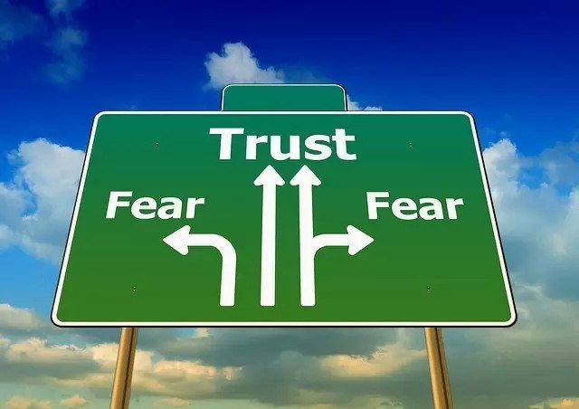

##  克服信任问题

_2015-03-10_ _史蒂夫**帕弗利纳_ 聪明人的个人发展 聪明人的个人发展

**聪明人的个人发展** 

stevepavlinachina

个人成长，与你同行

__ __

图片来源：**geralt**

  

信任他人对你来说有多容易？你会轻易相信别人吗？或者你常对他人动机持怀疑态度？

  

你是否对生活足够信任，一旦认识到个人工作毫无激情，就能马上辞掉它，而且知道生活会给你带来更好结果？或者你需要放慢脚步，控制事情的发展过程，比如先试着攒上些钱
，甚至去做更多你不喜欢的工作？你是否正因对生活的不信任感，付着满心沮丧的代价?

  

倘若离开毫无激情的感情关系，你是否信任生活将给你带来更好，更心满意足的感情体验？

  

如果你跃身投入一条追随内心的道路，你是否信任生活将是自己的坚强后盾？

  

  

**艰难的信任教训**

  

在20多岁头几年开创电脑游戏事业时，我还是个很容易信任别人的家伙。对于能跟一家主流出版商达成交易，出版发行自己公司开发的一款游戏，我当时感觉非常幸运。我的开
发团队在那个项目上奋战了数月时间，随后出版商却单方面取消交易，还试图用毫无道理的原因起诉我们。这其实是个恐吓策略。我得以说服出版商放弃诉讼，但他们仍扼杀了公
司的游戏项目，最终令我摊上一大堆债务并颗粒无收。

  

我之后才发现他们显然没有出版我们游戏的意图。他们只想避免我与其他出版商合作，因为他们也有一款与我们公司形成竞争的游戏准备同时发布，于是想出用这种方法来制约我
们。这个糟糕交易确实让我在财务上大受挫折。它就是导致我在1999年宣布个人破产的主要问题。在自己20多岁的年纪，我对一些人有多么欺诈还抱着太过天真的观念。最
终我被坑得一败涂地。那也是我人生中压力最大的时期之一。

  

这家公司CEO（首席执行官）后来由于财务欺诈不得不向SEC（美国证券交易委员会）支付数千万美元的个人罚款。公司其他一些官员也被处以罚款。显然，他们通过虚增销
售数字抬高了股票价格，从而欺骗了众多投资者。虽然旧CEO被开除，这家公司今天依然制作和销售着数以百万计的游戏，大都充斥着暴力内容。

  

之后我与一家不同的出版商进行了另一次满是问题的交易。他们的CEO其实是位看起来挺诚实的友好人士，但这家公司却经营得不怎么顺利。在共同合作大概一年后，他们因为
资金短缺不得不取消了我们公司的游戏项目。很快他们就被竞争对手以极其低廉的价格收购。

  

此后我对在生意中信任他人产生了很大问题 — 既难以信任他们的做事意图，也难以信任他们坚持到底的成事能力。

  

另一方面，我可以说这种经历也算好事，因为它引导我走向直销模式。与跟出版商合作相反，我开始通过互联网直接销售自己开发的游戏，而且进行得非常顺利。不到一年时间，
我便得以扭转局面，还继续帮其他开发者发行游戏。最后，在转行到个人发展领域前，我总共发布了大概20多款游戏。

  

  

**你信任生活吗？**

  

现在我已重建了面对他人的信任感，而且能吸引极值得信赖的人们进入我的生活（这种感觉棒极了）。我不再有以前那种面对他人的疲惫感。

  

给这种转变帮助最大的地方，就是用不同于往的方式来思考信任。我开始询问自己能否信任生活本身。我是否信任整个宇宙？我是否感到这是个可以安全生活的现实世界？还是个
我不得不处处保卫自己的地方？

  

最终我意识到，自己与生活的相互关系只存在于个人脑中。所以我可以将其改变。

  

同样的道理也适用于我和其他人的相互关系。它们都存在于我的思维感受里。它们本就是思想与情感上的概念。

  

随后我意识到自己有两个选择。我可以信任生活。或者不再信任。我从思想上探索了这两种可能性，并琢磨每种可能性会带来什么样的生活。倘若我信任生活，将会活得怎样？要
是不信任它，又会过得如何？我鼓励你也仔细琢磨一下这两种选择，比如通过写日记的方式，看看你的想法将把自己带向何处。我觉得你会发现这是个大开眼界的练习。

  

最终，我得出信任生活是更佳选择的结论。我可能会在短期内偶然被人欺骗，但如果我真正信任生活，就会总给予它最大善意。这使我能对任何看起来好像是消极负面的体验，重
新进行解构，把它们当作生活提供的教训。我会怀着谅解态度，吸取教训，继续前行。

  

我也可以预想，这种心态将最终吸引到，和真正值得信赖的人们一同分享的伟大感情关系。假如我是可信愿信之人，并遇到另一位可信愿信之人，我们就能以真正愉悦的感情深度
去交往。因为双方关系将在很大程度上免除猜疑与设防的麻烦。能有机会享受深厚亲密、心无防备的感情关系，看起来似乎有些浓烈，但也引人入胜。

  

另一方面，假如我选择不信任生活，心中便总会充满猜疑。我将在生活中时刻竖起防卫，感觉不得不始终保护自己。即使有人陪伴，我也很可能经常感到孤独。我将不得不拒绝展
露个人最亲密的状态，因为这会令自己显得极为脆弱。而谁又愿跟一个总是满心疑虑，处处设防的家伙发展关系呢？

  

我偶尔会和缺乏信任的女人进行交往，但我没法说自己喜欢那种交往。那种感觉就像有人试图强迫我符合她们的期待，认为我最终会出现背叛行为一样。当我避开她们的诱导模式
，试图将其从错位的猜疑中带回清醒自知的状态时，她们最后便感到困惑和尴尬，常常退入自己的防卫外壳。只要她们仍对生活怀有根深蒂固的不信任感，我就无法帮助她们。持
有这种怀疑心态时，她们在感情关系方面的大概所有体验，就是更多的背叛。或在推离某个想真心交往的人士时，感受到更多困惑与尴尬。

  

这是我想体验的那种生活吗？如果由于不知准确与否的那些猜疑和推测，我就把身边的人们推离开来，自己又怎能享受真正的亲密体验？时不时受些伤害真有那么糟糕吗？

  

总体而言，我觉得信任是更佳选择，因为它几乎必然导向一种更为有趣、互动和令人满足的生活。也许在信任中，我不得不偶尔面对一些拒绝和背叛，但若能保持信任生活的态度
，自己终将遇到那些美妙优雅、志同道合的人们，并与之共享深入和令人满足的交往关系。另一条缺乏信任的道路则显得黑暗、沉闷和孤立。我做出了自己的选择。

  

  

**重新解构痛苦**

  

一旦决定了信任生活是更佳选择，我便会事先臣服于生活带给我的任何体验。

  

我主要是在精神层面上保持这份信任。我此生所有肉身体验都只是暂时的。最终我将失去物质王国中所得的一切。因此，我对生活的信任，无法基于相信自己会获得物质财富、伟
大朋友或出色生意伙伴，并能让这些永远存在。事实上，我可以信任的，就是这一切终将消逝。所以我臣服于失去的必然性。

  

在精神层面上信任生活，意味着信任自己的存在有着更伟大目的，即使我还不明白这目的到底为何。我信任生活正在帮我学习、成长和经历饱含意义的体验。我信任生活绝然、积
极地站在自己一侧。我信任生活从来没有，也永远不会背叛我。

  

这种层面的信任能转化其余一切事物。我可能在生意中再次被骗。我可能失去钱财。我可能在身体上受伤或生病。我不认为自己能掌控所有这些因素。但有了现在拥有的这层信任
，我便无需控制它们。

  

我信任即使生活中出现看似艰难的挑战，它们的显现也有其原因。生活正教授我更多课程。它在教我如何沉浸于自然流畅的生活状态，如何学习、成长和爱。它教我更少看重结果
，更多体味当下。它帮我坚持走在追随内心的道路上。我热爱它正为我做的这些事情。而且我信任它将继续如此。

  

我感觉自己与生活的能量流动极其和谐一致。我感觉整个宇宙都是我的坚强后盾。我感觉生活在一个充满爱与支持的世界上。

  

但我也感到生活将不断挑战我。它会挑动我的神经。它将暴露我内心最深处的脆弱之地。它不会让我长时间安于现状或自我陶醉。它将继续推动刺激我，帮我不断成长。

  

我越是臣服于这种能量流动，生活似乎越愿意给我更多奖赏。它用友爱关系、美丽体验和珍贵回忆沐浴着我。但它也会给我带来众多强有力的经验教训。

  

你看... 我早期生活中的生意失败，其实跟信任了错误的人没多大关系。这些失败与我没能全然信任生活密切相关。我当时追逐着金钱和成功，而非追随一条忠于内心的道路
。我依赖他人的创意想法，而非信任自身的创造力。我可以说，自己当时吸引了错误的生意伙伴。但其实我吸引的是最佳伙伴，来教授自己需要学习的人生课程（非常艰难的一课
）。这些课程带来的痛苦，很大程度上源于我对它们的顽固抵制。从一开始我就存在那些信任问题。生活只是直接将其反馈给我。

  

  

**你其实只有一种感情关系**

  

我在2009年终止自己婚姻，就是信任生活的一个好例子。我当时感到被推动着在感情关系上步入更广阔的方向，但起初我却在抵制这种感觉 — 一直长达数年！

  

我之前并不想离开自己的婚姻舒适区。处在那种婚姻关系中十分舒服安全和温暖。我和妻子当时都是彼此最好的朋友。但停留在婚姻里并非自己忠于内心的道路。它曾是我内心追
随的道路，但那条路径最后转变了方向。我的婚姻已实现了它的意义。生活中还有其他课程需要我学习。我可以与这些课程保持一致。或是顽固抵制它们。我起初尝试了顽固抵制
。但这种做法并不解决问题。

  

你现在是否正试图顽固抵制生活中某一部分感受？这种做法的效果如何？很可能与我当初体验到的一样。

  

回头看去，我很感激生活没有让我安于现状。当时要信任它令人感觉很难，但我最终选择信任：信任生活知道我内心深处的最大利益，倘若自己追随忠于内心的道路，生活就将给
我全力支持。

  

事情果然如此，生活似乎奖赏我走出了后来的一步 — 让我拥有了一份几乎已4年的美妙感情关系。

  

虽然我热爱身处开放感情关系，并在与其他女人的4维交往探索中享受着无穷乐趣，尤其在今年，但我仍然坚信自己只拥有一种感情关系。那就是我与生活本身的感情关系。

  

我不想假装自己拥有的任何人间交往关系会恒久不断。我知道它们终将结束，或是由于分离，或是因为死亡。我此刻珍视着它们。我臣服于它们的暂时本质。我信任生活将其设计
为这种方式必有更伟大的目的。我感到自己与这个目的始终和谐一致，即便有时接受这个事实会极为艰难和痛苦。

  

我不仅原谅过去让自己感到受伤的那些人，我还深深感激他们。他们教给了我极具价值的人生课程。我学到了将自己跟生活的感情关系置于金钱和成功之前。我学到了如何听从个
人直觉。我学到了基于灵感和启迪勇敢行动。

  

我知道前方还有很多课程要学。我已瞧见其中的一些，它们看起来并不容易。我的一部分自我更愿留在当前的舒适区，不再前进，但我信任生活不会让我这样。

  

生活本身就是我最好的朋友和教练。即使我所要求的没那么振奋人心，生活也知道我真正需要的是什么。生活不会让我安于现状。

  

我在开放感情关系探索中没有感觉嫉妒的原因之一，就是因为我知道自己只有一种感情关系。那就是我与生活的感情关系。我拥有这份感情关系，而且对其许下了承诺，比人类婚
姻关系更大的承诺。我无法背叛生活，而且我不相信生活会背叛我。

  

我和人们的各种感情关系，代表着自己与生活这份感情关系的各个方面。每个人都在表达生活本身的不同方面。因此我拥有的种种人类关系，其实反映的是它们所代表的生活各个
方面，与我存在的感情关系。

  

  

**选择信任**

  

要克服自己对他人的信任问题，请探究你与生活本身的感情关系。

  

你是否信任生活？你是否感觉这是个安全的地方？你是否相信自己存在于此必有原因？你是否感到生活正通过一系列挑战指引自己，帮你不断成长？你是否感觉生活会因你对它的
信任，而给你奖赏？

  

或者你并不信任生活？你是否仍固守在个人舒适区，竖起各种防卫，回绝摆在自己面前的种种挑战？

  

信任生活是种选择，而且是个创造性的选择。你的选择将创造你的现实世界。若你选择用可能达到的最深方式信任生活，你终将重新解构生活里的每种体验，从而不断强化这种信
任。你最痛苦的失败将变为成长课程。找出追随内心的人生道路会变得强制必要，而非可选项目。你信任生活的决定将创造对应的现实世界。从个人经历而言，我可以告诉你，它
是一个充满喜悦体验的现实世界。

  

  

Steve Pavlina

2013.12.14

  

  

阅读原文

阅读

__ 举报

[阅读原文](http://mp.weixin.qq.com/s?__biz=MzA3NzIyNTQ3NA==&mid=206311773&idx=1&sn
=1fef4ec0e5a47707b4f7c1aacba047fa&scene=1#rd)

