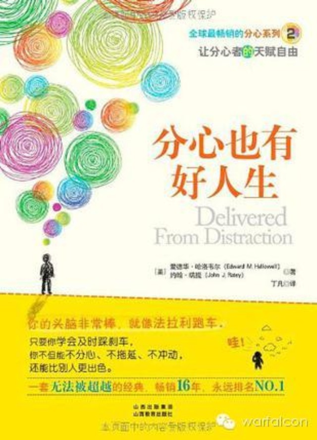

##  写给注意力严重不集中人士的生活建议

_2015-03-02_ warfalcon warfalcon

**warfalcon**

read01

想每年读完100本书吗？想在100天内培养一个好习惯吗？想搞定拖延和注意力不集中吗？关注我，让你成为一个行动者，跟几十万读者一起成长，欢迎参加100天行动

__ __

有本书叫《分心也有好人生》，是写给ADD患者的，ADD就是注意力缺失症，核心症状是非常容易分心、冲动、静不下来。最近几年随智能手机的快速发展，我能接触到的绝
多数年青人，都会发现自己的注意力越来越容易分散，注意力不集中跟拖延症变成了每个年青人都会面临的问题，只不过有轻有重。  

绝大多数人只是注意力不集中，算不上ADD，作者在书中针对ADD给出一些生活建议，它们都是经过证明，且简单有效的建议。这些建议对注意力严重不集中的人也同样有效
，如果你也有一些注意力方面的问题，请参考一下。

这些建议主要是针对成人的，但也可以用在儿童身上。比如，成人要养成习惯，一进家门就把钥匙放在门口的杂物盒里，而儿童则要养成一回家就把书包放在书桌上的习惯。

1.选对伴侣。找到真正爱你的人。（这条比较复杂，找时间单独说）

2.选对职业。不管有没有分心的问题，选对伴侣和选对职业都是快乐的基本要素。弗洛伊德说过，如果你在爱情和工作两方面都快乐的话，你就会是一个快乐的人。但是，分心
者往往在这两方面都会犯错误。他们的伴侣或老板常常是喜欢控制和批评的人，一天到晚挑他们毛病，对他们的才华和优点却视而不见。

选择老板就像选对伴侣一样，他要能接受你的优点，又能够忍受你的缺点，而不会抱怨太多。

分心者常常觉得自己什么都不是，认为自己需要被骂、被批评，因为他们习以为常了。

如何改变这种状况呢?求职的时候如何充满自信呢?赴约的时候如何期待对方善待自己呢?这就要看诊断、教育和治疗了。

你需要学习、了解内在那个美好的自己。诊断是第一步，接下来就是学习分心是怎么回事，花些时间接受心理治疗，并最终让自己有所改变。

3.家门口放个杂物盒，回家后把钥匙就放在那里。当我提醒分心者这一点的时候，他们常常觉得这是小事，不值得费事，但是，找不到钥匙可能会导致更大的损失。

分心者必须注意细节。大部分分心者都知道他们要做什么，他们只是不做而已。十之八九的乱象是因为细节出了错。他们忘记重要会议的日期、忘记地点、忘记带投影片、把门票
弄丢或者忘记打电话。他们认为自己已经做了该做的事，但是其实没有。

这就是为什么我们会注重细节。不要犯很多分心者常犯的错误，他们认为细节很无聊，就跳过去不读这部分内容了。这有些像闯红灯，你可能会因此行为而丧命。

（可以把所有需要提醒和记录的东西，都记在手机上，设上闹钟，或者手写在随身的记事本上，每天翻阅）

4.别期待完美。我还是要你遇事随意些，人生难免犯错。如果你不能接受错误，就可能会为每个错误自责。

5.整理堆积如山的东西。

6.买很多垃圾桶。你需要经常使用它们、经常清空它们。不要只用几个垃圾桶，并把它们塞得满满的。这样既不好看也让人觉得很沮丧。不论是在家或在办公室都用一个大垃圾
桶，丢掉的东西越多越好。在现代社会，我们必须学会对纸张或杂志说“我不需要你”，然后把它丢掉。不要为了某一天可能用得上而留东西。东西只会越积越多，用得到的一天
却永远不会来。如果你很有名气，想把东西留下来写传记，那就建个图书馆或租个仓库，不要把旧杂物等都堆在家里。

7.做你擅长的事情,不要一直希望克服自己的弱点。小时候在学校，你有很多时间可以尝试，看自己擅长做什么，也可以试着克服自己不擅长的事情。小孩子一开始尝试的时候
难免会做不好，花时间练习是值得的，但是成年之后要强调自己的优点，而不是继续事倍功半地想克服缺点。

8.注意饮食。不要滥用药物或吃太多碳水化合物；饮食要均衡，要吃早餐，而且早餐一定要吃些蛋白质；每天吃深海鱼油，因为鱼油中富含欧米茄三型脂肪酸，还要吃综合维生
素。

9.分心者需要有人帮他完成计划。很多人开始会制订一个计划，满怀热情地做一阵子，随后就搁置下来或干脆忘记，而堆积在墙角。如果你发现自己总是无法完成计划，可能就
需要找一个人帮你完成。这个人可以是你的助手、朋友或你的生活教练。

10.找个优秀的会计师、律师或其他专业的人士来处理细节。找有时间观念和能够照顾到细节的人和你一起工作，免得你的配偶一直照顾你。

11.分派工作!把这几个大字写在卫生间的镜子上方，时刻提醒自己。

12.持续使用曾经有用的方法，即让你成功的方法。你可能靠着直觉和意志力取得成功，但是不要懒惰。

13.不要继续使用以前失败的方法。如果同样的工作总是不成功，就换其他的工作吧；如果同种类型的伴侣最后总是
会分手，那么下次就找个不同类型的人试试。如果同一个亲友总是伤害你，就避免和他来往。

14.找个你可以信任的人，并听他的话。分心者喜欢固执己见，从而孤立了自己。你可能变得习惯什么都自己来，不听任何人的话。你可能很聪明，可是这样绝对会惹出麻烦。
找个老朋友，一个了解你的人，听他的劝告。

15.不要信任所有人。有时候，分心者过于热心、开放、急于行动，因此太轻易地相信每个人。结果是在多次被骗后，分心者变得不信任任何人。试着保持中庸，分心者不喜欢
中庸之道，可是有时候必须保持中庸。

16.如果你习惯晚睡晚起，试着使用日出闹钟。这种闹钟会让房间从黑暗逐渐转亮，让你很自然地醒来。

17.允许自己看一些不用大脑思考的电视节目。这是可以让自己重新充电的好方法。

18.完成一个大计划之后，可能会感到失落。每个人都会这样，但是分心者可能会陷入严重的沮丧情绪中，然后开始喝酒、嗑药或进行其他自我毁灭的行为。最好的方法就是知
道自己会失落，在这段时间多和朋友、家人联系或经常运动。

19.开车时听有声书，让大脑动一动。

20.制定固定的运动时间，这是非常重要的一点。运动会刺激大脑分泌多巴胺、正肾上腺素和血清素，这等于是同时服用百忧解和利他林。

21.庆祝胜利。分心者常常在获得胜利之后马上进行下一项任务。花一些时间享受成功是非常重要的。你不需要为得意的大事铺张或炫耀，但是你需要让胜利的时刻深植脑海，
以便支持和鼓励自己。

22.让生活中充满提醒你的事物。比如日历、便条、手表、闹钟、电脑以及手机的计时功能，甚至可以是碰触得到的提醒，比如在鞋子里放一颗小石头，提醒自己早上穿上鞋子
后要做的事情。

23.心灵食粮。你需要提醒自己，你这个人不错。你可以在衣橱里贴一封别人夸奖你的信，每天早上都看得到；或是把孩子照片放在皮夹里，整天带在身上，随时可以看得到；
或是把自己崇拜的人的照片挂在桌前。

24.找个玩具。这很重要，请看这个例子：

我是医科学生，我花很多时间听演讲、读书以及和病人聊天。听别人说话的时候，我的手需要一直动来动去，而我的解决方式就是玩捏捏球。

我有3个捏捏球，一个放在书包里，上课时用；一个放在衣服口袋里，跟病人说话时用；一个放在家里书桌上，读书时用。

捏捏球实在是太棒了。它不会黏在衣服上，好玩又便宜。如果弄掉丢了，只要花点钱就可以再买一个。因为颜色和皮肤近似，别人不会注意到。这一定是为分心者发明的玩具。

25.最重要的是：了解自己。知道自己的缺点和优点，让环境适合自己的优势。你必须对自己有充分的了解，并持续地运用这份了解。分心者很容易忘记自己是谁。

## 100天行动读者反馈

**@Wanying**

‍

老师好，关注你的公众号一年了，最近终于开始了自己的百天行动。每天坚持睡前仰卧起坐和平板支撑，今天已经是第十九天了。从刚开始的40个仰卧起坐加2分半平板支撑，
现在已经增加到60个和3分钟，并且每周也增加了别的运动。现在我每天在自己的朋友圈打卡，很多朋友也说受到鼓舞，准备开始运动了。我会坚持下去的！

**@某迟**

立春已过，反馈一下去年毕业后就开始了一个人的生活，自由难免会跟散漫关联起来。七八月开始用扇贝背单词，截至昨天居然也背了有快190天了。虽然还是有中断，但总能
催自己不要太在意“完美”而重新捡起来。算起来这居然真的是工作后坚持得最好的一件事了。

十一月中旬开始学吉他，兴趣的驱使下基本每天都会练上至少一个小时。现在两个多月了，会吉他的朋友都说我进步很快，感受到了坚持的力量！
从前几天开始下决心敦促自己不再熬夜，自发地找朋友约定只要晚睡就支付宝打给她一块钱，居然也真的能在约定的时间“放下手机立地成佛”！

新年愿望是能把更多精力集中到专业知识提升上，希望可以坚持看书学习。身上的惰性还很多，现在的我至少在学会与之共存。或许生活的胜利并不是打败这些弱点，而是找到一
个平衡。谢谢Warfalcon的指导与陪伴。

  

阅读

__ 举报

[阅读原文](http://mp.weixin.qq.com/s?__biz=MjM5NjA3OTM0MA==&mid=205820394&idx=1&sn
=b21d289ab70f1279b3068aa21a1de9ef&scene=1#rd)

