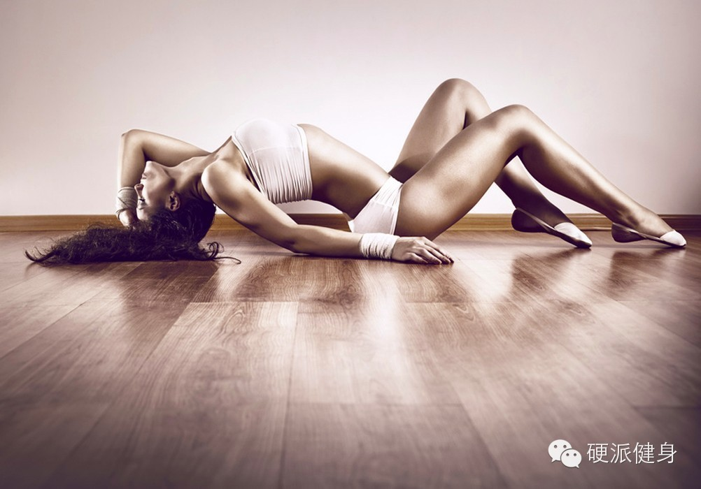
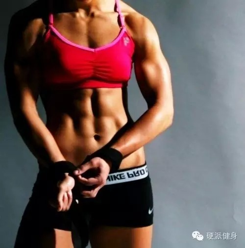
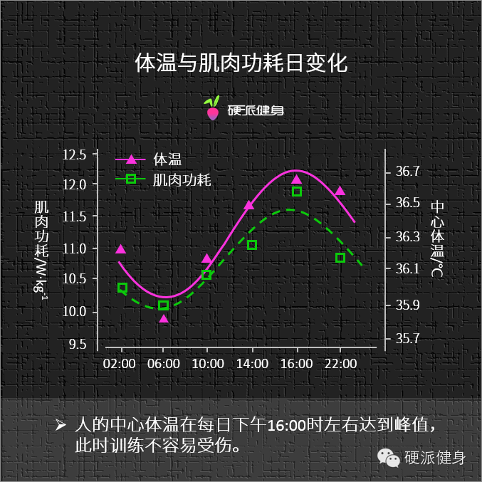
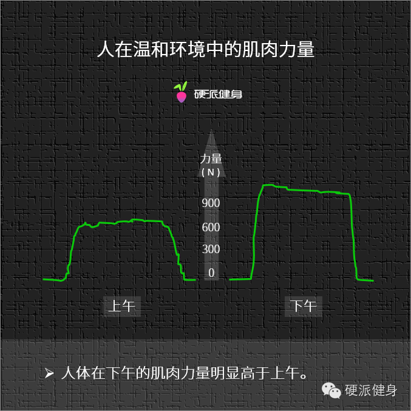

##  几点健身最有效？！

_2015-03-09_ _斌卡_ 硬派健身 硬派健身

**硬派健身** 

oh-hard

最专业  **  靠谱  **  蠢萌的运动健身科普

__ __

  

  

  

犹记得去年双11，京东淘宝猫狗大战，京东有这样一句很损的广告语：“买都买了，买一真的”，我当时就喷了……后来想想，抛去猫狗间的各种而言，这句话确实没错。而且
，其实健身也是一样啊……**同样是费心费力去健身，不如用最有效的方法练。**

  

所以，一个好的运动计划对健身而言很重要。一个好的运动计划，可以让你花费更少时间、走更少弯路，当然训练效果也更好。尤其是对都市中工作的我们而言，高效有时候几乎
意味着一切。

  

我们之前说过写过很多期，一个好的健身计划包括了什么，比如如何根据自己的身材和目标订制高效的健身计划、每周如何安排次数、组数、训练次序等等。

  

这一次我们就来聊聊，一天之内什么时候健身训练效果最好。

  

****

**训练计划相关文章：**

最全训练相关

回复训练计划查看健身训练计划汇总

哪些部位才是新手最该练的？

回复该练哪了解更多  
新手该选择什么样的训练动作？

回复动作类型了解更多

如何因目标设计计划？

回复训练负荷了解更多

  

1

什么时候健身最有效？

  

  

  

我们知道，人体的各项指标并非是稳定不变的，不同的时间段内人体的各项数值也不太一样。

  

通过上面这张图可以看出，人的体温、血压、睾酮等在一天之内都在不停变化，这就决定了肌肉力量和激素水平，在一天之内也会有很明显的差异。

  

综合多项因素考虑，我们认为**下午4点到6点左右进行健身最为合适。**原因有三：一是因为这个时间段**运动受伤的可能最小**；二是因为下午四点开始到六点之间
，肌肉的力量最大，**训练强度可以更高**。第三则是这个时间段**肌肉的增长更好**，训练后取得收益更多～

  

  

  

2

更好的肌肉增长

  

首先，下午4-6点这个时间段内肌肉的增长效果最好。为什么呢？这是因为这个时间段内睾酮和皮质醇的比值最大，最有利于人体的肌肉合成，也就是增肌啦！

  

据科学家研究，6-23时皮质醇会降低92%①。研究还表明，人体在一天中的18-24时，皮质醇处于最低②。

  

而睾酮的峰值虽然表现在上午8点，但有研究发现，抗阻训练引起的睾酮上升在傍晚时也能够被观测到③。

  

我们曾说过，睾酮水平代表着肌肉增长水平，而皮质醇则相反，会影响肌肉的合成，甚至会让肌肉分解。也就是说，下午运动时，你的皮质醇水平处于最低点，使得**睾酮与皮
质醇的比值升高。这就代表了你的肌肉合成速率加快，肌肉增长处于最高状态！**

  

  

  

3

更小受伤几率  

  

说完了肌肉增长，再来说说受伤几率。

  

我们之前说过，肌肉的弹性组织像一小捆束在一起的橡皮筋。而且肌肉本身具有粘滞性。粘滞的肌肉不仅无法从容工作，而且还很容易受伤。

  

温度越低，肌肉的粘滞性越大，越容易发生肌肉拉伤。而温度越高，粘滞度越小，同时弹性组织的断裂长度更长，就相对的不容易肌肉拉伤。换句话说就是，**体温越高，肌肉
纤维与肌肉弹性组织更加不容易断裂④，以及更耐拉伸**——这个原理跟热身是一样的。（回复 肌肉拉伤 了解更多）。

  

科学家发现，人在一天之中，体温最高的时间段是在下午4点-6点之间，所以选择这个时间段运动，也更不容易受伤⑤。

  
  

  

通过上述图表我们可以看出，人体的体温在16：02的时候到达了最高点。这就相当于人在这个时间段内被动热身，使肌肉的弹性组织增加了弹性，更加不容易断裂。所以这个
时间段训练，受伤的几率会比其他时候小很多。

  

4

更大力量，更强训练

  

除了比较不容易受伤之外，下午四点开始肌肉的最大力量也会达到高峰。

  

科学家们对比了不同时间内受试人员的运动功率，发现下午的时候肌肉的力量和爆发力都比上午更好一些。

  

  

  

对比图表中上午和下午两个时间段内的运动功率，不难看出，**下午运动的肌电水平更高，力量也更大**⑥！  
  

这一部分是因为我们上面所说的，下午四点左右人体的温度最高，相当于进行了被动热身，肌肉粘滞度变小，阻力变小，自然发挥力量更方便。

  

另一部分原因，是此时肌长度和肌张力都跟着加大了，因此力量也增大了。比如肌肉的最大自主收缩，与最低点相比将在下午升高6-18%⑦；再比如离心收缩和向心收缩也和
人体的体温变化相似，在下午四点表现较高⑧。此外肘关节的屈力量和背部力量在下午的时候也达到高峰⑨⑩。  
  

  

  

所以下午的时候去运动，你可以试着挑战更大的重量，让自己发挥出比以往更好的效果。

  

综上，一天之中最适合训练的时间就是下午4-6点啦！

  

5

上班族该咋整

  

对于绝大多数人来说，毕竟四点的时候大家都还在办公室，对此我的建议：提高点工作效率，在下班之前把手头的工作处理的七七八八，一下班就冲去去健身房。

  

如果真的工作比较忙，下班晚，也没什么。其实稍微有个1小时左右的偏差，对总体效果的影响不是太大。肌肉合成的效率在18-24点都是比较高的。而想要使得最大力量增
长，并且避免运动时的肌肉拉伤等，通过良好的热身也可以很大程度上弥补。**练，总是比不练强太多。**

  

有童鞋可能会问：那要是不吃晚饭直接练，肚子太饿扛不住怎么办呀？

  

这个，就像我们之前所说的，如果担心饿或者体力不支的话，运动前吃一些GI值低的食物（回复 训前吃什么
了解更多）其实就OK了。我们曾经特意推荐过一些方便又可以随时补充营养的食物，即便是上班时间吃其实也没什么问题的。

  

（当然，还是那句话，因为吃东西引起的开除扣工资等，硬派健身概不负责……）

  

而训练完后的18-24时，正好是训练完成后的最佳肌肉增长时间，这个时候的肌肉蛋白合成速率提高了三倍之多，正在积极地增长和修复。此时再去吃顿好的，主食和瘦肉各
来一点，不仅保证了你需要的营养，还能让肌肉增长效果更好喔～

  

* * *

①KRIEGER D T, ALLEN W, RIZZO F, et al. Characterization of the normal temporal
pattern of plasma corticosteroid levels[J]. The Journal of Clinical
Endocrinology & Metabolism, 1971, 32(2): 266-284.

②Zhao Z Y, Xie Y, Fu Y R, et al. Circadian rhythm characteristics of serum
cortisol and dehydroepiandrosterone sulfate in healthy Chinese men aged 30 to
60 years. A cross-sectional study[J]. Steroids, 2003, 68(2): 133-138.

③Kraemer W J. Endocrine responses to resistance exercise[J]. Medicine and
Science in Sports and Exercise, 1988, 20(5 Suppl): S152-7.

④Taylor D C, Dalton J D, Seaber A V, et al. Viscoelastic properties of muscle-
tendon units The biomechanical effects of stretching[J]. The American Journal
of Sports Medicine, 1990, 18(3): 300-309.

⑤⑥Racinais S. Different effects of heat exposure upon exercise performance in
the morning and afternoon[J]. Scandinavian journal of medicine & science in
sports, 2010, 20(s3): 80-89.

⑦Drust B, Waterhouse J,Atkinson G, et al. Circadian rhythms in sports
performance-an update[J].Chronobiology international, 2005, 22(1): 21-44.

⑧Jasper I, Haaußßler A,Baur B, et al. Circadian variations in the kinematics
of handwriting and gripstrength[J]. Chronobiology international, 2009, 26(3):
576-594.

⑨Guette M, Gondin J,Martin A. Time-of-day effect on the torque and
neuromuscular properties ofdominant and non-dominant quadriceps femoris[J].
Chronobiology international,2005, 22(3): 541-558.

⑩Coldwells A, Atkinson G, Reilly T. Sources of variationin back and leg
dynamometry[J]. Ergonomics, 1994, 37(1): 79-86.

阅读

__ 举报

[阅读原文](http://mp.weixin.qq.com/s?__biz=MzA5NjQwMTQxOA==&mid=206584594&idx=1&sn
=2045deb2f5c98a3da55bd20e72e9debb&scene=1#rd)

