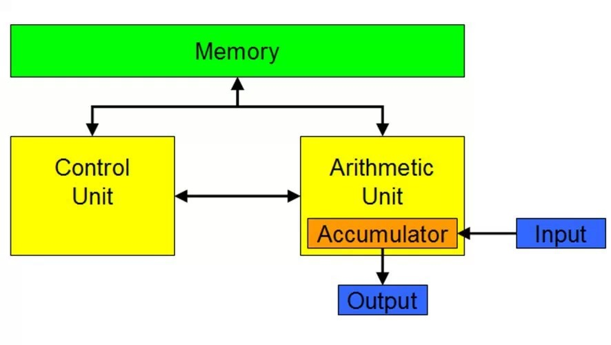
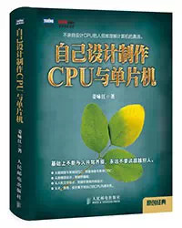

有关计算机研究的许多文章都爱将“颠覆了冯**诺伊曼结构”作为标签，进而来说明自己的科研成果是如何伟大。包括院士们也经常使用这个标签，例如，今年的自然科学一等
奖“透明计算”，还有据称为程控交换之父搞的“鲶鱼行动”计算机。  

  

什么是冯**诺伊曼结构？这个问题得稍稍往远点说。在计算机界，人们将开山鼻祖的头衔送给了图灵，实际上真正让机器成为计算机的人应该是冯**诺伊曼（当然也包括那些
当年的协同者）。图灵机严格地说，还不能称为计算机，原因是图灵提出的状态集并未进入到机器当中。应该说状态集的元素都是“计算”的结果，而没有反映出机器计算的过程
。图灵的伟大在于创造了机器自动输入输出及“状态”存储的思想，为后来者制造实用计算机指明了方向，这是人们将图灵捧上计算机神坛的重要原因。我之所以认为图灵不是计
算机的开山鼻祖，是因为图灵的设计并没有实现“机器计算”。

  

什么是机器计算？用图灵机状态的概念来说，就是得到状态的过程。通俗地说，就是获得结果的机器动作过程。机器的计算能力无论如何应该归功于冯**诺伊曼。有资料说冯*
*诺伊曼的成就不是他一个人的，这对我们来说已经无关紧要，因为冯**诺伊曼之名代表着计算机诞生的里程碑。如果说图灵解决了机器数据存储和输入输出，那么冯**诺伊
曼解决了计算机替代人类脑力劳动的最关键一步，那就是“机器计算”。冯**诺伊曼将机器计算的过程划分为指令、程序和数据，通过现在叫做CPU的器件运作，最终得到需
要的结果，从而完成了替代人所从事的重复性的脑力劳动。这一伟大的发明当中，最重要的是冯**诺伊曼提出了“程序、数据存储”的思想方法，即将运算的指令程序和数据都
存储于计算机的内部，而不是象图灵机那样，存储在外部的带子上，这才是冯**诺伊曼计算机结构的要害之处。现代计算机的各种形式，包括网络结构突破了“程序、数据存储
”的思想方法了吗？没有，一个都没有！

  

不要过多地赞扬将程序存储器和数据存储器分开的“哈弗结构”吧，那只是在冯**诺伊曼伟大思想之下的一个设计改动而已，不要将这种小打小闹的设计改动就叫做“颠覆了冯
**诺伊曼结构”。如果这种设计上的小小改进都叫做颠覆，那么我们将无法确认修改和颠覆的区别了吧？

  

从图灵到冯**诺伊曼是计算机的两个里程碑。用计算机处理多任务引进OS，创建多用户计算机，这应该说是第三个里程碑。将单处理器计算机结合通信技术组织成网络，这是
第四个里程碑。在网路上创建客户服务器模式应该算五个里程碑。片上多核处理器的引入可以说是第六个里程碑。为了提高计算机的时效，易用、应用的诸多设计理念和方法，多
数都是在这些里程碑之下的增光添彩而已。尽管有些设计声势很大，但多数都是为了商业的目的，进行了过分的宣传和夸大。由于冯**诺伊曼声名显赫，硬说颠覆了冯**诺伊
曼该有多大的震撼效应！例如，虚拟计算机、云计算、物联网，这些只不过是网络的商业应用的概念炒作而已，哪一个放弃了程序数据存储的做法？这些炒作都没有对上述6个里
程碑做根本性的改变，因而也成不了计算机发展的里程碑。

  

冯**诺伊曼等人初期创造的计算机是把程序和数据放到一个存储器当中了，哈弗将程序存储器和数据存储器分开了，这是设计的进步。如果将堆栈存储器也单独设立出来，那也
是颠覆吗？其实单独设立存储器的事情是计算机设计的必然过程，指令级并行的流水线程序这些方式为了减少相关，设置了编址的寄存器堆，那是什么？那也是存储器。如今解决
数据传输速度的各种缓存，到处都是，能说这些都是在结构上颠覆了冯**诺伊曼吗？

  

不论何种计算存在，就一定有存储器与之伴随，这就是冯**诺伊曼的程序数据存储的特色。将计算和存储彻底分开？怎样分开？请拿出分开的例子。从根本上讲，存储是记忆运
算的基础。离开了存储器，对不起，什么事情也做不了。狭义地理解存储器是大容量的？寄存器算不算？高速缓存算不算？

  

计算机的里程碑和解决设计应用中的难题是两个概念。能够解决应用难题也是很了不起的事情。例如高性能超级计算机的研发，操作系统的优化，通用性的虚拟技术，方便易用的
器件等，任何在空间上的扩充，在时间上的高效，都是计算机科学发展的重要问题。但请不要用“颠覆冯**诺伊曼”说事。

  

机器计算和存储是相依相随的不可分离的计算机组成部分，机器计算不灭，电子计算机不灭，冯**诺伊曼结构永存。

>  

> **姜咏江**　文革后的77级大学生，哈尔滨师范大学数学系毕业，82年从事计算机教学，立志自己设计制造一台计算机。经历20多年潜心研学，以自己的思想方法
设计出计算机，并于2005年自己设计制造了计算机PMC110，之后又设计制造了动态计算机PMC362，在个人设计制造CPU与单片机上有较丰富的经验和体会。

>

>  

>

>> 

>>

>>   * 理论与实战密切结合没有不能逾越的鸿沟

>>

>>   * 深刻简洁的计算机理论和方法能让你攀登最高峰

>>

>>   * 不亲自设计CPU的人很难以理解计算机的真谛

>>

>>  

>>

>>> 这是一本非常有趣、激动人心的书，本书带领读者进入此前难以想象的领域——自己设计制作CPU，自己设计制作计算机。内容涉及电子电路知识、计算机硬件设计制
作、软件和操作系统设计编写。全书以CPU设计制作为主线，通俗易懂地讲解了如何使用FPGA进行RISC型和CISC型CPU设计制造的方法，并最终带领读者使用E
DA软件设计制造出一台以自己设计的CPU为核心技术的计算机。

阅读原文

阅读

__ 举报

[阅读原文](http://mp.weixin.qq.com/s?__biz=MjM5Njc0MjIwMA==&mid=202551433&idx=1&sn
=34fb45df7587b193dbb2d4e778a1e082&scene=1#rd)

