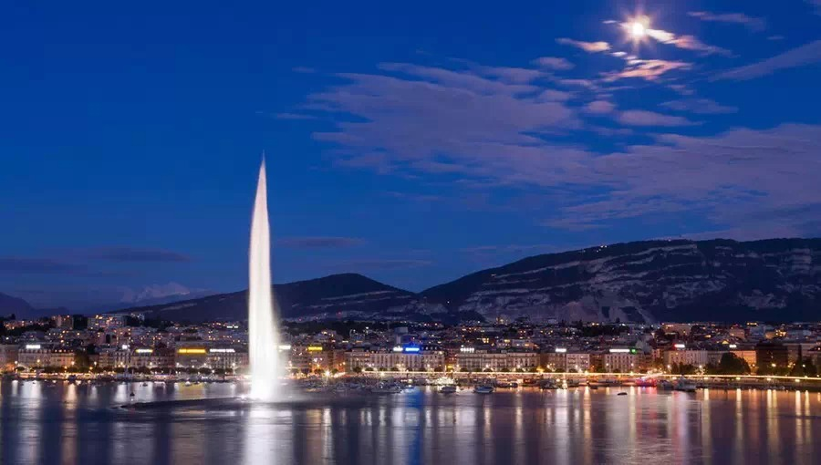

**一些城市将喷泉作为城市名片，不少网民为了谁才是亚洲最大音乐喷泉争得面红耳赤。初步统计，中国共有九个亚洲最高喷泉，九个亚洲最大喷泉。真的是这样吗？**  

  

**文/杜修琪**

  

洛阳和西安本没有城市矛盾，直到2006年，洛阳南湖喷泉建成，开始了亚洲最大音乐喷泉之争。

  

争执的战场主要为百度知道、贴吧，然而，“最大”是个极为模糊的标准，究竟按照高度、面积还是水量计算，对结果影响很大。

  

西安网友当然应该生气。2003年开始，大雁塔音乐喷泉就被宣传为亚洲最大音乐喷泉，被无数旅游材料中反复强调。如今洛阳新城突然高调抢走桂冠。

  

不过，局面很快对西安不利——无论是喷射高度、喷泉面积，洛阳都占据上风。

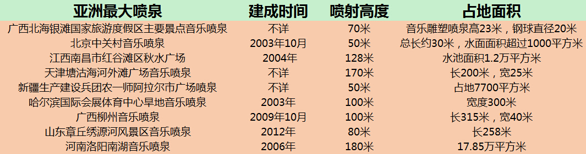

  

与勇敢的西安、洛阳们相比，更多的城市选择了相对实际的称号——亚洲最高喷泉。仅武汉市就修建了8座大型音乐喷泉，其中机器凼子湖、西北湖喷泉等号称亚洲最高。

  

1995年机器凼子湖是国内最早的一批大型音乐喷泉，喷射高度106米也可称亚洲最高。1999年之后，最高喷泉密集出现，门槛也不断抬升，基本都在160米以上。

  

贵为亚洲最高，高喷们的建设显然不必考虑气候。大陆性气候的内蒙古就有两座亚洲最高喷泉，鄂尔多斯康巴什是曾广泛报道的“鬼城”，呼和浩特如意河喷群则位于新市政府旁
边，十分空旷、壮丽。

  

这些高喷自然花费不菲。相对而言，齐齐哈尔劳动湖音乐喷泉性价比无疑最高，仅仅用了不到500万，就建成了200米级别的高喷，与鄂尔多斯不相伯仲。

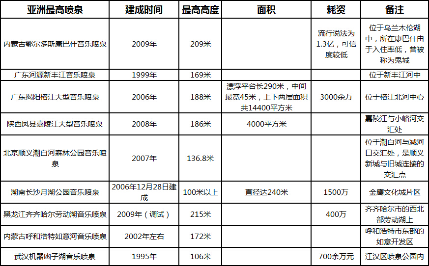

  

规划上，喷泉们多位于新城区的人工湖、河中。他们也有着相似的修建背景：2000年以后，商品房政策放开，开发区、新区被推广。

  

中国大多数的城市喷泉也都修建于此时。与中亚、欧洲不同，中国历史上并没有喷泉传统。乾隆年间，才出现第一个喷泉：1747年后圆明园的谐奇趣、大水法、海晏堂。后来
又陆续兴建了一些喷泉，但仅限于皇室赏玩，对民间毫无影响。

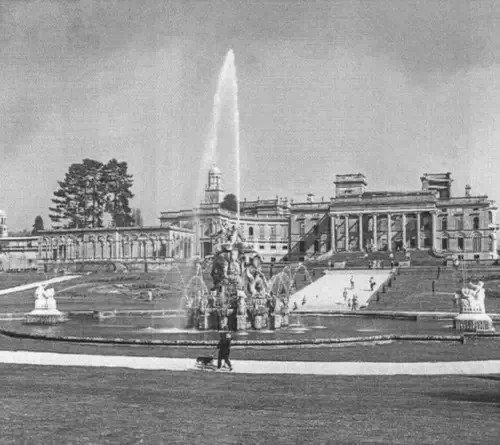

**英国维特利庄园海神泉，第一个蒸汽动力喷泉**

  

20世纪初，新形式的蒸汽动力、闭环水路喷泉传入中国，人们开始少量修建纯观赏性喷泉。但1990年以后，中国才第一次有足够的技术、预算大量修建现代喷泉。

  

为什么中国没有喷泉传统？

  

主要由于水源形式差别。中国古代多依靠人工井、蓄水池供水，喷泉确是欧洲的主要供水方式之一。古罗马号称万泉之城，多数的喷泉都位于饮水线路上的城市广场，规模较小，
供居民取水。

  

喷泉的供水功能甚至延续到工业革命时期。十八世纪末，伦敦市改由三家水务公司从泰晤士河汲取、转运淡水，效率奇差，十九世纪初多次爆发大规模传染病后，人们重拾喷泉传
统，在市区又修建了数百座路边喷泉以及地下管道。此举相当受欢迎，也为近代自来水、污水系统提供了思路。

  

另外，喷泉在欧洲还有重要的社交功能。它们多位于城市广场的中心，带有雕塑，是街区的标志性公共空间，妇女们常常带着衣物在此洗濯。

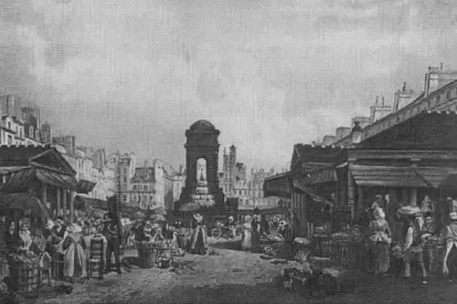

**巴黎夭逝者公墓喷泉，19世纪旁边已变为蔬菜瓜果市场**

  

最早的喷泉起源于中亚，喷泉建造技术也流传到过波斯、印度。但是它们多数为了彰显权力而修建，强调宏大、壮观，远不如欧洲普及。

  

工业革命后，蒸汽机、电力被引入喷泉制造，欧洲的技术突飞猛进，奠定了现代喷泉的基础。不过，古老的供水功能让位给装饰功能，开放水路也被闭环水路替代。音乐喷泉等也
随后出现。

  

但欧洲的喷泉仍保留了规模小、社区性的特点。美国也延续了类似理念，如著名的达拉斯喷泉，位于高楼耸立的市中心，面积十分有限。但设计师丹•凯利融合了植物、流水元素
，非常巧妙的达到了增添自然气息的目标，又在寸土寸金的市中心增添了公共空间。

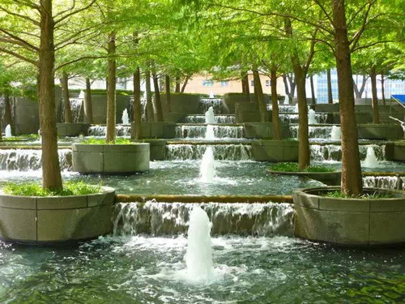

**达拉斯喷泉**

  

中国的城市喷泉则与此不同。喷泉中嬉戏、洗濯往往被当作不文明的现象批判。更多的亚洲最大喷泉，大面积区域内只有喷泉设施，让人无从嬉戏，炎热的夏天，附近的居民只能
过眼瘾。

  

公共交往的功能更弱——只为喷泉规划的区域，根本不存在社会交往。不过近年来有所改善，还要感谢广场舞的阿姨们，她们以非凡的毅力，赋予诸多根本不为她们设计的区域以
活力。

  

那么，设计如此明确，规划异常重视，功能如此简单的中国城市喷泉，就顺利的占据近20年的亚洲最高吗？

  

很可惜，并没有。所有的亚洲最高都是彻底的谎言。

  

1985年开启的沙特吉达喷泉，早早的奠定了世界最高的地位。其最高水柱达1024英尺，即312米。

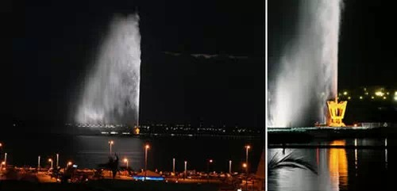

**沙特吉达喷泉夜景**

  

想成为东亚最高也有难度。韩国2001年建成的首尔喷泉，最高喷射202米，高于多数国内喷泉。

  

但是，中国的书记市长们往往具有非凡的创造力，也足以将大项目做的极致。与高度相比，“最大”模糊许多，在这一标准下，中国的许多喷泉非常有可能达到亚洲最高水平。

  

不幸的是，争夺亚洲最大头衔的路上，又出现了西亚土豪的身影。这一次拦路的不是沙特，而是阿联酋的迪拜。

  

迪拜音乐喷泉造价2.18亿美元，2009年开放，长度275米，总面积约等于两个足球场。其造价更多的花费在音乐制作、灯光效果上，技术超前，极度绚丽。是公认的世
界第一大喷泉。

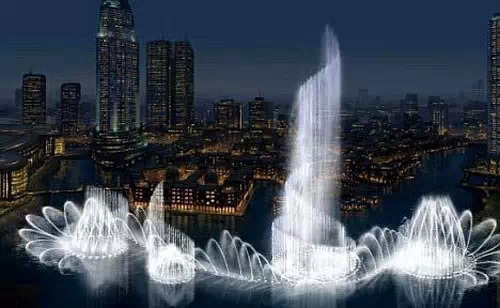

**迪拜音乐喷泉**

  

也许，“亚洲最高音乐喷泉”的宣传者们是从日内瓦喷泉得出的结论。

  

1951年改造后的日内瓦大喷泉，最高可达140米，长期被称为第一高喷泉。但是这个古老的喷泉开放的十分频繁，除了冬季，每天开放时间都在8小时以上。

  

相比之下，国内的亚洲最高喷泉们要娇气许多，每周开放都算得上勤勉，极少开放五天以上。武汉西北湖音乐喷泉虽然可以使用，但已经多年未开启——开放两个小时，费用大约
1500元，但公园预算中根本没有喷泉开放与维护一项。

  

许多喷泉质量根本不达标，维修费用常年居高不下。这和中国喷泉行业的水平较低有关。

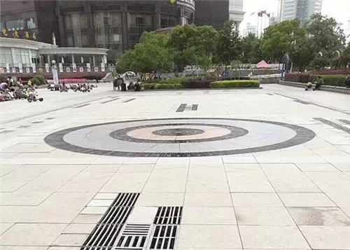

**沉默的武汉西北湖喷泉**

  

目前，喷泉行业并没有明确监管部门，也没有直接的国家标准。虽然东部已经有领先的企业，但没有形成行业巨头，企业林立，竞争水平较低。

  

比如音乐喷泉，国际先进水平早已经智能识别音乐，根据节奏变化，控制喷头动作。国内仍长期停留在预先输入程序的阶段。

  

为什么会这样？

  

中国本来并没有喷泉行业，80年代中期后，最初的从业者都由外行转入。剧增的喷泉项目给行业提供了暴利，管理、技术创新的需求不大，企业当然重视拉关系、打市场。

  

喷泉又是一个复杂的应用领域，需要土建、艺术、水景的合作。这无疑增加了制造难度。

  

这样薄弱的行业基础无疑难以支撑城市野心。为了避开西亚土豪的锋芒，一些国内城市选择了十分聪明的宣传策略——亚洲第二高喷泉。

  

合肥天鹅湖音乐喷泉于2004年建成，宣传时，就称之为韩国首尔喷泉外的亚洲第二高喷泉。经过2011年的整修，高度增加至172米，却依然低调的自称亚洲第二。

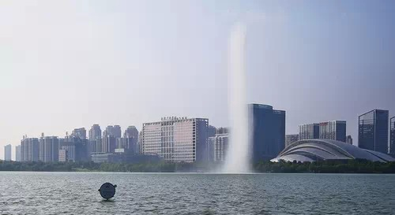

**“亚洲第二”天鹅湖喷泉**

  

另一些城市无疑更加现实，将最大、最高称号从亚洲减少到了国内部分区域。2007年，通化音乐喷泉建成，最高高度100米，一直宣传为东三省最高喷泉。

  

本来，还有一些喷泉能够一举击败韩国、西亚的最高最大，乃至冲出亚洲，成为世界最高。

  

2013年，广东增城挂绿新城发布规划，要建造千尺高喷，预计2014年建成，将成为名副其实的亚洲最高。然而，2014年年末，项目突然撤销，规划区域改为“发展备
用地”。

  

幸运的是，也许未来的世界最高喷泉将非常普及，能随时随地组装。据新华社2013年报道，中国航天科技集团第六研究院打算将航天涡轮泵技术应用在消防泵上，让消防车的
喷水高度倍增到300—400米。

  

那么，无需加强城市化进程，也无需项目审批，只要轻松的开来一辆消防车，世界最高喷泉将遍地开花。如果组成车阵，最大喷泉也可以期待了。

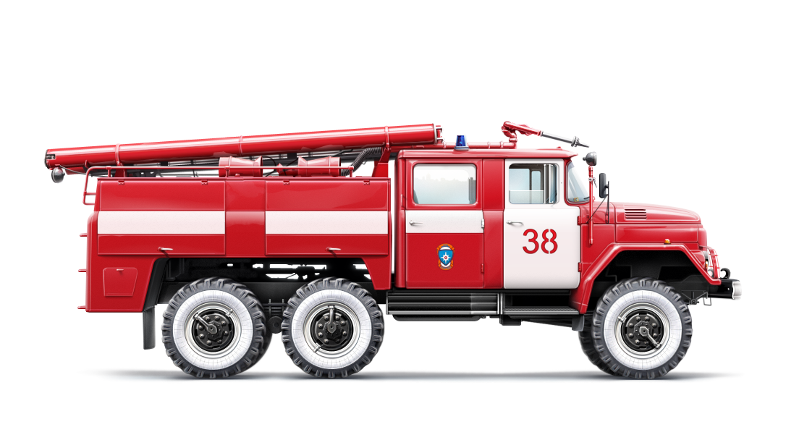

**  
**

**版权声明**

****大象公会所有文章均为原创，****  

****版权归大象公会所有。如希望转载，****

****请事前联系我们：****

bd@idaxiang.org

****知识 | 见识 | 见闻****

阅读

__ 举报

[阅读原文](http://mp.weixin.qq.com/s?__biz=MjM5NzQwNjcyMQ==&mid=209788167&idx=1&sn
=a01d616eaf7895cc81ef36b50aee5565&scene=1#rd)

