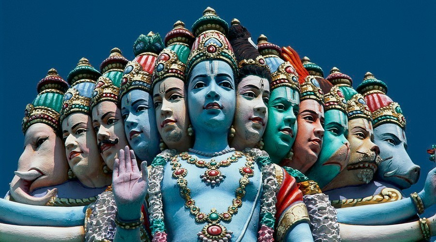
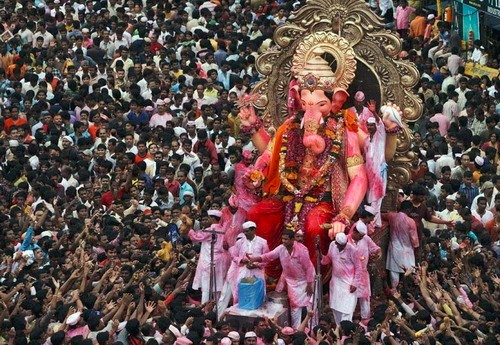
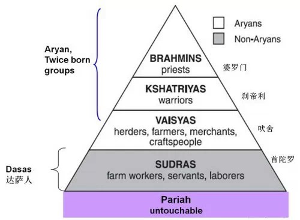
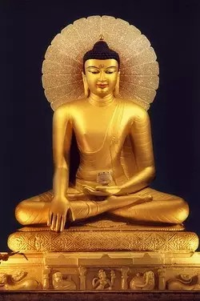

##  印度是什么：印度教为何战胜了佛教

_2015-03-03_ 大象公会 大象公会

**大象公会**

idxgh2013

知识，见识，见闻。最好的饭桌谈资。知道分子的进修基地。

__ __

_编者按：__自**《印度是什么》**一文发表后，读者提问积极。大象读者对印度的了解和兴趣远超我们预期。更有不少高水平的“刁钻”提问，让身为印度人的Bane
rjee小姐也颇为头疼。_

  

_中国人一般都很好奇，贵为世界三大宗教之一的佛教在其发源地印度为何乏人问津？佛教和印度教到底是什么关系？_

  

_本次为大家呈现的是Banerjee小姐对两个非常具有代表性的问题的回答：_

  

1、读者Fred Young提出：

> 你好，Banerjee小姐。中国人都知道佛教起源于古印度（今尼泊尔），常常理所当然地认为印度是佛教国家，或者以为印度教是佛教的分支。可否请你向中国读者简
要介绍两个宗教的关系和区别？

2、读者Water提出：

> 印度教怎么发展起来把佛教弄没了，他们俩啥关系？

  

_感谢这两位读者提出的问题。为力图原汁原味地呈现Banerjee小姐对这两个问题的看法，我们将她回答的英文原稿与翻译稿一同为读者呈上。_

  

_欢迎读者朋友们继续点击文末的阅读原文，向Banerjee小姐提问。_

**  
**

**The diversions of Buddhism from Hinduism**  

**佛教之于印度教的偏移**  

  

**作者：Banerjee**

  

**1、Hinduism **

**一、印度教**

  

In a country as culturally diverse as India, glamorised with numerous
celebrations, it is not uncommon for many to explore the origins of such
festivities. While it is a fact that not all festivals have originated from
Hinduism, most of them such as Diwali (festival of lights), Holi (festival of
colours), and Ganesh Chaturthi (a time to remove obstacles and invoke a new
beginning) have had their metaphorical and philosophical basis from the
religion. In essence, celebrating the festivals is an opportunity for Indians
to reflect upon the wisdom and teachings of Hinduism that can be traced back
to ancient times.

  

在一个文化有如印度般多元，被各种节庆所点缀的国度，很多人都热衷于探索这些节庆的来源。虽然并非所有节庆都来源于印度教，但多数重要节日如Diwali（排灯节/光
明节）、Holi（色彩节）和Ganesh
Chaturthi（象头神节，辞旧迎新之时）的哲学和隐喻的根源都和宗教息息相关。事实上，庆祝节日从古至今都是印度人反省印度教智慧与教导的好机会。  

  
**2009年9月3日，印度的印度教教徒举行盛大仪式庆祝象头神节**

  

Hinduism is a collection of philosophical and metaphysical beliefs that have
developed over a long period of time.Commonly understood as more of a way of
life than an official religion, Hinduism offers a philosophy that is rooted in
liberation of the soul back to its purest form, from the illusions, drudgeries
and desires of the world. The genesis of Hinduism has perplexed many scholars
over the years as there are no formal accounts of its actual beginning.
However the religion is believed to be over five thousand years old and
probably the part of the oldest civilization known to the world.

  

印度教是长期积累的一整套哲学和形而上学观念。一般情况下印度教并不被当作一种正式的宗教，而是更多的体现在生活方式上。印度教植根于一种向往灵魂获得自由，返回最纯
净状态，远离俗世的虚妄、劳苦、欲求的哲学。很久以来，印度教的形成使不少学者备感困扰——并无正式的文献记载印度教究竟是如何起源的。但是，这门宗教据信已有超过五
千年的历史，很可能是世上所知最古老文明的一部分。

  

Between 750 and 550 B.C , Hindu pundits (priests) tried to reveal the hidden
meaning of the Vedas. A stark observation about the Vedas is that they were
recited by the priests to the disciples. Spiritually enlightened priests who
had been through years and years of meditation had developed an innate
understanding on the nature of reality, morality , eternal life and the
functions of the soul, which were later on written down as Upanishads, a
series of which made each Veda.

  

公元前750年到550年，印度贤者（僧侣）试图揭开《吠陀经》隐含的含义。吠陀经的一项重要特征是由僧侣吟唱，传承给学徒。通过长年冥想，在精神上觉醒的僧侣可以具
有内在的，对现实、道德、永生和灵魂的作用本质上的理解，这些后来被写成奥义书，一系列的奥义书即成一部吠陀。

  

The formats of the Upanishads were written as dialogues or discussions between
a student and a teacher which carefully aim at exploring how a person can
achieve liberation from desires and suffering. The ultimate objective of a
Hindu is the state of perfect understanding of all things, also known as
“Moksha”. It is important for most Hindus to ultimately understand “atman”
(the individual soul of a living being) and the interconnectedness it has with
that of “brahman” (the universal soul) as a prerequisite in achieving
“Moksha”. Karma has been customised as a misunderstood concept that explains
the feeble connections of ones actions and the repercussions of them. However,
the true Hindu belief of Karma lies in ones’ perfect understanding of the
atman and brahman in order to avoid rebirths. The idea of rebirth in Hinduism
refers to the soul’s karma , delivering both the good and bad deeds leading
that lead from one reincarnation to another. It is popularly believed that
Karma influences specific life circumstances, such as the caste one is born
into, one’s state of health, wealth or poverty, and so on.

  

奥义书的文体为记录学生与老师对话的问答体。对话就一个人该如何解脱欲求与苦厄，获得自由进行了认真地探索。一个印度教徒的最终目标便是达到完美的、理解万事的状态，
这种状态被称为Moksha。对大多数印度教徒而言，最终理解atman（个体灵魂）及其与brahman（万物灵魂）之间的联系至关重要，这也是修得Moksha的
先决条件。宗业（因果报应）经常被误解为一种解释个体行为及其后果的弱关系的概念。真正的印度教徒对宗业的信仰则在于个体对atman和brahman的完美理解以避
免轮回。印度教中，轮回的概念指灵魂宗业，通过做好事与坏事导致从一种转世到另一种转世。一种很通行的信念是宗业对特定的生活条件有影响，譬如一个人诞生于什么种姓，
他的健康状况，富有抑或贫穷等等。

  

Hindu ideas about karma and reincarnation strengthened the caste system. If a
person was born as an upper-caste male—a Brahmin, warrior, or merchant—his
good fortune was said to come from good karma earned in a former life.
Nevertheless, throughout history, many in India have had a partial and perhaps
inaccurate understanding regarding the exact principle of Karma and Moksha and
in the same period of speculation, the other religious doctrines attempted to
simplify the complex metaphors of Hinduism.

  

印度教的宗业和转世概念强化了种姓系统。如果一个人生为高种姓男性——婆罗门、勇士、商人等，他的幸运便会归结于前世造下的好宗业。虽说如此，在历史长河中，很多印度
人对宗业和Moksha的理解却一度失之片面甚至不准确。在那些印度教并不盛行的时代，其他的宗教教条应运而生，试图简化印度教复杂的隐喻。

**印度种姓制度简易示意图**

  

**2、Buddhism**

**二、佛教**

  

Buddhism emerged from Magadha (now known as Bihar) during the same time to
offer a pragmatic view of people could achieve the egoless state of “Nirvana”.
Siddhartha Gautama, the founder of Buddhism was born into a family that lived
in Kapilavastu, in the foothills of the Himalayas in Nepal. Prophecy had it
that if young Siddhartha was to become a ruler, he had to isolate himself from
the world and stay within the domains of his kingdom. If he ventured out at
age, he would eventually transform into a universal spiritual leader. Despite
having married and becoming a father, the philosophical quest for Gautama led
him to explore the mysteries of human nature and life. He was overwhelmed and
particularly attentive to old men, sick men and corpses in cremation grounds.
Eventually, the sight of a holy man sitting by the river side had offered
spiritual refuge from the thought of inevitable suffering. He spent six years
wandering through Indian forests in search of wisdom, practices that could
lead him to an enlightened state and eternal knowledge which could eradicate
suffering.****

  

与此同时，佛教从摩揭陀（今比哈尔邦）崛起，它给人民提供了一个实际的、可以修得无我状态（涅槃）的愿景。佛教的创立者——乔达摩悉达多，出生于喜马拉雅山脚下的迦毗
罗卫（今尼泊尔境内）。有预言说如果年轻的悉达多想要成为一个统治者的话，他必须将自己与世界孤立起来，并且不可迈出他的王国一步。如果成年后走出了王国，乔达摩则会
成为一个普世的精神领袖。虽然已经结婚生子，但对哲学的诉求还是让他选择去探索人类本质与生命的奥秘。他震惊于碰到的老人、病人和火葬场的尸体。最终，一个在河边打坐
的圣人让乔达摩在思考无法避免的苦厄时得到了精神上的慰藉。他花了六年时间逡巡于印度的丛林之中，以求让他能够达到觉悟状态的智慧和办法，并获得恒久的、可以消灭苦厄
的知识。

  

Buddhism strangely was born of Gautama’s relentless determination to find
enlightenment through continuously meditating for 49 days. Historically,
Indians regard the fig tree as being sacred due to Buddha (then Siddharth)
assuming an enlightened status having sat under one. Many saints and sages in
India meditate under fig trees in pursuit of enlightenment, following the
footsteps of the Buddha. His realisations revolved around four main ideas
through which he understood enlightenment or a “nirvana” which is a state in
which all suffering ceases to exist. The ideas were formalised as the Four
Noble Truths where (a) Everything in life is suffering and sorrow, (b) The
cause of all suffering is people’s selfish desire for the temporary pleasures
of this world, (c) The way to end all suffering is to end all desires and (d)
The way to overcome such desires and attain enlightenment is to follow the
Eightfold Path, which is called the Middle Way between desires and self-
denial.

  

很有意思的是，佛教的诞生源自乔达摩坚定不移追求觉悟时连续的49天冥想。历史上，印度人认为菩提树是神圣的，因为佛陀（悉达多）是在一颗菩提树下达到的觉悟。很多印
度的圣人和智者都追寻佛陀的脚步，在菩提树下冥想以求觉悟。佛陀的认识围绕着四个主要思想，通过它们理解觉悟或者“涅槃”——一种所有苦厄都不存在的状态。这些想法形
成了佛教的“四谛”：“苦谛”，生命到处都是苦痛；“集谛”，一切苦厄的根源在于人类为了追求现世暂时的愉悦而拥有的自私欲求；“灭谛”，消灭一切苦厄的方法是消灭一
切欲求；“道谛”，克服欲求，达到觉悟的方法是追寻“八道”，即欲求和克己之间的中道。

  
**印度比哈尔邦菩提伽耶摩诃菩提寺中乔达摩三十五岁等身像**

  

The Buddha’s teachings included many ideas from the Hindu tradition. However,
they also differed sharply from that of some. Reincarnation was a commonality
between the two religions.He had accepted a cyclical, or repetitive, view of
history, where the world is created and destroyed over and over again.
However, the Buddha disapproved the privileges of the Brahmin priests, and
thus he rejected the caste system. The final goals of both religions—moksha
for Hindus and nirvana for Buddhist were similar where both involve a perfect
state of understanding and a break from the chain of reincarnations.****

  

佛陀的教导囊括了印度教传统的诸多思想，但它们也有着相当鲜明的不同。转世概念两种宗教皆有，佛陀认可一种循环、乃至重复的历史观，其中世界反复被创建、摧毁，循环往
复。佛陀不认可的是婆罗门僧侣的特权，因而他否定了种姓制度。两种宗教的最终目标——印度教徒的Moksha和佛教徒的涅槃颇为接近，都包括达到一种完美觉悟的状态，
从转世的链条中解脱。

  

**3、Buddhism declined in India**

**三、佛教在印度的衰落**

  

The fate of Buddhism in India saw its gradual demise through its own principle
of “Anicca”. “All is Flux” is the fundamental principle of Buddhism that
alludes to the concept of impermanence. Irrespective of whether the dying away
is metaphorical, symbolic or physical, Buddhism has maintained the importance
of transforming the original state to that of something else. It was this
particular ideology that may have created problems in the staunch castes
divided social fabric of ancient India. This is because Indian civilisation
and the Brahmanical traditions in those days were fatalistic about an
individual’s life path based on the caste they were born into. Buddhism
rejected this notion and provided a universal pathway which did not
discriminate one based on their inherent caste but discerned individuals on
their rigorous morality and orientation to become disciplined.

  

佛教在印度命运多舛，它逐渐衰落是由自身“无常”的思想所致。“万事皆空”是佛教的核心理念，它暗含无常的概念。无论消逝的是暗喻、象征、还是实物，佛教其最初的状态
发生了改变。可能正是由于这一思想，导致了佛教在被顽固种姓制度分割的古印度社会举步维艰，当年印度文明和婆罗门传统都认为一个人一生的道路是由他生来归属的种姓所注
定的。佛教却拒绝这一看法，提供了一条不因人的天生种姓而歧视，反而重视通过个人严格道德要求和取向自律的普世道路。

  

The social framework of ancient India that propagated the caste system was not
conducive to the Buddhist egalitarian principles and what made it even more
difficult was the exclusion of the complexities of social and psychological
needs of people in search of enlightenment. A Hindu would have to give up all
he or she had known about their lineage in order to be indoctrinated into this
alternate religion. This meant they would have to reject the social construct
of caste system which provided a sense of belonging to them and embark upon an
individual journey to find the truth. It would have been difficult for Buddha
to explain the actual insights that would encourage followers on his version
of truth.****

  

古代印度建立在种姓制度基础之上的社会结构并不有助于佛教众生平等理念的传播。更麻烦的是，佛教排除了追寻觉悟者复杂的社会和心理需求。一个印度教徒必须放弃他所知道
的、关于自己家族种系的全部东西才可以加入佛教。这意味着他们必须拒绝社会种姓系统为他们提供的归属感，独自踏上追寻真理的旅程。这让佛陀很难向人们解释洞见，以便更
多的人选择相信他的真理版本。

  

Another important and perhaps a more significant contribution to the decline
of Buddhism in India was due to the emergence of the “Bhakti Movement”
(Devotional Movement) after 1323 in Kashmir and Bengal (North and East India).
As an antidote to the caste system in ancient India, a collective and
transcendental version of Hinduism emerged from a part of the Vedas that was
originally hidden. The “Advaita Vedanta” (not-two, singular in Sankrit)
preached a form of enlightenment which was possible through knowledge of the
self in all its components and attributes. The Advaita form of Hinduism did
not discriminate against caste, ethnicity, religion or any form of social
divide. Under its principles, both the Brahmin (highest caste) and the Sudras
(lowest caste) were equal recipients of the eternal wisdom of Hinduism in its
Advaita form that would grant “Moksha” or “Nirvana”.

  

另外一个让佛教在印度衰落的重要原因是1323年后在北印度克什米尔和东印度孟加拉发生的Bhakti运动（虔诚派运动）。作为对古代印度种姓制度的矫正，一个更加集
体而先验的印度教从部分隐匿的吠陀经中诞生。“Advaita Vedanta”（不二，梵语为单数）传播一种形式的觉悟。达到这种觉悟可能更依赖于通过了解自身所有
的组成和特征。不二形式的印度教不以种姓、民族、宗教或其他社会分割而歧视。在这种思想下，婆罗门（最高种姓）和首陀罗（最低种姓）都可以接收到不二形式的印度教永恒
智慧，从而获得“Moksha”或涅槃。

  

What made matters more interesting was the political infusion of Indian
nationalism with that Hindu Universalism during the British Raj. The
colonisation of India by the British lead to the Hindu renaissance in the 19th
century, which transformed the way the East and the West understood Hinduism.
In order to fight off oppression, the idea of a unifying Vedic force which
defined the essence of Hinduism was intensely propagated by Hindu reformers.
This not only cemented the concept of a unified religious sect that shared
universal truths but also a nation that desired to transcend the predisposed
attributes (such as the caste system) of Indians. The Hindu reformers founded
the “Brahmo Samaj” (based on the Brahman- universal soul), and were supported
by the Unitarian Church due to the perception of shared principles and
ideologies.

  

更有意思的地方在于印度民族主义与印度教普遍主义在英国殖民时代的融合。英国人对印度的殖民导致了19世纪的印度教复兴，改变了东方和西方对印度教的理解。为了反抗压
迫，印度教改革者强烈地主张通过一种具有统一性的吠陀力量来阐述印度教核心的思想。这不仅粘合了一个统一的，分享普遍性真理的宗教团体的概念，也催生出了一个想要超越
固有印度特质（如种姓系统）的民族。这些印度教改革者创立了“Brahmo
Samaj”（基于Brahman——万物灵魂），并因共通的理念和思想观感取得了一神会的支持。

  

Gradually, Vedanta was known to be the essence of Hinduism and Advaita Vedanta
, the true metaphysical philosophy of this multifaceted religion. As a result
of the popularised notion of Adavaita Vedanta throughout India and the West,
an opportunity was provided for the simultaneous construction of a nationalist
ideology which would free India from the clutches of colonial oppression of
the British to the theological threats of alternate pathways of Buddhism.

  

渐渐地，吠檀多（终极吠陀）成为印度教和不二的精髓，这门多层面宗教真正的形而上学哲学。因为流行思想不二论在印度和西方传播的缘故，印度教有了一个机会：在构建民族
意识形态的同时，使得印度可以摆脱英国殖民的压迫与桎梏，并扫清佛教在神学上的潜在威胁。

  
**印度教圣地，恒河河畔的瓦拉纳西**

  

**版权声明**

****大象公会所有文章均为原创，****  

****版权归大象公会所有。如希望转载，****

****请事前联系我们：****

bd@idaxiang.org

****知识 | 见识 | 见闻****

阅读原文

阅读

__ 举报

[阅读原文](http://mp.weixin.qq.com/s?__biz=MjM5NzQwNjcyMQ==&mid=211145257&idx=1&sn
=4804e01faff3097115257d74edd3b5c2&scene=1#rd)

