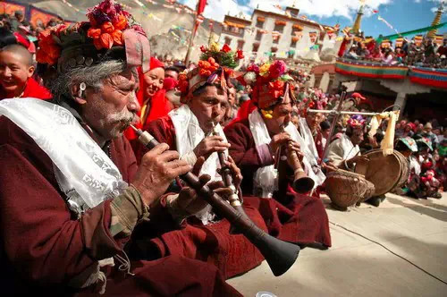
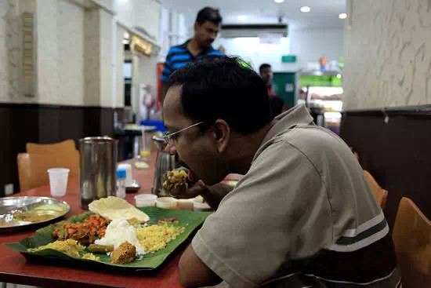
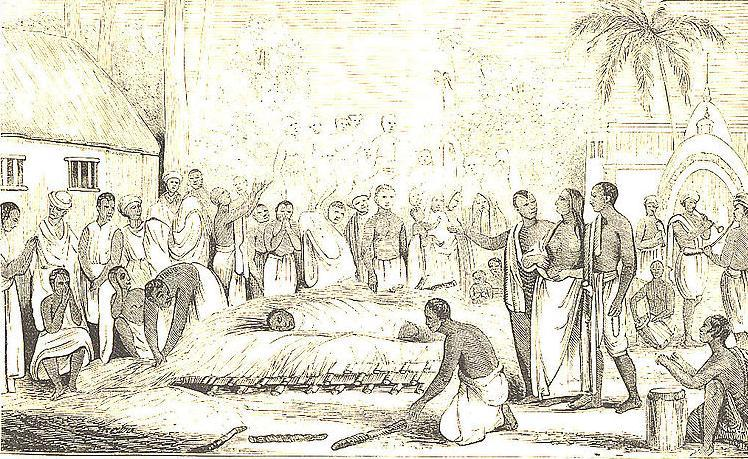
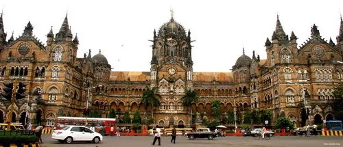
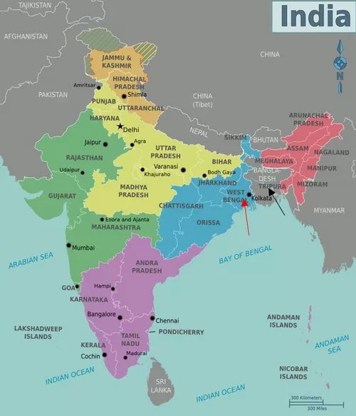
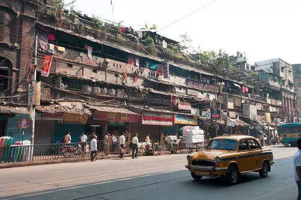

##  印度是什么？| 大象公会

_2015-01-26_ 大象公会

**印度是什么？一般中国人并不了解这个举足轻重的邻国。能说“干了这碗恒河水”也无助于此。现在，大象公会有一个非常棒的机会，与一位顶级婆罗门深入交流，向读者征求问题。呃，如果还不知道婆罗门是什么……请先看完这篇文章。**  

  

**文/郑子宁**

  

说自己了解印度？别逗了。

  

中国人去印度，通常有三种情况。一是去拜喇嘛教，这是各类社会新贵的时尚，虔诚度之高，甚至有明星回来后天天磕一千响头，终致离婚。

**位于印度北部拉达克地区的喇嘛正吹起号角，庆祝节日**

**  
**

二是去印度旅游，回国后只记得泰姬陵真白真美丽，至于红堡，胡马雍陵等等，能记住全称实属不易。

  

第三种比较新奇——穷游。驴友们往往热衷交流省钱经验，比拼谁过得惨，津津乐道“干了这碗恒河水”，享受人生再次升华的感觉——似乎非常有收获。

  

作为世界上最为复杂的国家之一，印度的艰深、落差、深厚远超人们想象。殖民时期，多数驻扎的英国人都很难弄清即使朝夕相伴的同事，十万个为什么永远萦绕在外来者的心头
，直到今天并没有太大变化。

  

为什么英吉拉•甘地机场刚建立时，厕所中只有便坑是干净的？为什么印度人清洗楼层，拖地和扫地的人绝对分开，不可能给对方替班？

  

为什么印度的厕所往往不提供手纸？印度人从来不用左手吃饭？

**在餐厅用右手进餐的印度人**

  

为什么印度公司的管理，最终总是由种姓关系影响？

  

这些问题关乎这举足轻重的邻国繁复多变的社会现状，不在印度语境，不接触、牵挂、生活其中，很难回答。

  

对此，无论是拜佛、旅游、穷游者，大可不必苛责自己。事实上除了少数学者、印度后裔，欧洲、美国等发达国家的人们也同样对此无能为力，即使是曾经千里迢迢奔赴印度，生
活数年的嬉皮士们。

  

只有与真正切入印度现实的人，以实际、坦诚的问题与之沟通，我们才有可能一点点接近这个复杂国家。

  

这是我们推出此文的初衷——大象公会的作者中，恰巧有人对印度有极深的了解，而她也非常愿意和大家分享。

  

Aparajita
Banerjee，孟加拉顶级婆罗门家族，著名诗人泰戈尔的远房侄孙女。母亲来自Mukherjee家族。出生于印度，成长于印度、巴林、澳大利亚。

**Aparajita Banerjee**

  

我们向读者征求有价值的问题，关于你想知道印度的一切。或许，先看完下面这些介绍文字，有助于找到提问的感觉。

  

**【种姓是什么？】**

  

对印度种姓制度，一般中国人都记得历史教材中的四大种姓：婆罗门、刹帝利、吠舍和首陀罗，稍微博学的人还知道贱民概念。

**印度种姓制度简易示意图**

  

现实中，印度种姓制度发展数千年，花样繁多，复杂程度远远高过以上几类。据说印度的种姓一共有几千多种。

  

Banerjee（ব্যানার্জি）小姐属于孟加拉婆罗门中被称作库林婆罗门(Kulin Brahmin)的一种种姓。库林婆罗门一般会将自己的族谱追溯到印
度北方邦的卡瑙杰，也即玄奘和尚当年参加戒日王组织的无遮大会的曲女城。历史记载，曾统治孟加拉的森纳王朝为了在佛教徒占多数的孟加拉地区推行印度教，从印度各地邀请
婆罗门在孟加拉居住，因此，Banerjee家族和另外几家婆罗门一起从卡瑙杰迁到了孟加拉。

  

种姓怎么区分高贵、低贱？要怎样保持高贵血统？

  

以Banerjee小姐为例。理论上，一位血统纯正的库林婆罗门，父母双方必须十四代均为库林婆罗门。不过理论和实践总有区别，Banerjee小姐相当大方地承认B
anerjee家族在莫卧儿王朝时期，其实跟波斯人有过姻亲关系。

  

种姓有什么作用？高贵又能有什么好处？

  

这样的问题极难简单概括。至少Banerjee小姐母亲的就业经历能多少说明一些。

  

和很多女性库林婆罗门一样，她最初选择英语文学这样缺乏实用性的专业。在丈夫不幸去世后，她感到了压力，转而修读了一个管理学的硕士学位。

  

瞬间，她被空降到了某公司成为管理人员，手下30余位码农对这位一窍不通的领导服服帖帖。这种情况在其他社会犹如天方夜谭，想象一下，五道口或者望京的互联网企业会这
样吗？

  

但在印度，由于她身份高贵，比她种姓低得多的码农对她始终恭恭敬敬。

  

**【现代印度人的婚姻观？】**

  

不过，种姓也有负面影响。比如婚姻生活。

  

传统的库林婆罗门女性的婚姻相当受限的。库林婆罗门不但一夫多妻，出于血统考虑，选择面还极其有限——仅有四五家门当户对的可以婚配。

  

因此，很多少女被迫嫁给老年人。更悲惨的是，若丈夫离世，往往还要依照“娑提”风俗自焚殉葬。英治期间，库林婆罗门中不少有识之士带头反对一夫多妻和娑提等陋俗，才让
这些恶俗有所收敛。

**娑提，原为印度教司婚姻幸福的女神达刹约尼的别名，神话中的娑提为向对其恋人湿婆不尊的父亲达刹表达不满而投火自尽，这段恋爱故事在印度的民间地区演变成妇女在丈夫刚过身后要立即跟随接受火葬以表达自己对先夫的忠贞**

  

但在二十一世纪的印度，她是否会坚定遵循传统呢？现实中她的婚姻观又是怎样的？

  

Banerjee小姐的意见是：并不急于结婚，一辈子独身也可以接受，只是过几年会考虑领养一个孩子。

  

然而，她也并不反对跟外族通婚。但态度与中国人稍有不同——她对中国女生乐于找澳大利亚男友颇为困惑，在她看来，澳洲人相当缺乏文化深度，一个文明古国的中国女性，怎
么会愿意嫁给他们？

  

什么是她看来的理想通婚对象？

  

至少欧洲的法国人和意大利人。他们文化底蕴深厚，有品位。日耳曼系的英国人美国人澳洲人都显得野蛮、粗俗。

  

**【殖民地的回忆】**

  

提到“半殖民地半封建”，中国人往往恨得牙痒痒。众所周知，印度曾完全沦为英国殖民地，他们对英国是否更加苦大仇深？

  

总体而言，Banerjee小姐对英国殖民持相对正面态度。理由非常实际——英国人将欧洲文明带向印度大地，促使印度社会发生深刻变革，对孟加拉的发展更有再造之功。

**在今天的印度街头，殖民时期遗留下的英式建筑仍随处可见。图为孟买市的维多利亚火车站**

  

但在统一问题上，Banerjee小姐对英国人持否定态度。

  

一般历史学家认为，正是英国人的参与，四分五裂的各土邦才能形成统一的政治实体——印度。

  

但Banerjee和她的印度朋友看来，南亚次大陆印度文化圈迟早会在政治上统一。只是英国人作祟，今天的印度、巴基斯坦、尼泊尔、孟加拉、斯里兰卡才没有形成统一的
大印度。英国人搞出了印巴分治，才使得印度文化圈陷入四分五裂局面。

  

**【印度的地图炮】**

  

不止是中国人有着富含特色的地域歧视。印度的地图炮往往更加凶狠。

**印度各邦和首府地图。图中红箭头所指为Banerjee小姐的家乡——印度西孟加拉邦；黑箭头所指为孟加拉国**  

  

Banerjee小姐来自印度西孟加拉邦，孟加拉地区（指今西孟加拉邦和孟加拉国）之于印度，犹如岭南之于中国。孟加拉泥沼遍地，又位于印度东部，开发较晚，血统上也
以原住民为主。

  

很长一段时间，印度上流社会对孟加拉不屑一顾。至于孟加拉地区东部，即今天的孟加拉国，真正开发的历史不过数百年，在千年古国印度中，当然更被瞧不起。

  

英国人的到来改变了这一切。英国控制印度后，行政中心并未设置在莫卧儿王朝的旧都德里，而是在孟加拉的加尔各答兴建新城，从此，孟加拉从边鄙之地一跃成为全印的政治中
心、对外交流中心。

**加尔各答城市街景**

  

和近代爆发，挺直了腰杆的广东人民一样，孟加拉人民也有了开地图炮的底气。Banerjee小姐感觉到，孟加拉人是全印度最热衷与他人在智力、文化上的交流的人群。

  

她描述，孟加拉人犹如印度的大脑，盛产各种管理者、巨商大贾、名状师。其他各类印度族群都会惨遭她开地图炮轰炸：

  

西北旁遮普人四肢发达头脑简单，只知道动手不知道动脑，好一点的就当个医生，差一点的就当个兵；

  

中部印度斯坦人文盲众多却自我感觉良好，天生就是“治于人”的命；

  

西部的古吉拉特人和信德人善于经商，不过撑死也就倒卖货物；

  

反倒是南部属于印度土著，在人种和语言上和孟加拉人差别特别大的泰米尔人，由于勤于思考善于学习，乐于交流，和孟加拉人颇有共同语言。

  

类似的有趣话题非常之多，根本无法穷举。我们希望找出最有价值，最为关心的那些，与读者分享。

  

请向我们提问，Banerjee小姐非常乐意为您答疑解惑。点击界面左下角**阅读原文**，进入提问界面。

  

**版权声明**

****大象公会所有文章均为原创，****  

****版权归大象公会所有。如希望转载，****

****请事前联系我们：****

bd@idaxiang.org

****知识 | 见识 | 见闻****

阅读原文

阅读

__ 举报

[阅读原文](http://mp.weixin.qq.com/s?__biz=MjM5NzQwNjcyMQ==&mid=210286970&idx=1&sn
=e63ad1d7860243222bb1ae3604d4daa7&scene=1#rd)

