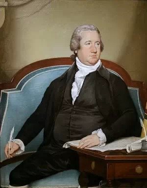
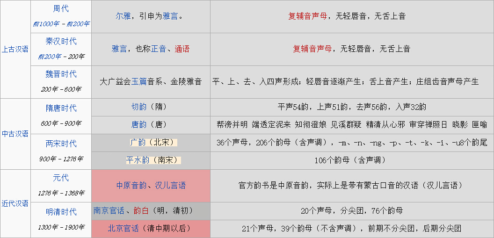
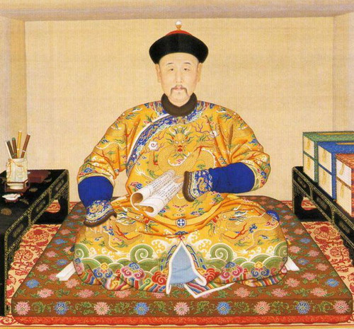
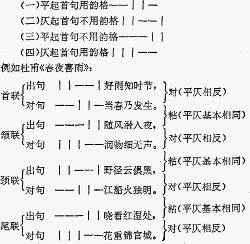
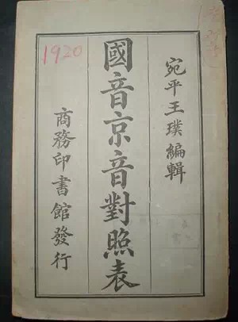
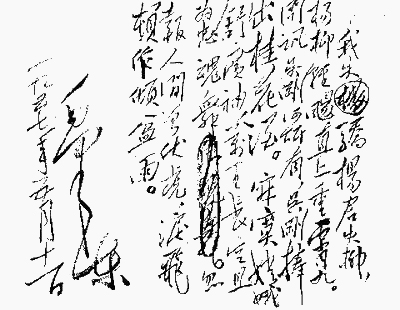

**国民党元老多出于广东，民国建立时，只差一票粤语就成为普通话；共产党元老多出于川渝、陕北，1949年建国，只差一票川话/陕西话就成为普通话……是这样吗？**

  

**文/郑子宁**

  

民国初立，为选官方语言，粤籍议员与北方议员互不相让，粤语和北京话票数持平。

  

关键时刻，为顾全大局，孙中山对粤籍议员晓之以理动之以情，亲自投给北京话一票，才避免了更大的语言之争。

  

相信了？别急，再听下一个故事：

  

1949年，为选官方语言，川渝元老与北方元老互不相让，川话和北京话票数持平。

  

关键时刻，为顾全大局，毛泽东晓之以理动之以情……

  

当然，两个版本都是谣言。历史上，无论是国民党还是共产党，根本没有针对粤语、川话、陕西话vs北京话的投票。

  

这个传说的母题，最早是美国差一点选择德语做官方语言的传闻。

  

18、19世纪，大批德国人移民海外，美国是其重要选择。如今，全美人口的17.1%自称德国后裔，远高于爱尔兰、英格兰、苏格兰。同时，德裔遍布美国，特别在中西部
有相当大的人口优势。

  

当时也是一样——北美殖民地中，德国移民的比例高于英国移民。

  

正因为德裔在美国的重要地位，德语差点成为美国官方语言的传闻颇为可信。传闻中也有一个孙中山、毛泽东式的人物——美国首任众议院议长，身为德裔的弗雷德里克•米伦伯
格。

  

为顾全大局，弗雷德里克•米伦伯格晓之以理、动之以情……

**弗雷德里克•米伦伯格**

  

真实的情况是怎样的呢？

  

1794年，一些德裔移民要求美国政府提供部分法律的德文版，该提案以42比41票被否决，米伦伯格在投票中弃权，但事后评价道：“德国人越快变成美国人就越好。”

**美国德裔分布图，红色代表德裔占优势，红色越深优势越大**

  

至于民国初年，制定官方语时确有争议。只是和北京话竞争的并不是广东话四川话陕西话之类的其他地方方言，而是人造的老国音。

  

国音是什么？为什么要人造老国音？

  

解释这两个问题，要从汉语的早期发展讲起。

  

秦朝开始，中国就实现了书同文，支持了文化、政治上的大一统。但是，“语同音”却一直没有实现。

  

古代人口流动性不大，地区间的交流靠着统一的文言文就可以维系。汉字本身对读音指示作用低，也让各地区的差异化读音得以保存、发展。

  

不过，一个统一的政权，毕竟有语言上的沟通需要。同时，战乱等原因引起北方人大规模南迁，将中原一带的官话带至南方。文化上对中原的推崇，也在事实上推动北方中原官话
成为地区间交流的主要方式。

**标准汉语的演变（来源：维基百科）**

  

到了明朝，官话已经形成了南北两支权威。北支官话覆盖今天的华北大部，而南支官话主要分布在长江流域。两者虽有差别，但在今天学者看来，都属于北方方言（北方官话），
交流障碍不大。

  

明朝传教士利玛窦在给欧洲同僚的信件中描述：“中国十五省都使用同样的文字，但是各省的语言不通。还有一种通用的语言，我们可以称它为宫廷和法庭的语言，因为它通用于
各省法庭和官场。”

  

他还在回忆录中说道：“各省的方言在上流社会中是不说的。学会了官话，可以在各省使用，就连妇孺也都听得懂”。例如，以明朝官话演唱的昆曲就在全国流行。

  

明朝的官话与现在的官方语言不同，其散播以自然传播为主。真正由官方推广通用语言始于清朝。

  

明末清初的浩劫之后，官话在全国的流行度大大受创。远离北方的闽粤地区更趋于萎靡。

  

这引起了雍正的不满。《癸巳存稿》记录：“雍正六年，奉旨以福建、广东人多不谙官话，着地方官训导，廷臣议以八年为限。举人生源巩监童生不谙官话者不准送试。”

  

此后，闽粤各县随即纷纷成立正音书院教导正音。措施不可谓不严厉。不过，正音书院的教学成果有限：天不怕地不怕，就怕广东人说普通话！

**雍正是推广普通话的先驱**

  

清朝已是权力最为集中的朝代，雍正无疑是位雷厉风行的皇帝，为什么正音书院还会失败呢？

  

以位于福州的正音书院为例，第一大问题就是“正音”是什么。

  

虽然同属北方官话，但是江淮官话、西南官话、北京官话语音存在着差别。应教仍有影响巨大的南系官话（尤以南京官话著名），还是正在崛起的北京话？这个问题不解决，权力
再集中也没有用武之地。

  

二是缺师资，也缺乏对官话的系统性整理，更谈不上运用语言学等工具的教科书。如福州正音书院，只能找了几个驻防福州的旗人。

  

第三是不会教，据记载，福州驻防旗人上课头几句就是“皇上，朝廷，主子的家；我们都是奴才”，这样的教法只会沦为笑柄，反倒加重了汉族士子对北京话的反感。

  

正音书院效果有限，真正有效的推广普通话，还要等到民国时期。

  

清末明初，民族热情高涨，很多人将目光投向四分五裂、有碍团结的地方方言上。1913年，民国召开读音统一会，决定在全国范围内推广“国音”。

  

当时，北京话已有很高地位，有成为全国通用语的趋势。民国初期定都北京，并没有经历传说中的投票，与会者同意以京音为基础，经过一定的修改才能作为“国音”。

  

为什么好端端的北京话不用，一定要修改才能推广？

  

辛亥革命后，北京话因为是清廷的语言本来就容易招黑，但主要原因在于——北京话没有入声。

  

入声是什么？简单来说，就是中古汉语中以-p –t
–k收尾的音节。保留中古汉语入声格局的方言不多，粤语是其中之一。去过香港的人都知道，香港国际机场亦称赤腊角机场，英文为Chek Lap Kok
Airport。赤腊角三字均为入声字。

  

绝大多数现代汉语方言，入声都发生了相当大的变化，有的是一个尾巴丢失，如潮州话；有的三个都混到了一起，如上海话；还有的干脆失去了短促的特征，变成了一个纯粹的声
调，如长沙话。

  

作为方言，入声的改变不会引人注意。若是推广为“国音”，这就是招人攻击的把柄。

  

尤其是出于继承传统的考虑。中国传统的韵文，如诗词歌赋格律，往往讲究平仄和谐。中古汉语四声中，平声为一类，上去入三声为另一类，统称仄声。古汉语中平声时长较长，
仄声较短，平仄有规律地交错会产生声音长短谐和的美感。人们为了追求这种谐和，在诗词创作时都非常注意平仄的使用。

**律诗的平仄有着严格的创作规范**

  

如果平仄窜乱，会被称作失格。在科举考试中出现这样的失误，不管该诗意境多好文采多么美妙，都是会直接出局。

  

虽然，后世平长仄短的格局早已被打破，但规矩已根深蒂固，被视为传统文化的标志。

  

北京话独特在于，入声消失后又派入了现代四个声调，大量入声字进了阴平阳平两个平声声调。所以平仄尤其混乱。

  

所以，保守人士尤其不喜欢北京话，认为严重影响对古典文学作品的理解。

  

这造成了另一个奇怪的对立格局：北京口语音和北京读书音。

  

一直到民国初年，老北京读书人并不用市面上的北京口语音读书，而是另用一种北京读书音。其特点在于，所有的入声字都读成短促的去声，韵母上也模仿南支官话，人为重现了
在北京口语中已经消失了几百年的入声。

  

现代，这种读书音已然式微，但留下了零散的痕迹。北京话的部分多音字，如“剥”皮——“剥”削，“削”皮——“削”弱，“择”菜——选“择”，家“雀”——“雀”鸟，
后一个读音正是源于读书音。

  

所以，只会北京口语音并不能获得读书人的认同。著名学者傅斯年在北京学了一口京片子，却被家人指责在说“老妈子的话”。祖籍常州，生在北方的赵元任幼时虽然家里口头说
北京话，读书却要求用常州话。一次，赵家请的北方先生教把入声字“毓”读成了去声，赵父大惊失色，旋即将其辞退。

**当年的推普教材，王璞是北京读书人的代表，书中比较了国音、北京读书音和北京口语音**

  

所以，民国初期确立的国音，就是北京读书音基础上，恢复了入声的修改版本。

  

但是京音势力并不买账。主张纯用北京话的京音派仍有强大力量，不少学校甚至出现了国音派、京音派的互殴。

  

1924年，民国官方的国语统一筹备会改弦更张，决定以京音为国音。京音派胜利了，国音派就成了“老国音”了。

  

自此北京话取得了京国之争的胜利，顺利成为普通话。建国后标准语方面延续了民国的传统，普通话日趋强大，在不少地方已经取代了当地方言。读音统一正在从愿景变为现实。

  

但北京话平仄混乱的毛病并没有解决。以普通话为母语的人，若想写传统诗词，需逐字记忆声调，十分辛苦。

  

天无绝人之路。受毛泽东开创的毛诗影响，新的“老干体”诗词诞生了。它以豪放大胆出名，对格律要求完全不顾，押韵、平仄随心所欲。从此，普通话克服了曾经最大的障碍，
续接传统有望，老“国音”可以彻底退出历史了。

**著名的《蝶恋花》是老干体代表，被胡适评价为“没有一句通的”**

  

**版权声明**

****大象公会所有文章均为原创，****  

****版权归大象公会所有。如希望转载，****

****请事前联系我们：****

bd@idaxiang.org

****知识 | 见识 | 见闻****

阅读

__ 举报

[阅读原文](http://mp.weixin.qq.com/s?__biz=MjM5NzQwNjcyMQ==&mid=209302657&idx=1&sn
=38a55cc18568bacd70b2395e850f1aef&scene=1#rd)

