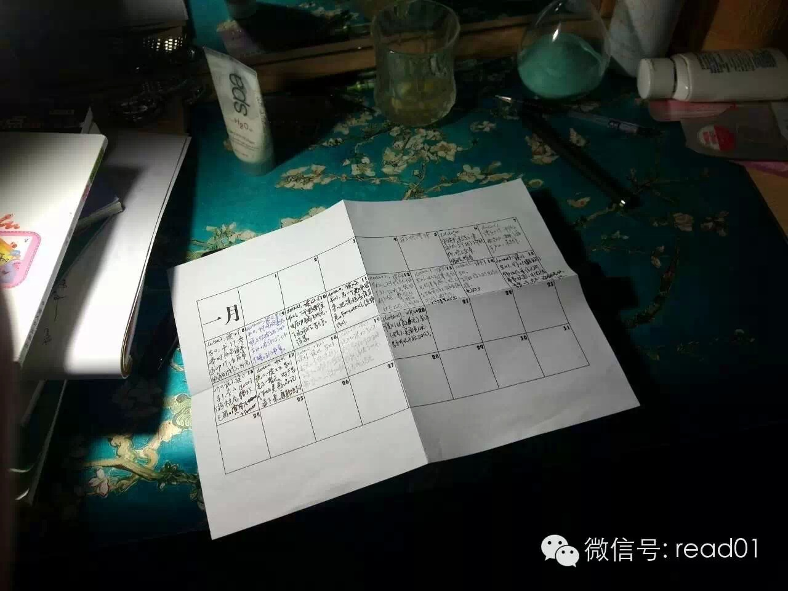

##  在你人生方向感没那么强的时候，怎么更好地生活下去

_2015-01-22_ warfalcon

  

昨天的文章，有读者说没给出具体的解决办法，具体的办法实在太多了，这个微信上最多的就是各种实用的方法论、建议、技巧，对于减肥、运动、时间管理、注意力、拖延、沟
通、阅读等很多方面都有非常仔细的指导和讨论，看看目录里面的文章列表。

看到一篇清华大学经管学院2014年博士及研究型硕士开学典礼新生致词，写得不错，跟大家分享。

作者提到的勇气、爱好和习惯这三点，第一点没办法帮你，只能多尝试，但第二点和第三点，都是这个微信所擅长的。

我写过一篇 怎样判断有一个有兴趣的方向是否值得深入？ 可以输入【兴趣】，或点击文章最后的【查看原文】来阅读。

## 正文

作者：王晓亮（2014年清华经管硕士新生）

出处：http://blog.renren.com/GetEntry.do?id=934316905&owner=335142703

我一直觉得，本科四年里有两个节点最难熬。一个是每学期第三个月，因为我们总在临近期末时才发现学期初立下的各种豪言壮语都没有达成，少花钱，多吃菜，每天自习六小时
，一周去三次健身房，期末成绩进前10%……这些在期末通通成了笑谈。另一个节点是入学后第三年，当你发现身边同学拿到了你没拿到的实习、奖学金和出国机会后，你忍不
住问自己：“入学时我们成绩和能力都差不多，为什么三年之后差距这么远”，这个问题也让你寝食难安。

我不知道有多少人是出于这些焦虑，选择了读硕、读博，选择给自己再争取两到五年的时间，去弥补之前没完成的愿望，去追赶那些超越了自己的同学。

但我很确信的一点是，当你还处于悔恨和焦虑中时，和你谈人生理想、谈通识教育、谈社会贡献，你都不太可能听的进去。因为那些像是高高挂在天上的月亮，而你担心的，是自
己错过一班车后会不会再错过下一班车。甚至你已经开始考虑，自己未来能不能在北上广落户、该不该找个家在北京的女朋友、要有多少年薪才够送孩子上双语幼儿园。 不过，
请别急于断定我们是群被功利主义捆绑的、目光短浅的年青人。因为我所熟知的许多同龄人都怀着强烈的社会责任心。我们也渴望改变些什么，也渴望在学界商界政府机关做出有
益社会的革新，也渴望make a difference，但很少有人手把手地指导我们平衡理想和现实的冲突，很少有人帮我们调和认知上的矛盾。

我们出发的时候都在朝理想走，但这一路有阻力有诱惑有焦虑更有歧路，我们走着走着，走散了。明明不想做一个精致的利己主义者，却无法凭一己之力走出现实约束的怪圈。

这说明了一件事：理想很重要；但仅凭对理想的憧憬，永远也走不到尽头。我们还得有照路的火把，得有挡风的墨镜，得有遮雨的斗笠，得有赶路的毛驴。我们得找一些理想之外
的伙伴陪同自己，才能在没有方向的时候找到方向，才能在理想还未落地的时候把理想坚持下去。

### 于我而言第一个伙伴是勇气。

我们常把勇气当作“敢于质疑”“勇于担当”的修饰语，但事实上勇气比质疑和担当更难培养。当我的意见和大多数人不一致时，当我选择的职业目标是个冷门是条险路时，当实
现理想的机会尚不完美却又稍纵即逝时，我们都得靠点勇气，靠点理性之外的东西，才敢说出自己的观点，才敢做自己认为对但别人不认可的事，才敢在不确定的环境下把事情做
成。有时人会用“我很勇敢，只是不想表现出来”这句话欺骗自己。但勇气这东西和肌肉一样，不用就会萎缩，得在每一个需要表现出勇气的场合反复练习才能强壮起来。

### 第二个伙伴是爱好。

有段日子我的闲暇时间是这样度过的：点开人人网看一遍今天的新鲜事，然后打开微信朋友圈从顶端刷到底端，直到浏览完每一条值得评论和点赞的内容后，再杀回人人网，看刷
微信的这段时间有没有新内容出现……这并不是一个笑话，这反映了一种现象——我们习惯靠社交网络推送过来的稀薄快感解渴，但却越喝越累，越喝越渴，很少得到过全然的满
足。这种日子一天两天可以，但不出一周就会让人烦躁，我们得培养一项社交网络之外的爱好才能获得足够强度的满足，它可以是打球游泳唱歌做饭任何形式，也可以是陪男女朋
友，只要它让你尽兴却又不会沉溺其中。找到适合自己的奖励机制并不比找到理想容易，可一旦你找到了，它将成为你一生抵抗无聊和空虚的利器。

### 第三个伙伴是习惯。

12年清华精仪系的马冬晗在本科生特等奖学金答辩时展示了一份她的日程表，从早上6点到晚上1点，每个小时都安排得密不透风。有人担心规划太多的生活会不会失去自由，
但事实上缺少规划的生活更不自由——因为你总在花时间考虑下个小时该做什么，是该读paper还是逛淘宝刷人人，你得打败头脑里N多偷懒念头才能下决心去做那1件重要
的事。这个抗争过程非常消耗意志力，而意志力对于任何人来说都是种稀缺资源。在固定时间做固定的事、养成一些好习惯，这都有助于节省意志力，把意志力用在更艰难的任务
上。

在我们90后这一代出生以前，中国诞生过一部集奇幻、动作、诙谐与特效于一身的影视大片，它的名字叫《西游记》。这是唯一一部我看过三遍以上的电视剧。然而此时此刻，
我发现小时候对奇遇的渴望和长大后对人生的认识竟如此相似——想收获最棒的旅程，你要有唐僧那样坚定的志向，要像悟空那样勇敢无畏，要靠八戒带来一路的欢笑，也要像沙
僧一样，日复一日地把工作做实。

我很喜欢知乎上的一个问答。

提问者说：“你是怎样走出人生低谷的？” 得票最多的答案是“多走几步”。

我想，培养勇气、培养爱好、培养习惯，这三者正是我们能在人生低谷中、能在方向感还不那么强烈时，向前迈出的一些步伐吧。

### 后记：

在接到学院开学典礼致辞的邀请后，我的脑海里一直回响的是那句话——“听过很多大道理，依然过不好这一生”。我们习惯在开学开工开幕这样的起始时刻，说些振奋人心的话
，说些美好却不容易企及的愿景，但事实上陪伴我们大多数时间的，都是一些再微小不过的喜乐悲欢。当然，这很可能是因为我的眼界还不够开阔，但我确实和很多人一样，感受
着生活中无处不在的琐碎焦虑。但反过来我也意识到，改变生活中任何一处自己不满意的地方，其实生活就会快乐起来。就好比无所事事了一阵子后，突然接到一个不太重要的任
务，你也能从完成任务的过程中收获更好的自我感觉。而这个演讲想说的，正是如何对抗生活中常见的几种负面情绪：因胆怯犹疑而错失机会的悔恨，因过度依赖单维度的快乐而
引发的空虚，因生活缺少计划而状况频出的烦乱。五分钟的时间不指望能说出多么深刻的道理，只求有过相似感受的人能因此找到一些改善生活的建议。

（注：原文是清华大学经管学院2014年博士及研究型硕士开学典礼新生致词，有改动）

## 100天行动读者反馈

**@孟磊**

多亏了在经济师考试两个月前开始了百天计划，终于顺利通过。虽不是什么大考试，要是裸考也很难通过。那时孩子刚出生，没空学习，几近放弃。看了百天计划就像试试。每天
尽量抽出半个小时学习，尽管有时实在抽不开身，但是心里总是装着百天百天百天的事儿，算是个督促。

另外，也用笔记软件记录每天小事儿，几句话，甚至几个字，有时候一下补了了一个礼拜。不管怎样，坚持即为不易。今年打算用纸质记录。说实话，生活并未改变太多，也没看
到更好的自己，不过，光亮越来越多总不是坏事。在沈阳呆了七年，算我的半个故乡。谢谢warfalcon老乡！

@墨熹

新的一年开始锻炼身体，100天的计划是经过坚持能够每晚做300个仰卧起坐，没想到才20天就到了200了！哈哈哈

  

阅读原文

阅读

__ 举报

[阅读原文](http://mp.weixin.qq.com/s?__biz=MjM5NjA3OTM0MA==&mid=204752953&idx=1&sn
=29d83267d5d54198a81c5492d81229d5&scene=1#rd)

