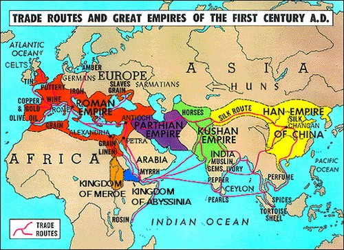
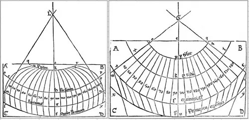
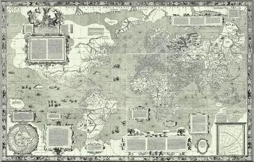
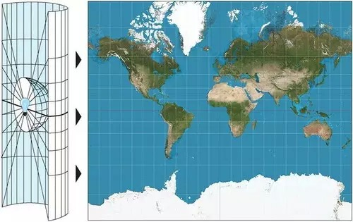
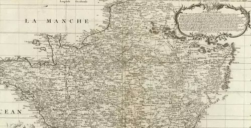
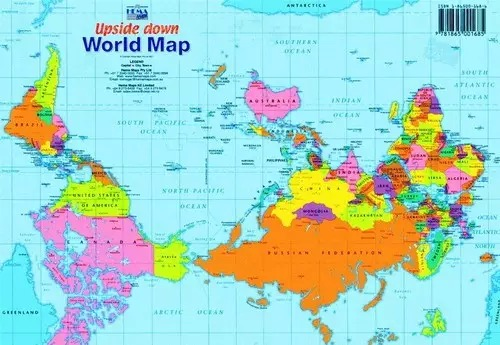
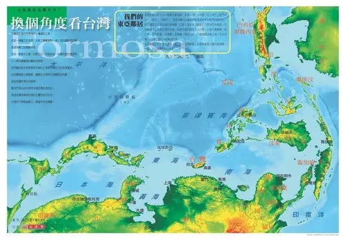

##  地图为什么总是上北下南 | 大象公会

_2015-02-02_ 大象公会

**地图总是上北下南吗？古代地图有各种朝向，只是到了近代才趋于统一，这是一种必然的趋势还是偶然随机的产物？上北下南的通行地图又会碰上什么样的反对意见呢？**

  

**文/李小龙**

  

地图就应该上北下南？

  

这是又一个约定俗成，极少有人会质疑的惯例——现代地图几乎清一色的上北下南。各国的绘制即使存在争议、差别，也都是本国是否处于图画中心，极少有人挑战南北方向。

  

这是“自古以来”的传统吗？

  

似乎是这样。古代中国，也许受西晋裴秀的地图集《禹贡地域图》影响，除了几乎无地图残存的元朝，宋到清的国家地图几乎清一色以北为上。

  

比如宋代《九域守令图》、《禹迹图》、《华夷图》、《地理图》；明代《广舆图》、《大明混一图》、《杨子器跋舆地图》等；大部分的清代全国地图，都是如此。

**相对比较罕见的东上西下的明代全国地图**

  

但并不是所有地图都如此。

  

古代海防图、边防图、方志附图等就没有统一的方位规则。南、北、东、西为上皆有出现。

  

清学者俞正燮《癸已存稿》中说：“凡舆地悬图宜以北为上,其几案展阅之图宜以南为上,以坐阅多向明也”也证明了这一点——制图人的主观判断很影响地图的方位。

  

世界范围内更不统一。比如古代阿拉伯人的地图习惯以南为上(可能是麦加圣城在阿拉伯世界的南方的原因)，刚好和西方相反。更多的地区绘图本身就谈不上规范，就是根据现
实需要制作——怎么方便怎么来，都没有一致的朝向。

**12世纪上南下北的伊斯兰伊德里斯地图**

  

是谁让地图变成以北为上的呢？

  

和大部分现代规范一样，还是欧洲人。他们的绘制习惯统一了全球的地图模式。

  

好像又一个欧洲中心思维的靶子可以被立起来了——他们将自己的国家放在地图的顶端，这是一贯的自大心态作祟。

  

且慢。真实的故事远比论断复杂，北上的确立既有偶然性，也和航海技术的发展息息相关。

  

这要从古代地中海地区开始说起。

  

**【托勒密的世界地图】**

  

上北下南地图的雏形可以追溯到今埃及的亚历山大港。

**公元1世纪的世界贸易路线：亚历山大港(ALEXANDRIA)连接了地中海和红海、亚丁湾、印度洋、孟加拉湾和南中国海的海上贸易路线**

  

罗马帝国时期，地中海内部以及和跨海域的海上贸易愈发繁荣。地中海东部货物集散地的亚历山大港人因此获取了丰富的欧亚大陆地理知识，为早期的地图制作提供了必要信息。

  

天文学家和地理学家托勒密是其中的佼佼者。当时，他完成了具有划时代意义的著作《地理学》——收集了约8000个地方的经纬度，附有27幅地图，描述了两种地图投影方
法(将三维球面通过数学法则转换为二维平面方法)——最后一点尤为重要，它决定了地图的呈现方式。

  

什么是地图投影方法？

  

简而言之，是用一定的数学法则，把地球椭球面上的经纬网转换到平面上的方法。为什么要有这种投影方法呢？理由很实际——地球是一个不可展的球体，想象一下将地球仪的表
面铺平，褶皱、拉伸和断裂当然不可避免。地图投影就是让曲面向平面有序转化的工具。

  

很可能是为了地图投影的便利，奠定了上北下南的位置分布。

  

托勒密就选择了以北为上的指向。他自然知道地球的地轴指向北极星，所以，对投影交集点的选择，最方便莫过于选定为北极上空某一点，将“北”方位置于地图的顶端。

**托勒密伪圆锥投影世界地图(15世纪副本之一)**

  

**托勒密两种地图投影的交集点均为北极上空一点**

  

但这个开端没有被罗马帝国之后的人们重视，地图绘制方向一度陷入混乱。中世纪时期，信仰成了欧洲人绘制世界地图的灵感来源，地图转变为多以东为上——《圣经》中的伊甸
园被认为在世界的最东方。

  

这种情况持续了数百年之后，才又出现了另一种以北为上的地图。

  

**【意大利城邦的海图】**

  

11世纪，意大利城邦从阿拉伯帝国手中夺回了西西里岛等诸多地中海岛屿的控制权，并在第四次十字军东征(1202年-1204年)中将贸易区域拓展到东地中海。

  

一个看似意外的收获改变了欧洲——阿拉伯人流传的指南针，极大地提高了意大利城邦的航海技术。

  

指南针的使用当然影响了地图绘制，直接催生了更高水平的海图——公元13世纪末，意大利诸城邦的波特兰海图。它是迄今发现的最早欧洲海图。

  

具体而言，波特兰海图突破了以北极星为航海导航坐标的局限，以风雨无阻、稳定准确的指针替代。

  

指南针的一端指向北极星方向，北极星和指南针同时帮助定位，无疑更为保险。这强化了以北定位的传统，波特兰海图通常都是按照上北下南的方位绘制。

**1502年葡萄牙的坎迪诺平面球形图(Cantino planisphere)：属于波特兰型海图，这种海图的特征是确定一个大圆圆心(有时两个或三个)，在这个圆心上放射出32条均匀分布的恒向线(也叫等角航线，在实际航行中总是和经线保持某一固定夹角的弧线)。同时将大圆的圆周平均分成十六等分，在圆周的每个等分点上绘制一个指南玫瑰，这些小的指南玫瑰(Compass rose)也均匀放射32条恒向线。依靠这些纵横交错构成网状的恒向线进行导航**

  

**融入了装饰美学的指南玫瑰：上端鸢尾花徽为北方标识，右端十字架为东方标识**

  

大航海时代来临，波特兰海图应用在更为广阔的大西洋。1406年，被欧洲遗忘了一千多年的托勒密的《地理学》由拜占庭人安杰勒斯(Angelus)从希腊文翻译成拉丁
文，其学说和地图成为当时南欧人最佳地理指南，不断积攒的经验，又促进更多的地图绘制。

**1507年的瓦尔德西穆勒(Waldseemuuller)地图，第一次呈现了美洲是一个独立的大陆：亚洲大陆的轮廓和“以北为上”的地图方位的绘制方法依旧沿袭了托勒密世界地图**

  

但二者都有弊端——托勒密世界地图的大陆轮廓几乎是靠想象绘制；波特兰海图则没有考虑圆形地球的曲率，大范围的海域内使用，地图恒向线会有较大偏差。

  

1569年，佛兰德（今比利时北部）地理学家墨卡托绘制了第一张使用“墨卡托投影法”的航海世界地图，三维球面能通过数学方法转换成二维平面，并且能保证恒向线在地图
上显示为直线。

  

也就是说，在这种地图上测量好出发地到目的地的恒向线和经线的角度之后，便可以一次性调整好航向，途中可以不用再调整航向便可到达目的地。

**1569年墨卡托投影地图：地图保留了波特兰海图的指南玫瑰和纵横交错的恒向线**

  

**现代墨卡托投影地图及投影原理**

  

16世纪末，墨卡托的朋友奥利特乌斯的《世界概观》地图集也发挥了重大影响——《世界概观》重复刊印了40多个版本，其译本遍及欧洲各主要语言。

  

墨卡托投影地图和奥利特乌斯地图都继承了“以北为上”的做法，一并影响了后来的近代科学陆图绘制习惯。

  

比如18世纪法国首幅用三角测量法、天文观测绘制的全国地图，就延续“北上”习惯。这是世界上第一幅全国范围使用三角测量法完成的国家地图，也被视为近代陆地科学制图
学的开端。

  

**1570奥特利乌斯世界地图：保留了托勒密地图的南方未知大陆，这也是传教士利玛窦世界地图的原型**

  

实际上，只要有能稳定方向的工具，无论哪个方向为上，都可以操作，以北极星、指南针定轴线只是方便了北上倾向，并非必要条件。

  

但当时的地图绘制典型、投影学说都沿用了上北下南，此后，这一特点在欧洲确立。

**1744年被三角网覆盖的法国地图(局部)**

  

**【欧洲绘图法的扩散】**

  

此后，这种绘图法随着欧洲势力的全球扩张，紧随欧洲商人、传教士、统治者等的贸易、传教、殖民的脚步，统一了全世界的地图。

  

如日本受到葡萄牙商人的影响，17世纪初就采用波特兰海图；印度则在英国殖民者的带领下绘制近代地图。

  

而在传统力量强大的中国，欧洲绘图法又是怎么取代本土绘图法的呢？

  

传教士的作用不可小觑。1584年，传教士利玛窦在广东肇庆绘制了第一幅中文世界地图《舆地山海全图》。

**利玛窦1602年的世界地图《坤舆万国全图》**

  

1708年康熙下令编绘的国家地图《皇舆全览图》，也是在传教士杜德美、白晋等的主持下，用三角测量和天文观测的方法制成。不过，清朝的其他地图并未就此采用近代科学
绘法，省志或者府县志仍然采用传统象形符号绘制。

  

直到民国时期，北洋政府制订“十年速测计划”，之后的南京政府制定“全国陆地测量十年计划”，中国的各种通用地图最终统一为“北上”朝向。

  

并不是所有人都喜欢现代地图惯例。南半球人民的痛恨当然能够理解——谁会觉得放在下方舒服呢？

  

于是，一些不喜欢被忽视的澳洲人，索性把地图翻转了过来：

**澳洲upside down版本地图**

  

台湾也很不服：按照上北下南方位绘制的地图，让本来具有海洋性格的台湾人，忽略了东面广阔的太平洋。因此，应台湾传统地图逆时针旋转九十度，如下：

**台大地理系制作“换个角度看台湾”地图，将台湾地图摆放成了东上西下的方位**

  

这并不能改变已经成型的“上北下南”原则——南半球的人民们还是再忍忍吧。

  

**版权声明**

****大象公会所有文章均为原创，****  

****版权归大象公会所有。如希望转载，****

****请事前联系我们：****

bd@idaxiang.org

****知识 | 见识 | 见闻****

阅读

__ 举报

[阅读原文](http://mp.weixin.qq.com/s?__biz=MjM5NzQwNjcyMQ==&mid=210468994&idx=1&sn
=09617a2f711645d5f45e32f4cebfc45d&scene=1#rd)

