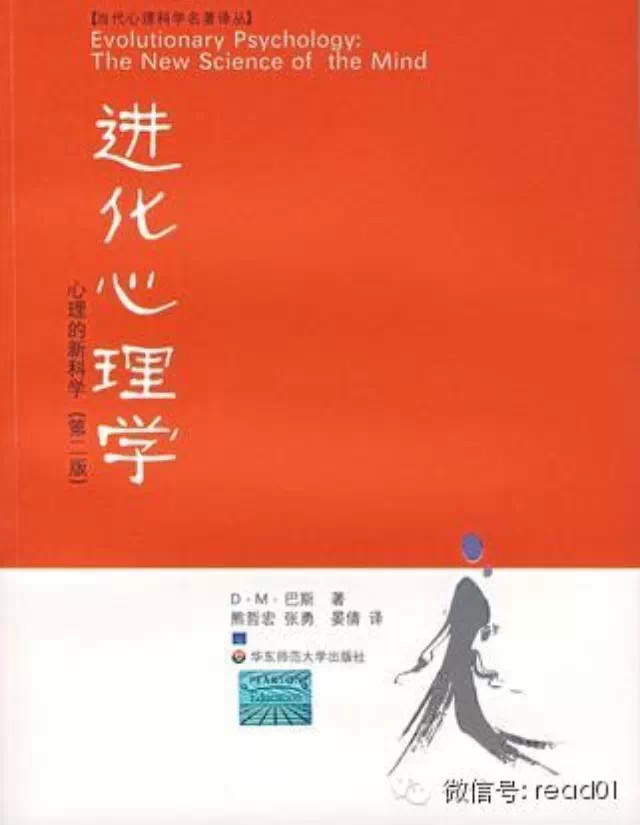
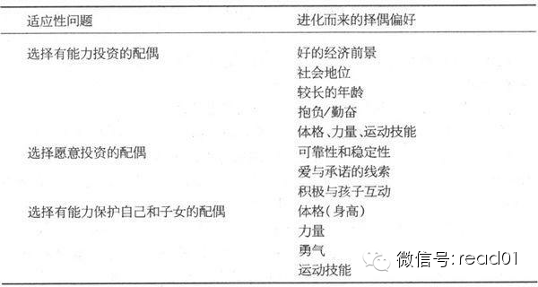
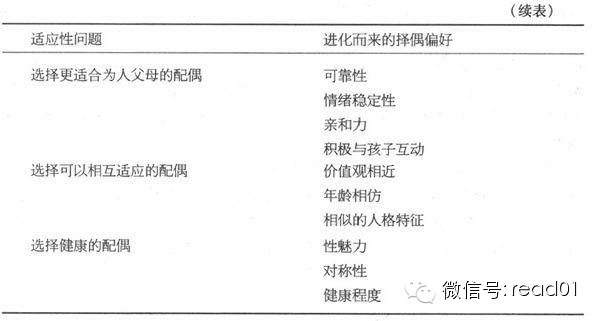

  

在看一本非常有意思的书《进化心理学》，这本书个人打5分，里面从进化的角度来看待心理学，对心理学有兴趣的读者，推荐阅读。

分享其中一章的笔记：**女性的长期择偶策略**

## 正文

在某种特殊程度上，雌性的择偶偏好可能决定了物种进化的方向。因为雌性是择偶行为的主宰者，她们决定了何时交配，和谁交配以及交配的频率。 —Sarah
Blaffer Hrdy, 1981

正是由于我们的祖先明智地选择配偶，才获得了这种生存和繁殖上的优势。同时，许多特殊的欲望也随之进化而来。作为进化过程中胜利者的后代，现代人类也继承了一系列特殊
的择偶偏好。

### 女性择偶偏好的内容

择偶是一项复杂的任务，我们不能期望由一个简单的答案就了解女性想要的是什么。这是一个长期存在而且备受关注的问题，也许没有任何一个其他的主题受到过如此多的关注，
然而现在我们或许已经找到了某些合理而且确定的答案。

### 对好的经济前景的偏好

来自几十项研究的证据表明，当代美国女性在择偶时的确比男性更看重经济资源。以1939年美国的一项研究为例。要求男性和女性分别为18项个人品质作出择偶重要性的等
级评分，范围从“无关”到“必不可少”。女性虽然没有把良好的经济前景作为必备品质，但也把它列入重要级别。而男性只把这评为一项优点，但不是很重要。1939年的研
究表明女性对经济条件的重视程度是男性的两倍，这项结果在1956年和1967年的研究中得到了重复验证（Hill, 1945; Hudson & Henze,
1969; McGinnis, 1958）。

在20世纪80年代中叶，研究者重复了几十年前的研究，发现结果没有太大的变化，两性之间仍然存在两倍的差异。

对报纸以及杂志上刊登的征婚广告的研究结果表明，女性在征求配偶的时候确实很注重男性的经济资源。一项对1111例征婚广告的研究发现，女性征婚者对经济资源的要求约
为男性的11倍（Wiederman, 1993）。总之，资源偏好的性别差异并不仅仅局限于大学生，也不受研究方法的约束。

这种女性对资源的偏好不仅仅发生在美国社会、西方社会或者资本主义社会。一项国际性的跨文化研究也证明了这一点。这项研究遍及六大洲和五个岛屿的37种文化，参与者从
澳大利亚沿海居民到巴西当地人以及南非贫民区的祖鲁人（Buss, Abbott, Angleitner, et al., 1990）。一些参与者来自一夫多妻制
社会（允许一名男子配娶多名女子的婚姻制度），如尼日利亚和赞比亚。而更多参与者来自一夫一妻制的社会（一名男子只能配娶一位女子的婚姻制度），如西班牙和加拿大。研
究地区还包括一些同居现象非常普遍的社会，如瑞典和芬兰，以及坚决反对同居的社会，如保加利亚和希腊。

该研究中，要求男性和女性参与者对潜在配偶和婚配对象的18项品质的重要性进行评分，从“不重要”到“必不可少”划分等级。结果得出，不同洲际、不同政治体系（包括共
产主义和社会主义）、不同种族、不同宗教团体以及不同婚配制度（从极端的一夫多妻制到假定的一夫一妻制）下的女性都比男性更看重对方的经济前景。总体看来，女性对经济
资源的评分比男性高出100％，约为男性评分的两倍。当然，各地的评分存在一些文化差异。例如，日本女性对经济资源的评分比男性高出150％，而荷兰女性仅比男性高出
36％，比其他任何国家的女性都低。不过总体看来性别差异还是一致的：世界范围内，女性对婚配对象的经济资源的要求高于男性对经济资源的要求。

**远古女性承载着体内受精、九月怀胎和哺乳婴儿的重大负荷，而选择资源丰富的配偶就可以获得相当大的支持。**

### 对高社会地位的偏好

远古男性已经能够清晰地根据资源的多少来由高而低地定义地位等级。

女性往往偏好社会地位较高的男性，这是因为社会地位是判断资源控制量的最通用的线索。较高的地位就伴随着较好的食物、更广袤的领地以及更优越的健康护理。社会地位更高
的男性还能给子女提供更多机会。就世界范围而言，地位较高的家庭的男孩往往能接触到更多更好的配偶。

等级性是各种人类社会的共同特征，资源往往积聚在那些社会高层人士手中。从历史上看，远古女性偏好高地位的男性，也许能在某种程度上解决获取资源的适应性问题。现代女
性就是那些繁殖成功的祖先的后代，因此也继承了她们的择偶偏好。

### 对年长男性的偏好

在那项国际性择偶研究的所有37种文化中，女性都偏好年长的男性。平均而言，女性偏爱年长约3岁半的男性。在不同的文化中，这个年龄差别也存在差别，加拿大说法语的女
性选择的丈夫年长不到2岁，爱尔兰女性选择的丈夫年长5岁以上。世界范围内新娘和新郎的年龄差是3年，这表明女性的婚姻决策与她们的择偶偏好相匹配。

**为什么女性更看重年长的男性？**

我们必须考察随年龄而变化的事物。最普遍的变化之一是资源的增长。在当代西方社会，人们的收入一般都随年龄而增长，年龄与资源和地位的联系具有跨文化的一致性。男性的
体力往往随着年龄的增长而加强，所以在资源对生存至关重要的狩猎—采集时代，远古女性更偏好年龄较长者，现代女性的择偶偏好可能就源于此。

女人大多更愿嫁给比自己稍稍年长又差距不大的男性，但不愿直接选择年长许多的男性的原因之一也许是，更年长的男性死亡的风险更大，一旦他们死亡，就不能继续为子女提供
资源和保护了。

### 对抱负和勤奋的偏好

人们怎样在日常生活中获得成功？

在所有策略中，勤奋工作是预测过去或未来的收入和晋升的最佳指标。比起工作不够努力的男性，那些他们自己及其配偶都一致声称其工作努力的男士往往都拥有更高的教育水平
、更高的年薪，而且他们有望获得更多的薪水以及晋升机会。勤奋而有抱负的男士比那些懒惰缺乏上进心的男士更容易维持高职位。

。在长期关系与短期关系的择偶研究中，女性把缺乏抱负心的男性认为是最没魅力的人，然而男性对未来妻子有无抱负却没有太多的要求（Buss & Schmitt,
1993）。当一个男人处于失业、缺乏目标或者做事懒散的状态，女人就极可能结束与他的长期关系（Betzig, 1989）。

女性对有抱负且勤奋的男性的偏好不仅只限于美国或者两方社会。在绝大多数文化中，女性都比男性更看重这两种品质，这一点可以从他们的评分差异中看出。

### 对可靠性和稳定性的偏好

在择偶的跨文化研究所评估的18种品质中，爱情位居第一位，之后分别是可靠性、情绪的稳定性或成熟性。在37种文化的21种中，男性和女性对配偶的可靠性都有同样的偏
好（Buss et al., 1990）。在剩下的16种中，有15种文化中的女性比男性更看重可靠性。

这些品质对全世界的女性都如此重要的原因可能有两个。

第一，这些品质是资源将持续不断地得到提供的可靠指标。

第二，缺乏信任感和情绪不稳定的男性会给配偶带来反复无常的、充满冲突的情绪负担（Buss, 1991）。他们往往是自我中心化的，习惯于垄断资源。

如果一个男人情绪多变、喜怒无常，这将会让女性付出更多的代价，从而阻碍关键的适应性问题的解决。

女性看重配偶的可靠性和情绪稳定性，这样做的好处在于她们能够从中获得长期稳定的资源供给。在人类进化的早期阶段，如果女性选择了稳定可靠的男性，那么这样的女性将会
更加确信配偶获取和维持资源的能力，从而确保自己和子女的生活。而且，作出此种明智之举的女性还可以避免不可靠或不稳定的男性所带来的损失。

### 对运动能力的偏好

女性择偶中身体特征的重要性是显而易见的，女性的长期择偶的收益之一也是男性能够提供身体上的保护。一个男人的魁梧、力量、身体素质和运动技能都是判断其能否提供保护
的线索。

在一项短期和长期择偶的研究中，美国女性为一系列的身体特质评定等级。不管是短期择偶还是长期择偶，矮个子男性都被评为“不具性魅力”的一类（Buss &
Schmitt, 1993）。相对地，高大强壮的运动型男性被评为“极具性魅力”的潜在婚配对象。

在人类进化历程中，身体上的保护是男人能为女人所做的最重要的事情之一。

男人身体结构的特质，例如身高、肩宽、上身肌肉都对女人具有性吸引作用，对其他男人具有威慑作用。

### 对健康和外貌的偏好

**对女人来说，选择一个更对称的男人，其实就是为她的孩子选择更优秀的基因。**

有大量证据证明这种假设，即对称性确实是一种健康的线索，而且女性特别重视配偶的这种品质。

第一，面孔对称的个体在生理测验、心理测验以及情绪健康测验上都取得了较高得分。

第二，对两性而言，面孔对称性和性魅力的评分之间存在正相关。

第三，相对于其他人，面孔更对称的男人往往被女性评论为更性感，一生拥有更多性伴侣和更多外遇，而且性经验开始得更早。

男性面孔和身体的对称性标志着健康，均对女性具有性吸引力；迷人的具有男性气概的面孔同时也被认为是健康的。健康可以给对方带来诸多收益，包括环境和遗传方面的收益：
更长的寿命、更可靠的物质供给、更低的患病率以及给子女遗传更好的基因。从这些收益可看出，健康对择偶而言非常重要。

### 爱情与承诺

女性长期以来一直面临的一个适应性问题是，不仅要选择一个拥有生活必需资源的男性，还要选择一个愿意为她及其子女作出资源承诺的男性。这个问题也许比看上去复杂得多。
尽管资源是直接可辨的，但是承诺却不能。要确保承诺，可以转而寻找标志未来忠诚度的线索。爱情可能就是承诺的最关键的线索之一。

无论对于男人还是女人，承诺都被看作是爱的最核心的部分。这种行为包括放弃与其他人的关系，开始谈婚论嫁，以及表达共同拥有孩子的愿望。如果一个男人表现出这些爱的行
为，就意味着他愿意为她及其子女作出承诺。

然而，承诺有很多方面，即有很多种分享资源的特殊方式。其中主要的一个方面是忠诚，即分居两地仍忠于对方。忠诚意味着只对单一对象的性的承诺。承诺的另一个方面是，对
爱人的物资付出，例如赠与贵重的礼物。这种行为意味着对长期关系的郑重承诺。情绪上的支持是承诺的另一个方面，这表现为一方有困难时另一方能及时赶到并耐心倾听。承诺
还意味着时间和精力的投入，牺牲个人目标而尽量满足对方的需求。还有，繁殖行为也代表了对对方的繁殖的直接承诺。所有这些方面都被认为是爱的基本要素，它们分别表明了
对另一方在性、经济、情绪以及基因资源上的承诺。

由于女性在分娩和哺育孩子方面投入更多，如果她们随意与人发生性关系，损失就会比男性大得多。因此，对爱的需求正是她们确保能获得与她们为男人付出的代价相当的资源承
诺的一种方式。

### 对愿意为子女投资的人的偏好

女性选择长期配偶的另一个适应性问题是衡量男性为子女投资的意愿。这个问题之所以重要有两个原因：

（1）男人有时会寻找多样的性关系，从而更可能为其他女人付出（为择偶而努力）而不是对子女付出（为孩子而努力）（详见第六章）；

（2）男人会评估自己是孩子生父的可能性。当知道或者怀疑孩子并非亲生，他们往往会对自己的投入有所保留（La Cerra, 1994）。

这两个因素就决定了男人为某个孩子投资的意愿会有很大的不同；这种差异造就了女人偏好的进化，促使她们偏好那种更愿意为子女投入的男人。

女性对那些愿意为孩子投入的男性有一种特殊的偏好，觉得他们更有性魅力，然而男性并没有这种偏好。

### 女性择偶偏好的背景影响因素

四种背景因素下女性择偶偏好的变化：

第一种背景因素是女性自身的经济资源。研究结论刚好和结构性资源缺乏假设相反，拥有较多资源的女性往往更加重视而不是轻视潜在配偶的个人收入和教育背景。

第二种背景因素是关系的持续时间。多项研究表明，选择未来丈夫时，女性往往更重视对方的个人品质而不是性魅力，例如忠诚、可靠性、善良等个人特征往往比外貌重要得多。

第三个影响女性择偶偏好的背景因素是生理周期。处于怀孕几率更大的时期的女性，往往更欣赏富有男子气和对称性更好的男性形象——因为这两个线索都暗含了身体健康。

第四个背景因素是女性自身的配偶价值。比起配偶价值较低的女性，配偶价值更高的女性往往更偏好富有男子气和对称性更好的男性，例如在刊登的征婚广告中她们通常会对相关
特征提出大量的要求。

最近正在研究的第五个背景因素是地理位置。生活在密集地区和高消费地区的女性在征婚广告中往往要求更多的资源（McGmaw,
2002）。综合起来看，这些背景效应表明，女性的择偶偏好恰好反映了人类进化适应的标志：人类必须设计特殊的偏好来解决复杂的择偶适应性问题。

### 小结

女性的择偶偏好并不是一成不变的，而是会随着以下至少5个背景因素作出适应性的变化：她们的个人资源、关系的持续时间、月经周期、她们的配偶价值、她们的居住地对资源
的需求程度。择偶偏好也会随着性取向而发生变化。

结构性资源缺乏假设预测，拥有许多个人资源的女性不会像缺乏资源的女性一样看重男性的资源。然而这个假设并没有得到已有的经验数据的支持。

实际上，比之收入低的女性，收入高的女性更看重未来配偶的收入和教育程度，而不是更不看重。女性也显示出对长期关系还是短期关系背景中择偶的敏感性。特别地，在长期择
偶背景下，配偶必须是一个好的资源提供者和好的父亲。这些品质在短期择偶背景中却远远没有那么重要。女性的月经周期对择偶偏好也有影响。相比于那些不太可能受孕的时期
，她们在最有可能怀孕时偏好选择更有男子气、对称性更好的男性。最后，配偶价值更高的女性往往对于更有男子气和对称性更好的男性有更强的偏好，因而在刊登征婚广告以寻
求长期配偶时往往会有更多要求。

## 100天行动读者反馈

**@波罗蜜**

老师好，看您的微信收获良多，目前跑步已坚持150天，好习惯继续中。今年特别想着手管理自己的时间，用Excel和纸记录每天的事项，能看到很多黑洞，但改进效果很
不好，想问下有没有windows phone系统用的APP,谢谢！

**@warfalcon**

抱歉，windows phone系统我不熟，没用过，不知道有哪些时间记录的APP好一点，如果有哪位读者有推荐可以反馈一下。

**@穷遥**

今天才发现，实施百天计划诵读心经居然107天，真是好开心。我自认为是个非常没有毅力的人，没有一天间断，真是让我开启了新大门好不好◠‿◠。在理解方面还是似懂非
懂，还是自己悟性太低了，慢慢领悟其中的奥妙吧下一步呢，打算坚持下去的同时，再开启一扇大门--
锻炼身体！每次熬夜过后都感觉自己虚弱的要死，为了让自己以后有资本去为一些事情努力，跑步要开始写上日程！

  

阅读

__ 举报

[阅读原文](http://mp.weixin.qq.com/s?__biz=MjM5NjA3OTM0MA==&mid=204464196&idx=1&sn
=219ca6a64bee35971c3e566f813eabe9&scene=1#rd)

