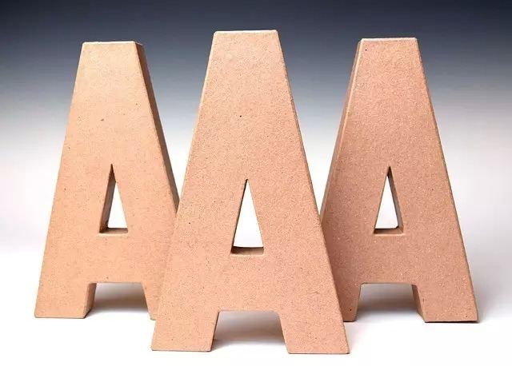

##  如何取得全A成绩

_2015-03-12_ _史蒂夫**帕弗利纳_ 聪明人的个人发展 聪明人的个人发展

**聪明人的个人发展** 

stevepavlinachina

这是勇敢者的游戏。这是自强者的人生。StevePavlina.com博客网站中文翻译。  个人成长，与你分享。：）

__ __

图片来源：**wongpear**

  

我开始上高中时，就决心成为一名成绩全A的学生，即使自己以前还从未做到。作为一个只有14岁的孩子，成绩全A的学生看起来是个极有意思的追求目标。由于学校就是当时
生活的中心，我想自己最好能在学业上取得成功。

  

在高中一年级的第一篇英语作文上，我只得了C+。这让我感到有些恼火。我觉得自己已尽了最大努力。

  

与把C+成绩看作自己会无法实现追求的目标相反，我自问道：“为什么我没得到A？一篇成绩为A的文章需要是什么样子？”

  

无论何时在课堂作业上取得低于A的成绩，我都会不断自问：“我要用什么不同做法才能得到A？”

  

假如自己不确定，我就会询问老师并仔细听取他们的建议。我告诉老师想在所有课目上都取得全A成绩，并问他们要怎样做才能实现目标。他们都很高兴告诉我正确做法。于是我
听从那些建议并按照他们的意见行动。

  

很快我就形成了赢得并保持全A成绩的心态与习惯，且连续4年坚持如此。我以最高荣誉从高中毕业，手握满是褒奖的推荐信，还有计算机科学专业顶尖大学的录取通知书，如加
州大学伯克利分校、加州大学洛杉矶分校、加州理工学院、卡耐基梅隆大学等等。

  

令人惊讶的是，获取全A成绩很可能比得到较低分数花费的努力更少。当致力于取得全A成绩时，你会认真听取课堂内容，不会拖拉落后。你将保持学习进度，按时完成作业。这
样就不会心存疑惑，或者毫无头绪。如果有什么不明白的地方，你便会尽快将其搞懂。倘若需要帮助，你就会立刻寻求帮助。你不会让自己落在人后。

  

那些学业分数较低的学生常要付出更多努力，因为他们采用了一条拖沓途径。他们养成在最后一分钟压力下完成任务的坏习惯。他们在面对考试时显得疲惫和压力重重，而非放松
和准备充分。他们没在课堂上及时吸收学习内容；而是在时间更紧、压力更大，以及想法更生疏时死记硬背。他们得到B类或C类成绩便感觉足矣，不愿回头再学习如何取得A类
成绩。

  

对于A类学生而言，得到B类成绩就是错误。取得B+和A-也同是如此。

  

当在任何课目上得到A-成绩时，我就会把它看作一个错误。我不会过分自责，只是不断问自己：“为何没得到A？我还需要采用什么不同做法？”

  

如果出现难以避免的小差错，我会原谅这种错误，对其放手。但若辨认出一种可以避免的出错原因，我就会做上标记并琢磨如何改变做事习惯。例如，对于在数学测验中出现的简
单运算错误，我会通过在做完每一题时重做所有运算步骤，并且不看原来的计算过程，在很大程度上避免犯下同类差错。假如重做后的答案与先前不同，那我显然犯了错，若还有
时间，我就可在交卷前回头将其改正。我还学会了慢慢校对自己的作文，检查拼写和语法错误，查找任何不能确定的单词意思。

  

最终，获取全A成绩就是一系列简单习惯的自然结果。每晚我都会在玩视频游戏前做完家庭作业。我总是超额完成老师布置的功课。我也很高兴帮助其他在学业上需要帮助的同学
，部分原因是这样可以帮我更好巩固所学知识，另一方面还能为我在同学间赢得更多社交支持。

  

我理解评分工作本身有着许多变化因素。评分结果常被人视为不公平。一项有趣研究显示，老师给你作业或测试评分的时间距其饭后越久，你的评分就越低。老师们在血糖越高时
，给出的评分就越慷慨。因此你试卷被评分的最佳时间，就是在老师刚吃完饭后。不过大多数时候，你很可能都没法控制这种事。

  

但你可以让老师的个人偏见对自己有利。假如你告诉一位老师自己想成为全A学生，这个印象就会一直留在其脑中。他们常会帮你达成这种愿望，特别是你主动请求帮助和建议。
如果老师知道你对获得A类成绩非常认真，他们甚至在某些主观评分的事项上会给你有利评判。他们通常不会直接给你慈善分数，但能让老师站到自己一边，在主观问题上给出有
利评分，对你而言毫无坏处。

  

获得全A成绩当然与你的学习态度和测试表现相关，但它也跟你和老师间的交往关系有很大关联。若你认为老师不能，或者不会因为跟你之间关系而降低对自己的评分，请再仔细
考虑考虑。老师们也是人。即使他们没有主动表现个人偏见，那些偏见也会在潜意识出现。这个事实已在大量老师评分行为模式的数据分析中一再体现。

  

由于评分行为的主观本质，尤其在一些副课上，我很快意识到即使出色完成了要求的所有作业，自己仍感觉无法完全确定能取得A类成绩。但要是我和老师发展并保持了积极师生
关系，就很容易确信能得到A。而且强有力的师生关系还给了我一点更多回旋空间。如果老师相信我已为获取A类成绩付出足够努力（或者绰绰有余），即便时不时有些小错，我
还是能得到A。若感到学生正在努力认真地学习，老师们通常乐意原谅这个学生犯的一些小错。

  

通过许下获取全A成绩的承诺，我得以让自己转变到全A学生的状态。没过多久我也养成了其他自认为适用于全A学生的行为习惯。

  

通过在老师工作之余表达对他们所教课程的更多兴趣，我与高中老师们发展出积极的师生关系。即使已获得全A成绩，我仍喜欢询问那些最感兴趣问题的更多信息。我会表达个人
好奇心，学习比课堂所教知识更多的内容。我会询问老师还在忙些什么，以及他们是否愿意和我分享那些活动。课后我会留在教室跟老师同学们一起开开玩笑。有时我还参加自己
老师也参与的俱乐部活动。我当时并非特意去做这些事情，也不是和每位老师都如此。我只在自己真心感到好奇时才这样做。

  

自然而然地，我被邀请分享一些其他学生未能获知的教学机会。我得以参加一些特殊实地考察旅行，例如位于加州帕萨迪那的喷气推进实验室。我也得以使用额外教学资源，如某
些书籍和软件。高中时我便被邀请在USC学习大学级别课程，它能为我提供大学课程的学分。我还被邀请成为自己高中首个学术十项全能（Academic
Decathlon）团队的领队。

  

我们都会为自己设定标准。如果B对你来说已经够好，那是你的选择。但生活中如此多的上乘机会都是给那些不断争取优异表现，真正专注于成为顶尖选手的人保留。这些人才能
收到无穷无尽的积极邀请。

  

获取全A成绩无需更多工作。它只需要一种不同的心态和一系列不同的行为习惯，但长远而言，它其实只用付出更少工作，尤其是透过长期视角来看。若你在早期生活中取得全A
成绩，就会获得在以后生活里可以依靠的知识和技能。你没法总是知晓，这些技能将如何在未来生活中发挥作用。

  

我很早之前便可认定自己无需擅长写作或语法，因为甚至在高中时，我就知道自己要走向一条技术类型的职业道路。我当时无法预测自己最终将从写作和演讲获得美好生活。我上
高中时，都还没出现博客这种事物。但我非常感激过去的自己，当时在这些基础技能上许下坚实承诺。“他”为我留下了一些优秀习惯，使我在今天都受益匪浅。若我当时只满足
于C+成绩，“他”可能就给后来的我留下沉重负担，让我不得不重新学习怎样写作，或者勉强接受自己欠佳的写作技能。

  

即使你现在并未身处学校，生活本身就是个大学堂。你也仍在被这个世界评分。你的分数就是自己的生活结果。生活每时每刻都在给你打分。

  

你对自己现在的分数高兴吗，或者感觉并没好好发挥个人潜能？如今什么样的承诺会和你在高中时获取全A成绩的目标一样？你要怎样才能上升为班级里的顶尖成员，成为同龄人
中最佳选手之一，还能与各类导师发展积极关系并从他们那里有效学习？

  

今天你眼中的优秀个人形象又是怎样？

  

一旦你弄清自己当前的全A标准，就对其许下承诺。无论何时偏离标准，请不断询问自己：“我要怎样才能得到A？”然后着手那些该做的事情，争取赢得那个A。

  

另外，请一直将自己作为全A学生看待。他/她不是别人。他/她就是你。你就是那个成功者，那个顶尖选手，那个致力于优秀自我的人。

  

  

Steve Pavlina

2013.10.25

  

  

阅读原文

阅读

__ 举报

[阅读原文](http://mp.weixin.qq.com/s?__biz=MzA3NzIyNTQ3NA==&mid=206395505&idx=1&sn
=8f5dbfbf174e0e5b01d10b95c4db88f1&scene=1#rd)

