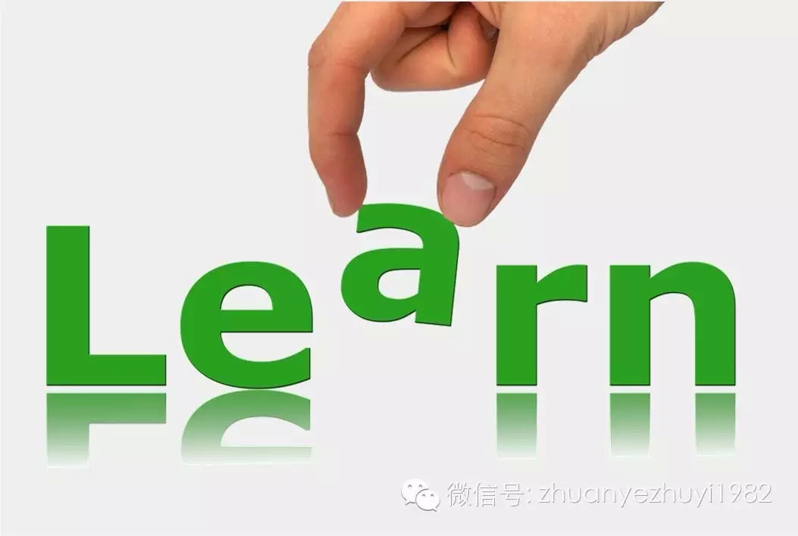

##  如何拥有快速学习的能力？

_2015-03-12_ _邓璟_ 专业主义 专业主义

**专业主义** 

zhuanyezhuyi1982

努力用专业主义视角，讲述新闻和新闻背后的故事。

__ __

**文|邓璟**

  

在企业工作的家人，最近要写一份报告，告诉我：百度搜索了很久，也没找到多少关于这个话题的、有用的干货。

  

我想了下，跟她说：你可能方向错了，像这种偏小众的话题，不能用百度、Google这种大众搜索工具，而应该通过专业数据库、精准定位来搜索，必要时候还得直接致电相
关机构和负责人，以学习取经的名义索取相关信息（不涉密）。

  

今天花了大约30分钟帮她找到了这两三年来关于此话题（这个话题诞生也就两三年）最详尽最权威的资料，数了数：10篇PDF论文，2篇图文并茂的Word文档，以及4
篇TXT文档（每篇又内含同主题的多篇），文字加起来大概有10多万字。

  

发送这些文件前，我快速阅读了这些文章，不敢说100%记得住，但哪篇文章讲什么，哪些可以写进报告并做SWOT分析，我心里是有数的。她在QQ那边接收了这些文件，
然后发了一个“流汗”的表情过来，说：“看不完……”

  

起初，我有点不理解，回复：“**我看了下这些文章的作者，多数都是一线负责人或操作者。关于这个话题最精华的介绍和分析，几乎都在这里了。假如你都不知道别人做到什
么水准，就去写可行性报告和相关建议对策，怎么可能写的好？**”

  

不过，这些话发出去之后，我很快意识到一个问题：**快速学习能力**。

  

家人和我不一样，她没有受过多少速读、提炼和概括的训练，甚至在“选择”时也可能存在问题。

  

像一边查找资料，一边速读，还能在大脑中形成相关记忆单元，这种做法或者说思维，她目前是不具备的。

  

> **我把这种做法或思维，视为快速学习能力（的一种）。**

  

做记者这一行就10年了，下面通过几个亲历的小故事，来探讨一下如何获得这种快速学习的能力。

  

**第一个故事是买手机和其他电子产品。****每次买新电子设备之前，我会泡相关网络论坛一两天。**这种做法，常常能让我找到最适合自己需求、性价比最高的手机等电子设备。这只是其中之一，更重要的是，它帮我扫盲了——当手机等电子设备入手之后，我基本不会碰到有太多使用上的困难和麻烦，因为这种设备可能存在的问题及其解决方式，在论坛上早已有人碰到并解答，而且相关使用窍门我也知道了。

  

**如果用一句话来形容上面这个故事，就是“磨刀不误砍柴工”。**这种做法的好处，等养成习惯了，大家可能就知道它的威力有多么大。

  

**第二个故事有关速读。**我的速度能力是Google Reader锻炼出来，不幸的是谷歌把这个功能废掉了。曾经在Google Reader里订阅了10来家中文媒体（几乎搜罗了我能找到、有原创能力、报道国际新闻的媒体），以及英美和亚洲其他国家20多家英文媒体，如果对方不提供RSS功能，我就自己给它“烧”一个RSS（现在很少人用RSS，这儿就不介绍怎么“烧”RSS了）。

  

我有强迫症，只要Google Reader显示有未读条数，就要把它看完才能安心入睡。这件事做了4年多，每天大概有总数2000+条新闻，要一条条精读是不可能的
，只能是速读+重点阅读。这个过程非常非常痛苦，我是全年无休在做这事，因为有时差，很多外电都是北京时间每天凌晨更新，因此我凌晨1点下班回家后发现又有几百条未读
，几乎天天看到凌晨4-5点才能看完，随后才能安心睡觉。

  

这事养成习惯之后，**有两大好处：一个就是上面说的速读能力，**当每天都这么有意无意训练自己时，题材会越来越熟悉，然后浏览速度会非常非常快，“一目十行”；*
*第二个就是你对某个新闻事件的判断越来越精准**，因为国际新闻领域，尤其是时政类国际新闻，几乎没有什么“新鲜事”，多数都可以追溯至几个月前、几年前、几十年前
甚至数百年前的历史瓜葛——往大里吹牛皮，这就是“看问题的历史眼光”。

  

**第三个故事有关提纲挈领、抓住核心的能力。**这跟第二个故事有一定延续性，**当你看的东西非常非常多时，请注意“非常非常”这个修饰语，一定要多到普通人都追不上时，你可能会发现自己“发现好东西”的能力已经大大增强了。**打个比方，我曾跟同事说，自己是不太看BBC、CNN这种以即时新闻见长的媒体的，或者只花很少时间去看，这不是说BBC、CNN不好，而是说等你看东西足够多之后，你会发现它们的报道还不够过瘾，想知道更多。

  

在有了大量阅读、基本具备识别精品能力之后，我会花很多时间在《经济学人》、《大西洋月刊》、《外交政策》、《华盛顿邮报》以及《纽约时报》（专栏和评论）等重点媒体
上面。做国际新闻非常出色的安替，曾写过一篇《新新闻人自学手册》，它是我摸索国际新闻操作的一本“红宝书”，文中提到《经济学人》是极佳刊物，所以我2007年前后
就花了10多元在淘宝买了两个光盘，内含十年《经济学人》过刊PDF版本，接下来我花了三四年以及单位的打印机，背诵了其中绝大多数大文章。

  

回想起来，这个过程非常非常痛苦，因为我当时只是应试英语6级水平（当年还是60.5分，惊险通过），最开始那一年背诵，无数次想放弃想丢掉，但最后坚持了下来。好处
是极度明显的：**它是一份全世界都推崇的国际政经分析类杂志，让我在随后比较容易就能把握一起国际新闻事件背后的前因后果及博弈关系等。**另一个意想不到的收获是
：跨过对英文阅读的恐惧阶段之后（大概花了一年半），别人随便扔中文还是英文材料过来，我都不会恐惧了，因为中英文材料在阅读上来说对我都差不多。

  

《经济学人》行文从不拖泥带水，言简意赅，观点精炼。**当你阅读这类文章越多，慢慢地，提纲契领、抓住核心的能力也会开始形成。**

  

**第四个故事是关于比稿，以及比稿给人带来的学习能力。**现在网络、微信阅读均有点击量、阅读量作为一个权衡指标，但在微信诞生之前，印刷类媒体是没有这种评估体系的，多数时候是自己内部评稿，内部评估不是不好，但有缺陷性。所以我当时采用了比稿和复盘方式来给自己加压，最开始，只敢跟同城竞争对手媒体比稿，**每天看自己的稿子跟对方同题稿件有哪些差异，信息点是否比对方多，写作、标题以及内容呈现是否比对方好，传播效果对比，诸如此类，哪个环节落后了有漏洞了，下次绝对会补上、不再给对手任何机会。**后来发现稿件能比同城对手好很多时，就全国范围比稿（再后来是跟英美媒体比较分析角度和深度），因为每天都在比稿、复盘、查缺补漏，带来的一个副产品是：我记得住全国省会城市、副省级城市50多家都市报电子版每天凌晨更新的时间（误差不会大于5分钟）。

  

上面四个故事都是个人对如何拥有快速能力的看法，总结起来是四句话：

  

> **1.磨刀不误砍柴工；**

>

> **2.海量阅读并研究；**

>

> **3.站在巨人肩膀上；**

>

> **4.不断模仿和提高。**

  

我坚持一个观点：做新闻也好，做别的事也好，像乔布斯那样“凭空”创造出苹果并风靡全球的事情，越来越少，今后还会越来越少。**一个更现实、可行和有效的做法可能是
：不断模仿，不断在模仿基础上提高，即站在巨人的肩膀上来审视、规划自己。**

  

我也越来越相信：这个世界，**没有什么捷径，不走弯路便是捷径。**

  

这篇不在写作计划之内的急就章，如果你读完有些思考和建议，欢迎你给我留言，下一次推送时我会整理后跟大家分享。谢谢。

  

**\---------------**

**想不想再看一篇《怎样快速成为某个领域专家？》，请回复关键词“快速成为专家”取阅。**

**\----The End----**

* * *

**专业主义**

微信公众号zhuanyezhuyi1982 邮件5292525@qq.com

努力用专业主义视角为您解读新闻

始终关注人和人的生活、情感和命运

主编|似水流年|微信 aimforthesky

* * *

除了动手点赞

您也可以长按、扫描下方二维码打赏

  

阅读

__ 举报

[阅读原文](http://mp.weixin.qq.com/s?__biz=MzA4NzQ2OTMxOQ==&mid=203450810&idx=1&sn
=f53eff7204929601e3a16e64d2c21734&scene=1#rd)

