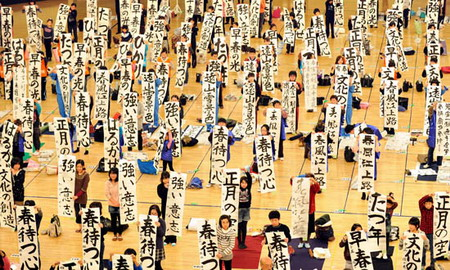
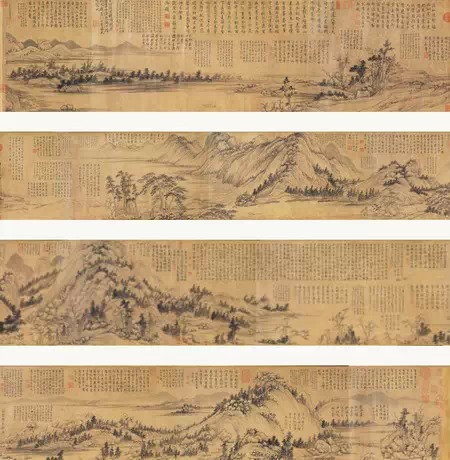
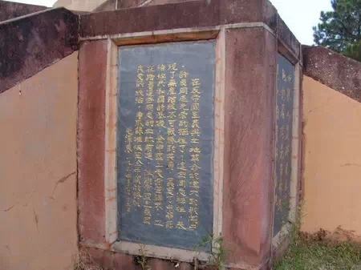
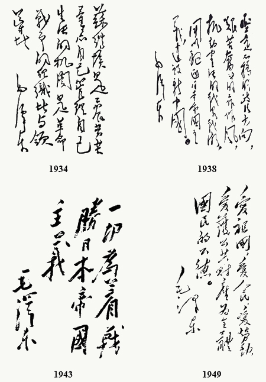
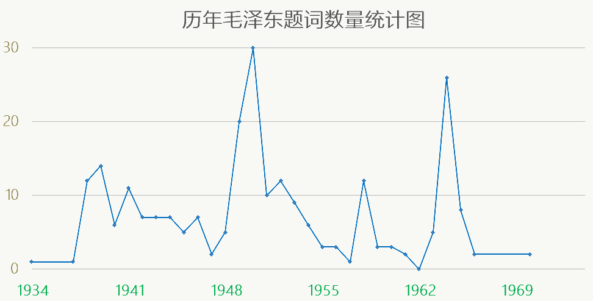
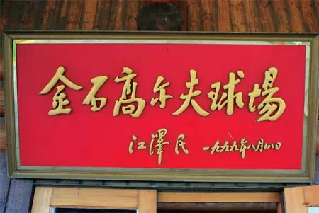
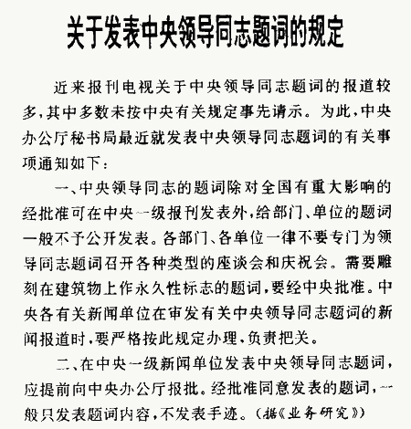
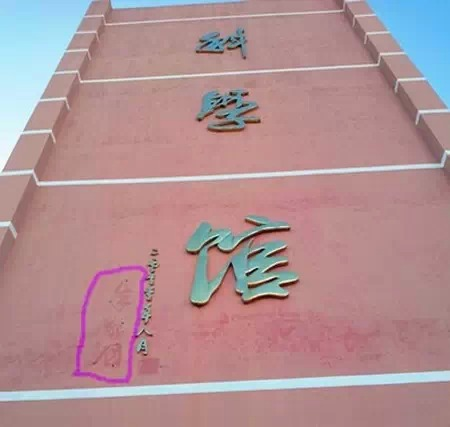
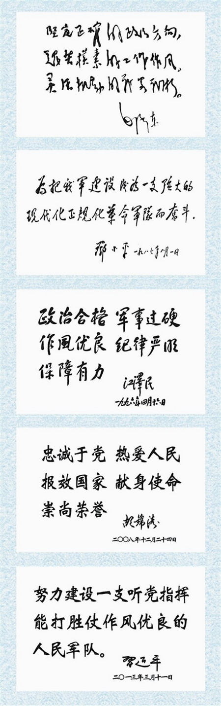

**没有哪个国家比中国更注重题词。人们常常能从题词者的名声、字迹、频率中，玩味出些许的政治意味。**  

  

**文/鲍君恩**

  

勤练毛笔字是一个青年公务员有追求有抱负的标志之一，如果一个三十岁左右的年轻人就写得一手潇洒老成的毛体字，必当刮目相看。

  

在中国，题词、题字几乎是权力到了一定级别后的待遇，而一个人的书法，又往往被视为是其性格、气质的象征，练出一手好字，当然对提升其第二形象大有裨益。

  

中国题词文化的基础当然是汉字独特的书法传统。东亚文化圈（中国大陆、台湾、日本、越南、韩国等）都有基于汉字的书法形式。方块字的复杂笔画，给个性化的书法提供了载
体。

**2012年日本东京，参加第48届新年书法大赛的选手们正在展示书法作品**

  

东亚文化圈外，拼音文字占据主流，拼音文字虽然便于书写，但构成简单，一个人的字迹很难有较强辨识度。

  

有些拼音文字也发展出一套书法系统，但往往和宗教有关，比如印度、尼泊尔、西藏的书法，基本集中于印度教、佛教领域。最典型的是伊斯兰书法，阿拉伯字母书写时位置变化
较多，表现力比其他拼音文字更强。而伊斯兰教禁止偶像崇拜，绘画中不允许出现人物，文字的作用就被格外放大。

  

欧洲的书法虽然也很早出现，比如抄写圣经诞生的羊皮纸书法等，但无论是希腊字母、拉丁字母都并没有汉字一样个性化潜力。活字印刷发明之后，欧洲的书法都大为衰落，除了
个别爱好者，即便是以文为生的作家也更偏爱打字机，不会迷恋自己的笔迹。

  

官员、名人带有非常强烈政治色彩的题词现象，只有在中国出现。它带有自身的等级印迹，暗含着完备的操作秩序，甚至落马后的铲字，都逐渐形成规范。

  

**【题词的功能演进】**

  

最早带有政治色彩的领导人题词，可以追溯到秦始皇。之前的文字并没有统一，只有书简、甲骨等零散载体，并不具有后来的政治功能。

  

公元前219年，秦始皇封禅泰山，命丞相李斯撰写了一幅144个字的石刻，记录自己各方面的丰功伟绩，这是第一次由统一的汉字来表达统治的合法性。

  

不过，日后的皇帝不满足于他人代笔，亲自题词成为标准。不少皇帝书法优美，甚至独创书法派别，如宋徽宗。

  

最为著名的当属清朝的乾隆。他写诗数量超过全唐诗总数，更在数不清的书画、瓷器、玉器中留下大量题词，到了不辨真伪的地步——《富春山居图》的赝品上也留下了题跋。

**赝品《富春山居图》上的乾隆题词**

  

乾隆能够随心所欲的题词背后，是皇权地位前所未有的提高。6次南巡、11次泰山献祭，乾隆在泰山石崖、江南园林、名人书画中留下大量题字，每一处都精心保管，被官员、
民众奉为皇权象征。

  

这种题词模式影响深远，极大地塑造了民众、官员对政治的理解。即使皇权被推翻，题词作为政治理念的载体，也被人使用。比如孙中山。

  

孙一生的主义、理想类题词总计101条，大多为“天下为公”、“博爱” 、“世界大同”等。

  

蒋介石也继承了这一形式。不同的是，他的题词几乎不再担负传播政治理念的功能，像“礼义廉耻，国之四维，四维既张，国乃复兴”这样强调儒家道统的题词，更像是出自古代
帝王之手。

**蒋介石题词**

  

这些题词当然无法与之后的中共领导人相比。只有在新中国，题词才逐渐变成一个等级化、体制化的体系，甚至成为重要的政治风向标。

  

毛泽东开中共领导人题词的风气之先。与蒋介石、孙中山相比，毛的题词有强烈的实用特征。抗战初期的“抗日民族统一战线万岁”、国共内战期间的“无产阶级领导的，人民大
众的，反对帝国主义、封建主义、官僚资本主义的革命”、建国初期的“不要沾染官僚主义作风”，无不是紧贴形势发展的政治动员，相比虚无飘渺的“天下为公”显然更能起到
宣传鼓动作用。

  

政治形势的变化，也对毛泽东题词字体的演变有决定性作用。一般来说，中国人最熟悉的是毛泽东恣肆张扬的字体，然而，“毛体”并非旦夕而成。

  

1933年落成的瑞金红军烈士纪念塔，四周分别镶着毛泽东、朱德、周恩来、博古、项英、张闻天、王稼祥、凯丰、邓发等人的题词，毛泽东的题词是四平八稳的隶书，与其他
领导人相比并不显眼。

**瑞金红军烈士纪念塔上的毛泽东题词**

  

毛氏书法风格的逐渐美化定型，其实大体与毛泽东在党内地位逐渐巩固和在权力角逐中胜出同步，与大象公会往期文章**《主席头的源起、定型与发展》**中描述的过程基本
一致。

**毛泽东书法的变化**

  

1949年后，毛体开始具有更强大的力量。

  

**【字在人在】**

  

直接的政治指令并不是中共领导人题词的常态。更常见的，是对内涵微妙但影响深远的题词内容、载体、频率的把控。

  

据统计，毛泽东一生留下的200多件题字题词中，题写对象最多的就是报刊、高校等意识形态部门。这也与政治形势密切相关。题写各地党报的报名，是巩固个人威望的重要手
段之一。

  

毛泽东最早频繁更换题词，就是对延安时期培养八路军干部的抗日军政大学。据不完全统计，在短短几年内，兼任抗大政委的毛泽东先后为该学校的部门和学员题词22条，数量
之大在其生平中绝无仅有，当时也正是延安政治斗争最为激烈的阶段。

  

毛泽东题词、题字的第二次高峰期是文革爆发前。

  

1964年秋，刘少奇藉当时的“四清运动”声誉正如日中天，在公共场合似已淡出的毛泽东一日之内主动给三位省市委第一书记写信，要求把党报的报头更换为自己题写的版本
，并明确指定在当年国庆节改换。

  

这一年，由其题写的报刊名达20家之多，占其一生所题数量的大半，甚至连《中学生》和上海《青年报》这样的报刊也是有求必应。

  

这一举动很快引起了其他领导人的注意。除毛泽东外，1966年至1974年间其他领导人均未再发表题词。

  

最典型的是周恩来，1970年7月，斯里兰卡驻华大使请求周恩来为女儿签名留念，周虽然满足了他的要求，但反常地没有写下日期，并叮嘱大使不可将此事外传。

  

文革期间，林彪宣传个人崇拜的题词“伟大的导师、伟大的领袖、伟大的统帅、伟大的舵手，毛主席万岁！万岁！万万岁！”被毛在报纸上看到，他对代总参谋长杨成武说：“谁
封我四个官啊？”

  

林彪知道消息后，在当年12月写给军委的信中，就提出了“一概不再题词”的要求。

  

领导人题词的活跃度是个很有价值的风向标。1962年是毛泽东因为大跃进失败导致政治上最为失落的一年，这一年他罕见的没有发表一句题词。

**毛泽东历年题词数量统计图**

**（根据中央档案馆《毛泽东手书选集》整理）**

  

不过，经过短暂酝酿后，毛泽东的题词又重新占据了上风。1963年3月，毛先后在《中国青年》、《人民日报》、《解放军报》、《光明日报》上发表“向雷锋同志学习”的
题词手迹。

  

这一次，毛泽东的政治用意更加明显——他要求刘少奇、周恩来、朱德、林彪、邓小平、陈云等一并题词。而且从字数上，其他领导人的题词字数均多于毛泽东。

  

**毛泽东**：向雷锋同志学习

**刘少奇**：学习雷锋同志平凡而伟大的共产主义精神

**周恩来**：向雷锋同志学习：憎爱分明的阶级立场，言行一致的革命精神，公而忘私的共产主义风格，奋不顾身的无产阶级斗志

**朱德**：学习雷锋做毛主席的好战士

**邓小平**：谁愿当一个真正的共产主义者，就应该向雷锋同志的品德和风格学习

  

这是领导人权力的巅峰，甚至能够对整个领导层作出规定内容的题词指示，后人极难模仿。

  

**【题词的管理】**

**  
**

毛泽东之后，中共内部不再有居于超然地位的政治领袖。领导人题词一度松动起来。可以题词的人多了，并且字数上也不必一定多于领袖。

  

1990年第三代领导人集体为雷锋题词，字数上已无明显差距，李瑞环题词的字数甚至比江泽民还要少。

  

**江泽民**：学习雷锋同志，弘扬雷锋精神

**杨尚昆**：全国人民都要向雷锋同志学习，全心全意为人民服务，为

建设具有中国特色的社会主义而努力

**李鹏**：“在新形势下把雷锋精神进一步发扬光大，希望有更多的活雷锋在中国涌现

**乔石**：学雷锋精神，做人民公仆，努力建设具有中国特色的社会主义

**姚依林**：发扬雷锋精神，全心全意为人民服务

**宋平**：向雷锋学习，做共产主义事业的接班人

**李瑞环**：雷锋精神永放光芒

**第三代领导人为雷锋集体题词**

  

此后，压抑已久的题词热情开始井喷。1980年代至今，各级别官员题词遍及全国，一再声明“不题词”的朱镕基也几次破戒。

  

但题词的内容、范围、载体出现了变化。领导人中，再也没有毛泽东一样对报刊、高校等意识形态部门的广泛题词。

  

1978年之后，作为实际的主政者，邓小平发表的题词内容收缩到军队和经济建设领域，几乎很少对报刊题词。

  

之后的江泽民，公开发表的题词内容也多集中于军队和科教文卫，甚至还有一些是为高尔夫球场、宾馆酒店题名的应景之作，再没出现过对领导人层面的题词指令。

**江泽民为某高尔夫球场的题词**

  

不过，基层的书记们在1990年代后城市大规模改造中，喜欢为桥梁、广场、大型公共楼宇等题字，倒是与毛泽东当年为党报党刊题写名称有异曲同工之效。

  

由于题词多是官员个人的临时行为，内容不经过事先把关，经过新闻媒体报道后造成的政治影响难以控制，中共中央办公厅曾专门发文限制对领导题词的报道。

**关于发表中央领导同志题词的规定**

  

这种限制只限于对题词、题字的宣传，无法约束官员题词行为本身。近年来下马的周永康、薄熙来、王立军等高官，出事后都有关于其题词被铲除的新闻。最近的一次是原广东省
政协主席朱明国，在被中纪委调查的消息传出之后，其在家乡五指山市的多处题词落款被迅速抹去。

**五指山琼州学院附属中学，朱明国为母校题写的“科学馆”三个大字仍挂在墙体上，但落款名字已被抹掉**

  

官员题词频繁的产出和铲除，显然给执政党造成了一定的尴尬。2012年12月，中央颁布《八项规定》，其中明确规定“除中央统一安排外，不发贺信、贺电，不题词、题字
”。

  

最高领导人悄然无声地为之率先垂范：

  

2014年3月16日，全军和武警部队各级党委(支部)会议室按要求统一悬挂毛泽东、邓小平、江泽民、胡锦涛、习近平，关于军队建设的题词指示——与前三位不同，胡锦
涛和习近平的题词均为印刷字体。

**  
**

**版权声明**

****大象公会所有文章均为原创，****  

****版权归大象公会所有。如希望转载，****

****请事前联系我们：****

bd@idaxiang.org

****知识 | 见识 | 见闻****

****  
****

点击**阅读原文**，查看附录：

**《毛泽东历年题词统计》**

阅读原文

阅读

__ 举报

[阅读原文](http://mp.weixin.qq.com/s?__biz=MjM5NzQwNjcyMQ==&mid=209233855&idx=1&sn
=82452b1f798ec5278a5a18a3980a030f&scene=1#rd)

