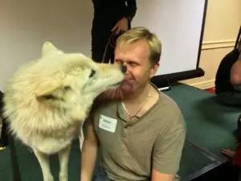

##  安于不适

_2015-03-09_ _史蒂夫**帕弗利纳_ 聪明人的个人发展 聪明人的个人发展

**聪明人的个人发展** 

stevepavlinachina

个人成长，与你同行

__ __

图片来源：**danfador**

  

在我本月早些时候参加的Rich Litvin培训工作坊上（部分原因是在那里演讲，部分原因也是去学习），Rich谈到他是怎样处理不知接下来该说什么时的培训情形
。他说如果自己不知道该对客户说些什么，就会暂停下来，什么也不说。

  

Rich指出这种做法肯定会令人感到不舒服。但与试图逃离那种不适状态，想重获控制与确定感相反，他觉得干脆安于不适状态，允许它存在那里也完全可行。新的见解和想法
终将浮现，然后教练或客户便可重新开始自己的分享过程。

  

这就是那种让我豁然开朗的时刻之一。从那之后我一直在思考，生活中还能应用这种安于不适做法的其他领域。

  

  

**准备 vs. 灵感**

  

由于多年一直从事公开演讲，我相信自己要说的话总会存在于心。我好像从未因接下来要说什么感觉为难。但我将此表现归功于自己总能充分准备。

  

然而，经过年复一年，我已留意到跟以往相比，自己为每次演讲要做的准备工作越来越少，我更依赖在台上演讲时自然流入的种种想法。

  

与在脑中强记该说什么相反，现在我会把注意力更多投向现场听众，房间内积聚的思维和情感能量，以及此时此刻迎面而来的灵感想法。和提前准备内容相比，如今我的演讲更多
源于当下时刻的现场灵感。

  

不过我依然会提前准备。我对自己要说的内容总有相应的计划安排。但大多数情况下，我在演讲时会跳出原先计划，随着灵感状态顺其自然发展。

  

大概10年前，我演讲时几乎会100%按预先准备的计划进行。倘若计划演讲某内容，我就会这样讲。如果没计划说此事，我就不会说。这意味着演讲时我非常专注于自身思维
。很大程度上，这就是Toastermasters（一个国际性演讲训练组织。译者注）的演讲风格。你应当提前准备个人演讲，然后按照准备的内容将其传递出去。

  

应用这种方法几年后，我演讲中开始有25%的时间会跳出原先计划。我用准备好的内容开始每次演讲，但若演讲中间出现某个很有趣的想法，如迫切想说出一个不同寻常的故事
，我有时也允许自己这样做。我发现这些计划外的内容蕴含着额外能量，普遍都很受欢迎。我还很有趣地发现，听众们其实不知道我当时在偏离计划演讲。他们不清楚我之前的计
划安排，所以通常会推想我说的一切都是原计划要说的内容。

  

在自己Toastmasters演讲生涯初期，我见识过一位女士为大家完成了10分钟精彩纷呈的演讲。之后我对她大为赞赏，并问她花了多长时间记忆和/或排练这场演讲
。她告诉我其实没做任何准备 — 她只在即兴演讲。我对有人能这样清晰传递出如此流畅的想法深感钦佩。这件事给了我想让自己的公开演讲该怎样发展的方向感。

  

在2009年开始举办自己的3日工作坊时，我大概有75%的时间都严格按照事先准备的材料演讲。到2012年初，此比例已接近50-50。我总会提前做好全面准备，但
也越来越频繁地在演讲中跳出原先计划。有时我甚至会添加额外的听众参与练习、团队活动，和现场游戏。要是有个想法令我感到激动人心，即便自己从没尝试过，我也愿意付诸
实践。这些想法通常都非常有效。而且没人知道它们并非我原始计划的一部分。

  

过去两年中，这个比例已从50-50变成了大概75-25。现在我大约只有25%的演讲时间会使用先前准备的材料，其余75%的时间则是演讲过程中涌现的各种灵感想法
。我依然会提前做好100%的准备，但站上讲台后，我只会用到计划内容的大概25%。因此，我一直在想是否还有必要，提前准备这么多不会用到的材料。

  

随着不断脱离事先准备的材料，更多基于当下涌入的灵感演讲，我演讲中蕴含的能量也发生了转变。我更少用头脑思考演讲，更多地发自内心进行演讲。我感觉这样能更好地与听
众融合在一起。我也更专注于当下时刻的自然状态。

  

尽管已经有了这些积极结果，我对不事先准备就进行演讲仍感犹豫，除非演讲会在时间极为有限和非正式的情形下进行。我相信不加准备地完全即兴演讲是种不负责任的表现。在
提前做好准备后，我的演讲便总有一个结构主干。当灵感袭来，我可以自由脱离此结构，然后在感觉合适时回归这个主干，继续演讲事先准备的材料。身处这种情形时，我那些因
灵感出现而偏离的演讲内容，总能系绕于原始计划上。

  

假如一场演讲没有事先准备好的主干内容，我确实能在灵感引导的任意方向自由发挥。但这样也存在自己被引入死胡同的风险。写文章时我总能回过头来修正错误，让内容更显紧
凑，去掉感觉不太对劲的内容。但在实时发生的演讲中，我根本没机会回头去修正。

  

Rich这种安于不适的观点，正是我步入此类演讲风格所需的最后一块拼图。事实是，我无法保证由灵感而发的演讲总会成功。不过，倘若演讲中途卡壳，我还可以允许自己安
于这种不适状态，直到清楚接下来该走向何方。我甚至可以和听众分享这种不适感，暂停演讲并邀请他们问些问题。假如我能接受这种不适状况可能出现的事实，并愿提前臣服于
这种可能性，我对100%由灵感而发进行现场演讲就没那么抵制。而且这种演讲看起来更像是个有趣挑战。

  

  

**感情关系中的不适状态**

  

我正应用此观点的另一领域就是个人感情生活。几个月来，我一直都对探索3维和4维感情关系怀着极大兴趣，同时也在不断放手1维和2维的交往联系。假如你不知道我正说的
是什么，这些想法在我网站的亲自见面页面都有解释。

  

我偶尔会遇到的一种情形，就是和有着严重信任问题的女人进行交往，她们过去都曾受过撒谎、欺骗或虐待的困扰。这些过往经历使她们很难信任他人，尤其是男人。但一份真诚
的3维或4维交往关系需要双方存在强有力的相互信任；否则它就无法进行下去。

  

另一方面，我对这些女人怀有很深同情。我的前妻Erin17岁时便在约会中被强迫发生性行为，之后还陷入了长达3年半的虐待感情关系。她用了很长时间才从这段糟糕经历
中复元。从她身上我了解到许多虐待感情关系的问题，并看到这种关系对人造成的长期后果。

  

当与撒谎之人相处时，我也遭遇过类似问题，还在《克服信任问题》这篇文章中分享了那些经历。

  

以前我通常会用下面两种方式之一来应对这些情形。

  

假如我面对的女人看起来使人难以信任或精疲力尽，我一般会回绝跟她交往。和这类女人交往就像试着抚摸总对你的善意举动张牙舞爪、目露凶光的猫一样。我干嘛要惹这种麻烦
？我完全不需要她可能给我生活带来的种种闹剧。跟那些对亲密行为没有负面情绪关联的女人交往，会舒心惬意得多。

  

而另一些时候，我又想帮忙治愈这类女人所受的创伤。我看出她在情感上遭受的破坏并想做出补救。不过这种做法很难有积极结果。归根结底，我们必须选择由自己治愈个人心中
的创伤。

  

这些都是我用来帮助逃脱自身不适感的策略。应付那些并不信任我的人，会让我感觉很不舒服。我习惯于充满高度信任、诚实和开放氛围的感情关系，在这种感情关系中，本真的
沟通平常而自然。但与那些无法轻易相信他人，或经常误解别人意图的人交往，我便感觉非常不得其所。我想要立刻脱离那种境地，而自己采用的做法，或是通过远离这种女人，
或是试图治愈她们显而易见的信任问题。我极不喜欢那种负面能量出现在生活中，觉得碰到这种情形就需要洗净它，好像自己刚被阴沟里的泥水溅到身上一般。

  

Rich令我恍然大悟的地方，就是他让我意识到还有另外一种方式可以应对这些情形。与需要逃脱这种不适感相反，我可以允许它存在于此。我可以感到深受误解且不用即刻跑
离那种感受。我可以允许面对的女人满心怀疑、令人生疲，而不让自己逃离现场。我可以安于不适，无需将她推开，或试图补救她。我可以让其行为烦扰我，惹恼我，让我脱离个
人舒适区。

  

这是我刚开始投身探索的领域，所以还不确定它将把我带往何方。这种处理方式所体现的一个积极效果，就是倘若有人固执己见，在我身上臆想他/她曾受的伤害，现在我便能选
择安于此种不适感，不将它看做个人攻击，也不责怪对方缺乏信任。

  

  

**在非纯素世界里做个纯素主义者**

  

我已应用此“安于不适”做法很多年的一个领域，就是自己的纯素主义生活方式。明年一月就是我成为纯素主义者的17周年纪念。

  

这种饮食转变起初主要源于个人好奇心。我从一次30天尝试开始了这种生活，从此就再没结束这种尝试。我的纯素生活已接近6200天。最初我保持这种生活方式，是因为它
带来的清晰思维感，给我留下了深刻印象。几个月后动物制品便在我身上失去所有吸引力。我停留于纯素生活方式，是因为我感到这才是正常生活状态。我吃着我想吃的东西。我
毫无消费肉食、蛋类或乳制品的欲望。对我而言那些都是非食物类型的东西，与体液、排泄物或呕吐物处于同一层级 —
令人毫无胃口，更别提其生产过程。把那些东西放进嘴里的想法让我感到恶心。这绝非我所迷恋的事情，无论世上有多少人对其深感兴趣。

  

随着对个人食物选择在环境和社会影响上的更多了解，成为纯素主义者在道德层面的正确性开始深入我心。伴随这些领悟，我对肉食生活方式的不适感也不断上升。我对各种动物
的看法、感受和信念，都远远超越了自己因以往社会教化而形成的观念。举个例子，和像猫狗这样的宠物相比，我不觉得被摆上餐桌的猪、鸡、牛跟它们有任何意义上的不同。

  

一些纯素主义者会通过激进方式表达他们的不适感。他们认为这个星球已遭到破坏，我们要进行补救。让我们唤醒众人！抛弃这些残忍行为。让我们站在道德高地上去做正确事情
，即便这样做很难。我也曾有过这种思维心态。我参加过纯素主义者集会，还给专业纯素慈善组织捐赠过成千上万美元。

  

另一些纯素主义者则将自己隔离在志同道合者的社区环境内，以便不会遇见太多让自己感觉不适的刺激物。

  

身为纯素主义者的大部分时间里，我的解决之道就是安于这种不适感。允许不适感存在于此，而非试图逃离其外。

  

每一周，肉食者们为食取鲜肉而屠宰的动物数量总计有30亿。那是每周3,000,000,000只动物啊！在人类层面上想象，就是每天杀死整个美国和墨西哥的总人口。
第二次世界大战中死亡总人口大约是6千万 — 而为了获取食物，我们每天要杀死7倍如此多数量的动物。这种屠杀行为的规模几乎超出了我们想象。

  

除了其残忍方面，这种每天发生的大规模屠杀还需要难以置信的土地、劳动力和自然资源投资。你能想象每天生产和杀死全部美国和墨西哥人口所要牵扯的物流成本吗？它需要水
力、电力、燃料和劳动力上的天文数目投资。而且它还会产生比你能想象到的更多垃圾产品，尤其是温室气体。

  

知道这些会使你感到不舒服吗？你是否在意自己所处的角色？你是否足够在意，甘愿改变自己餐桌上摆放的食物？你是在做你相信正确的事情…
还是在做让自己感到最舒服的事情？

  

这些肉食行为当然令我感到不适。有时还会引起我的强烈情感反应。

  

当看见朋友们吃着动物食品，同时知道生产这些食品背后的真相时，我就感到心弦正被人扯动。我对那些只是为满足人们的肉食口味，而毫无必要受难和死去的动物感到伤心。取
决于面前之人吃的是什么，这种行为还可能引起我的呕吐感。闻到鱼类味道，或是看见原本位于一头牛体内的那些东西，毫无疑问是我极不喜欢的体验。

  

假如我只能改变这个星球上的一件事，那就是看见人类会停止繁殖、囚禁和杀害各种动物，返回到跟这个世上所有动物间的一种更加和谐、更少虐待的相处关系。倘若付出自己生
命就可让其变为现实，我绝不会有任何犹豫。

  

我没养任何宠物，但我发现自己很容易和动物进行交往。我把它们看作兄弟姐妹。当自己身处动物之间，我常能感到一种特别的能量联系。我感觉自身是完全裸露的，就像它们能
立刻看穿我当时穿戴的社会面具，见到我真实的样子。想要囚禁、折磨和杀害如此美丽生命的想法，看起来简直难以理解。

  

本月初我第一次有机会拥抱了一只狼 — 她是自己狼群中的alpha母狼（alpha狼是狼群中天生头狼，由一对公狼和母狼组成。译者注）。与其能量相连是极为愉悦的
体验，她的能量使人感到纯净、凝聚和充满好奇。

  

  

  

我们之间的联系毫无畏惧感。我感觉刚坐到她身边时，她正扫描着我的能量。之后她便靠近我，并让我抚摸和拥抱她。接着她就满脸舔起我来。你可在我的Google+相册中
看到更多我俩的照片。

  

当其他人在动物身上付诸暴力时，我又会感觉怎样？那让我深感痛苦。但与四处奔走，试图修正每个人，或是逃离那种痛苦相反，我允许自己安于这种痛苦之中。有时我会为人类
的所做所为向动物们郑重道歉。臣服于这些感受可能很难，但我发现这能帮自己保持心灵开放和更具同情心。

  

  

**喜悦与忧伤**

  

纪伯伦在他的《先知》一书中写道：

  

The deeper that sorrow carves into your being, the more joy you can contain.

  

Is not the cup that holds your wine the very cup that was burned in the
potter’s oven?

  

And is not the lute that soothes your spirit, the very wood that was hollowed
with knives?

  

When you are joyous, look deep into your heart and you shall find it is only
that which has given you sorrow that is giving you joy.

  

When you are sorrowful look again in your heart, and you shall see that in
truth you are weeping for that which has been your delight.

  

镌刻在你们身上的忧伤愈深，你们能盛装的欢乐愈多。

  

斟满了美酒的杯盏，难道不是曾在陶工炉火中锻造的杯盏吗？

  

抚平了心弦的诗琴，难道不是曾在木匠利刃下雕琢的木材吗？

  

当你们快乐时，审视自己的内心，你们会发现曾经的忧伤如今却让你们快乐。

  

当你们忧伤时，再次审视自己的内心，你们会发现曾经的快乐如今却让你们流泪。

  

（中文翻译源自林志豪的《先知》译本。译者注）

  

我很喜爱这段话，觉得它饱含智慧与洞见。当我们向伤害、痛苦和不适关闭心灵时，也同时关闭了我们面向爱、喜悦与相互联系的心灵。我们放开了心灵，也会让自己在体验众多
不同情感时易受伤害。

  

使我在看到人们如何对待动物时，感到受伤和痛心的同情感，与能让自己从灵感和关爱出发写作，给出如此多免费内容的同情感，是同一种感受。它也是那同一种同情感，使我得
以跟生活中的人们享受深入与充满意义的感情关系。一颗向动物关闭的心灵，肯定也对人类关闭。我确信有人会不同意诗文的最后一句；因为我也曾不同意它的内容。

  

关爱是混合着喜悦与忧伤的行为。这两种感受无法分离。但忧伤不等于感到受苦。感到受苦是对忧伤的抵制。能够接纳忧伤就是一种情感上的成长。

  

忧伤能燃尽我们情感上的杂质。它帮我们看清什么对自己而言是真正重要的。当忧伤钻入心底，我们便见识到一个更加觉醒的自我。生命不再看起来如此渺小。在深深忧伤的无尽
空间，我们形成着自身最伟大和最广袤的心愿。

  

  

  

我接受自己生活在一个许多人和动物交往，以及相互交往时，与我的交往方式不尽相同的世界。我可以选择加入他们的生活信念和态度，但我更愿安于自身经历的种种不适。加入
其他人大规模屠杀动物的举动，以作为逃离个人不适感的方式，我感觉并非正确之道。我也不认为试图补救一个并不想被补救的社会，特别是对我的努力只会张牙舞爪的社会，是
种正确行事之道。

  

与试图逃离不适或尝试补救途径相反，你可能会发现安于不适这种做法的价值。允许不适感存在那里。臣服于它。让它在你内心为关爱和同情刻划出更深空间，即便有时这种感受
就像自己正被利刃凿空。

  

倘若你要追随一条忠于内心的道路，就可能经常发现身处不适的情形。与逃回个人舒适区相反，请试着和这种不适感一同玩耍，投身于它。看看它会把你带向何方。你也许将惊讶
于最后结果。

  

  

Steve Pavlina

2013.12.17

  

  

阅读原文

阅读

__ 举报

[阅读原文](http://mp.weixin.qq.com/s?__biz=MzA3NzIyNTQ3NA==&mid=206272526&idx=1&sn
=3c3bac33d9da375321336712312b3384&scene=1#rd)

