**** ****

********

　　小腿(Claves) 如图双手撑墙,保持后脚跟着地,把腿绷直,体会小腿被拉伸的感觉,保持20秒.换一条腿重复.

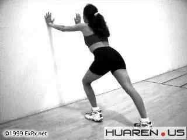

　　大腿--前侧-四头肌(Quadriceps) 一手扶墙单脚站立,另一只手抓住脚腕或脚面向后扳, 体会大腿前面被拉伸的感觉,保持20秒后换腿重复.
注意拉伸的时候不要让膝盖向外翻. 这个动作也可以趴着或侧躺着做.

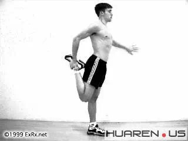

　　大腿--前侧-四头肌(Quadriceps)

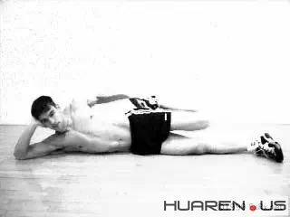

　　大腿--前侧-四头肌(Quadriceps)

　　大腿--后侧(Hamsprings) 就是压腿啦,大家都会的.

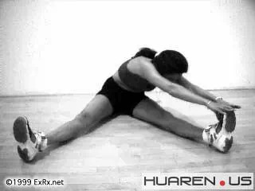

　　髋部 (Hip) 两个动作,可以连着做,第一个是用手把膝盖向下压,保持20秒之后,做下一个动作

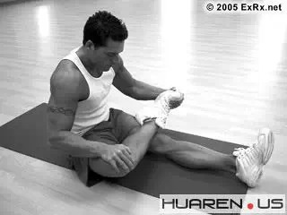

　　用左肘将右膝盖向自己身体左侧压,体会右大腿外侧被拉伸的感觉,同时腰向右边纽,体会左侧腰部肌肉被拉伸的感觉,保持20秒后换一侧重复这两个动作.

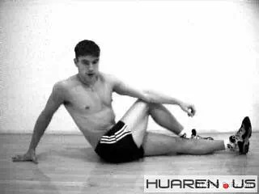

　　上臂--三头肌(Triceps) 一手举过头.将前臂尽可能与上臂靠近.用另一手抓住肘部,向头部拉,保持20秒,换边重复.
注意的是如果是向下压,向下图这样,就成了拉伸背阔肌了(LAT).

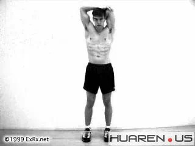

　　拉伸背阔肌

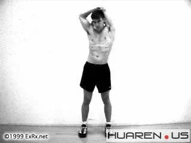

　　上臂--二头肌(Biceps)和三角肌(Deltoids) 坐在垫子上,上身后倾,用双手撑住与肩同宽.注意图中撑的方法,是手指向后的.
然后将髋部向前慢慢地向前滑动,体会拉伸的感觉,保持20秒.

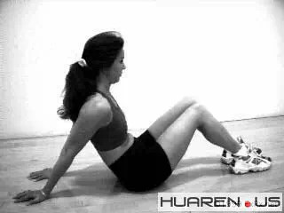

　　上臂--二头肌(Biceps)和三角肌(Deltoids) 坐在垫子上,上身后倾,用双手撑住与肩同宽.注意图中撑的方法,是手指向后的.
然后将髋部向前慢慢地向前滑动,体会拉伸的感觉,保持20秒. 把手撑宽点,就成了拉三角肌了.就向这张

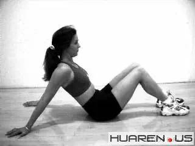

　　胸 找个门框或固定立拄,将一手扶住墙面或立拄.肘略弯,与肩同高.将身体向前倾,体会胸部被拉伸的感觉.保持20秒,并换方向重复.
另外如果肘低一点,则主要是拉伸upper chest, 以及侧面的三角肌.

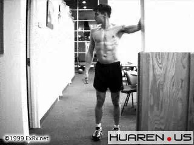

　　背 找个立拄面对它站好，一只手抓住柱子,在腰的高度上,然后身体如图那样弯曲,以拉伸背部. 保持20秒后换边. 这个动作对三角肌的后部也用拉伸作用.  

　　做完仰卧起坐/crunch等腰腹运动后做下面的拉伸可以最大程度地避免肌肉酸痛. 腹肌(Rectus Abdominis)
如图趴在垫子上,用手将上身撑起来,身子尽量向上仰,体会拉伸腹机的感觉,保持20秒.

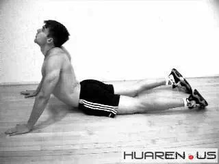

　　侧腹肌(Obliques) 向图中那样躺好, 将两个膝盖和髋部都向一侧push...用力, 保持20秒后换个方向重复.

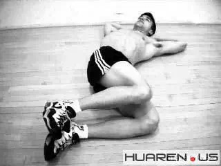

来源：豆瓣网

aven的相册

****  
****

********

> 任何建议、想法、供稿

>

> 都可添加个人微信号：fanfanrunner

>

> \- - - - - - - - - - - - - - - - - - - - - - - - - - -  

>

> 欢迎关注更多健康联盟微信自媒体

>

>  

>

> 微信公众号runfreerunhappy

>

> 跑步心情：跑步减肥健身，励志正能量

>

>  

>

> 微信公众号keep-fit001

>

> 镁女罩我去战斗：女性健身，励志

  

**↓↓点击阅读原文 查看更多内容**

  

阅读原文

阅读

__ 举报

[阅读原文](http://mp.weixin.qq.com/s?__biz=MjM5MzI0NTk2MA==&mid=202860637&idx=1&sn
=b3afa0cde245cbaa1a61bb9605d29082&scene=1#rd)

