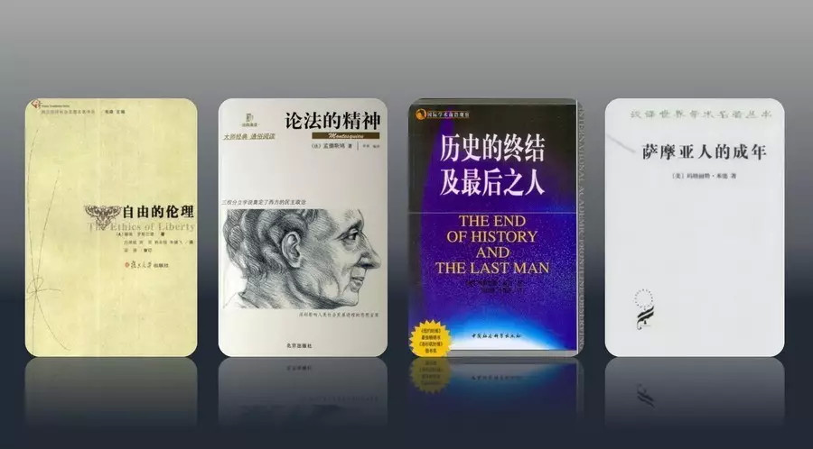
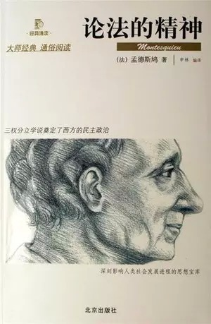
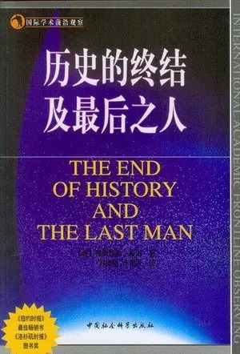
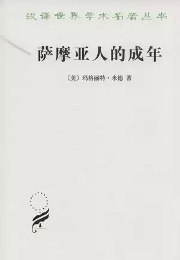
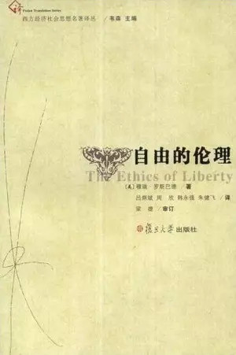

##  小心被经典砸到  | 不必读经典

_2015-03-05_ 大象公会 大象公会

**大象公会**

idxgh2013

知识，见识，见闻。最好的饭桌谈资。知道分子的进修基地。

__ __

_本次由自由撰稿人辉格推荐他认为不必读的经典。用辉格老师原话说：“被我扫进废纸篓的作者倒是随口就能报出不少：卢梭、洛克、康德、黑格尔、弗洛伊德、萨特、福柯、
汤因比、福山、米塞斯、罗斯巴德、彭慕兰（及整个加州学派）……”但多是读不下去，并没有太深印象，因此他挑出了一些恰好认真读过，却很失望的经典，以飨读者。_

  

**《小心被经典砸到》**

**  
**

**文/辉格**

  

虽然不算多，我也读过一些经典（比如商务汉译名著里那些），多半是在学生时代，那时候年幼无知，在寻求知识和探索世界方面完全没摸着门道，当然，也可能是因为那时能找
到的好书实在太少，就被裹挟哄骗着相信了那些经典是人类智慧的最佳代表。

  

可是翻来翻去，我实在看不出这些经典有什么高明之处，多半要么语义含混不清，要么逻辑跳跃，充斥无端断言，让人摸不着头脑，除了催眠没有别的作用。

  

好在我还没傻到自欺欺人的程度，所以大约到大学五年级时，我对读书已完全丧失了兴趣，此后七八年没正经读过什么书，直到2000年左右，网上能下载到很多电子书之后，
再后来有了网络书店，才大开眼界，重新点燃了我的读书热情。

  

多年后回想起来，大学时代少数几本给我留下较深印象的书，都是地摊上偶尔淘到的小册子，比如弗雷泽《魔鬼的律师》，马文•哈里斯《文化的起源》，还有边疆派历史学家特
纳的一本（书名忘了），看起来都是无望进入经典书单的。（刚想到一个例外：科尔奈的《短缺经济学》，是唯一让我印象深刻的非地摊大册子。）

  

或许是因为有了这段曲折经历，我和一些年龄相仿的朋友一样，特别讨厌某些书蠹子喜欢举着动辄上百本的经典书单砸人的做派，我怀疑真有不少年轻人被他们砸晕了头，和我当
年一样从此对读书丧失兴趣（当然，在阅读选择如此丰富的今天，被砸晕也得怪他们自己）。

  

实际上，某些圈子可能恰恰需要这样一种将新人砸晕的方法，以此为圈子设立进入门槛，作为维护其排他性的手段（有了排他性才可能享受到租值），这跟他们用一套黑话将外人
弄迷糊有着类似效果；当你悬梁锥股多年终于啃下这堆砖头（或至少学会其中说话腔调）之后，可以跟着圈子在大学里混吃混喝了，自然不会再轻易贬低砖头的价值，承认自己冒
着傻泡浪费了几年生命，于是你成了经典地位的又一位坚定维护者。

  

自然科学界就很少有人建议新人去阅读牛顿或爱因斯坦的原著，这个行当多少需要些硬功夫，这就构成了一个自然门槛，不像社会科学界和人文学界那么鱼龙混杂，充斥欺世盗名
者和混吃混喝的平庸无知之辈，只能人为构造一些常见于民间社团的崇拜偶像、残酷入会仪式和黑话切口来建立门槛。（心理学家罗伯特•西奥迪尼在《影响力》第三章里分析了
此类残酷入会仪式的组织功能）

  

黄章晋老师希望我评述几本曾经坑到我的经典，这是个挺让我尴尬的任务，因为一本书既然读不下去，自然很难留下多少印象，况且时隔多年，早就忘的一干二净，最多能报出作
者和书名（被我扫进废纸篓的作者倒是随口就能报出不少：卢梭、洛克、康德、黑格尔、弗洛伊德、萨特、福柯、汤因比、福山、米塞斯、罗斯巴德、彭慕兰（及整个加州学派）
……）

  

所以我只能挑几本出于不同原因恰好认真下过些功夫，结果却很失望的经典。

**  
**

**孟德斯鸠：《论法的精神》 - 逻辑缺失的因果判断**

  

  

孟德斯鸠宣称要像自然科学那样分析人类政体和制度，这一愿景很吸引我，而且他的文字很清晰，语义直白，用词精确而一致，不像其他许多经典那样给我制造阅读障碍，所以这
本书我是认真读完的。

  

但孟德斯鸠充其量只是在形式上完成了他为自己设定的任务：像博物学家那样对政体和其他一些制度元素做了分类和定义，描述了各自特性，并界定了包括气候、土壤、风俗、教
育、民族性和人口在内的一大组变量，然后试图在它们之间建立因果关系。

  

听上去很好，问题是他建立因果关系的尝试极为草率，全书充斥着毫无依据的经验判断，下判断的数量和速度简直就像鲟鱼产卵；所以如此，无非是因为他想一口气建成一个大体
系，可掌握的材料又少得可怜，只能用一串串的妄断来填满他的庞大结构，以期获得体系的完备性；实际上这也是启蒙作家中普遍存在的流行病：在手里没货的情况下强行构建宏
大体系。

  

启蒙作家多半重思辨而轻实证，这当然主要归咎于时代的局限，那时可供分析的经验材料还太少，只能以思辨为主；所以在阅读启蒙作家时，我倒宁愿他们专注于思辨而少做经验
判断，其实，假如你有着良好的洞察力、语言习惯和逻辑能力，从一些弱而安全的前提出发，思辨工作也完全可以带来极好的洞见和高质量的分析，霍布斯、休谟、哈耶克，便是
杰出的例子。

  

但孟德斯鸠走的是另一个方向，贪多求快下了一窝窝蛋，结果全都孵不出，都变成了毛鸡蛋。

  

**弗兰西斯•福山：《历史的终结及最后之人》 - 历史决定论的糟糕传统**

  

  

这本书之所以那么烂，是因为福山追随了一种从柏拉图、黑格尔到马克思的糟糕哲学传统，那就是历史决定论，大意是（歪曲和脑补是难免的，某些脑筋混乱的家伙说的话，若不
加歪曲和脑补，你是无法以可理解的形式加以转述的）：

  

存在一种人的本质（姑且称为人性），现世之人所拥有的是该本质的非完美版本，但人性有着走向完美的内在倾向，因而随着历史进程的推进，人性和社会将逐渐趋向于其完美形
态，在经历若干特定阶段之后，最终双双达至其终极理想状态，于是历史便终结了。

  

在不同版本的历史决定论中，这个有着自我完善倾向的人性也可以换成其他东西（比如民族、文明、社会或人类整体）的本质，但无论如何，历史进程的方向和过程都是由这个本
质的固有内在倾向所决定的，是不可避免且可以预知的，当个人自觉的顺应并参与这一进程时，他便是“自由”的。

  

对种种历史决定论，波普曾有全面评述，这里就不重复了，我只想说：挑书的一个重要线索是作者的哲学背景，满嘴黑格尔萨特福柯拉康德里达齐泽克的人，绕着走是最简便的选
择，宁可错杀一千，绝不浪费自己生命。

  

**玛格丽特•米德：《萨摩亚人的成年》 - 文青研究人类学造成的科学退化**

  

  

弗雷泽和马文•哈里斯老早就激发了我对人类学的兴趣，不过那时找不到什么可读的东西，直到互联网发达之后，才读到马林诺夫斯基、布朗和普里查德等人的著作，一时兴奋不
已，但这一欣快感很快消退了，因为当我顺着年代次序读到更晚近的人类学著作时，一股股夹杂着酸臭的傻气扑面而来，我每每被这些作品的主题吸引，却又屡屡被其臭气熏倒。

  

后来我逐渐意识到，人类学曾经历了一次全面退化，一条隐约可见的分界线大概出现在二战前后；早期人类学家以法学家居多，后来是经济学家，英国的功能主义和美国的文化人
类学兴起之初，其先驱是一批科学家：马林诺夫斯基和博厄斯都是物理学家，帕森斯和塞利格曼都是医学家，弗思是经济学家，他们是打算按自然科学的方法和标准来研究社会与
文化的。

  

可是这个学科一旦建立起来，在大学有了独立科系，开始招收未经系统化科学训练的本科生，便很快吸引来大批文青，结果，该学科在方法论、研究态度、材料质量和写作风格上
，皆与科学标准渐行渐远，最终退化成了一门“人文学科”；米德恰好处于这一退化过程的转折点，她是博厄斯的学生，但完全没有继承博厄斯的科学态度；有关《萨摩亚人的成
年》如何不靠谱，人类学家托马斯•弗里曼在半个世纪后花了数倍于原著的篇幅详加阐述，不重复了。

  

上述退化过程中影响最为深远的部分，是进化论思想和经济学方法被全面清除出了这个学科，而且没有任何份量相当的理论内核来取代它们，结果该学科在方法论上丧失了灵魂；
直到70年代新达尔文主义兴起，进化论重新回归社会科学领域，上述趋势才逐渐开始扭转，拿破仑•沙尼翁是其中先驱，但他在美国人类学会所遭受的蛮横排挤，见证了这一扭
转过程何等艰难。

  

所以在人类学这个领域，我的选书原则是：只读1945年之前的，或1995年之后的。

  

**罗斯巴德：《自由的伦理》 - 全方位离谱的不靠谱之作**

  

  

这个案例有点特别，不像前面几位，罗斯巴德我在读他书之前就知道是不靠谱的，因为此前读到过他一些相当离谱的文章和片段引述，不仅内容离谱，其行文风格也是我非常讨厌
的革命宣传论战腔，但讽刺的是，这是仅有的一本我花了整整一个月功夫中英文对照细读，然后用了十万字篇幅逐段评论的书。  

  

作出这一举动，是因为我震惊于罗斯巴德这么一个颠三倒四狗屁不通荒诞无稽的作者，竟然在某些圈子中受到如此热烈追捧，要是这些圈子跟我不沾边那倒也算了，可恰恰其中许
多是与我在观点、立场或诉求上多有相合、常相互视为同道的朋友，这就实难蛋定了，于是急火攻心，痰血上涌，做下这件我这辈子最愚蠢的事情之一。

  

罗斯巴德脑筋如何混乱，具体可以看我博客，这里只举一个最单纯的例子：一方面，他认为立约者的未来选择不应被契约所约束（除非契约仅涉及有形商品的直接交付），因为基
于自我所有权的绝对性，人的自由意志不能在任何情况下被任何东西所约束，即便是被他自己在早先时刻所表达的意志所约束，但另一方面，他认为债权人可以正当地将未能偿还
债务的人强制为自己的债务奴隶。

  

问题是：一）自我所有权的绝对性，怎么一碰上债务就立马不管用了？既然可以不管用，为啥碰上契约就必须仍然管用呢？二）你煞费苦心要避免契约对未来意志的约束，可是既
然可以有债务奴隶，那么只要在契约中规定一笔不可能偿付得起的违约金（违约金条款是罗斯巴德所认可的），立约者的未来意志不是同样可以被其当前意志所约束吗？有债务奴
隶这个大漏洞开着，还有什么意志不能被约束的？你裤子都没穿还把领带打这么严整到底想干啥？

  

  

随口喷几句，不一定对，不欢迎指正，也谢绝讨论，谁又能指望一个珍惜生命的人会花功夫认真讨论诸如“你所鄙弃的东西是否真的值得鄙弃”之类的无聊问题呢？

  

（点击阅读原文，查看<不必读经典>系列第一篇——从《菊与刀》到《乌合之众》）

  

**版权声明**

****大象公会所有文章均为原创，****  

****版权归大象公会所有。如希望转载，****

****请事前联系我们：****

bd@idaxiang.org

****知识 | 见识 | 见闻****

阅读原文

阅读

__ 举报

[阅读原文](http://mp.weixin.qq.com/s?__biz=MjM5NzQwNjcyMQ==&mid=211200731&idx=1&sn
=8f4cd37cec0aa82808848defd304e15a&scene=1#rd)

