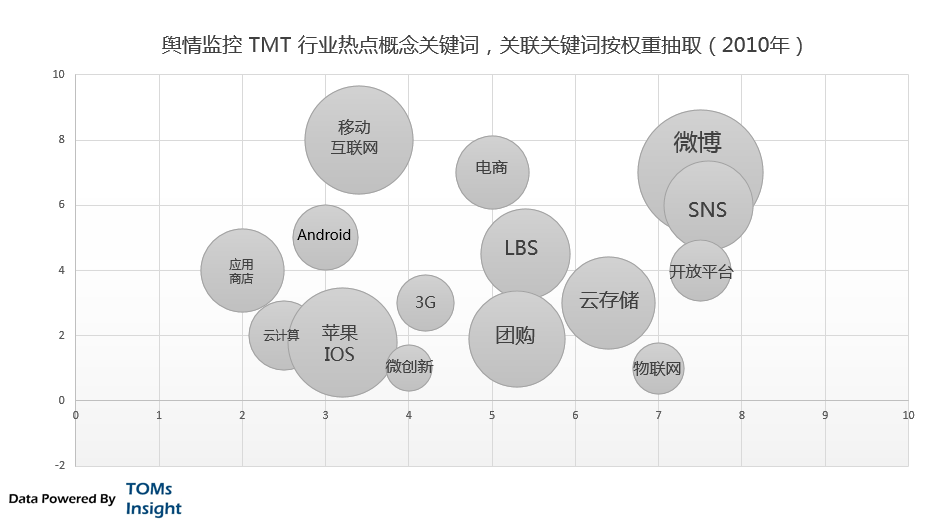
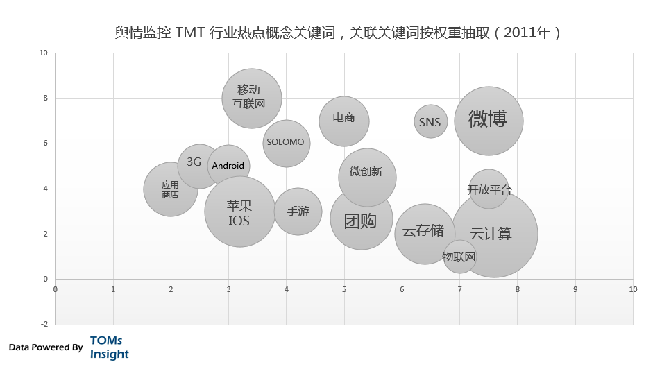
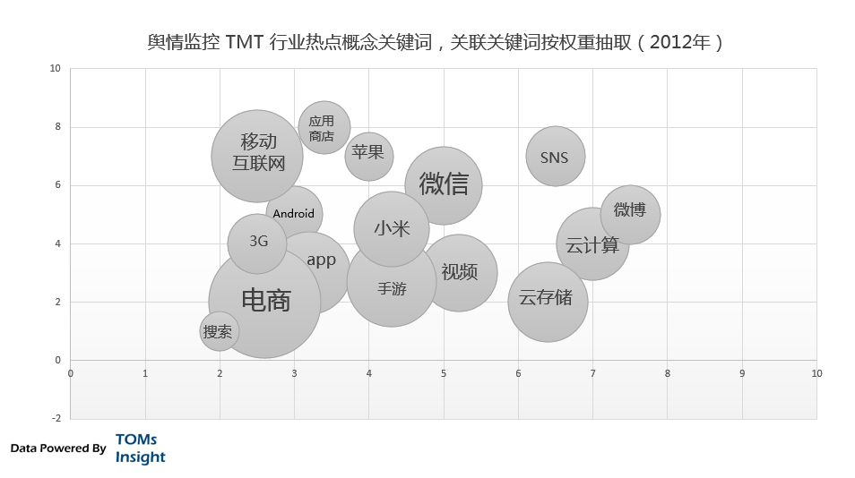
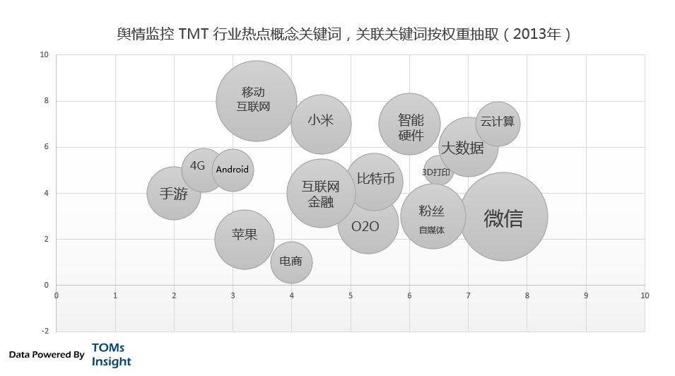
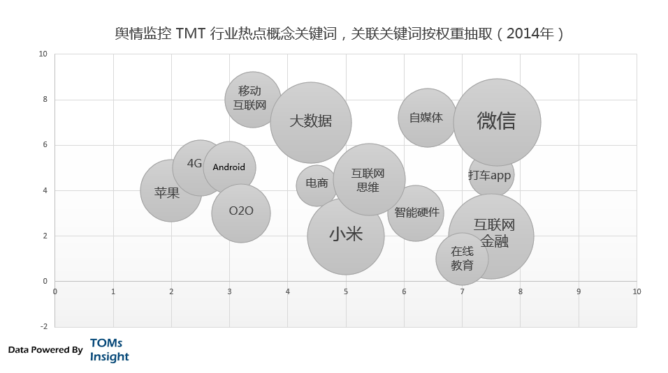
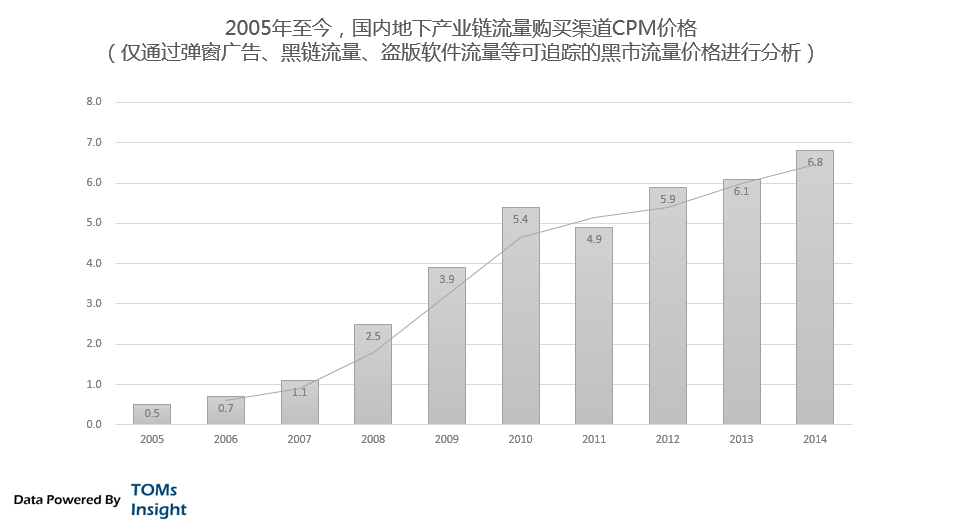

##  平凡之路：这些年互联网的变迁

_2015-01-27_ TOMsInsight

我们不喜欢平凡，特别不喜欢走在平凡的路上。我们习惯于看着远方的灯火繁华，幻想着到达后的喜悦和新生活，幻想着到达后如何洗去这一路的疲劳，去追逐自己的幸福。所有
预期中的美好，在存在在远方的灯火繁华中，这是我们继续走下去的动力和决心。

  

我们不满足平凡，特别不满足走着平凡的路上。好像这些平凡的路，根本承担不了我们的青春、我们躁动的心、我们的才华、我们的梦想。因为这些不满足，我们不断的会抬起头
来，看着远方的灯火繁华，好像那里才有我们的故事。虽然，我们也不确定那里有什么，是不是属于那个地方，到底有没有那些故事。

  

互联网行业更不喜欢平凡，也更不满足于平凡，在这个以创新为第一生产力的行业中，平凡在大多数时候都意味着失败。所以我们极力的打造远方的灯火和繁华，我们把成功和幸
福都放在｢预期｣中，我们拼命的跑，为了满足自己心中的空虚和资本口袋的空虚。我们走着，跑着，大多数时间，眼光都聚焦在远方所看到的，来让我们忘却自己到底在做什么
。

  

有时候，当我们不得不停下来的时候，回首，在发现我们一直在走一条平凡之路，仅仅是我们自己的故事；有时候，当我们停下来看整个互联网行业的时候，也会发现，其实这么
多年，行业也在走一条平凡之路，它也又它自己的故事。

  

今天我们就回过头来看看互联网行业走过的平凡之路，TOMsInsight今天的主题是：｢平凡之路：这些年互联网的变迁｣。

  

**过去五年互联网行业的变迁**

  

在互联网行业或者说是在TMT行业，好像有几天不看朋友圈、微博、新闻都仿佛被时代淘汰了似的，有一种恐惧和饥渴，这种恐惧和饥渴心理给信息流类应用和媒体以极大的市
场，但是却是影响我们专业分析和眼光的一大污染和噪点，层层目的性包装过的信息掩盖了事实。在这样的信息污染下，认识清楚事物的本质越来越难。

  

几乎所有的人都会说互联网行业瞬息万变，那过去五年，互联网又有多少变化，有哪些本质的改变呢？如果让我们去回顾，反而又觉得挺难，也许仅仅能记得五年前是没有微信，
微博刚出现，智能手机没目前的性能，充斥着山寨机，小米刚成立，没有互联网思维，或者有些人能记得团购大战，优酷土豆的合并，或者当时的iphone才出到4。

  

那到底互联网行业有多大的变化呢，我们先借助技术手段，通过舆情信息回顾一下过去五年内中国互联网的热点轮换：

  

2010年：那一年微博的出现几乎成为最火热的产品生态，移动互联网的热潮开始到来，LBS还是一个极其火爆的概念，物联网、微创新、开发平台目前可能已经开始被人忘
却。而SNS这个极其古老的概念也随着微博的火爆再次被翻炒。

  

  

2011年：那一年微博已经开始降温，LBS也变成看起来更具逼格的SOLOMO，团购开始火爆，大量的传统基础IT厂商和大型互联网公司开始炒作云计算和云存储，最
后落地的却都是网盘产品和IDC机房。移动互联网继续发展，移动流量分发红利导致应用商店火爆。

  

  

2012年：那一年微信出现了，电商开始火了，标志事件是那一年的双十一，大量的垂直电商出现，用小米手机成为热点。什么云计算、
云存储、SNS概念继续发酵，移动互联网稳步的发展，手游、应用商店还在热点词列，优酷土豆合并，视频疯狂烧钱。

  

  

2013年：那一年微信开始变成最大热点，粉丝经济不知被谁炒作起来，云存储退出云计算也降温，大数据概念提出，互联网金融开始进入公众视野，当然包括昙花一现的比特
币。4G开始预热，智能硬件被频繁提起，O2O开始火热起来。

  

  

2014年：来到了大家最熟悉的刚刚过去的一年，微信、小米、互联网金融、大数据、互联网思维是最火热的几个产品生态或概念，打车APP烧钱烧出来一个繁荣，电商概念
开始萎缩O2O发展，出乎意料的是在线教育上榜了。

  

  

看完这最近五年内的TMT行业的热点概念关键词，不知道大家有什么感觉，什么滋味。只是当我们TOMsInsight的分析师拿到这份数据结果时，或多或少都有点失落
，我们中国区合伙人甚至开了几瓶红酒供大家惆怅一番。

  

为什么会觉得失落呢？

  

**概念热点的轮换**

  

失落并不是因为感觉时光的匆碌，而是觉得并没有感觉中的精彩。

  

我们认为国内互联网行业这五年的概念热点的轮换其实相当的贫乏：

  

移动互联网的发展是全球技术的进步，是苹果为首的手机厂商的创新和通讯运营商的网络建设的发展的结果，而移动互联网的创新更多的只是吃发展红利，占据流量入口，分发流
量，复制当年的PC上的创意和玩法。

  

另一方面，由于移动互联网带了更多的网络用户，围绕这些用户的利用信息不对等的商业模式让电商再次繁荣也是在预期之内的事情，同理，SNS再次繁荣也是这些用户带来的
红利所成就；云计算大数据等概念都是一些｢门槛概念｣，围绕之的与其说创新不如是积累和包装。最后，互联网金融在线教育O2O等去年火热的一些概念更是充分围绕信息不
对等来构建更多的不对等来获利。

  

资本的进入和追捧，让最近五年的互联网创新变得活跃，但是也变得功利性更强：确实，由于用户红利特别是移动用户红利，和国内经济水平发展的原因，如果从这些用户身上获
取价值是要比给这些用户创造价值容易的多。在商言商，无可厚非。但是每想想行业把｢约炮｣、｢屌丝经济｣、｢美女生产力｣这种概念视为产品杀手应用意识形态时，多少还
会有一些的失落。

  

这种概念热点轮换还表现在强烈的目的性，为了金钱而创新。举个互联网金融的例子，那些跑路的p2p暂且不说，最近拿到风投以后的不约而同的疯狂洗钱行为已经把相关的垂
直行业的广告费推高到一个令人发指的地步，再发文章来洗地说这个行业竞争激烈广告费占比高，这已经变成了资本和创新者之间为了钱而进行的一场对赌游戏，这样下去都不用
想打破传统金融中介体系的垄断，互联网金融的｢政策红利｣都无需到边际效益就会互博而亡。

  

而在同样功利性极强的｢在线教育｣领域，反而为了盈利一切都以学生为中心，讲究用户停留和消费，其实极端点，这种模式打造的教育，就和给青春期的孩子讲黄段子来吸引听
课没啥区别。

  

而真正的创新，却被忽略了。反观这五年，有的是资本推动下大量｢试错｣出现的最适合中国网民｢需求｣的互联网产品，有的是可以圈钱可以抱团忽悠的各种概念，当然也不缺
乏的把改革开放以后几十年骗术心理模式移植到网络再发挥成精髓，继而洗白。

  

从另一个方面讲，重新包装概念扎堆或者利用已经成熟的大型产品生态进行创新，也是获利成本最低的一种方式。把竞争的成本用来进行市场培训和用户教育，吸取产品生态中的
每一滴养分并给自己一个合理的包装，也是最｢聪明｣的做法。

  

这也是这五年，特别是最近两年来，中国互联网行业的极其矛盾的热闹与匮乏。

  

而我们透过这些，再往更深处看一下，这些年互联网又是如何发展的呢？

  

**缓慢变化的发展**

  

中国互联网的本质，无外乎流量的获取和变现模型。而网络直接变现的终端却非常贫乏，仅仅通过：电商、游戏和广告（广告一种是互联网流量的再分发，也会有一部分是针对线
下的商业进行广告，后者才算终端变现）。所以在这个模型中，如果终端的变现能力没有增加，保持一定的利润率，那么流量的成本就不会增加。

  

我们去追溯过去10年的主流渠道的流量获取成本，如下图：

  

  

可以看出除了2013年和2014年以外，每年都会有不小的增幅，但是事实上真的是这样么？我们再来看下图地下产业链流量获取成本的的数据跟踪分析：

  

  

会发现最近五年地下产业链 CPM的价格几乎没有多少变化。这又是为什么呢。很多时候，主流的流量获取成本都会被资本推高，因为存在大量的｢烧钱｣行为，而地下产业链
由于必须直接变现，不会被这种噪点干扰，流量获取成本的趋势更能表现出实际最终变现成本的情况。

  

所以，事实的情况是，最近五年内，流量的价格变化不大，这也意味着，最近五年内的变现手段，或者最终的终端变现能力，并没有获得本质上的提高，也无法和2005年到2
010年那五年相提并论。仅仅因为资本的介入，大肆推高了流量成本。

  

没有更强的终端增值，就意味着这个行业并没有得到创新型发展。这和舆论叫嚣的互联网颠覆所有传统行业似乎有点矛盾，但是开玩笑的想一想，如果一个行业哪怕是服务业在目
前所处的环境中都可以做到创新增值，还需要再去颠覆别人吗，会叫的狗一般不咬人。

  

而一层层的概念的包装轮换，资本的助推，都只能是暂时的，并不能带来本质性的改变。浮华过后，本质仍在。风停后，不需要落地还能飞的那是神仙。

  

**本质上的逻辑**

  

从更深层来说，最近这五年，互联网一直在走着｢平凡之路｣，虽然享受着移动互联网的红利，增加用户数和访问时间，流量来源快速增加，但是却没有创新让互联网行业有更高
的增值。

  

这并不意味着发展到了瓶颈，而是我们并没有去专注思考如何把脚下的路走好。我们看着远处的灯火和繁华，我们拼命的想到达那，为了满足自己心中的空虚和资本口袋的空虚，
或者也包括我们自己口袋的空虚。但是我们忘却了如何在这条｢平凡之路｣上走的更好。

  

如果去美国，最好是北欧那几个富裕国家，完全按照当地人的生活方式，使用当地的互联网服务，我们就会发现，远远不如在国内丰富，但是却可以获得另一种精彩：稳定、踏实
、真实、没有那么多信息判断成本和游戏性，却又直接而包含着创新的增值。这些在国内不会被广大的网民所接受，也是整体的人文环境所限，但是这不应该成为我们的理由和接
口。

  

也许这也正是下五年国内互联网行业的变迁的机会和趋势所在。有时候觉得国内的互联网行业的成功被模式化被标准了：整体的｢等风｣，就如冲浪一般，一波波，刺激热闹，但
是到头来虽博得满堂彩，但其实还在停留岸边；而有些人，坚定的游，一点点一步步，反而能顺利的到达彼岸。正如段子所说：在奥森公园里面长跑的装备帝们总是被穿着背心的
大爷温柔而又坚定的超越。

  

**给我们的启示**

  

我们不应该盲目的浮躁，相反也没必要妄自菲薄，更不要被大环境所影响。

  

看清楚行业的本质，坚实的走出自己的｢平凡之路｣，其实就是每个人最踏踏实实的成功之路。目前国内互联网行业的变化和趋势在很多时候并不客观，会有一只无形的手去调节
。但是我们的人生必须客观，我们没必要去跟随，没必要去较真，更没必要去用自己的生命验证别人口中的｢成功定律｣，最没有必要盲目的去扎堆热点帮别人暖场。每个人的成
功都会不同，这是大自然的魅力和精髓，而我们需要做的只是用心去体会。

  

也许正如朴树的同名歌词：我曾经跨过山和大海，也穿过人山人海；我曾经拥有着一切，转眼都飘散如烟；我曾经失落失望失掉所有方向，直到看见平凡才是唯一的答案。

  

> **( TOMsInsight仅发布独家原创报告，拥有全部内容及数据版权。****欢迎个人分享，但媒体或商业转载必须联系我们并获取****邮件授权***
*，违者必追究法律责任。 )**

  

**这是TOMsInsight报告**  

  

**专注于中国互联网的深度数据分析洞察**

**微信号：tomsinsight**

  

阅读

__ 举报

[阅读原文](http://mp.weixin.qq.com/s?__biz=MzA3NTcwOTIwNg==&mid=203585093&idx=1&sn
=0c1368af35126e2505f0cd4cce763992&scene=1#rd)

