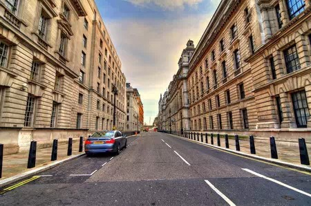
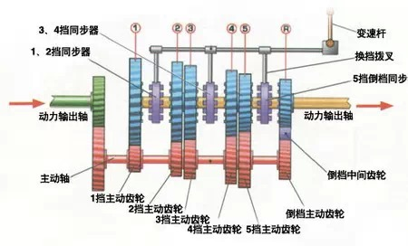
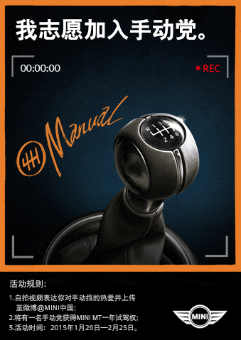

##  手动党：特立独行的少数派

_2015-01-28_ 大象公会

在中国，一个人成功与否，可以直接从座驾看出来，通常，车的大小、长度与他的成功程度成正比，如果坐着一台和大货车一样长的超长悍马、林肯、凯迪拉克，必然是照片会被
发到网上引来一片惊呼的成功人士。而在美国，这类车主多半是刚从贫民窟崛起的拳击手或说唱歌手。

**前NBA球星安东尼**沃克与他收藏的豪车**

  

手动挡还是自动挡，也是区分成功程度的重要标志。在中国，驾驶手动挡车，通常意味着这个人只能勉强买得起车，因为通常只有中低端车才有手动挡，而且手动挡款型通常与各
种低端配置打包在一起，而高配车几乎都是自动挡。

  

所以，中国人虽然大部分人在驾校学车时学的都是手动挡，但买车时都会买自动挡。道理很简单，既然已经勒紧裤腰带出一大笔钱买车，谁还愿意为了节省一万多块钱而被人认为
是个穷酸呢？要让人尊重，当然得买自动挡。

  

在欧洲，自动挡车主会得到比中国更多的尊重和照顾，不过，这倒不是因为欧洲自动挡与手动挡的价格、档次差别比更大，相反，欧洲手动挡和自动挡完全不体现配置和档次的高
低，人们更尊重照顾自动挡车的车主，仅仅是因为自动挡车的车主通常是肢体或智力有缺陷的残疾人。

  

欧洲人很难理解中国富二代们开着豪华运动车把妹时，居然大多是自动挡，在他们看来，这类车最让人着迷的地方显然是其卓越的驾驶性能，而不是酷炫的外壳。拥有最发达汽车
制造技术和成熟汽车文化的欧洲，绝大部分汽车都是手动挡的。

  

环境和经济考虑当然是欧洲人偏好手动挡汽车的重要因素。

  

欧洲多数城镇及乡村道路往往蜿蜒起伏，有些地区堪比中国的重庆，城区道路普遍偏窄。这种路况，往往需要司机刻意保持发动机最大扭矩输出在一个较高范围，方能从容应对各
种较急的弯道或坡道。

**以英国伦敦为代表的欧洲城市街道普遍偏窄**

  

普通汽车发动机，不论涡轮增压还是自然吸气，最大扭矩在2000 – 2500rpm左右才会出现。而发动机的怠速一般是800转左右。在800 –
2000转这个自动挡车辆最长停留的区间，发动机无法提供纸面参数上的扭矩。如果发动机处于低转速时正好遇到爬坡，车辆的加速感和行驶品质会大打折扣。

  

如果是手动挡，驾驶者在这种路况上可以一直把发动机转速保持在最大扭矩输出范围，以获得良好的行驶品质。这种随机应变的反应是一般自动变速箱，或者说2010年以前的
自动变速箱所不具备的。

  

手动变速箱的另一大优势便在于经济性：传动效率高以及结构简单，维修保养便宜。

  

在传递动力过程中，手动变速箱只会在离合器位置有较大动力损失，对老司机来说，只要恰当的油离配合便可避免。而自动变速箱的必备结构–液力变矩器，则在动力传递中不可
避免地浪费10%-15%的能量。每次换挡，自动挡需要比手动挡多10%-15%的发动机扭矩，才能达到同样速度，这当然要多耗汽油。

  

另外，手动变速箱结构简单，部件结实耐用，维修费用较低。自动挡车就复杂的多。除了液力变矩器实现换挡外，它还有套复杂的挡位运算程序。结构复杂，故障概率必然上升，
维修成本也要比手动挡车更高。因为这个原因，欧洲二手自动挡车的保值率明显不如手动挡车。

**手动变速箱结构示意图**

  

汽车消费文化也造就了中国和欧洲对变速方式的不同偏好。

  

汽车进入家庭在欧洲已有几代人时间。买车时，“我中意”早已压倒了身份炫耀。对这种挑剔的客户，厂家会提供极为细致的配置清单供其组合自选，所以他们拿到的车会体现出
强烈的个人订制色彩。不过自选配置轿车往往需要3-6个月的定制周期。

  

而急于拥有第一辆车的中国人，多数习惯付全款提现车，很难忍受长达半年的等待，并且并无驾车经验，根本不知道自己需要什么，所以汽车厂商的市场部门一般会把各种配置预
先搭配好，以套装形式打包卖给车主。

  

而手动挡往往会被归为经济、实惠大类，这使得与手动挡打包的其他配置（轮胎、音响、内饰、座椅等）多是中、低档。这造成少数对手动挡驾驶有特殊追求的人，在选择手动挡
时面临必须放弃很多舒适配置的选择困境。

  

在习惯以车代步的欧洲人看来，开手动挡车是一种真正的人车互动，操控感是很重要的驾驶体验。他们坚信，车要更多的服从于人的意志，而不是代替驾驶者完成很多工作。美国
虽然懒人司机扎堆，但高端运动型车的客户甚至比欧洲人更热衷于手动变速箱。

  

多数中国人今天首先要解决的是汽车的有无，以及展示自己是否成功，操控感实在是一项奢侈的追求，起码它要排在驾驶技术是否容易掌握、座椅是否柔软舒适、外观是否酷炫之
后——菜鸟和老手当然有不同的追求。

  

为迎合中国市场的特殊需求，当年甚至桑塔纳、捷达这种传统手动挡汽车都曾推出自动挡版本。

  

不过，中国的驾车者并非全都是菜鸟，极少数已解决汽车有无的人，特立独行地成为追求驾驶操控感的爱好者。

  

**敏锐捕捉到这一小众文化的MINI，在其新款手动挡车型面市前的1月26日，向全国网友开展"MINI手动挡”活动，征集驾驶者与手动挡汽车的故事，周期一个月，最后的获胜者将赢得MINI MT手动挡一年使用权。**

  

** **

  

**众多追求驾驶操纵感的大V率先响应，让人们首次注意到了中国这一小群特立独行者追求与手动挡的复兴：**

**  
**

**女司机，这一称呼在近年来或许已经变得略显贬义，“让女士开手动挡？别逗了！”但这次MINI却收获了演员钟丽缇的青睐：**

  

**  
**

  

**运动员对汽车的苛求由来已久，嗡嗡发响的马达轰鸣与飞驰而过留下的模糊车尾灯是作为司机的他们给大家留下的最初印象，但足球明星邵佳一得知MINI手动挡面世之后同样也是按捺不住：**

**  
**

****  
****

****  
****

****聚光灯下的明星已经站出来了，**这样看来，手动挡或许真的并不小众。这些大V对MINI手动挡的的热切期盼也反映了中国手动挡消费市场的蠢蠢欲动。的确，随着汽车从简单的代步工具变成满足操控感的“大玩具”，与他们拥有同样想法的同路人已有不少。**  

  

**18.5W的MINI手动挡对于汽车市场会有怎样的冲击？手动挡汽车是否真的魅力十足？值得期待。**

阅读

__ 举报

[阅读原文](http://mp.weixin.qq.com/s?__biz=MjM5NzQwNjcyMQ==&mid=210340277&idx=1&sn
=77ebcffde7dde6f53bcf8a5f92ee875a&scene=1#rd)

