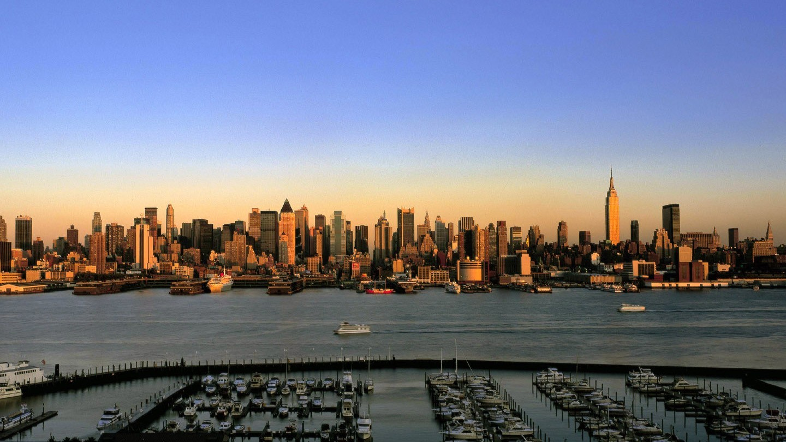
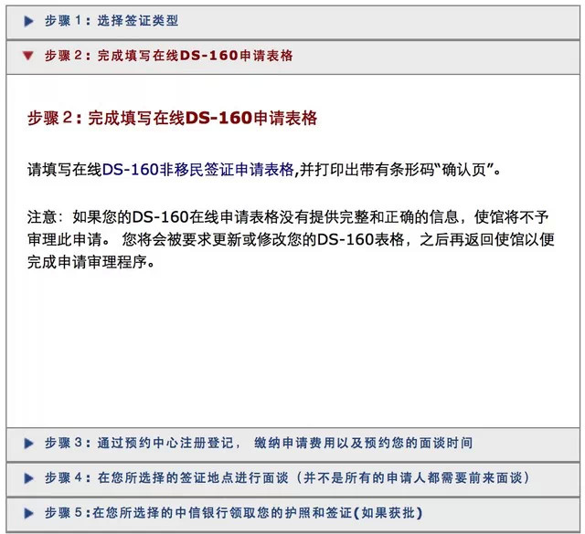
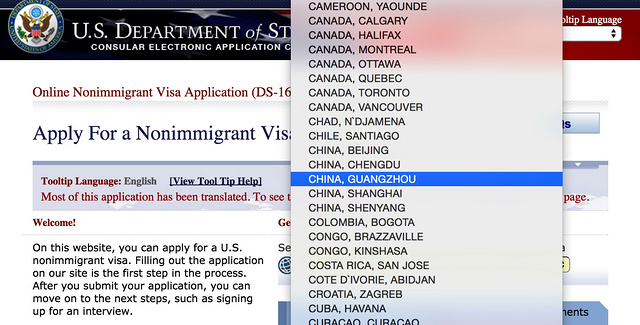
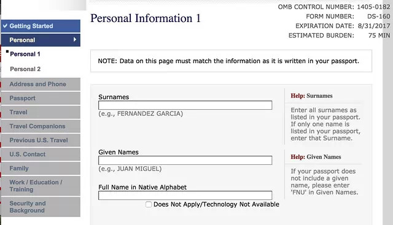
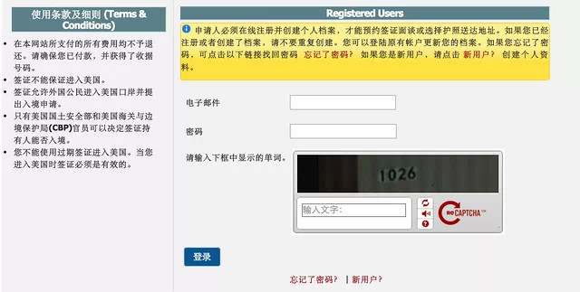
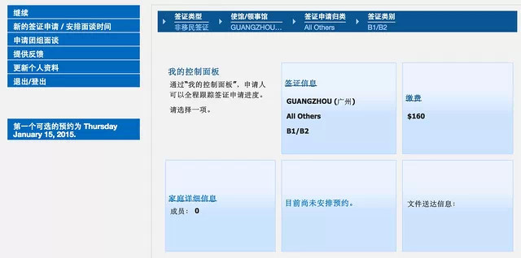
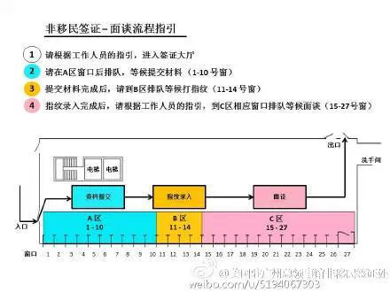

奥巴马在 APEC 峰会上给我们带来了一份大礼，从 2014 年 11 月 12 日起，中国人赴美商业旅游签证将延长到 10
年，换句话说，只要一次搞定签证，接下来的 10 年，去美国就是说走就走。

  

说实话，对比一下欧洲国家，美国签证的门槛算是很低了！

  

下面小编手把手教你把美国签证拿到手：

  

进行任何国家的签证申请，都可以去到该国驻华大使馆或领事馆的网站，进行相关信息的查询，填写，电子签证申请或者面签预约。美国签证，当然只要百度一下美国大使馆就可
以了。

  

主要分为三个步骤：

  

> 1、网上申请

>

>  

>

> 2、缴费

>

>  

>

> 3、面签预约

  

**一、完成 DS-160 电子表格申请**

  

进入签证页面，了解你的「商务/旅游签证」类型。进入 DS-160 页面进行在线填写。

  

  

  

进入 DS-160 页面后，首先选择面签的城市。目前可就近选择在北京的驻华大使馆，驻成都、广州、上海、沈阳的领事馆进行面签。你还会发现只要鼠标放在英文下面，
中文翻译就会非常人性的展现。

  

  

选择好城市后，并选择 Start an Application，跳转后填写安全问题，并记住右上角的申请 ID 以及你的安全问题，这样你可以在稍后的 30
天内继续完成表格填写。如果不想在 30 天内完成申请，还可以在表格低端选择 save，便于以后的表格完成。

  

  

上面是 DS-160 申请表，从左边可以看出，从 Getting Started 开始一共有 11 个部分要填写，下面我把其中的容易迷惑的事项列一下：

  

表格所有的填写都用英文，除了上图种的 Full Name in Native Alphabet 要用中文填写。

  

Do you have a telecode that represents your name? 一项选择 Yes ，并在 ChaseDream
中查询标准中文电码，填入数字即可。

  

Person/Entity Paying for Your Trip，填写你此次旅行的出资人，此处将与后续的财力证明有关。

  

上传一张在最近六个月内拍摄的 2 英寸 x2 英寸（5.1 厘米 x5.1 厘米）照片。

  

  

完成所有内容填写和照片上传后签名。签名后，系统会告诉你要打印那一页，或者你可以选择把 DS-160
页发到指定邮箱，日后打印也可。注意用喷墨或者激光打印，条形码清楚。

  

**二、注册并创建个人档案，缴纳签证费用**

  

  

在上述页面，选择新用户，完成注册。

  

  

注册完成后，完成「个人资料」更新，然后选择「新的签证申请/安排面谈时间」，一步步进行选择，进入缴费页面，支付相当于 160 美元的人民币。

  

缴费有 3 种方式，但都只支持中信银行的缴纳。

  

> 方式一：使用中信银行的「银行卡」进行在线支付。

>

>  

>

> 方式二：选择中信银行柜台支付（需携带打印好的「美国签证付款单」和护照），银行支付完成后会得到一个收据。

>

>  

>

> 方式三：选择中信银行的自动柜员机进行支付（网页申请的最后一步会得到一个 CGI 码，用于柜员机支付的识别），完成后会得到一个收据。

  

**三、面签预约**

  

缴费完成后，凭借缴费收据编号，进入「个人资料」页面里左上角「安排面谈时间」里，进行面谈时间预约。

  

至此，网上申请及面签预约完成，下面开始准备相关纸质材料。

  

**纸质材料准备**

  

必要性材料：

  

> 面谈预约单打印件。

>

>  

>

> DS-160 确认页打印件。

>

>  

>

> 一张在最近六个月的 2 英寸 x2 英寸照片。

>

>  

>

> 新旧护照。

  

支持性材料（最好是原件）：

  

> 当前收入证明、纳税单、房产证或企业产权证、资产证明。

>

>  

>

> 行程表和/或其他有关旅行计划的说明。

>

>  

>

> 申请人所在单位的介绍信，详细说明申请人的职位、工资、入职时间、是否获准休假、赴美参加商务活动的目的（如有）等。

>

>  

>

> 犯罪/法庭记录（无论在何地被捕或定罪，即使已服完刑期或被赦免也不例外）。

  

**此外，根据申请人的出行目的，可能还需携带下列材料**

  

> 学生：携带成绩单和学位证明/文凭，以及银行月结单、固定存款单等资金证明。

>

>  

>

> 在职人员：携带单位开具的就职证明以及最近三个月的工资单。

  

**面签（以美国驻广州领事馆为例）**

  

到达领事馆后，工作人员会引导去签证大厅的窗口交表。然后，将会被指引到指纹队伍排队等候指纹的采集。最后，会来到面谈队伍排队等候面谈。

  

  

完成面谈后，就可以在家安心的等护照了！

  

而护照可以选择快递到家，也可以选择中信银行自取。

  

**说明**

  

十年多次往返签证不等同于停留期限，每次的停留期限由美国边境官员决定，且最长时间不会超过 6 个月。

  

美国对资金证明并没有给出明确要求，网上流传的十万的财产证明是旅行社为获得更多签证客户而做出的传闻。事实上，只要你的收入证明能支付得起你的旅行费用就没问题了。

  

网上的旅行社说为你提供签证服务，还是免不了「面签」这一环节，所以最省事的是自己准备材料，避免面签时出现信息不符。

  

拍照不能戴美瞳。

  

最后，终于拿到美国签证，就会知道，有了美国签证你还可以：

  

> 1、墨西哥免签 (单次停留 180 天)。

>

>  

>

> 2、菲律宾免签停留 7 天 (直接从中国出境，边检不放行，从第三国前往可以)。

>

>  

>

> 3、洪都拉斯免签 (30 天)。

>

>  

>

> 4、多米尼加免签 (30 天)。

>

>  

>

> 5、巴拿马免签 30 天（前提必须该美国签证至少用过一次：可以先到美国，后去巴拿马；美国转机也符合该要求)。

>

>  

>

> 6、黑山免签 (7 天)。

>

>  

>

> 7、百慕大免签 (180 天)。

>

>  

>

> 8、过境韩国免签停留 30 天 (切记：前提是必须是前往美国本土，前往美国海外领土关岛等不能享受此政策；往返各停留 30 天)。

>

>  

>

> 10、过境新加坡停留免签 96 小时 (有效期至少为 1 个月，往返只能停留一次)。

>

>  

>

> 11、哥斯达黎加免签停留 30 天 (有效期至少还有 3 个月)。

>

>  

>

> 12、土耳其 (电子签证，需要持有有效的持有有效的澳大利亚、加拿大、爱尔兰、日本、韩国、墨西哥、新西兰、英国，美国，申根，以色列签证)。

  

需要解释几个名词：

  

免签：即你可以拿着护照（含美国签证）和前往第三国的机票即可进入该国。

  

过境签：即你拿着护照（含美国签证）和前往美国的机票，可中途在第三国停留规定时间。

  

土耳其电子签证：可登陆土耳其大使馆，网上申请电子签证，网上支付，A4 纸打印电子签证，拿着护照（含美国签证）和前往土耳其的往返机票，即可入境土耳其。

阅读原文

阅读

__ 举报

[阅读原文](http://mp.weixin.qq.com/s?__biz=MzA3OTQzNzAxMg==&mid=205746768&idx=1&sn
=ff4cb1f7432c6d5f4ba125fdc2648f95&scene=1#rd)

