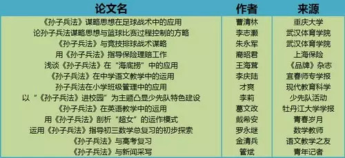
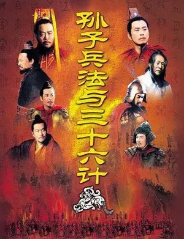
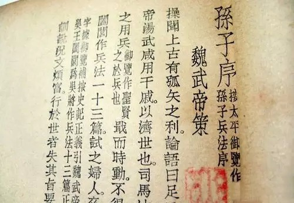
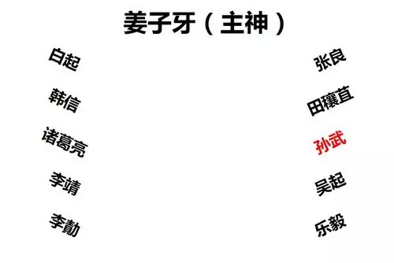
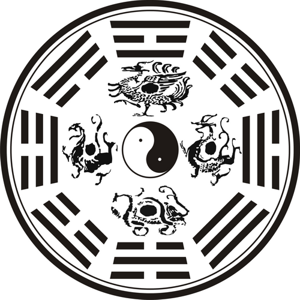
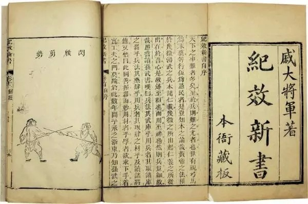
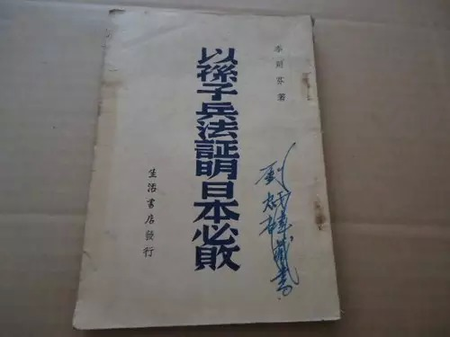
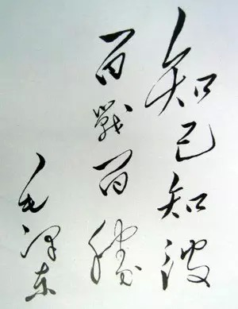

##  拿破仑看《孙子兵法》为何流泪  | 大象公会

_2015-02-05_ 大象公会

**大象公会**

idxgh2013

知识，见识，见闻。最好的饭桌谈资。知道分子的进修基地。

__ __

**《孙子兵法》今天在中国是万能智慧宝典，任何人、任何行业都可从中获得启发。不过，《孙子兵法》并非一开始就有崇高地位，它在后世大受欢迎，与其说是可让武将们受益，不如说是因为更适合文人知识分子谈兵论政的缘故。**  

  

**文/鲍君恩**

  

谁不会背几句《孙子兵法》呢？

  

“知己知彼，百战不殆”，“后人发，先人至”……这些语句和“子曰”一样让人耳熟能详。《孙子兵法》也常出现在《厚黑大全》、《三十六计》旁，以其经典智慧，滋润、指
导着现代中国人。

  

《孙子兵法》堪称现代中国人的处世圣经、谋略宝库。除了军事、商业、体育等领域，孙子的智慧还也可以运用到“超女”运作、英语教学、海底捞和小学班级管理之中。

  
**《孙子兵法》各行业相关论文（根据中国知网数据库整理）**

  

2000年，一群高智商的电视工作者还将《孙子兵法》与《三十六计》杂糅，推出名噪一时的电视剧——《孙子兵法与三十六计》，当时不少中小学还要求学生回家观看。

  

略让人遗憾的是，该片通篇讲述孙膑和庞涓斗法，孙子却不幸遗漏，当然，这不重要——人们更在乎影片中的谋略和启迪。

  
**《孙子兵法与三十六计》宣传海报**

  

军事专家对《孙子兵法》当然更有热情——不但金一南、张召忠、戴旭、罗援等“军事超男”们引用《孙子兵法》如家常便饭，军方有关部门同样极为重视相关学术研究，201
4年7月召开的“孙子兵法与总体国家安全观”国际学术研讨会，文化部长和国防大学校长、政委悉数出席。

  

《孙子兵法》在中国有如此高的地位并不奇怪，因为据传，拿破仑在圣赫勒拿岛囚禁的最后岁月，看到《孙子兵法》时，曾老泪纵横道：“如果我早看到它，我怎么会落到如此下
场。”

  

没错，人类唯一能与《孙子兵法》的万能智慧相媲美的，也许只有《易经》了。

  

**【平凡的前奏】**

  

只是，人们至今仍无法确认孙武是否真的存在。

  

孙武最早的记载，是战国后期《韩非子》和《吕氏春秋》，但春秋时期的权威史书《左传》、《国语》中并没有孙武出现。唐宋之时，不少人因此怀疑孙武、孙膑实为一人。

  

1972年4月，山东临沂银雀山出土了《孙子兵法》13篇残文和孙子佚文5篇、《孙膑兵法》16篇的汉简，证明孙武并非孙膑，且《孙子兵法》汉朝就已存在，但仍没有办
法确定孙武的真实身份。

**明代所绘孙膑画像。孙膑，中国战国初期军事家，兵家代表人物。原名不详，因受过膑刑故称孙膑**

  

从历史上看，以武开国的汉、唐两代，《孙子兵法》并无特殊地位，反而是文弱不振的时代它才有了神圣地位。

  

甚至西汉人提到《孙子兵法》时，是道德上贬低的。时人总结秦朝败亡教训，认为天下可“逆取”，却必须“顺守”：对内要广施仁义，强化道德观念，而《孙子兵法》强调“兵
以诈立”，显然与当时主流意识形态不容，故《汉书•刑法志》对孙子大加挞伐，认为他“身诛戮于前而国亡于后”，是“报应之势，各以类至，其道然矣”。

  

经历几个世纪的黯淡，东汉末年的三国，孙子有了“平反”机会——国家的分裂导致意识形态上的严厉管控迅速瓦解，曹操注解《孙子兵法》的《孙子略解》，让孙子第一次登上
了台面。

  
**曹操注孙子兵法**

  

不过，当另一拨中国历史上举足轻重的群体也开始关注《孙子兵法》时，它的历史地位才真正大幅提高。  

  

这就是文人群体。

  

魏晋时期，名士圈子崇尚玄谈和论辩，精彩警句迭出的《孙子兵法》充斥着大量概念游戏和诡辩技巧，因为可提供丰富的新谈资，遂大受热捧。

  

到了文武并重的唐朝，兵家第一次真正得到官方认可，不过《孙子兵法》的地位倒未因此显赫，因为当时兵家代表人物并不是孙子，而是姜子牙。公元760年，唐高宗尊姜子牙
为武成王，祭奠规格与文宣王孔子相同，并配备了10位著名军事家一同祭祀，孙子排在右列第3位，只是普通一员。

  
**唐肃宗上元元年武庙祭祀排位示意图**

  

**【武举制的扶持】**

  

唐朝对兵家的推崇只具有象征意义，对其学说并不热衷，直到北宋时期，由于在与辽和西夏的战争中屡尝败绩，文人阶层普遍开始关注军事，兵书开始受官方重视。宋神宗命专人
校订七部兵书，以官方名义颁行，统称为《武经七书》，《孙子兵法》位于七书之首。没有兵书传世的姜子牙自然风光不再。

  

成为经书，最重视的肯定是文人儒士。当时，文人谈兵蔚然成风，但苦于无机会实操，遂多把功夫花在对《孙子兵法》的繁琐考证和注解上。

  

不过，宋人好谈兵，只是不断抬高和神化了《武经七书》的地位，军事理论和实战水平却止步不前。

  

但他们也不是没有创新和发扬，由于对“九宫八卦阵”为代表的古兵书阵法的兴趣，他们在《周易》中四象八卦之说的基础上，演绎出了大批怪力乱神的阵图和奇门遁甲术，不少
阵图都冠以孙子之名。

  
**四象八卦图**

  

靖康之难前夕，禁军老兵郭京用猫和老鼠在金銮殿上演示八卦阵，当场赢得了宋钦宗和百官的信任，与金军对阵时，他祭出“六甲正兵”、“六丁力士”、“北斗神兵”出战，结
果被不识此阵的金军杀得大败。

  

如果仅是文人一时偏好，兵法、谋略的地位或许会在风气过后回落。然而，宋朝人在制度层面为《孙子兵法》的崇高地位上了保险——武举制。

  

中国的武举制度始自唐朝武则天，当时的考试内容尚且实用，主要是骑射、举重等，出现兵法考核，也只是临时科目。

  

北宋时，重心开始向《武经七书》偏移——不熟读兵法，军事技能再硬也休想中举。朝廷的军事学校——武学也以教兵法为主。

  

兵法的地位随着宋军的失败水涨船高。最初，武举考试还先测试步射，再问兵法，但南宋高宗时期，考试只以兵法水平定成绩，结果，武举的应考者中相当比例是没考上功名的儒
生。

  

这种武举制度在明清两朝没有太大改观。清嘉庆年间，武举考试甚至废除了关于兵法理论的问答，只需默写《武经七书》中的一小段，没有错误即为合格。

  

武举考试和武学教育，让《孙子兵法》逐渐上升到地位不可撼动的绝对真理。譬如著有中国少有的实用型军事著作《纪效新书》
的抗倭名将戚继光，虽然对《孙子兵法》中“兵闻拙速”、“高陵勿向”、“围师必阙”等原则明确提出了相反看法，却仍认为孙子绝对正确，只是要有条件地加以理解。

  

与戚继光同时代的名将俞大猷倒是勇敢地认为，《孙子兵法》中有些说法是“误天下后世徒读其书之人，杀天下后世千万万人之命”。

**《纪效新书》，明戚继光撰**

  

**【神话的动摇】**

  

对《孙子兵法》最严厉的质疑，出现在鸦片战争之后——不谈谋略、根本不存在兵法这一概念的西方强国，轻而易举就击败了熟读《孙子兵法》的清军将领。

  

屡战屡败，促使清帝国模仿西方，变革军事体制。但在“中体西用”的指导下，中国军队的基本军事理念仍逃不出《孙子兵法》的窠臼，技战术素养提升极为缓慢。

  

《孙子兵法》这才开始遭遇信任危机。陈昌龙编辑的《中国兵略指掌》就说到“孙子论兵多玄空微妙”，洋务派的代表人物张之洞虽没有直接点《孙子兵法》的名，但批评《孙子
兵法》的衍生著作“《太白阴经》、《虎钤经》之属，诡诞不经”，称赞《克虏伯炮说》、《防海新论》等西方兵书“皆极有用”。

  

不过，满清王朝土崩瓦解，又让《孙子兵法》交上了好运——民族国家构建是新生的中华民国颇为重要的任务，在中国社会有极高认同的《孙子兵法》是重建民族文化认同的重要
符号。

  

首先是袁世凯以北洋政府陆海军大元帅的名义出版了蒋方震、刘邦骥合著的《孙子浅说》，并要求将《孙子兵法》“尊为兵经，列为官学，布告海内，使莘莘学子家喻户诵”。

  

同为军人出身、接受过日本系统军事教育的蒋介石，对孙子也推崇备至。不但指定《孙子》、《吴子》、《六韬》为军事学校专习必修之课，更认为《孙子兵法》中“所讲的东西
，有很多就是现在外国人最新最进步的战术原则”。

  

抗战爆发后，《孙子兵法》又派上了新用场——鼓舞民心士气。有一本叫《以孙子兵法证明日本必败》的奇书，因为论证了“在《孙子兵法》中找不出日军胜利的条件”，在国民
党高层大受欢迎，时任湖南省政府主席陈诚还亲自为该书题写序言。

**奇书《以孙子兵法证明日本必败》**

  

国民党的《孙子兵法》热迅速激发了中共的兴趣。

  

**【中共的认可】**

  

中共很快发现《孙子兵法》作为统战工具的价值——国民党将领们实在太爱孙子了。

  

1938年，为向国民党将领宣传运动战思想和军事辩证法，毛泽东指示郭化若在《八路军军政杂志》上发表《孙子兵法之初步研究》，用马克思主义的世界观、方法论分析孙子
兵法，将毛泽东的军事思想巧妙地裹在孙子的外衣中，在国民党军官内赢得了不错的反响。

  

毛泽东对《孙子兵法》的运用并不限于军事，除了《论持久战》和《中国革命战争的战略问题》，在他的哲学著作《辩证唯物论讲授提纲》中，也引用了《孙子•谋攻篇》的原文
。

  

毛对《孙子兵法》还有创造性继承：“知己知彼，百战不殆”，被毛泽东数次误引为“知己知彼，百战百胜”，后者成为很多人的口头禅。

  
**“知己知彼，百战百胜”，毛泽东题**

  

中共对《孙子兵法》的态度改变了不少人的学术观点。1930年，受过系统西方哲学教育的冯友兰在撰写《中国哲学史》初稿时本来拒绝收入孙子，并对日本学者高濑武次郎在
《支那哲学史》中高抬孙子含讥带讽。

  

但二十多年后思想已经转变过来的冯友兰，在《中国哲学史新编》中不但把孙子请了回来，还写下了大篇空泛的溢美之词。

  

政治和学术的合力，在普通人的头脑中再造了《孙子兵法》的神话。翻阅毛泽东军事思想相关研究论文，基本都会提到其对《孙子兵法》的“批判继承”。

  

毛泽东和孙子的诸多相似之处——擅长辩证法、强调斗争哲学、喜欢思考宏观战略问题，但对具体战术语则焉不详，这让两个相距两千多年的人紧紧绑在一起，孙子不但成为中国
传统军事思想的神圣符号，更是毛泽东的一个化身。

  

不过，在军事科学院战略研究部副部长毛新宇看来，孙子还是不能和“人类历史上最伟大的军事家”毛泽东相提并论。他在接受记者采访时强调：“毛泽东的军事思想远远要比咱
们几千年前的《孙子兵法》总结的理论水平高出很多。”

  

作为研究毛泽东军事思想的权威学者，毛少将能否在爷爷的基础上发展出一套新的孙子兵法，值得广大军迷期待。

**  
**

**版权声明**

****大象公会所有文章均为原创，****  

****版权归大象公会所有。如希望转载，****

****请事前联系我们：****

bd@idaxiang.org

****知识 | 见识 | 见闻****

阅读

__ 举报

[阅读原文](http://mp.weixin.qq.com/s?__biz=MjM5NzQwNjcyMQ==&mid=210544527&idx=1&sn
=83eec6ce94480d2a02f4e3b42719346d&scene=1#rd)

