##  摩天楼的温情 | 大象公会

_2015-01-21_ 大象公会

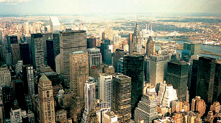

**纽约曼哈顿城区是全世界高楼密度最大的地方，狭窄的街道却能看到阳光，这里是世界上行人密度最高的地方，但行人却不会感到拥堵。**

  

**文/史伦**

  

长安街这样的超宽马路被许多人认为是只适合乘车检阅市容、但反人性的设计——行人不但很难走到马路对面，而且整条街上没有一处可供停留、驻足、休息的地方。但中国城市
新建街道全都在向长安街看齐。中国的摩天楼也具备同样特色，它适合远观，作为城市名片。对路过的行人没有任何友好。

  

如果把中国的摩天大楼像纽约曼哈顿那样密集地摆在一起，或许会是这样的情形：狭窄的街道会变成令人绝望的、看不到丝毫阳光的停车场，至于行人，要么在车缝中挤进挤出，
或者干脆只能全都在地下行走——曼哈顿的行人密度比中国大都市高得多。

  

但是，曼哈顿街道却经常能有阳光照射——退台式高层建筑保证了阳光的照射路径，街道对行人也非常友好，摩天大楼纷纷将宝贵的底层镂空，作为行人行走、休憩的公共空间，
狭窄的街道事实上被拓宽了。

  

纽约的这一特征，甚至能从航空照片中一眼辨认出来——曼哈顿城区林立的高楼大都是竹笋般的退台式高楼。

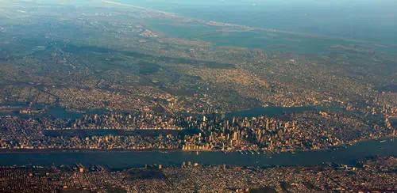

**纽约市俯瞰图，曼哈顿城区的所在位置颇为显眼**

  

是什么原因，让阳光从高楼的狭缝中打在纽约的街道上，让开发商奢侈的放弃建筑底层，“好心”考虑行人需求？

  

很难一句话讲清楚原因。纽约政府、开发商、建筑设计师多者互动，历经一个世纪，才完成了这样友善、克制、温柔的建筑风格。

  

**【遮天蔽日的曼哈顿】**

  

20世纪初，纽约市迅猛发展，地产商纷纷投资曼哈顿，诸多摩天大楼拔地而起。

  

火热的地段自然价格不菲，地产商出于经济考虑，对建筑师提出了在当时非常具有挑战性的要求——建造高度更高，面积最大的摩天大楼。

  

审美角度来说，这是一场灾难——曼哈顿城市用地被臃肿、庞大的建筑体块占满，狭窄的街道空间终年不见阳光，阴暗、逼仄，空气非常浑浊，城市环境日渐恶化。

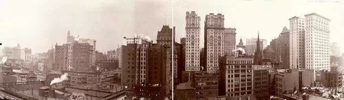

**1907年的曼哈顿街头**

  

著名的丑陋项目恒生大楼（Equitable Building,1912-1915），就是当时建筑风格的代表之一。其容积率惊人，体量巨大，不仅阻挡了周边地块建
筑的采光和通风，1.3万人的容量对交通、服务都带来不小的压力。冬季，恒生大楼形成面积高达2.6公顷的阴影，相当于自身面积的6倍，直接造成周边地块办公楼出租率
下降。

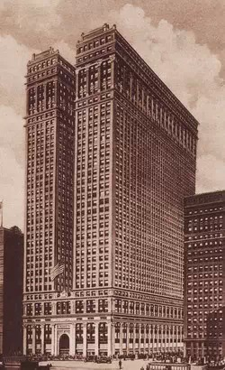

**恒生大楼**

  

纽约市敏锐的意识到这种问题。1916年，纽约出台了区划法案（1916 Zoning Resolution），旨在遏制这样贪婪攫取空间的趋势。

  

区划法案中，明确规定了出地块中建筑高度和体量的标准——地产开发者可以在一定的高度限制范围内，在用地上保持100%的建筑密度；超过这一高度，则应让出临街一侧的
空间；高度如果更高，则继续让出面积。只有建筑体量出让到一定程度，即主楼的平面面积少于用地面积的25%时，才不必继续后退。

  

这部分改善了曼哈顿的街道环境，此后的建筑形体也变得稍微克制、美观起来——从平顶、方盒子形状，向山坡般跌落式转变。

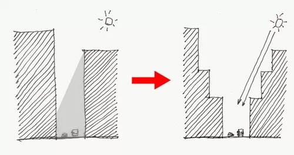

**退台式建筑示意图（绘图 By 史伦）**

  

帝国大厦、克莱斯勒大厦等就是退台式建筑的典型代表。这种建筑形态，被人们戏称为“婚礼蛋糕”或“巴比伦金字塔”。

  

区划法案颁布后的近40年中，纽约新建成的摩天大楼无一不层层后退。街道上因此保留了一些阳光。相比之下，纽约的早期法案有效的缓解了城市高楼病。

  

如果一直如此，帝国大厦们就应该占领曼哈顿了，相似的退台式建筑会成为纽约统一的建筑风格，纽约的立法者们应该感到欣慰。

  

直到1952年，一名非常有创造性的建筑师用全新的方案，巧妙地糅合法案要求、建筑美感、商业需要于一身，引领了20世纪中期曼哈顿的建筑时尚。

  

这就是利华大厦。

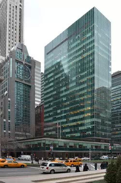

**利华大厦**

  

**【两座大厦和它倡导的风格】**

  

一开始，利华公司就向建筑师邦沙夫特（Gordon Bunshaft）提出了公益要求：给社区、行人尽可能提供便利。

  

邦沙夫特（Gordon Bunshaft）仔细研究了1916年的区划法案，很快就在“面积小于用地25%时不再要求退台”的规定找到突破。他新设计的方案，将占整
个用地25%面积的长条作主体平面，于是解放了“后退法则”限定的帝国大厦式建筑形体。

  

纯净简洁的规整长方体，在当时公园大道满目的“婚礼蛋糕”中独树一帜。

  

此外，与各地产商抢占街角、争夺面积的常规做法不同，利华大厦将裙房底层的街角空间让出，在其中布置座椅、植物等，任由行人穿越开放的庭院。

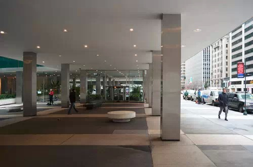

**利华大厦底部架空层**

  

这样的贴心、便利前所未有。人们甚至能无需付出任何代价，在此避雨、休憩、娱乐。庭院的设计一直延伸到建筑的门厅，极大地加强了建筑内外空间的融合与联系，也使得这处
环境宜人的庭院成为街道空间、室内办公空间的缓冲和过渡。

  

当然，利华大厦更广为人知的建筑贡献，是世界上第一座玻璃幕墙高层建筑。总之，这种谦逊、友善、漂亮的作品影响深远，柏林的欧罗巴中心等后来建筑就是仿效利华大厦。

  

曼哈顿的公园大道（Park Avenue）注定要引领当时的建筑风潮。利华大厦对街的西格拉姆大厦，很快也突破了退台式建筑风格，甚至某种程度上更加漂亮。

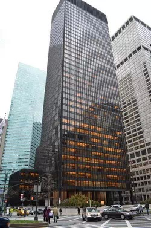

**西格拉姆大厦**

  

西格拉姆大厦（Seagram Building）被公认为功能主义审美与现代主义风格的绝佳典范。它建成于1958年，高516英尺（157.3米），共38层。

  

为了不采用千篇一律的退台形式，其设计师路德维希•密斯•凡•德•罗（Ludwig Mies van der Rohe）与菲利普•约翰逊（Philip John
son）将西格拉姆大厦沿公园大道的一侧整体后退，并在退让出的用地上设计了城市公共广场，广场南、北两侧安排两个长方形水池，水池周围设置大理石座椅，每当夏季，男
女老少都聚集在喷泉水池的旁边，成为城市中生机盎然的一角，这个广场自然成为广受欢迎的集会区域。

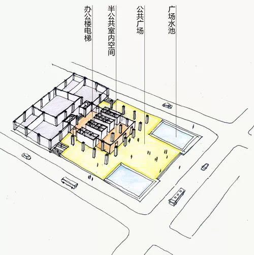

**希格拉姆大厦首层空间分析**（绘图 By 史伦）****

  

同时，设计师在立面语言上采用了密斯经典处理方式，与隔街的“球拍与网球”俱乐部（意大利复兴式立面）形成了良好的对话关系——就是说，不仅单独考虑到自身的设计美感
，还充分尊重、利用社区的既成建筑风格，在元素设计上与隔街的建筑良好互动。

  

因此，西格拉姆大厦与利华大厦一并成为几十年来纽约市摩天大楼建设的榜样，为后来的建筑师提供了方向。

  

不过，建筑师们的创新很快又得到了一个熟悉力量的重视——纽约市政府。由一种建筑风潮，很快变为激励性的法案。

  

**【新常态的稳定】**

  

1961年，作为对建筑师创造力的回应，纽约市颁布了相关法案：如果开发商采用此类为城市退让公共空间的设计方案进，他们将因此而得到一定的奖励（奖励内容为允许加建
20%的建筑面积）。

  

开发商怎么会讨厌这种法案呢？于是，曼哈顿的城市空间越来越多元、舒适。但是，法案仅仅规定了对退让的奖励，极少有人专注经营这片退让的空间，直到花旗银行大厦（Ci
tigroup Center）接过了建筑创新的传递棒。

  

与利华大厦、西格拉姆大厦异曲同工，花旗银行大厦也在设计上为城市空间费劲了心思，它更加慷慨——将本可以作为宝贵办公空间的近10层底部楼层都舍去，仅保留中央的方
形核心筒和位于四个方向上的结构支撑柱。

**花旗银行大厦底部空间示意图**（绘图 By 史伦）****

  

虽然这种结构处理方式给当时的建造提出巨大挑战，它的效果却非常出色——仿佛在水泥森林中挖出了一片休憩的洞穴。更进一步的是，花旗银行塔楼架空的西侧，建成了一个下
沉广场，伴有叠水景观和绿化，成为列克星敦大道（Lexington Ave）与53街路口上宜人的一角。

  

同时，用地西北角为一座教堂，恰位于高举的塔楼下方。商场的裙房建筑形态也与架空的塔楼底部巧妙结合，以退台形式自西向东层层递进，退台上的屋顶绿化，为广场、教堂、
零售店、写字楼门厅及地铁出入口的综合化城市空间争取了更多阳光与生机。

  

纽约建筑评论家保罗•高德伯格曾高度评价花旗大厦：“上个世纪七十年代纽约最重要的建筑就是花旗银行大厦，不仅由于它让人过目不忘的外形，更是因为它根本地与城市的结
合。”花旗银行大厦的设计者休•斯塔宾斯（Hugh Stubbins, Jr）也因此被誉为“地标建筑师”。

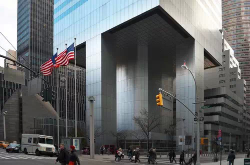

**花旗银行大厦近景**

  

不过，这种创新的背后，其实还有着法案修改的影响。1961年，纽约市颁布的奖励退让公共空间设计法案，未明确公共空间的经营方，不少摩天大楼只是简单地铺上地砖，最
多再添加一件或几件雕塑，所谓的“广场”也不过只是放大了的城市人行道，只能与冰冷的建筑界面机械地拼接，效果大打折扣。

  

纽约市政府1976年时意识到了这点，调整了原法案，要求退让的公共场所由遵守配套规范的开发商经营、配置，如树木绿化、公用电话亭、休闲座椅等。

  

法案的调整令后来建造的大楼（包括1976年的花旗银行大厦）注意打造其出让的空间，一批生机勃勃的街头休闲场所于是诞生。

  

这是纽约曼哈顿摩天大楼密集，却令行人异常舒适的原因。它像是多方互动的一次惊喜，充满了不确定性，事实上，极少有城市能有幸拥有这样出色的建筑师、市政规划者、开发
商们。因此，这样的城市景观极难复制。

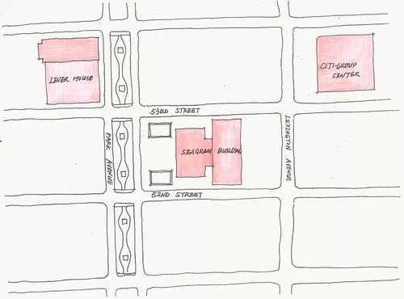

**利华大厦、西格拉姆大厦与花旗银行大厦，三座建筑的地块关系示意图（****绘图 By 史伦****）**

  

**_更多内容，详见《环美建筑日记》，作者史伦：_**

**_ 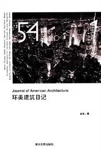_**

  

**版权声明**

****大象公会所有文章均为原创，****  

****版权归大象公会所有。如希望转载，****

****请事前联系我们：****

bd@idaxiang.org

****知识 | 见识 | 见闻****

阅读

__ 举报

[阅读原文](http://mp.weixin.qq.com/s?__biz=MjM5NzQwNjcyMQ==&mid=210119867&idx=1&sn
=134aa53c72582eb8e720747bdc53e77b&scene=1#rd)

