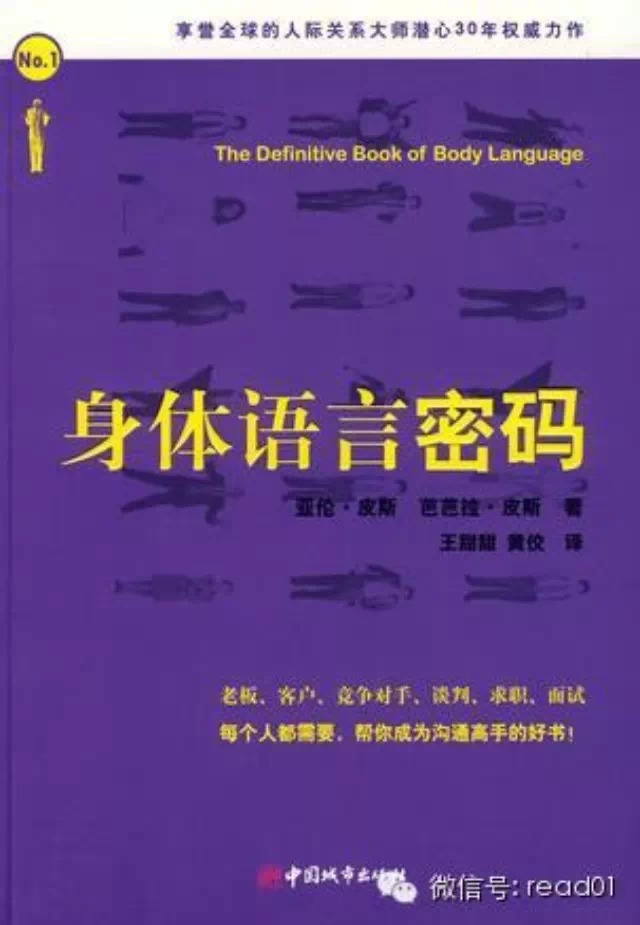

# 前几天在分享 用身体改变头脑的十个快速方法 ，输入：【身体】 时提到人的行为影响人的思想和感觉，今天分享一篇类似的文章，这些技巧可以让你变得更加自信。  

很早之前参加过一个培训时学到的一个类似的方法，当你觉得心情低落的时候，可以假装自己非常高兴，昂首挺胸，象明星走过红地毯一样去走路，立刻就会变得自信起来。大家
下次遇到同样的情况可以试试。

## 正文

* * *

出处： http://article.yeeyan.org/view/504134/430828

译者：徐莹

你的身体语言会告诉别人关于你的很多信息。如果我看到走路时抬头、挺胸、目视前方，那么我会觉得你是一个自信的人（或者至少在那一刻是自信的。）

如果我看见你走路时是垂头、手插在兜里和眼睛紧盯着地面的话，那么我肯定会推测你非常不自信。

去评判一个人用这种方式似乎有点不公平，但是这至少可以说明改善身体语言是如何的重要。

身体语言最棒的地方在于你可以伪装它，而且没有人会察觉得到。在练习一段时间这些技巧之后，你会发现你做的很自然。

提示：看看《身体语言密码》这本书。他对改善身体语言很有帮助。

### 1、观察自己的身体语言

改善身体语言的第一步是能意识到你到底在做什么。如果你没有意识到，你将不会知道改善从何处入手。  
对你要做的每件事，什么时候做，为什么要做要多加注意。例如，你可能没有意识到当你在谈论一个你不感兴趣的话题时，会不自觉地去挠挠脖子。所以说了解了自己身体动作是
成功了一半。

### 2、直视对方的眼睛

在路上遇到陌生人、同事甚至是被介绍给新朋友时，你能否保持目光的接触？  
眼睛是自信最重要的指示器。直视对方的眼睛会告诉他人你很自信，不会被轻易吓退。  
如果觉得直视对方有困难，那么试着注视对方两条眉毛之间的那一点，对方不会知道这差别。  
记住不要盯着对方看，这样会很吓人令人生厌的。

### 3.把头抬高

把头抬高，但也不要高到抬头望天那么高，只要可以做到目视前方那么高就好了。  
低着头走路的人通常不希望别人看到他们，就好像他们有什么要隐藏的似的。我确定你没有什么需要隐藏的，所以，抬起头来吧。

### 4.让身体多占据些空间

或许你会认为这么做是没有礼貌，事实上不是的这样的。这表明你的身体很舒适自在。自信的人通常会在站立和坐下的时候双腿分开一些，所以你也应该开始这么做。

### 5.不要交叉双臂或双腿

双臂交叉抱在胸前或翘起二郎腿传递出防御和拒绝的信号，这个动作就像在告诉别人自己心情不好，不要来打扰我。没有人会愿意和这时的你交谈的。

把你的双臂放下来，脚也平稳的放在地上，你会注意到对方开始对你的回应更加积极。

### 6.适当点头

当和他人交谈时，记住在觉得赞同的时候点头。这表明你在认真听，并对对方的谈论的话题很有兴趣。  
但也不要做过头了，你不会想要看起来像啄木鸟伍迪一样狂点头不止。

### 7.保持微笑

在谈话中保持微笑，在走路的时候稍稍带一点傻笑，会告诉周围的人你很快乐、积极向上。这会使你更以接近，其他人也会更乐于听你讲话。

### 8.减速慢行

自信的家伙从不会急急忙忙的。对他们来说，一切都是那么的完美。他们对自己，对这个世界都感到心情舒畅。  
走路的时候慢一点，会显得更自信和镇定。在其他人叫你名字的时候，不要急着扭过头去，要慢慢的把头转过去。

### 9.掌握身体的倾斜的艺术

身体前倾表明你对对方的话很有兴趣。然而，太过前倾就会显得太过依赖他人，并渴望得到他人的认可。  
身体后倾告诉他人你很放松和自信。然而，过分后倾会显得傲慢和冷漠。  
这可能听起来很难把握好之间的度，但其实做起来并不难。观察别人在听你讲话时是怎样做的，相应调整就好了。

### 10.不要做小动作

和别人说话时动来动去的会显得紧张不安。捏耳朵，玩瓶盖，摸脸，等等小动作都是不安的表现。同时也会让和你谈话的人分心。  
改掉手上的小动作，用双手使交流更清楚、有效。

### 11.握手要有力

没有人喜欢握到一个死鱼一样的手。一个有力的握手和微笑，会给对方留下良好的第一印象。

### 12.模仿

就像生活中大多事情一样，当师从一位某方面的专家时，进步是最快最多的。选择一位你钦佩的人，观察他的身体语言。你能从中学到什么么？

我最喜欢模仿詹姆斯**迪恩。他是我看到最有自信的人。去看看他在电影‘无因的反抗’中的表演。这部电影是以个极好的学习素材。

## 100天行动读者反馈

* * *

@紫溦贪狼_Time

2014-4-27立的目标，中间大病3个月，8月下旬重新开始到2015-1-18，完成#100天行动# 的目标。里程碑的成绩粗现了！达到100天目标，除去紧
急情况下未执行，plank几乎每天早上执行，保持到59kg，粗现马甲线。今天送自己2013海贼王的山治&乔巴，终于归队了，喜极而泣啊[泪流满面][加油啊][
lt切克闹]

完成人生第一个#100天行动# 早起plank，继续之前的#100天行动# ，并开始新的一个#100天行动# 早睡早起睡前阅读，目标一月一本非专业书籍。

@小火柴

老师你好，我是个注意力不太集中的人，现在用佛教中的方法让自己能集中注意力，已经7天了 ，每天二十分钟

  

阅读

__ 举报

[阅读原文](http://mp.weixin.qq.com/s?__biz=MjM5NjA3OTM0MA==&mid=204629933&idx=1&sn
=3f082caaa3c656f8877c18baa9c6da87&scene=1#rd)

