****

****

今天FitTime为你带来了**拉伸大全**，练前拉伸有助于激活肌肉，练后拉伸有助于肌肉放松恢复，一起行动吧！

  

**每个动作保持30秒,重复2-3组，保持呼吸自然均匀。**

**  
**

**肩部肌肉**

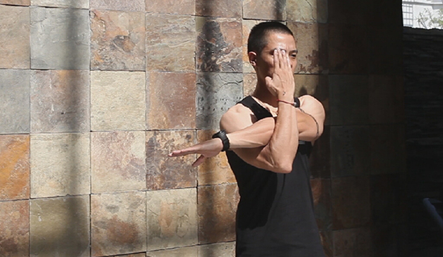

1.双肩下压，保持躯干的稳定；

2.抬起单侧手臂，扣住肘关节，尝试将手臂侧内旋；

3.自然呼吸。

  

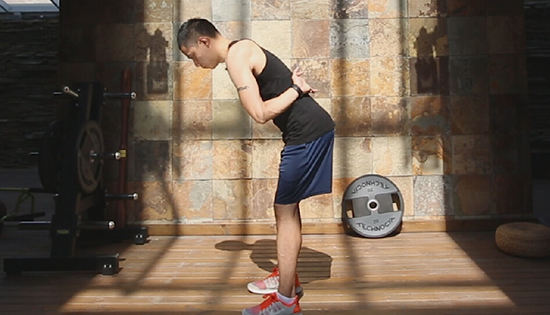

1.双肩下压，保持躯干的稳定；

2.双手固定在下背部，双腿打开，站距与肩同宽，身体微微前倾，保持背部收紧，将双手肘关节向内收；  

3.自然呼吸。

  

**三角肌前束**

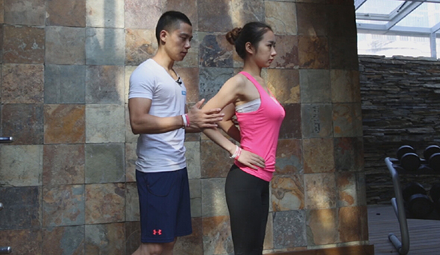

1.双肩下压，保持躯干的稳定；

2.搭档原地站立，双手叉腰，保持沉肩，收腹，轻轻推她的双手向内，由轻到重，她的整个肩部保持中立位，不要向前倾；

2.自然呼吸。

  

**三角肌中束**

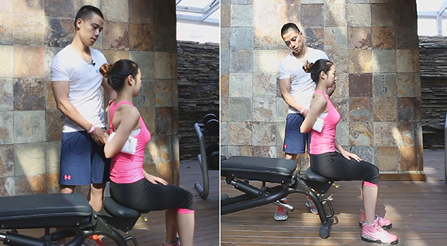1.双肩下压，保持躯干的稳定；

2.搭档坐在凳子上，用肘关节夹住毛巾（稳定肩胛骨），抓住她的手腕，轻轻向后提拉，手肘贴近身体；

3.自然呼吸。

  

**肱二头肌**

****

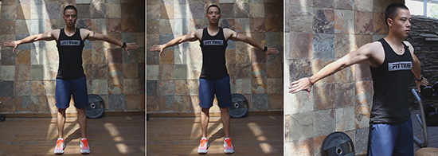

1.双肩下压，保持躯干的稳定；

2.双臂打开，翻转掌心朝后，胸腔打开，双手臂向后；

3.自然呼吸。

  

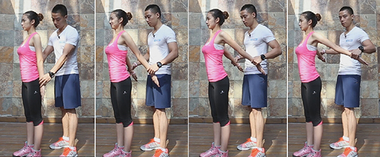

1.双肩下压，保持躯干的稳定；

2.搭档原地站立，拇指内旋，将她手臂轻轻向后向上抬，轻轻向外展开；

3.自然呼吸。

  

**肱三头肌**

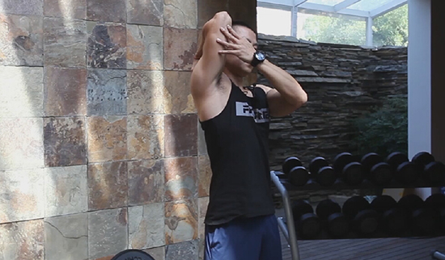

1.双肩下压，保持躯干的稳定；

2.一侧手臂放于肩部，保持肩部稳定，轻轻用另一侧手臂推拉肩部，肘关节向上；

3.自然呼吸。

  

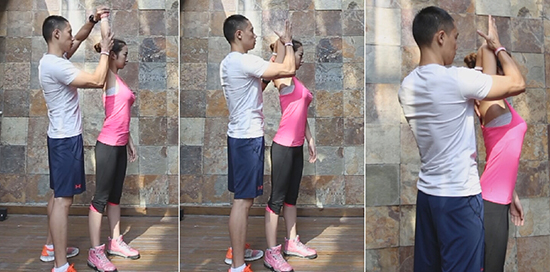

1.双肩下压，保持躯干的稳定；

2.训练搭档原地站立，单臂抬起，托住她整个肘关节，轻轻向后弯压，手肘贴近整个头部；

3.自然呼吸。

**  
**

**胸部训练前**  

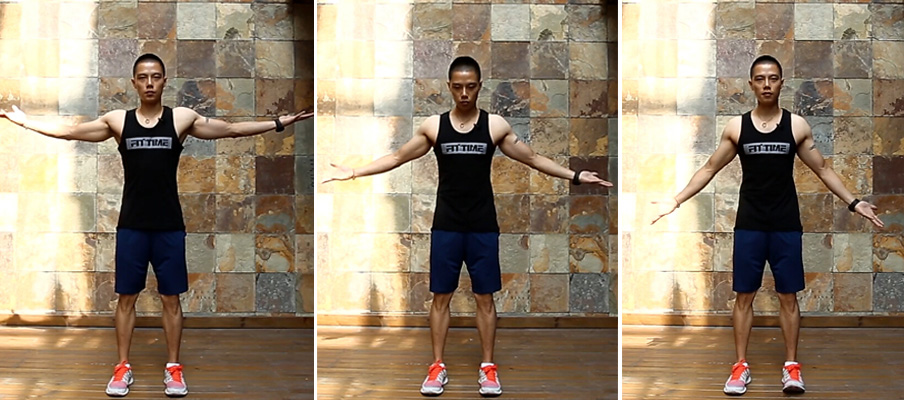

1.肩部下压，保持躯干的稳定；

2.掌心朝上，手臂端平，手臂打开后将整个胸廓向外打开然后还原，在上中下三个方向上激活胸部不同位置的肌肉；

3.自然呼吸。

  

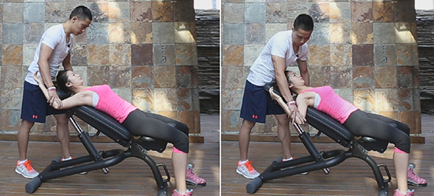

1.搭档伙伴仰卧在垫子上，将她的手肘向上举起，打开90度；

2.抓住她的肘关节，轻轻向下压；

  

**胸小肌**

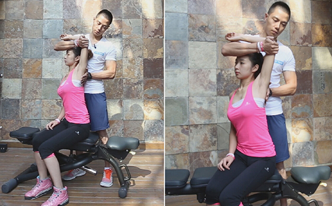

1.保持躯干稳定；

2.让搭档坐在凳子上，保持腰背收紧，将她一侧手臂抬起，抓住其肘关节，并按住她的肩胛骨保证稳定，提拉她的肘关节向外、向上；

3.自然呼吸。

  

**背部**

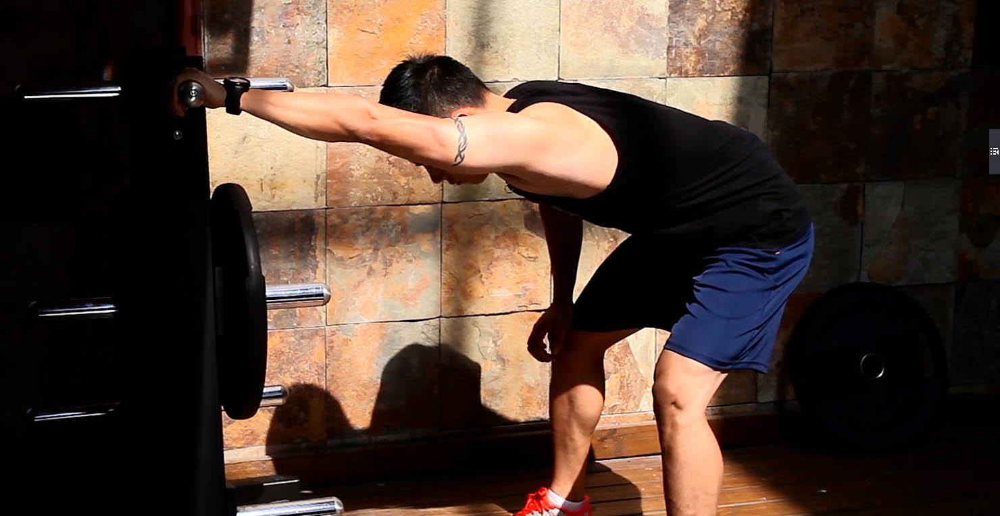

1.单臂抓住固定物,双腿打开,站距与肩同宽,臀部向后坐，手臂伸直；

2.先将身体向后拉，再把身体重心移向被拉伸一侧，最后耸肩充分激活肌肉。

**  
**

**下背部**

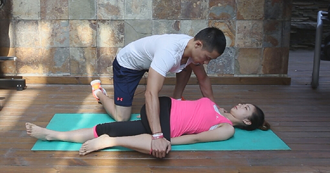

1.搭档躺在垫子上，抬起她的一侧膝盖，轻轻按压膝盖向下；让你的

2.手臂按住她的肩部，保证上肢稳定。  

  

**腹部**

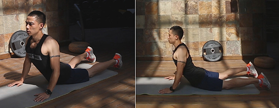

1.俯卧，双手放于身体外侧，轻轻将上身推起，肘关节微屈，试着将身体加左右侧旋转；

2.腹部完全放松。

  

**腰部**

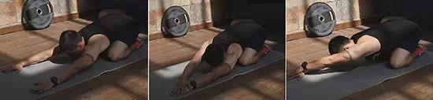

1.双腿呈跪姿，腹部收紧，腰部拱起；

2.双手臂向头顶远端延伸，将臀部尽量靠近脚后跟，背部充分伸展；

3.改变不同的方向激活腰部不同位置的肌肉；

4.保持自然呼吸。

  

****

**髂腰肌**

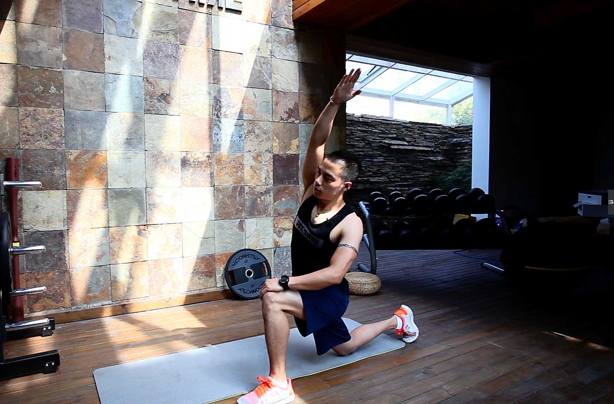

1.一侧腿膝关节着地，另一侧腿呈90度，保持身体呈中立位，将对应侧手臂抬起，贴近耳朵；

2.躯干不要过多前倾，膝关节不要超过脚尖；

3.腰部放松，躯干向外侧略微旋转

  

**臀部训练前**

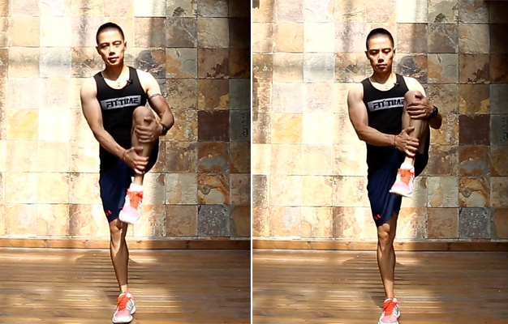

1.抱住膝关节，向上提拉，轮流交换腿，让双腿膝盖拉近自己身体；  

2.背部收紧，不要俯身向前。

  

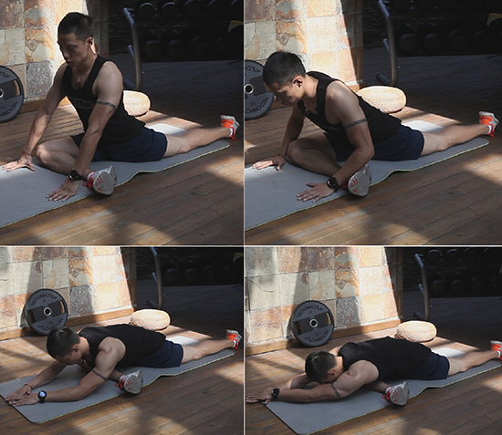1.前侧单腿呈90度打开，后腿伸直，脚面着地，保持身体呈中立位，面朝正前方；

2.向下俯身，双手臂向体前延伸，可以加上身体的侧旋。

  

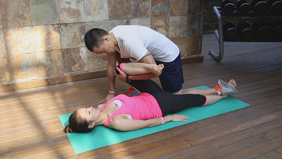

1.搭档仰卧垫子上，一侧腿抬起，手臂从下侧绕过，抓住她的膝盖，用自己脚腕压住她另一侧腿（防止她另一侧脚弹起），到位后轻轻下压；  

2.自然呼吸。

  

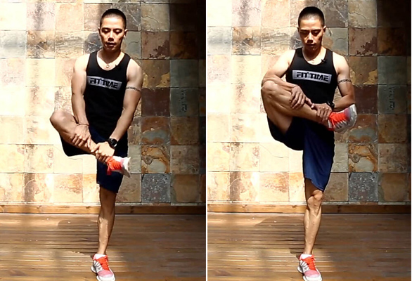

1.将一侧腿抬起，抱住小腿，试着把膝盖向上提拉；

2.保持躯干稳定。

  

**腿部训练前**

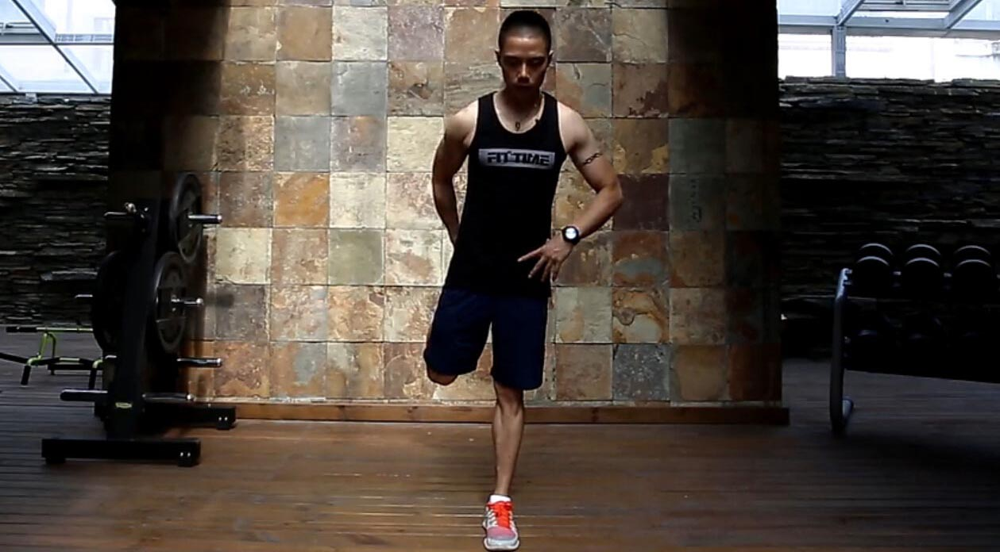

1.保持站姿，手握住踝关节，将脚后跟拉近臀部；

2.膝关节不要打开太多。

  

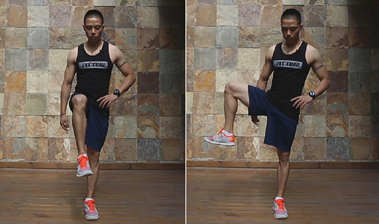

1.提起单腿，向外打开，收回；保持髋部稳定

2.保持髋部稳定。  

  

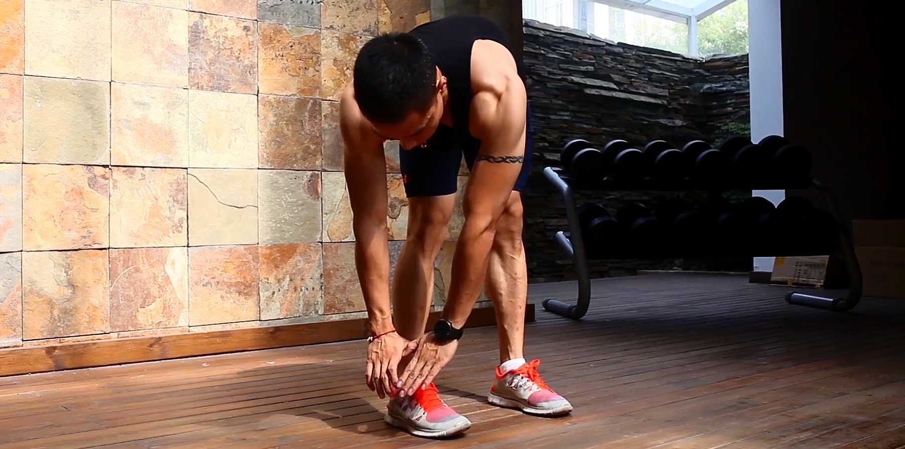

1.双腿与肩同宽，俯身向下，背部收紧；

2.双腿膝关节收紧，轻轻转动臀部。

  

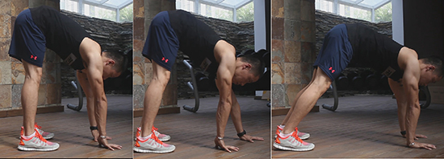

1.膝关节保持伸直，双手着地，向前行走，慢慢收回；

2.腰部肌肉略微收紧。

**  
**

****

**大腿外侧**

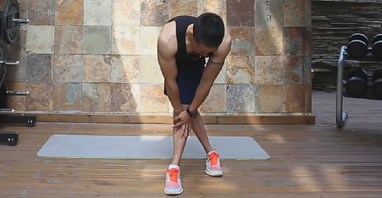

1.双腿交叉，重心在前侧腿，后腿踩实，收紧下背，适当向前俯身，身体前倾的时候腰部肌肉收紧；

2.为更好保持身体平衡，可以双手交叉放于支撑腿。

  

**大腿后侧**

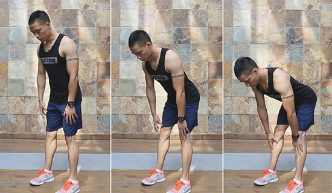

1.双腿站距与肩同宽,下背收紧,向下俯身；

2.将脚尖外撇或内扣，可以帮助我们拉伸到不同位置的大腿后侧肌肉

  

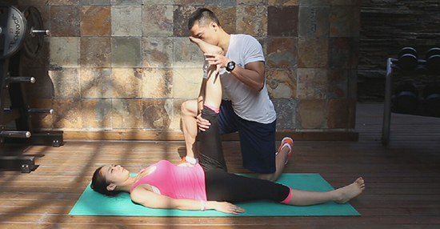

1.搭档仰卧在垫子上,一只手托住她的脚腕,另一只手扶住她的膝盖,轻轻上推；训练伙伴保持放松

2.自然呼吸。  

  

**大腿内侧**

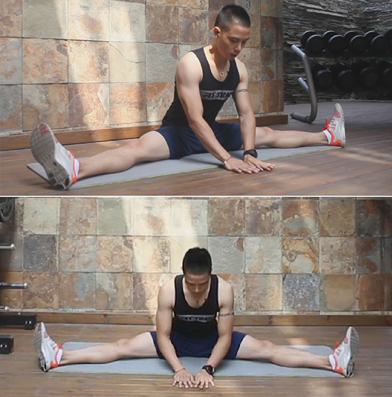

1.双腿打开，膝关节伸直，脚尖外旋，腰部肌肉收紧；

2.双手放于体前，调整呼吸，轻轻俯身向前，保持停。  

  

**股四头肌**

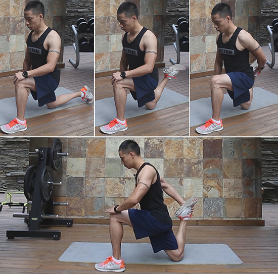

1.膝关节不要超过脚尖；

2.保持核心收紧；

3.握住踝关节上方；

4.变换小腿拉伸的方向可以帮助我们拉伸到大腿前侧不同位置的肌肉。

  

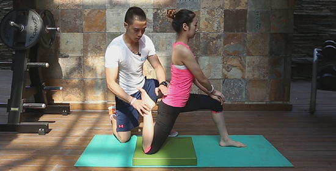

1.搭档后腿膝盖着地，保持髋部稳定，抓住她的脚腕，轻轻上推；  

2.试着将她脚腕方向适当改变，拉伸到大腿前侧不同的肌群；

3.核心收紧，身体保持平衡。

  

**小腿肌肉**

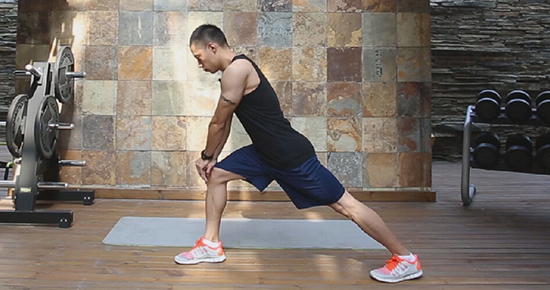

1.双腿开，背部收紧，双手撑于前腿膝关节上，后腿伸直；

2.后腿膝关节伸直，脚后跟不要离开地面。

  

**【更多精彩内容】**

**关注微信：rjfittime 点击“查看历史消息”**

  

**【火辣型男美女】**

**点击下方“阅读原文” 进入FT club**

  

  

阅读原文

阅读

__ 举报

[阅读原文](http://mp.weixin.qq.com/s?__biz=MjM5MjYxNzY2NA==&mid=206444141&idx=1&sn
=98554cfc54ed0dbcfe4affeb70f9362b&scene=1#rd)

