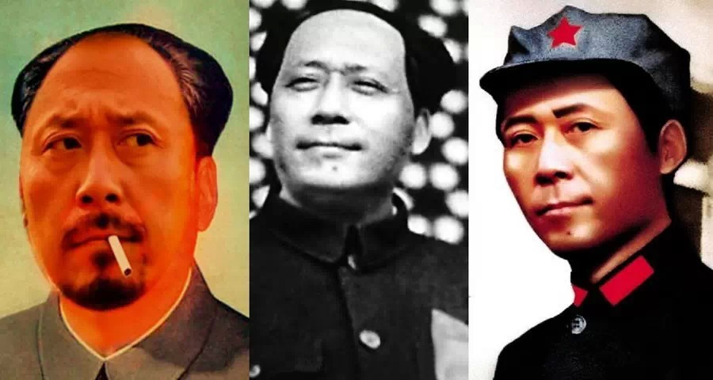

**想演好毛泽东，最重要的并不是形似，而是把握霸气。这个角度上，姜文无疑是最合适的。但他也有瓶颈，面对更具霸气的人物，或许就力不从心了。哪个人物能霸气的让人对扮演都心生绝望？——卡扎菲。**

  

**文/黄章晋**  

  

谁是中国最有男子气的演员，不少人会回答：姜文。姜文本人对此当然深信不疑，以至于他在《让子弹飞》中忍不住两次安排台词，让人夸自己“霸气外露”。在这部片子中，胡
军、邵兵这两位大陆著名硬汉影星，只是衬托姜文才是中国第一猛男的两片绿叶。

  

在《太阳照常升起》中，他请了黄秋生，在《让子弹飞》中，他又请来周润发，这两位都是香港影视明星中最具男性魅力的，如果有足够的人民币支撑姜文的雄心，没准我们将来
会看到渡边谦、梅尔•吉布森、布鲁斯•威利斯这类硬汉，在姜文的电影中咬牙切齿地赞美姜文“霸气外露”。

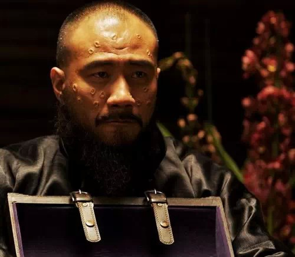

**塑造过不少正面英雄人物的演员胡军在《让子弹飞》中饰演一个戏份不多、憨傻莽撞的狗腿子**

  

霸气，集中体现中国人心目中男人形象。所谓霸气，除了高度以自我为中心，对他人形成压倒性气势的性格特征，还暗含一种无视乃至践踏既有规则、秩序、禁忌的侵略性姿态。
它是最直接、原始的雄性特征。

  

有强烈权力秩序的群居动物，譬如狮群、猴群、野鸡群中的雄性，就是这种类型。

  

但欧美和日本电影中，经典男性魅力明星，很少出现被一大堆绿叶衬托的霸气型形象。即使男主角形象阳刚十足而配角形象明显逊色，配角也常会不安分地挑衅一下他的权威。

  

霸气这种东西，可算是中国特产。

  

**【霸气的土壤】**

  

西方电影中很少出现配角故意以暗弱、阴柔、雌伏的姿态去衬托主角的英伟雄武睥睨天下，主角可以光芒四射，但很难霸气外露。

  

这种差别自然有历史传统的影响。最典型的类比，是群臣在中国帝王身边的身体语言，日本武士在大名诸侯身边的身体语言，西方贵族在国王身边的身体语言，三者完全不同。

  

尤其是后者，有些场合，在一大群表情傲慢的权贵当中，人们甚至很难通过身体语言看出他们各自的权力位阶，往往只能从服饰装扮的差别来分辨。

  

封臣可以在领主面前作雄武状，自然要允许附庸在自己面前作英武状，最后，整个社会的精英阶层固然都英武了，却无人可以称得上霸气。毕竟，霸气要有周围的配合，没有金正
恩身边低头做笔记的高级干部，金正恩就没有睥睨天下的领袖霸气，最多只是个喜欢叉腰挺胸的胖男孩。

  

日本武士在领主面前，既不能像欧洲同行那样趾高气扬，又完全不似中国职业文官在上级面前一味雌伏阴柔，虽然身体语言能明显分出位阶高下，但日本武士强烈的自我克制文化
，严重压抑了自我张扬。

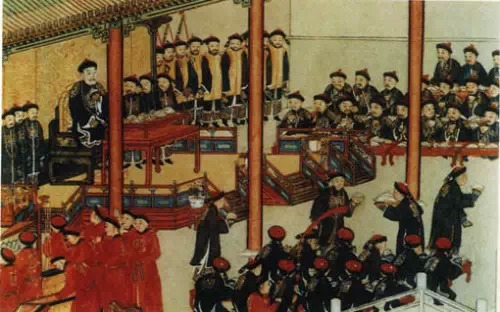

**乾隆紫光阁赐宴图（局部），为表忠心，大臣们需要跪着把膳用完**

  

中国则不然，只要是一个由权力、地位不对等人群构成的场合，每个人的身体语言必然会把这种地位落差淋漓尽致地表现出来。见到君王，中国人的膝盖会自动打弯。

  

不过，中国君臣之间的身体语言，并不一贯如此。刘邦刚当皇帝时，为了争功，臣僚甚至在大殿里骂骂咧咧拔剑击柱，宋代君臣还可坐在椅子上对谈，清代大臣只能跪地口称奴才
。

  

如果让中国皇帝看到描绘1871年普鲁士国王加冕德意志皇帝的油画，除了向德皇敬礼的下级军官，其余那些站得笔挺、趾高气扬的贵族，统统该以大不敬之罪拉出砍头。

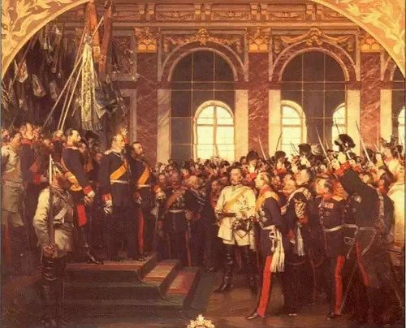

**威廉一世在巴黎凡尔赛宫镜厅加冕德意志皇帝**

  

不过，欧洲贵族虽然会让人有不分场合地趾高气扬之感，但他们还有自我克制的另一面，并非时刻以咄咄逼人之态凛人，而且地位优越者，往往自我约束和讲究的规则也越多，没
有这种克制，很容易变成火力四射的芮成钢。

  

这种克制，是一种与霸气截然不同的姿态和特征。霸气的典型特征是对他人的无视，对规则的藐视，而无论是贵族范还是骑士精神，对他人的尊重、对规则的重视和维护，甚至对
弱者和地位较低者的推定责任，都是其组成要件。

  

它孕育出的最奇特文化观念，是女士优先，甚至上升为这样的伦理：无论能否做到，危机时刻优先保护女人，而多数传统文化则与之相反：不可能强调女性优先，而且真出现某些
危险时，为保全女人的名节，常见的做法是授意其自杀。

  

今日欧美主流人群的精神面貌，很大程度上带有过去精英自我张扬和自我约束一体两面的印记，而日本古代精英阶层强自我约束、弱自我张扬的行为特征，同样深刻塑造了今天日
本人的集体精神面貌。

  

中国不缺霸气。一般来讲，到了乡党委书记这一级，在自己管辖的地面，必然是霸气全打开模式。所以，霸气与否，其实主要取决于身份地位。即便是平民百姓，周围觉得已经是
个人物了，他就可以梗着脖子直着嗓子拖着长音，慢吞吞享受被周围哄着供着的待遇。这种角色在北方话中，叫做“爷”。

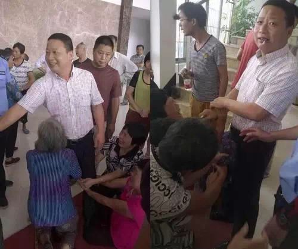

**2014年7月，浙江义乌工业园区，一名官员叼着烟卷笑对跪着哭诉的村民**

  

前文提到中国唯一保有男子气的行当——好汉强盗，霸气更是不用说，他们足够张扬，却又无须任何自我约束，比皇帝还霸气。

  

主流社会所有角色身份通常都有与之匹配的社会负责，即使是皇帝，而好汉强盗则无须承担任何社会责任。主流社会所有角色都有与之匹配的行为规则，皇帝不能说脏话，不能肆
无忌惮打饱嗝、不能当众放屁，不能随地吐痰，不能调戏良家妇女。

  

当然有人会举五代十国时石虎这种无法无天的暴君，但石虎本人是把皇帝像强盗头子一样看待的，他本质上该算强盗，不算皇帝。

  

好汉们才是真正顶天立地的霸气英雄，他们是狮群中的雄狮，野鸡中的公鸡。

  

但是，全世界最霸气的男人却不是中国人。

  

**【最霸气的人】**

  

如果一个人无论是与谁在一起，哪怕是与一群总统，他也完全是想怎么穿就怎么穿，想摆什么姿势就摆什么姿势，无论他去哪里做客，哪怕是去联合国开会，他说，老子就是想住
帐篷，不然不去！他什么都敢干，不爽了，炸架民航玩玩……

  

他毫无疑问是世界第一霸气男。

  

你猜到了，卡扎菲才是过去一百年来最霸气的男人。沙漠游牧部落的强者生存法则，很容易出现这种超级强人。

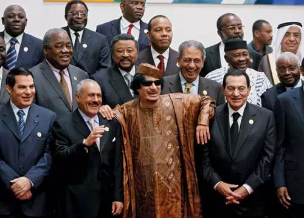

**2010年,非洲-阿拉伯联合峰会领导人合影。卡扎菲把双臂搭在埃及前总统穆巴拉克（右）和也门总统萨利赫（左）的肩膀上**

  

卡扎菲不仅霸气，而且还特别男人味，是原始的荷尔蒙四溅的男子气，他像头公骆驼一样，把男人的原始魅力演绎到了极致：

  

一位受命暗杀卡扎菲的美女刺客，在卡扎菲公开演讲时找到了绝好机会，在她举枪几乎顶着卡扎菲的太阳穴扣动扳机的一瞬，卡扎菲转过头来，在雄狮般的目光下，她手软了，爱
情无可救药地俘虏了他们俩。

  

对自己的霸气和男性魅力自恋到何等程度的人，才会制造这种离奇的故事。

  

中国最霸气的人，当然是伟大领袖毛主席。他可以在游泳池里对岸边穿着西装一脸尴尬的赫鲁晓夫谈笑风生，他可以拉住菲律宾马克斯夫人的手放在嘴边亲时不撒手，他不但在开
会时可以熟练使用拉屎、放屁、操娘这些群众喜闻乐见的词讲道理，还让“不须放屁”入诗词，让中国诗词有了通脱的新境界。

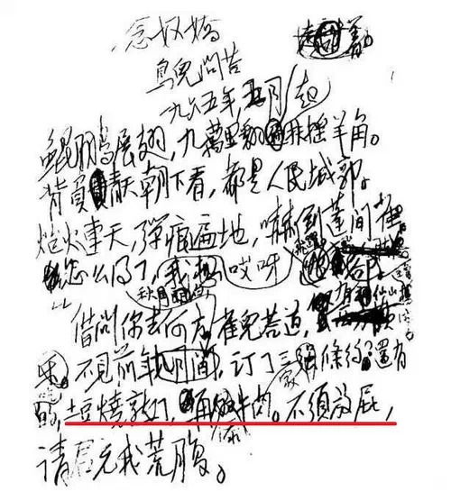

**《念奴娇**鸟儿问答》手稿，划线部分写的是“土豆烧熟了，再添牛肉，不须放屁”**

  

毛主席也不是从一开始就这么霸气外露的，他早年的字曾是中规中矩的颜体，重庆谈判时，曾因紧张不慎打碎过杯子，蒋介石不喜欢抽烟，他干脆戒了43天烟，与蒋介石合影时
他颇显拘谨，日后见到斯大林后更如小学生见到老师。

  

文革后的毛泽东才真正进入随心所欲的霸气巅峰境界，在九大这种神圣场合，为调节气氛，他开林彪的玩笑说“我推举林彪同志当主席”、“林彪同志当主席，我当副主席好不好
？”吓得林彪屁滚尿流。

  

1973年11月，毛泽东接见访华的基辛格时开玩笑说中国女人过多，“让她们去你们的地方，她们会制造灾难。那样你们就会减轻我们的负担”，“你们想要我们中国的女人
吗？我们可以给你们一千万。”助理外交部长王海容和基辛格表示这个玩笑传出去不好，毛回答说“我什么都不怕”。

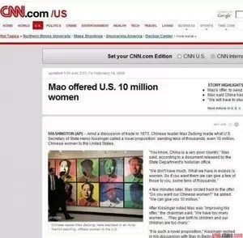

**外媒对“一千万中国女人”的报道存档**

  

然而，无数人扮演过毛泽东，而且古月这种外形与毛泽东酷似的特型演员甚至注意到毛泽东抽烟时，不喜欢弹烟灰这种细节，但他们演绎的毛泽东，最多只相当于从警卫员回忆中
概括提取的符号化和皮相的毛泽东。

  

这并不令人意外，演员水准和理解力只是一方面，重要的是导演、编剧们试图塑造的凡人化的毛泽东，原本就是另一种神格化的空洞符号，这使得大屏幕上的毛泽东，一举一动都
像是县文化馆话剧团排演的角色。

  

要真正演好毛泽东，演员本人至少必须具备两个要件，一、对中国近代历史和毛泽东本人，有强烈兴趣和个人理解力；二、重要的性格特质与毛本人具有高度内在相似性。

  

同时具备这样的条件，几乎是可遇不可求的，而没有这两条，如果有好的剧本、导演，也能拍出至少比已有更好的毛泽东，但中国居然还真有这样的人。

  

**【当然是姜文】**

  

可以举出很多姜文与毛的不同，甚至是截然相反的地方。

  

姜文属于少数散发着骚哄哄男性荷尔蒙气息的异类，对女性有极大杀伤力，这点他颇像卡扎菲；毛泽东则刚好相反，史沫特莱就曾说过，她非常不喜欢毛身上阴郁的女性气质。

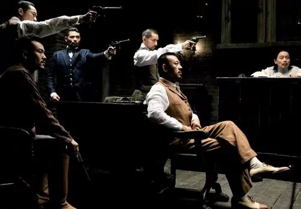

**《让子弹飞》剧照**

  

两人的声音最能显示这种对比：毛的声线尖细、高亢，近女声，而姜文低沉浑厚的声线属于高荷尔蒙型。

  

毛属于情绪波动易怒型的性格，史沫特莱口中“阴郁的女性气质”或许还指毛长于记恨、敏感、多疑，这与姜文的性格中明朗豁达的成分明显更多也完全相反。总之，两人在某些
性格特质上，恰好处于两端。

  

但这些都不重要，重要的是，姜文本人张扬恣肆的自我意识，与毛泽东高度匹配，他们俩大概是世界上最崇拜自己的人。姜文的见识和创造力，在他的中国同行中算是异类，他似
乎是中国大陆唯一不依赖苦大仇深的题材便能（偶尔）达到国际水准的电影人。

  

早些年，姜文曾放话他才能演好毛泽东，没有花足够时间研究毛，他大概不会说这样的话，姜文在某些电影中对细节的把握能力，应该相信他暗中做家庭作业的水平，至少目前没
有任何理由拿陆川这种头盖骨有两寸厚的人的大话来看待姜文。

  

今天很多关于姜文是“毛粉”的说法，并不适于用来证明姜文是否适合演毛。姜文迄今表达出的对毛的喜好，与典型意义上的“毛粉”有本质区别，后者通常特指对特定社会形态
的迷恋和追求。

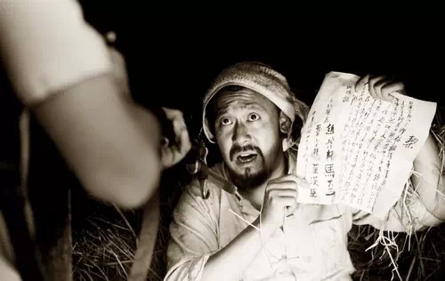

**《鬼子来了》剧照**

  

姜文对毛的喜好，首先带有出身和年龄的共性特征：军队大院子弟的青春期美好回忆。一位网民曾说过一句了不起的话“我不会因为我的青春摇曳在狗日的年代，多年以后就觉得
那个年代就不是狗日的”，只是，很少有人能做到这一点。

  

属于姜文个人化的喜欢，第一层应该对同类的喜欢和赞赏。姜文是极少数多年来只享受崇拜和仰望而罕遭批评的导演。除了才气，中国男人身上普遍缺乏的彪悍、热烈，张扬，却
在他自我塑造的形象中体现得淋漓尽致，如此稀罕而又极度自我的人，在亿万宠爱中当然会进化成影视界的卡扎菲。

  

举个不恰当的例子，或许能形容他对毛的喜欢和赞赏——丘吉尔虽然远比罗斯福更仇恨苏联，但他这种骨子里就是独裁者的民主国家领导人，却对斯大林青眼相加。

  

第二层则应当是审美共性的契合：拍出《太阳照常升起》、《让子弹飞》这两部片子的姜文，是精神上离毛泽东最近的姜文：无节制的轰轰烈烈、热热闹闹的酒神狂欢型场面，在
审美上与毛导演的中国社会运动完全一致。

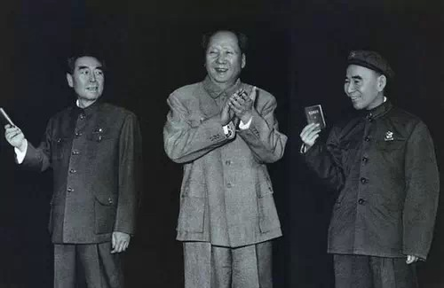

**1968年，毛泽东和林彪、周恩来接见军队代表**

  

而毛和姜文的同行，都罕有这种强烈即兴狂欢美学的作品。有趣的是，它们都是极度自恋的产物，这种强化自我崇拜的作品，不但让他们迷狂，而且认为老百姓肯定喜欢，必须喜
欢。

  

如果没有差评如潮的《一步之遥》，按理姜文已到了适合拍毛泽东的时候。

  

姜文接见记者时假装亲民的答非所问、天马行空式的谈笑风生，真是九大之后伟大领袖的附体；而陈道明、王志文接见记者时，则是斯大林式的冰冷粗暴。相比姜文强大的文化自
信，后者显然在努力想象自己被好莱坞大牌附体。

  

长者那句话送给陈、王非常合适：（姜文）比你们不知道高到哪里去了。

  

如果姜文自导自演毛泽东，它肯定不会是旨在强化某段历史集体记忆的作品，所以，历史本身不是重点，姜文心中毛泽东最令他印象深刻浓郁的部分才是，它的内在张力，不来自
历史事件，来自毛本人。

  

它当然会极具争议，但值得期待，无论姜文拍出多少部《一步之遥》。众所周知，姜文今天不可能有这样的机会。也许有生之年，我们能等到。

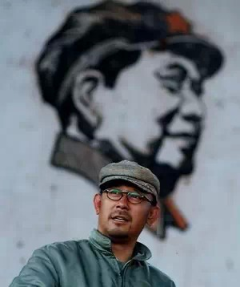

  

**版权声明**

****大象公会所有文章均为原创，****  

****版权归大象公会所有。如希望转载，****

****请事前联系我们：****

bd@idaxiang.org

****知识 | 见识 | 见闻****

阅读

__ 举报

[阅读原文](http://mp.weixin.qq.com/s?__biz=MjM5NzQwNjcyMQ==&mid=209326565&idx=1&sn
=ad47ee5401921854c0b05490c3b06eed&scene=1#rd)

