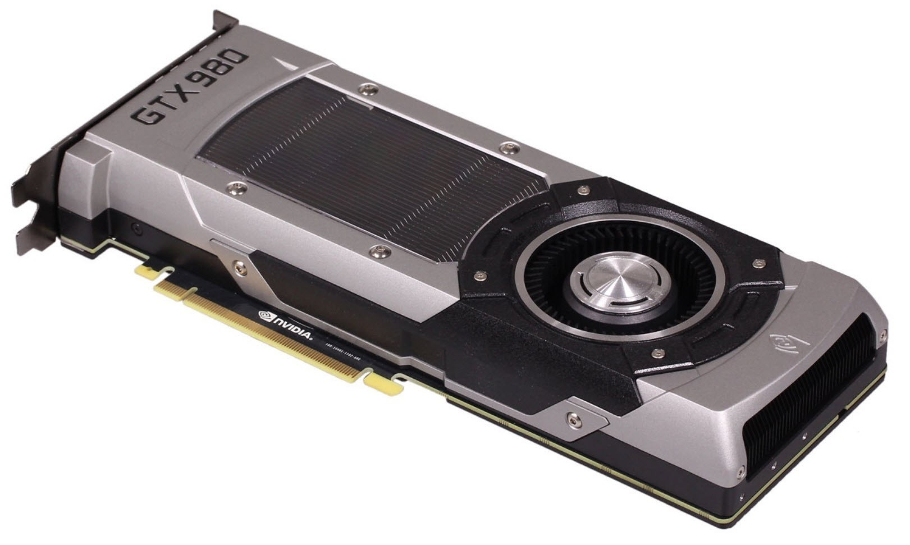
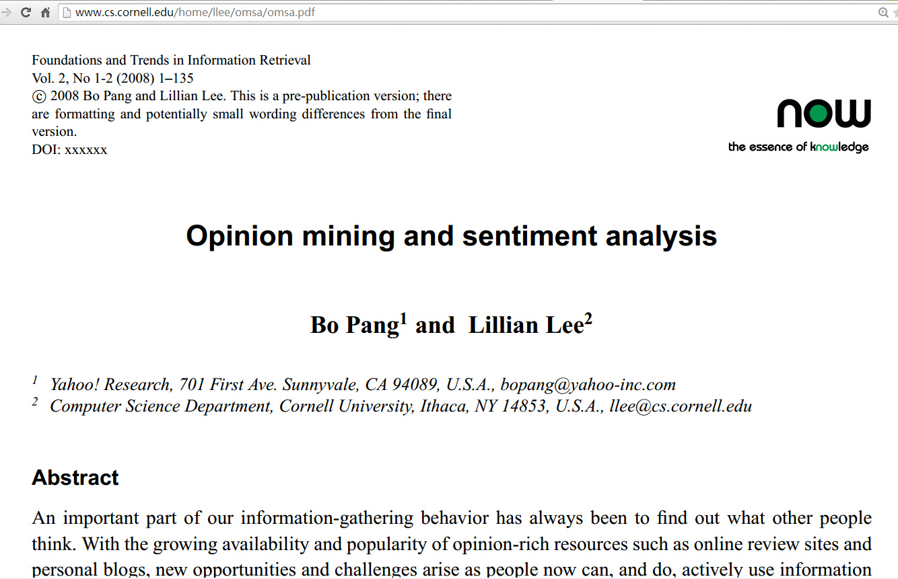
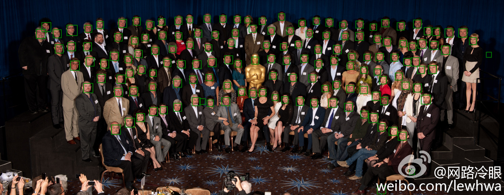
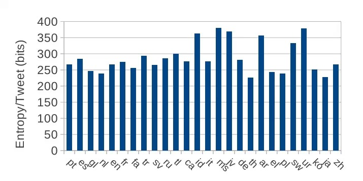

更多相关微博看加长版 http://memect.co/ml-list-2014-12-25 (32条最新动态+焦点, 25条温故知新, 1条触类旁通)

  

@好东西传送门 出品, 过刊见 http://ml.memect.com

订阅：给 hao@memect.com 发封空信，标题是 " 订阅机器学习日报 "．

  

  

  

**开源力量** 2014-12-25 23:30

【推荐系统之协同过滤的原理及C++实现】http://t.cn/RZPonAp

推荐系统

  

  

**eNe14** 2014-12-25 18:58

#免费电子书# Bo Pang & Lillian Lee 【Opinion mining and sentiment
analysis】http://t.cn/SPMOKUFoundations & Trends in Information Retrieval. 2008
EMNLP'02的情感分析[Thumbs up?: sentiment classification using machine learning
techniques]和评论数据集的引用也是很高

资源 自然语言处理 Bo Pang EMNLP Lillian Lee

PDF 会议 情感分析 书籍 信息检索

**  
**

**  
**

**网路冷眼** 2014-12-25 09:08

【ccv：一个现代的开源计算机视觉函数库】http://t.cn/RzFswmv
是一个利用此函数库进行人脸识别的应用实例。ccv的开发以应用为驱动，集成了视觉处理最现代的算法。GitHub托管地址：http://t.cn/aDs5jY
强烈建议搞视觉处理的童鞋收藏！@2gua @好东西传送门 @百度技术沙龙 @伯乐头条 @52nlp

视觉 代码 算法

**  
**

  

**  
**

  

**赵开勇** 2014-12-24 23:14

把几年前写的CUDA入门的博客整理了一下，有兴趣的朋友可以作为入门的材料《GPU的革命》文章整理 - OpenHero 开勇 - 博客频道 -
CSDN.NET http://t.cn/RzsjQCF

GPU 博客

  

  

  

**好东西传送门** 2014-12-25 18:32

一条推文包含多少信息？Graham Neubig和Kevin Duh在How Much Is Said in a Tweet？http://t.cn/RZP
zrPU这篇论文里用信息论分析了十几种语言的短消息。英文每字符3.3bit，中文每字5.2bit，中英文推文每条都是大约260bit信息（中文推文的平均短些
）。单条推文信息量最大的语种？马来语（370bit）！

Graham Neubig Kevin Duh 会议

**  
**

**好东西传送门** 转发于2014-12-25 18:54

文章还比较了Twitter和Wikipedia上各语种单字的信息熵。几乎所有语言Twitter上的单字熵都高于Wikipedia，但中文则相反。是不是说明中
文推文更灌水呢？[思考]

  

阅读原文

阅读

__ 举报

[阅读原文](http://mp.weixin.qq.com/s?__biz=MzAwNDAxNTg4NA==&mid=207263965&idx=1&sn
=bcf57e008fa315d0a9d7e620b4a71bec&scene=1#rd)

