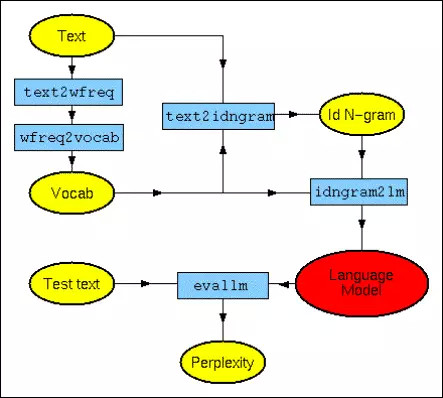
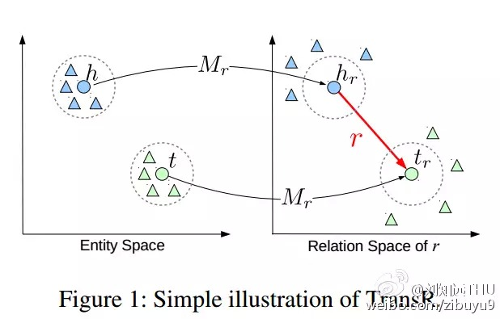

##  机器学习日报 统计语言模型

_2015-03-03_ 好东西传送门 好东西传送门

**好东西传送门**

awesomeport

“好东西传送门”为您精选专业知识，提供大数据，机器学习，Web技术等方面的前沿精华信息。

__ __

### 机器学习日报 2015-03-02

  * VALSE视觉与学习青年学者研讨会视频

  * Why word2vec works

  * LIBFFM场感知分解

  * 我们是这样理解语言的-2:统计语言模型

  * TransE、TransH和TransR全部开源

  

@好东西传送门 出品, 过往目录见 http://ml.memect.com

订阅：给 hao@memect.com 发封空信， 标题: 订阅机器学习日报

  

**视觉机器人** 2015-03-02 18:27

会议活动 视觉 活动 教育网站 李学龙 潘纲 山世光 颜水成

VALSE是山世光教授（博士、研究员、博导）等发起的一项研讨会，主要目的是为计算机视觉、图像处理、模式识别与机器学习研究领域内的中国青年学者（以70后和80
后为主）提供一个深层次学术交流的舞台http://t.cn/Rv0OrRG，历次QQ群活动信息：http://t.cn/RZYzl2v，技术分享视频列表：h
ttp://t.cn/Rzq9yxs

  

**视觉机器人** 转发于2015-03-02 18:37

“2011年初，山世光、潘纲和刘青山共同讨论了发起一个视觉与学习领域华人青年学者研讨会的想法，之后该想法得到了颜水成、李学龙、徐东等青年学者的大力支持。”
视频列表里有好多paper指导，专题分享 @西瓜大丸子汤 @好东西传送门

  

  

* * *

  

**爱可可-爱生活** 2015-03-02 15:35

自然语言处理 论文

[论文]《Random Walks on Context Spaces: Towards an Explanation of the Mysteries
of Semantic Word Embeddings》(2015) S Arora, Y Li, Y Liang等 http://t.cn/RwHPhwf
用对数线性生成模型为word2vec等word embedding方法寻求合理解释。简化版解释一篇:《Why word2vec
works》http://t.cn/Rw6jNo6

  

  

  

* * *

  

**爱可可-爱生活** 2015-03-02 14:31

算法 教育网站

[开源] LIBFFM: A Library for Field-aware Factorization Machines
http://t.cn/RwOYrFu 场感知FM，又一开源FM实现(C++)，FM可对任意实值向量进行预测，可看作自动的特征选择/组合方法。 云:http
://t.cn/RwTDt5S关于FM的更多内容可参见上次介绍的libFM:http://weibo.com/1402400261/C3VoTBv7X

  

  

* * *

  

**火光摇曳Flickering** 2015-03-02 12:50

算法 自然语言处理 神经网络

[我们是这样理解语言的-2]统计语言模型 | 火光摇曳 http://t.cn/RwTmDWu 旧文重发，系统介绍了 N-Gram
语言模型的数学表示、效果评估、模型平滑及模型训练（尤其是分布式），为后续介绍神经网络语言模型和序列标注技术打个好基础。

  

**王利锋Fandy** 转发于2015-03-02 13:11 回复 @Copper_PKU “转发微博”

几年前的文章，整理发出来了，接下来会有我们组的 @Copper_PKU 撰写神经网络语言模型文章会发出来~

  

  

* * *

  

**刘知远THU** 2015-02-01 13:21

会议活动 知识工程 资源 AAAI PDF 代码 会议 教育网站 林衍凯 知识库 知识提取

TransE通过h + r = t的目标学习知识图谱表示，效果引人关注。最近我组林衍凯同学针对TransE对1-N、N-1类型关系效果不佳的问题，提出Tra
nsR将实体映射到不同关系空间中构建优化目标，效果最高比TransE提升近20%。论文 http://t.cn/RZSpha8
，实现TransE、TransH和TransR全部开源：http://t.cn/RZe9of4

  

**刘知远THU** 转发于2015-03-02 18:29

这篇论文除了将TransE、TransH、TransR代码开源以外，现在还将第3个实验使用的数据集 FB40K 公开：http://t.cn/RwHqAmh
，其他几个实验所使用的数据集获取方式（包括链接）也公布在项目主页上，http://t.cn/RZe9of4 ，欢迎大家使用。

  

  

* * *

  

关注“好东西传送门”，可以添加公众号awesomeport

  
点击【阅读原文】或【Read more】查看链接可点击的在线版  
↓↓↓↓↓↓

阅读原文

阅读

__ 举报

[阅读原文](http://mp.weixin.qq.com/s?__biz=MzAwNDAxNTg4NA==&mid=209957502&idx=1&sn
=392ad0283adf10f7ec6be6040ac80885&scene=1#rd)

