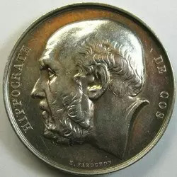

##  段宇宏谈<不必读经典>

_2015-03-12_ 大象公会 大象公会

**大象公会** 

idxgh2013

知识，见识，见闻。最好的饭桌谈资。知道分子的进修基地。

__ __

**文/段宇宏**

  

前不久，我跟大象公会总编辑黄章晋聊天时，随便说了句：“今天我们探索与求知，应该‘去经典化’和‘去大师化’。”

  

我们生活中，的确到处充斥着“拜经典教”、“拜大师教”信徒，这句话无非有感而发。貌似这话却刺激了黄Sir萌动的心，诞生了这么一个系列选题，我也被委派了写稿的任
务，其实我真没做好写作此稿的准备，机会来得太突然，这也是个吃力不讨好的活儿。

  

关于经典与大师，我想先说点题外话，这并非不尊重经典与大师，而是想讨论下如何正确地看待经典与大师。

  

如果你深深地认同“今不如古”，你通常会赞同“经典”与“大师”是不可超越的，他们的学说是不可撼动的，那么就不必继续往下阅读了，如果你并非持有如此强烈的立场，或
承认人类总体是当代超越前代，那么尚可继续探讨。

  

在局部地区和某些时段，可能会出现退步甚至大倒退的情况，如中世纪中前期的欧洲与古希腊、古罗马时代比较；红色高棉时期的柬埔寨与此前时代比较……但总体而言，人类是
不断进步的，最近三四百年尤其明显，过去一百年人类所取得的成就，从所有指标来看，比此前100万年的总和还多N倍。

  

若今天的文明水平不如古代，今天的学科知识就不如古代“经典”，今天的学人就不如以前的“大师”，那应该是地球人的祖先过上比今天更先进的生活才对。

  

当然，近几百年推动世界现代文明进程的驱动力在西欧和北美地区，这个应该是必须承认的事实。人类进步的历史，就是不断否定（去魅）“经典”和“大师”的过程，这一点在
欧美自然科学与社会科学的发展史上，体现得再明显不过了，也是欧美学人们率先摆脱了崇古迷思。

  

先去除崇古心态，问题就容易讨论了，不崇古是指既不崇东方的古，也不崇西方的古。尊重前人在探索知识上的努力与贡献，但切勿将之神化，沉迷于“经典”与“大师”中难以
自拔，个人与社会的进步无从谈起。

  

今天的欧美生物学家、医学家会承认“医学之父”希波克拉底的历史地位，但恐怕没有任何人认为希波克拉底的“四体液说”是正确的，他的学说是不许挑战的真理，也无人会赞
同希波克拉底的医学知识比一个受过现代专业训练的护士更广博更靠谱。《希波克拉底文集》有文献价值但已经没有学习价值，除非研究医学史，实在没有阅读的必要。同样的道
理，一个学科两三百年前的奠基大师，在该领域的水平远不如今天的博士生，这应该是常识，只有这样才对得起前人啊。

  
**法国老银章上的希波克拉底头像。几乎所有医学生，入学的第一课都要学习《希波克拉底誓言》**

  

印度教保守知识分子宣称宇宙一切知识全包含在了几千年前的“吠陀经典”中，犹太教极端正统派认为，《摩西五经》和《塔木德》已经蕴含了宇宙所有真理，其它的知识没有学
习的必要。他们是极保守的宗教徒，有此表现人们通常能给予理解，但可能会在心中视之为古板和荒唐。

  

自然科学由于它尊重实证主义和可重复检验等原则的特殊性质，不崇古、去经典化、去大师化比较早形成了普遍共识，只要遵守学术共同体认可的方法，任何大师都可以推翻，任
何经典都可以否定。

  

可是在社会科学或人文学科中，要达成这个共识，在“文青哲青”主导的前现代的社会中有相当难度。“越古老越美好，越经典越正确，越大师越神奇”，仍是很多人追捧的观念
，“你这个大傻逼，怎么竞敢（居然、胆敢）去批评大师和经典，简直人神共愤啊”！只要稍加观察不难发现，但凡这种观念盛行的地区和族群中，对近现代人类文明几无贡献。

  

地球上还有一种在现代才出现的特殊社会，行政级别与权力大小代表着“学问”多少，只要级别到了，就是“大师”，级别混到最高，就是人类导师，写什么都是经典，哪怕只有
初小文化程度，也可指导政治、经济、文化、科学等各领域的发展，驾驭专业人士，这种社会要去经典化去大师化还得捅破两层铁板窗户，练了一阳指也未必能戳穿。

  

过去，每个时代都有它的经典和大师，文艺复兴前的欧洲，上帝是最大的大师，《圣经》是最牛的经典；文艺复兴后几百年产生了一系列新大师新经典，着实推动了社会的进步。
若只沉迷于之前的大师与经典崇拜中，则达芬奇、霍布斯、洛克、牛顿、休谟、李嘉图直至达尔文、韦伯等人及其著作，绝无产生的必要。

  

一个爱求知的古人，有亿万分之一的可能生活在公元前二、三世纪的埃及亚历山大，是地球上最幸运的人，这里有远古世界最大的图书馆，据说藏书最高峰时达50万卷（也有很
多历史学家认为可能不足5万册），其它地方的学人骑马乘船少则数月，多则数年才能来这里享用这些资源。

  

生活在中世纪欧洲大教堂附近也属万幸，通常那里至少会有千儿八百册藏书。如果你有机会突破身份与等级限制，能自由接触这些资源，在那个连贵族阶层的文盲率都高达8成以
上的时代，稍加用功就能成为大师，创造出经典。不错，那个时代很多大师就是教士。

  

“亚瑟王”在英国历史上的地位变迁就相当具有代表性，修道士们结合图书馆零星资料和民间传说，陆续写作了系列经典史书，把一个可能根本不存在的人一路拔高，从士兵逐渐
演变成骑士、贵族、君主、 神王，一度成为英格兰的民族图腾和王室象征，此后多代王族都声称自己是亚瑟王圣裔。（注：指公元800年左右，威尔士修道士南尼亚斯的拉丁
文经典《不列颠编年史》；11世纪时，威尔士教士蒙矛斯的杰弗里流行了几百年的经典——《不列颠诸王史》）

  

文艺复兴后，近代学科体系和研究方法萌芽，自弥尔顿大力质疑这些经典开始，亚瑟王地位一路走低，从神王慢慢还原为文学人物，当代英国学人只会把那些经典当作文学作品而
非史实来看待。这种对经典的推翻没有使英国人文化退步，反而树立了正确的民族观、历史观和世界观。若真存在亚瑟王，那也是抵抗英格兰人（盎格鲁—撒克逊人）入侵的英雄
，而非英格兰人的神王。

  

谷腾堡15世纪中期发明金属活字印刷术，加快信息传播速度，为现代知识体系的建立奠定了基础。不过从15世纪中叶到19世纪数百年间，印刷技术没有进一步的飞跃式发展
，一部《圣经》需要一个字母一个字排版，五年才能排完。

  

18世纪末工业革命完成前英国的民众识字率，男子为60%，女子为40%；当时世界最发达的西欧北欧，1800年成年男子也只有一半多点的人能够签名和简单阅读，女子
绝大部分仍是文盲；西班牙和俄罗斯等地区19世纪末才达到英国18世纪末水平。

  

不错，这就是人类启蒙时代最先进地区的情况。

  

那个时代，只要你家境过得去或有些独特际遇，稍加些努力，成为大师写出经典并不难。极少数贵族和精英们当时最高雅的娱乐，无非晚上围坐在大厅火炉边传阅和讨论新近的文
艺和哲学作品，绝大部分平民仍然与此无缘。那年头，基上冒出一个就大师，写出一部即经典。

  

工商业革命完成以后，随着城市化和公民运动推进，大众教育的普及，文盲被消灭了，图书馆和大学在发达国家像雨后春笋般冒出来，一个纽约公共图书馆如今就有馆藏资料53
00多万份，不算声像材料，藏书近1700万册。不管你什么阶层何种身份，均可自由遨游知识海洋之中。

  
**纽约公共图书馆一景**

  

由于获取知识的门槛大幅度降低，知识不再是稀缺品，“大师”与“经典”也急剧减少了，因为水平超越之前大师，能写作出比经典更优秀著作的学者，在大学和研究机构里已经
一抓一把，见多不怪了，成为大师和经典的门槛也大幅度提升。

  

即使五十年前的学者也绝对想不到，今天哪怕一个住地下室的屌丝，只要凭着一台电脑一根网线，就可以穿梭于全球各大图书馆、论文库、档案馆（若他有此兴趣的话），也可以
在自己的硬盘里建立非常庞大的私人电子图书馆和数据库，若是从前，没有相当可观的财富与房产，这是不可实现的梦想。五十年前一个学者在顶级图书馆要花数月才能完成的资
料检索和收集工作，今天的学者利用电子化便利，可以几天就完成。

  

上中学时，每逢假期就抱来一堆西方文学经典阅读（大多产生于启蒙时代至20世纪初），说实话，读得让人不想睡觉的其实是少数，但为了增加文艺修养，很多还是硬着头皮看
下去了，不过最后我却对很多经典失望。像列夫•托尔斯泰的名著《复活》，原本一件并不复杂的事儿，真不需要那么字儿来表述，当代一家西方大报的万字特稿就可以把这事儿
说清楚，并且因为技法更先进，水份更少，会更加生动和精彩。

  

我也发现，同样18至20世纪，自由市场经济发达的国家，如英美作家的书就比较有趣，因为知识更普及，生活节奏快，新闻出版市场发达，写作技法高明，知识与信密集型作
品方能脱颖而出；俄罗斯这种生活节奏慢的欧洲落后国家，其作品普遍有冗长沉闷的特征。当然，这种品味自然让喜欢《尤利西斯》这类作品的读者瞧不上眼，我也承认我笨，看
不懂，那种作品对我来说是催眠读物。

  

不过，我倒更加钦佩《指环王》、《冰与火之歌》这类作品，作者托尔金、乔治•马丁构筑起一个庞大的体系，所拥有的历史、地理、语言、宗教等知识，非前一代大师可企望。
这样的作者和作品，需要文明高度发达并积淀到一定程度才能产生。

  

当代欧美媒体的特稿为什么没成为普遍崇拜的经典，作者没变大师呢？

  

上世纪九十年代初，工薪阶层还领着两三百元工资，手持一台大哥大，别人会觉得你是老板，带两台大哥大，是大老板，带七八台大哥大，还是令人羡慕，倒卖大哥大的有实力老
板；今天你拿一台Iphone6，没谁关注你，带两三台Iphone6只能显得你比别人更忙，混身挂上八九台iphone6，别人会以为你是水货客。

  

这就是时代、知识、技术进步带来的“见多不怪”。

  

按中国人的熟知程度来说，我们所顶礼膜拜的西方大师多为启蒙时代至20世上半叶的，这是个有趣的现象，与社会发展水平落差导致的传播、出版、学术滞后有关。

  

其实现代学科体系及研究方法的萌芽与定型，是相当晚近的事儿。19世纪前还没有任何社会科学存在，此后它也只是处于不断的成型状态。

  

英语中泛指多个学科门类，作为复数词的“社会科学”(Social sciences)，直到19世纪晚期才出现在美国。但是此前始终存在着知识精英对政治、财富、人
口、心灵等各方面的思考与论述，这种奠基作用不可否认，如1644年约翰•弥尔顿的《论出版自由》、亚当•弗格森1767年的《论公民社会的历史》，1771年约翰•
米勒的《等级差别的起源》，亚当斯密1776年的《国富论》、孔多塞1890年代的《人类思想进步的历史图影概览》。

  

直至19世纪末，社会知识是松散的和非系统的。研究社会科学史的美国约翰•霍普金斯大学教援多萝西•罗斯认为，现代学科的形成即使在20世纪也是逐渐的，有时候是非连
续性。现代学科体系和研究方法真正的定型与普及，主要还在二次世界大战以后（首先在发达国家）。

  

现代学科定型之前，可以说哲学家简直成为包打天下的全能者，什么都能跟哲学沾边，自然哲学、政治哲学、历史哲学、经济哲学、法律哲学……而且一位“大师”基本上是“通
才”，有的大师可以把上面所有领域都涵盖了。

  

启蒙时代至工业化初期，哲学家影响精英，文学家（时评家）引领大众，造就了庞大的文青和哲青群体，这是前现代社会的重要特征。这种时代还有个特性，各派大师与其拥护者
们，喜欢用全称判断（调研、统计、概率管它干甚），敢于下结论，都认为自己常握了真理。20世纪中前期随着市场经济进一步繁荣，城市化进一步提高，西欧国家大众媒体和
大众文化强势崛起，文体明星、畅销书作家、企业家、议员逐渐抢占了他们“人民心灵导师”的市场份额，很大一部分哲学家和文学家，转而亲睐苏联、纳粹德国和法西斯意大利
，跟强烈的失落感有关。

  

学术越发达，学人越谦逊，知识越多，人们偏见越少，大师与经典也慢慢变成了稀缺品。以前一位“大师”可以一人写作几十本大部头的著作，涵盖各个领域，天上懂一半，地上
全都懂。当代的剑桥和牛津大学，若要出版一部《英国通史》，很可能不同章节，不同内容（政治、经济、军事、文化、科技）分配给不同的学者来写，体现出一种专业主义精神
，因为历史学不但早就从哲学中分离出来，而且衍生出分支学科，也逐渐融合了其它学科的研究成果与方法。

  

学术的现代化还使人们不断克服前人的偏见与无知。17世纪末，英国粮食平均亩产量猛增，这当中虽然有耕作技术进步的因素，但明显不是主因，早期的学人曾从哲学、法律、
经济、宗教、政治各种角度来论述，但都有漏洞，争执不休。最后，现代生物学引入农业史研究，终结了争吵：英国农民从圈地运动开始广泛养殖牲畜，为了提高牲口营养，大量
种植豆科植物作为饲料，豆科植物具备超强的固氮功能，使土壤在百年之后变得异常肥沃。

  

18世纪90年代，英国农产品市场上谷物涨价，弗雷德里克•伊甸爵士撰写了著名的三卷本调查录——《穷人之国》，仅从这本经典中描述的英国各地很多工人家庭的收入与生
活来看，英国真是人间地狱，而工业革命开启了通往地狱之门，很多哲学家、文学家和时评人根据他的著作发表了无数反现代性的感慨和结论。伊甸爵士实地调研，比起纯动口的
哲学家和时评家，已是很大的进步，但仍有其时代局限。

  

现代历史学家们通过对欧洲中世纪到19世纪初庄园账册、市场物价资料、工厂薪资表、家庭购物单等等一切档案的详尽搜集（包括利用考古成果），大量的归类整理（或电子化
后建成数据库便于统计与搜索），甚至对不同地区工人家庭燃料使用、食物结构、卡路里摄入量进行了统计，否定了伊甸爵士的结论：若工业革命时代英国工人与中上层社会生活
比较，当然显得贫困，但是与此前几个世纪和同时代欧洲国家平民比较，他们却普遍工资最高，营养最好，是巨大的进步。比如根据1800年左右的兵役档案统计发现，英国士
兵当时平均身高1米72，为欧洲最高，法国是1米65，没有收入和营养上的巨大进步，这是不可能出现的情况。

  

法国启蒙时代的大多数哲学家都认为：“一个政府让其统治下的公民人数繁殖和增长越多，无疑是好政府”，今天你还觉得这是正确的吗？当代尼日尔、尼日利亚、索马里、阿富
汗等贫穷国家，出生率位居世界前列，人口不断暴增，而你要想在出生率排名榜上找到德国、新加坡、台湾、日本、奥地利……得从排名的倒数开始找。

  

马尔萨斯认为，因为人类无法节制性欲，人口不断暴增，食物日益短缺，会陷入无休止的贫穷、战乱、饥荒之中。马尔萨斯的时代，法国人口2900万左右，大部分人仍然生活
贫穷，现在的法国有6300万人口，却是世界上高度富裕的国家。今天的美国，用不到3%的农业人口，不仅养肥全美人口，还是农业出口大国，全世界到处出售、援助粮食。

  

当代社会科学专业主义的强化，分工的精密，研究技术与方法的进步，与启蒙时代甚至与20世纪初相比，相当于世界最大军火公司美国洛克•希德马丁集团与牛家村鞭炮作坊的
差别。

  

说到这应该明白，如果我们沉迷在一二百年甚至几千年前的大师与经典中拔不出来，你的知识体系就无法与当代接轨，还将保持着多少偏见！我们应该相信的是现代学科的研究方
法，而不是膜拜大师与经典。

  

西方的作品传到非西方社会时，到底谁能成大师，谁会是经典，受到很多因素影响。

  

输出国的国际影响力——哪些国家处于世界强势地位，来自他们作品的译介和出版就比较多，人们心目中的大师和经典就多。

  

也与作者及作品的知名度有关，但往往知名度不与水平成正比，这涉及到作者是否填补了研究空白（这类著作有开山之功，但水平远不及后继者），是否更多介入公共事务，是否
得到欧美媒体推介，在学界和媒介是否人脉广泛等诸多更复杂原因，这些原因对输入地翻译界、出版界、媒体界选择自然有影响。

  

比如研究中国政治与历史，欧美汉学家水平跟日本、中国学者相较，通常是小学生与大学生的差距，但前者常作为大师被热捧，后者却默默无闻。同样是西方学者，研究中亚、东
亚问题，日本、德国、俄罗斯的学者很多比英美学者要靠谱，但后者可能更有名气，被译介得更多。

  

一位学者坐着冷板凳，埋头搞研究，其研究之精细与广博可能让人叹为观止，但可能他在大众中的知名度，不如经常介入公共事务，在媒体写时评的某同行的万分之一，若不被媒
体挖掘出来推介，顶多只能在专业读者小圈子被人知晓，那么后者及其作品很可能就作为大师和经典被后发国家译介出版了。

  

利奥波特•冯•兰克（1795—1886），代表作有《从1494年至11535年拉丁和日耳曼民族的历史》、《罗马史》，其中《罗马史》是现代研究古罗马的奠基性作
品，现代实证史学的第一部著作。兰克是提倡科学方法研究历史的创始人，西方客观主义历史学派之父，将古典哲学和法学研究中的批判主义方法扩展到近代欧洲史领域。19世
纪后半期，西方学界开始对兰克的科学编史学模式进行效仿，并在英、美、德、法获得了规范性地位。兰克在学术史上地位相当重要，因为前述缘由，知名度远不如同一时期的诸
多启蒙学者，但他的著作今天也没有多大的阅读价值。

  

所以我更常使用的是“优秀著作”，而不想用带有膜拜意味的“经典”一词，即便我现在最喜欢的优秀著作，随着研究水平的不断提升，该被超越就应被超越，该被否定就可被否
定。

  

**版权声明**

****大象公会所有文章均为原创，****  

****版权归大象公会所有。如希望转载，****

****请事前联系我们：****

bd@idaxiang.org

****知识 | 见识 | 见闻****

阅读

__ 举报

[阅读原文](http://mp.weixin.qq.com/s?__biz=MjM5NzQwNjcyMQ==&mid=211387104&idx=2&sn
=4d96cae0dacaf9488cdf922029d40c35&scene=1#rd)

