##  每天坚持做什么（一小时左右）可以让英语水平在一年半载内得到大幅提升？

_2015-01-27_ _Bart_ warfalcon

  

前几天在知乎上看到 @Bart 的回答非常精彩，他的个人经历正好把以前在文章中提到的 时间记录、透析法、Quora
等多种方法综合到一起，并给出自己心得、体会让你体会坚持读原著和时间记录能让你得到多大的收获。

他在文章中推荐由Stephen D Krashen 所著的《Principles and Practice in Second Language
Acquisition》 闻名以久了，有能力阅读的一定要去看一下。

本文已经经过@Bart
的同意，在微信上跟大家分享。希望大家别只停留在阅读上，多行动。文章中包括一些链接，已经点击文章最下面的【阅读原文】访问出处后，才能点击链接。

**注意：**

月初时在文章中提到过寻找赞助商提供奖品，已经搞定。感谢有道云笔记的大力支持，提供了100份奖品。

欢迎去年完成100天行动的读者，把你完成100天行动的心得体会写出来，有各种奖品赠送。

明天会有详细的奖品介绍和得奖规则出台，欢迎大家参加。

## 正文

作者：Bart

出处：知乎

地址：点击【阅读原文】

看英文原著，记生单词，数据说话：（多图^_^）

单词量容易量化，先说单词。2013年6月2日扇贝单词量测试为3900个，2015年1月1日为16700个。

  

2013年6月21日至2015年1月24日583天，记单词总时长为1431小时4分钟，平均每天花费2小时27分钟。 历次单词量测试数据，如下：

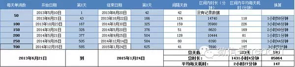

2014年11月23和11月24相隔一天数据波动有异常，原因是23日特别累、强打精神做的单词量测试，24日为正常清醒情况下的测试。

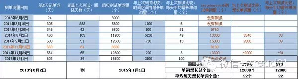

阅读英文原著的时间开销如下：

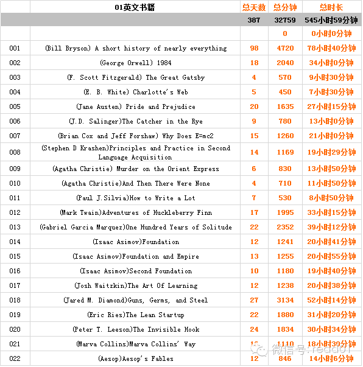

我的第一本英语原著《A short history of nearly everything》，每天看半小时左右用了接近100天，过程是地毯式的查单词，生词
一个都不放过。后来知道了所谓的透析法，2页查1个生单词，速度慢慢有所提高。对我来说最难熬的是最初3本书，咬咬牙看过3本，等看过10本左右就会柳暗花明。看上面
的数据大概可以猜到我有点强迫症，2页查1个生词，在实际看书中不适用，我还是会查每个生单词。

透析法的理论根基Stephen D Krashen的书《Principles and Practice in Second Language Acquisi
tion》，有各种实验和数据分析，是我读过最好的英文学习理论书籍。英语学习只有有了足够的输入，才能有输出，也就是说只有听、读的量到了，说、写才能有本质的改变
。如果看原著，应该看i+1的书籍，i就是input的意思，i+1就是看的书不能太难也不能太简单，比你当前的水平高一点就可以，只有读i+1的书才是可理解的语言
输入，才能真正的学会语言。i+1理论在实际应用中不能太死板，对一本书的兴趣才是最最重要的，《Guns, Germs, and
Steel》对我是i+3左右的难度，阅读的时候我敢说很享受。

如果有可能一定要看一下这本书，比市面上各种介绍英语学习方法的书都靠谱。我看书很慢，这本书（上图第8本书）总共用了19小时29分钟才看完，如果你不想被各种英语
方法忽悠，那么一定要看一下这本书，参考我的阅读速度，玩命的看也用不到24小时，我是用了14天慢慢的看完的。这，比《把你的英语用起来》更精彩，当然理论书比较枯
燥，要有思想准备。

**附录：**

1、文中22本英文书的下载地址：Kindle_免费高速下载

2、文中记单词、看原著的时间消耗数据详情下载地址：数据说话_免费高速下载 （好奇的小伙伴可以看一下，删除了一些和本文不相关的数据。）

3、英语学习过程中，我用俞敏洪的方法背过《新概念》，用钟道隆逆向英语的方法听写过VOA，用李阳疯狂英语的方法学过口语和语法，试过17天GRE单词，试过看电影
学英语观影1200+，结果却是文章开头“2013年6月2日扇贝单词量测试为3900个”。

4、我经常问自己，俞敏洪（也可换成其它名师）学习的过程到底是怎样的，背完《新概念》这一套教材之后，他达到了怎样的高度？他到底看过、听过、背过多少东西，才有本
事开培训班？当我有这种疑问的时候，在网页上是搜索不到满意答案的，结果是我对一切英语的学习办法都持怀疑态度。

5、英语学习方法的好坏衡量很难，只学习英文课本，英语强悍的人多的是，也有多的是的人学了课本英语照样烂。中国英语教育乱象丛生，被误导而放弃的人太多太多，很多时
候并不是我们没毅力，只是我们被蒙蔽后失去了信心。

6、看完请点赞或评论，谢谢。因为我想知道这个答案的受众有多少，看还有没有再更新的必要^_^

==以上2015年1月25日首答，首答从构思、整理数据到最后成文用时5小时6分钟==

上面的回答可以再梳理完善一下，但是为了后来的小伙伴能知道首答的原始模样，上面的答案只字未改，在下面更新吧。
==以下2015年1月26日二更，二更用时3小时37分钟== 先谢谢所有评论、点赞、关注、私信的小伙伴们，你们的热情出乎我意料之外。

每个评论我都会看到，太多太杂不能一一回复，我会给回复的小伙伴们点赞，见谅哈。下面先回答一些评论里面的问题吧：

1、2013年5月10号至2013年6月20日42天，记单词的时间开销我没有做记录。2013年6月21日至2014年8月6日的时间数据是手表估算的，误差大概
10分钟左右。2014年8月7日到2015年1月1日的时间数据是aTimeLogger计时，误差2分钟以内。下图为昨天的aTimeLogger上的时间开销，
“想法（5小时6分钟）”实际上是首答的时间开销。

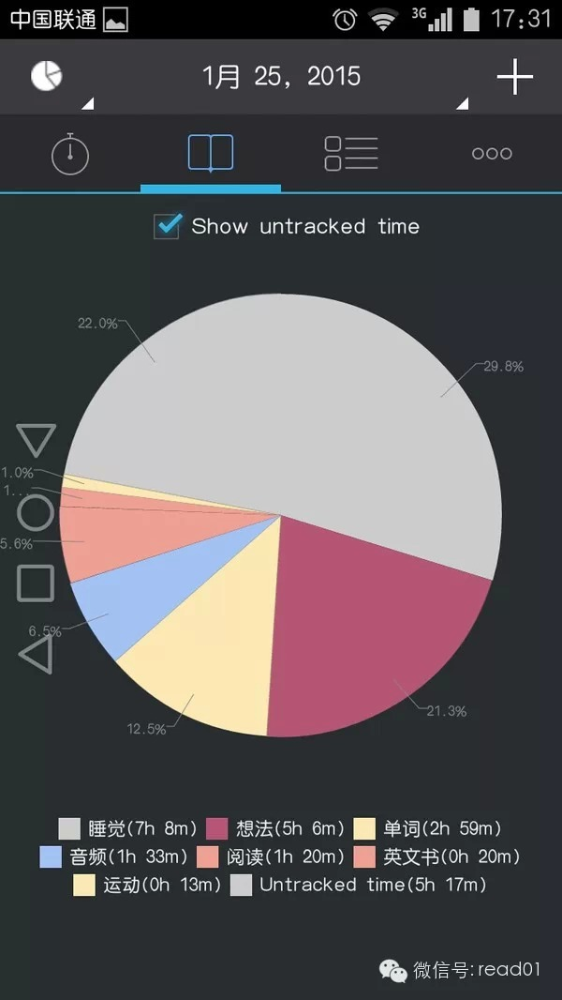

2、扇贝单词量测试数据的可靠性，确实是个值得谈论的问题，先不考虑算法的合理性，只说测试时的主观因素就足以影响结果的正确性。细心的小伙伴应该会注意到，上方的图
片不只是扇贝的测试数据，也有Test your vocabulary的数据做并列参考。2015年1月1日Test your
vocabulary网站访问不了，当时估计是被墙了，今天我看了一下，可以访问。扇贝量测试网址为： 5分钟，评估你的词汇量 ，Test your
vocabulary网址为： Test Your Vocabulary
。我觉得，单词量测试的目的是，努力学习一段时间后对自己的进步做出量化评估，和别人比没什么意义，和昨天的自己比进步，意义更大。

3、记单词软件我用过很多种，如：完美规划、百词斩、新东方记单词、拓词、有道、金山、扇贝、Anki、沪江，具体用哪个小伙伴们可以自己对比做决定。如果让我说哪个
最好，我会说是Anki，灵活、功能完善而且不仅可以记单词，它还是很好的辅助记忆软件，只是我很懒不喜欢弄卡片，最终放弃了。选扇贝的原因（扇贝的优点此处不提，因
为评论已经有小伙伴批评了)，说出来你可能不相信，但这是真的，我最开始学英语的动机，除了看原著另一个就是想看懂Quora上的问答（我的逻辑是：知乎问答很精彩，
那么Quora的问答肯定更精彩），而扇贝阅读里面有Quora问答精选。我扇贝阅读都是Quora问答，如下图：

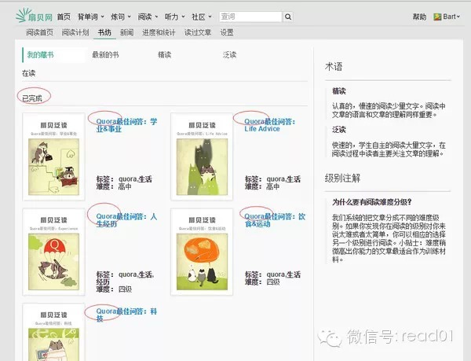

4、这个回答有个500天数据量的版本，首发在扇贝，评论里面也有小伙伴认出来了，一些有强迫症的小伙伴肯定想知道网址，喽，链接为
扇贝打卡500天纪实——怎样记单词最有效？

5、我要鼓励大家去看英语原著，鼓励大家看Stephen D Krashen的书《Principles and Practice in Second
Language Acquisition》，虽然《把你的英语用起来》写得很好、有自己的体系，但是当你看到《Principles and Practice
in Second Language Acquisition》后面的参考书目有多少页，你会意识什么是专业、什么是认真。我觉得，不管你的观点是对是错，只有认真
才能让别人获得更多的信息，才能让别人自己判断事物的对错，才能不被误导。我相信给我点赞的小伙伴，大部分不是因为我说的有道理，而只是因为我认真，而认真才能打动人
。如下图，《Principles and Practice in Second Language Acquisition》书后的参考书目：

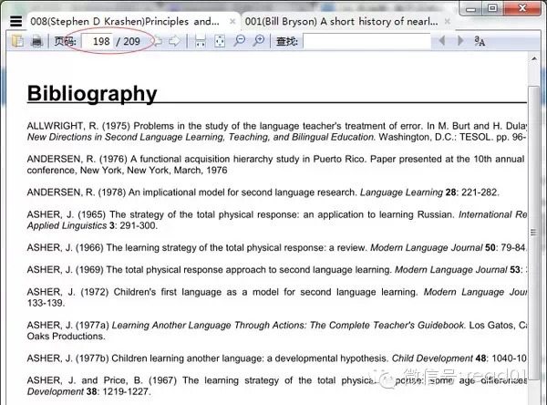

7、说个彩蛋，下载上文附录2的小伙伴估计没发现，隐藏的F列里有书籍的字数统计数据，记单词用时曲线如下：
==2015年1月27日三更，三更思考、回复评论、写作共用时2小时58分==
先修改一下二更的一些错误，本文可以随意转载，是否署名或署谁的名都没所谓的，我不介意，只是有一点要说明，请尽量转载完整的文章，不完整的文字会误导人。  

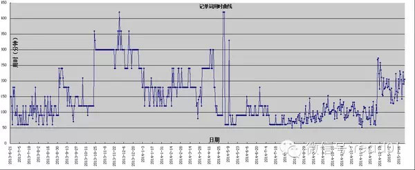

本文的核心是**求你去看原著**，后面如果有更新都会围绕这一个核心，文中都是个人数据，对小伙伴们的实际意义不大，参考一下就好。如果看完本文，你从今天就开始看
原著记单词，说明本文没白写。我写本文并不全是为了刷赞同，对我来说刷知乎比不上刷微博，我之前刷过百万粉丝微博大号，那个倒是可以满足我的一点虚荣心。T_T（不给
链接了，写的不好，但有很多内幕，实在好奇心重的小伙伴，可以看一下我来知乎的第一个回答）

  

> 通常来讲四级考试要求的词汇量大约在4000个左右，八级10000个左右，那么这相当什么水平呢？根据Testyourvocab网站上两百万份测试的结果，大
部分母语为英语的人单词量为20000-35000之间。英语为母语的4岁儿童词汇量已经有5000个，8岁词汇量为10000个。也就是说4级词汇量相当于母语为4
岁的儿童，8级词汇量相当于母语为8岁的儿童。原文链接为： Test Your Vocabulary
，截图如下：（此处引用的是我知乎另外一个问题的答案，原链接为：一共有多少英语单词？ - Bart 的回答 ）

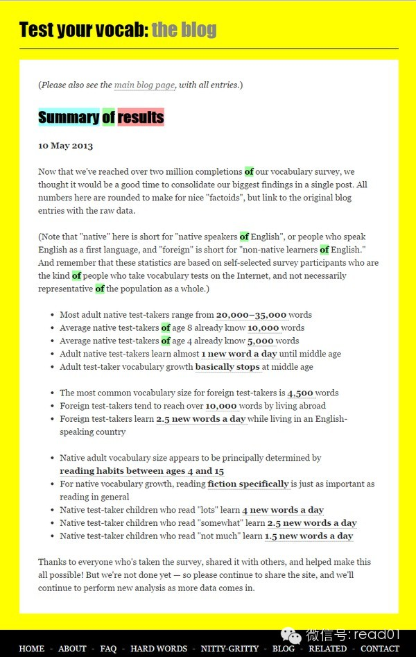

  

既然“大部分母语为英语的人单词量为20000-35000之间”，那么取最大值35000，根据我自己之前的统计数据，在扇贝上平均50个单词学习量，我能掌握8个
左右。假设当前词汇量为16000，50个学习量用时15分钟，估算数据如下表：

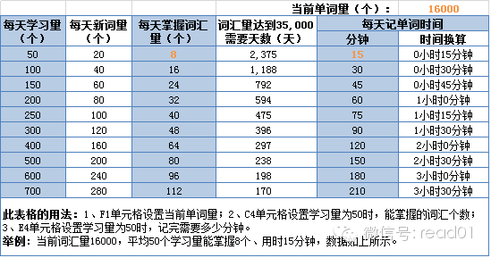

如果扇贝的算法给力，理想状态下，想达到35000的词汇量，我大概还需要170天的时间。实际情况，我预估是绝对不可能的，最根本的原因是，你的35000和nat
ive speaker的35000质量是不同的。老外记得的肯定是生活、交流、阅读中常用的单词，你记得的却是单词本上不知道什么词频的单词。李笑来老师的TOEF
L词汇是根据词频编写的，但只针对TOEFL考试，针对老外实际生活的35000单词我估计没人能编写的出来，因为范围太大、标准不一，如果有人宣称有这样单词书，八
成我会当骗子。合理的记单词方法应该是，选择一个根据艾宾浩斯记忆规律设计的软件，不用过多考虑学单词的方法，也不用每天花太多时间，半小时最好，我们的精力应该放在
学单词的目的听说读写上。

道理这么明白，我为什么还记单词呢？因为，**持之以恒的做一件事，即使这件事对你来说没有意义，当你克服困难、惰性，坚持到底，你会发现，你已经磨练出了无比强韧的
心性。毕竟心灵的成长，也需要不断磨练。**

** 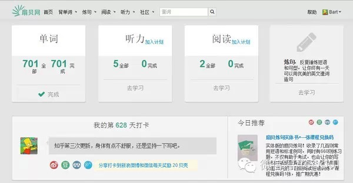**

就我个人而言，记单词并不是没有意义，见到任何生单词不会恐惧等其它好处此处不提，只说一个，如果记单词这么枯燥无味的事情我能一天不漏的坚持628天，这世界上其它
所有的事情，我都敢说，我可以做到、做好。

==2015年1月28日四更预留== 如果等四更请一定评论、点赞，谢谢，因为写这文章的时间成本太高，现在都花了快12小时了，我都能看一本《万历十五年》了。

头有点痛，先上传个图片做28日内容的预告，主题是，变质的鸡汤。图片是09年，我大二时，为了激励自己上进总结的鸡汤，这是我能写的最好看的字了，多多包涵。是否写
这个，各位小伙伴说了算。

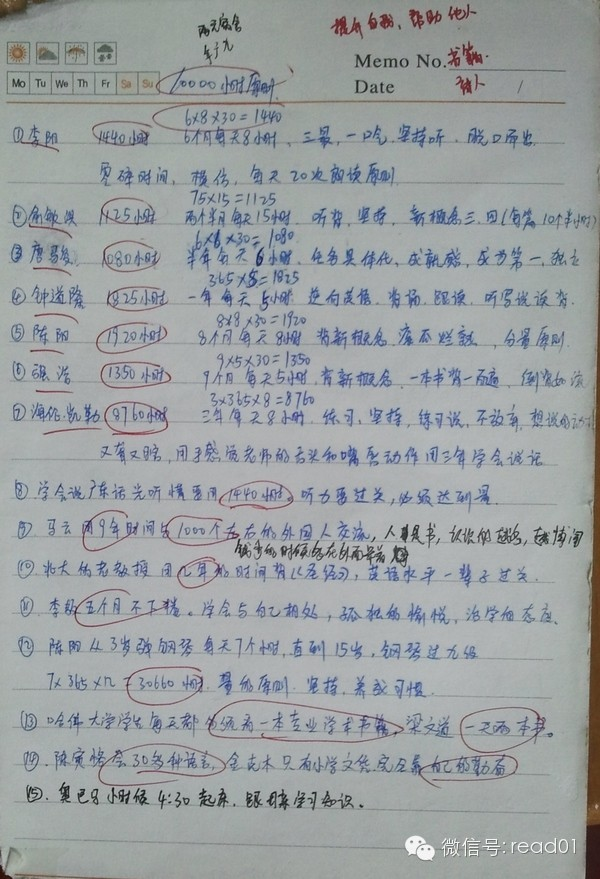

## 100天行动读者反馈

@a _

每天一页字帖这件事已经坚持了三个月了，现在想来特别有成就感。同事都夸我字写的好，不过不能骄傲，习惯还是要好好坚持下去，才能改变。谢谢你.

@淙淙date

每天俯卧撑三组，仰卧起坐两组。已成为习惯，每天这半小时的坚持让我感觉没有让时间白白流逝。感觉自己做事的毅力强了很多，打算把每周一本书提上议程。感谢有你

  

阅读原文

阅读

__ 举报

[阅读原文](http://mp.weixin.qq.com/s?__biz=MjM5NjA3OTM0MA==&mid=204914304&idx=1&sn
=0a4fed6991b86380d5ecadbcc5175c97&scene=1#rd)

