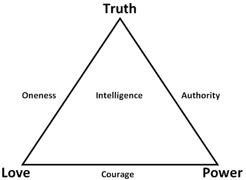

##  每年休息130天

_2015-01-21_ _史蒂夫**帕弗利纳_ 聪明人的个人发展 聪明人的个人发展

**聪明人的个人发展**

stevepavlinachina

个人成长，与你同行

__ __

你能清醒主动地承认，自己每天埋头工作8个多小时，其实专注在有意义工作上的时间只有1-2个小时吗？你还要这样生活多少天，才能重新严肃思考个人的工作动力、生活目
的和专注重心？

  

那解决方案是什么？很多情况下最佳解决方案，就是更长时间的休假。这种做法常令人感到违背直觉，但它确实管用。

  

一个简单原因就是，当人们感到工作时间极其充足时，便很容易浪费它。毫无效率的虚假工作每天都会潜入我们的生活…
导致人们每天大部分时间，都没用在能创造核心价值的事务上。

  

  

**每年休息130天**

  

在Jack Canfield的The Success Principles（《成功原则》）一书中，他推荐人们每年应享受130-150天的自由假日。一个自由假
日，即意味着从凌晨到凌晨（完完整整的24小时），你在此期间无论如何都不工作。不看与工作有关的邮件。不接触社交媒体。不琢磨跟工作相关的问题。除非需要处理绝对紧
急的事务，你不会碰任何跟工作相关的活动。

  

当找到自己想从事的工作时，你会很容易允许跟工作相关的活动渗入每日生活，包括在那些所谓的假期里。我与任何企业家一样，都对此感到愧疚。由于身处个人发展这种行业领
域，我发现不去工作尤其让自己感到为难。我的工作和个人生活已经交织在一起，而且自己能在任何地点开展工作。

  

你可能会想：要是每年全休130-150天，实际又去干什么呢？没有工作填充那些时间，你该用什么活动来替代？看电视？玩视频游戏？去登山？

  

若发现自己很难想象该把那么多时间投向何处，你绝非一个人为此苦恼。充分享用那么多天的假期，需要你探索和表达与以往全然不同的一部分自我，这部分自我并未通过你现有
的职业道路获得生动鲜活的表达。这种假期绝非只是工作外的一段休息 — 它是你对真正拥有生活的一项切实投资。

  

为能够真正享受更多假期，我不得不开启对自身的全新探索。其中一些探索方向包括旅行、感情关系和新爱好。

  

在20多岁头几年开创第一份事业时，我觉得辛勤工作就是成功关键。周末我也常去办公室。平时甚至工作到大楼清洁人员出现在面前。我会告诉他们不用打扫我的办公室，之后
继续工作到最终没法再集中精力。然后躺在地上睡几个小时，醒来后再投入工作。我以为那就是高效的工作方式，而在自己心底，我知道要是头脑更集中，就能用少得多的时间完
成同样份量的实质工作。

  

那时候，我的假期就是一次偶尔进行的三日旅行，最好时可能会有四天，旅行距离也在驾车可达的范围内。这些算是不错的休假经历，但它们还没长到足以允许我离开个人生意，
真正享受生活，获得新鲜的头脑视角。这些假期令我感到自己在放弃工作，但也没用任何真能让人复元的事情填补这份虚空时间。我只是按下了生活的暂停键。若有更多休息时间
，比如一连休息几周，我也许就能在工作中避免很多挫折。

  

我还没达到Jack推荐的每年休息130-150天的水平，但正逐渐靠近这一目标。我现在已能看出其中蕴含的智慧，也能看出当不再试图一直工作时，个人效率会有多大提
升。我还明白了对工作彻底放手一段时间的重要性。

  

今年我比以往完成了更少的写作和演讲，谈下了更少生意。相反，我将数百小时都投入到属于自己的个人项目上。我学会了一些新技能，比以前阅读了更多书籍。但在财务上，我
的生意并未因此受损。事实上，今年是我过去四年中收益最高的一年。我承担了更少的工作项目，但完成的那些比以往要更加成功。通过减少工作量，我挣得了比以前更多的收入
。

  

  

**为真正生活投资**

  

最近我回顾了这几年的财务记录，想看清个人在旅行上的花销。我发现不包括食物消费的情况下，自己每年在旅行上的开销一般是年收入的1%到3%。我还记得旅行开销是3%
的那一年，自己要比只花了1.1%的那年，充满更多生活乐趣和动力。

  

我的数据说明自己对旅行依然十分吝啬。我已经比以往旅行得更多，但在上面的投资还没达到个人最佳程度。部分原因是我的很多旅行开销都由他人支付，如旅行去他人举办的活
动演讲。但我确实可以在旅行上加大投入，尤其对我而言，这是种有着极高价值，能够促进成长的活动。

  

我鼓励你也审视一下个人财务记录，看看把钱都投到了哪里。在拥有真正的生活上，你的实际投资有多少？

  

金钱显然不是投资的唯一形式，但的确是审视事实的有力数据。

  

我发现支出更多收入的一些开销，并没让自己感到格外兴奋。若我在旅途中比待在家里，能收获更多快乐和成长，自己干嘛还要在与住所相关的开销上花费这么多？我从父辈那里
继承了这种优先选择思维，并一直保持了多年时间。但当清醒自主地审视它时，我很容易就能承认，自己其实并不需要房子、汽车，或者继承而来的生活方式所附加的其他许多事
物。

  

假如把那些毫无激励感的开销转换成更令人兴奋的活动，将会发生什么？若你开始质疑对生活必需品的定义方式，又会发生什么？房租或抵押贷款真有必要吗？

  

若你将Jack的建议应用在金钱，而非时间上，又会有什么结果？那就等同于说：为拥有真正的生活，花费至少35%的年收入。

  

试着计算出个人年收入的35%，得到一个数字。现在请想象，在真正为生活增添价值和意义的事物与活动上，你每年要花费至少这个数字的金钱。请想象把这笔钱花在有趣、冒
险和带来成长的体验经历上 — 而非那些生存性、安全性和工作类需要上。

  

你想怎样花这笔钱？你要把它投入到什么地方？

  

  

**挑战个人支出的优先级**

  

或许更有趣的问题是，问问自己：你为何还没把更多金钱投入能增进生命乐趣和成长的事情上？

  

普遍回答是：_我负担不起。我太穷了（或是欠债太多）。我倒是想花更多钱享有真正的生活，但现在就是没那种财力。我太可怜啦！_

  

这听起来很像企业家们哀叹没法从工作中抽出时间休假。或许这一整套思维模式，就是真正的问题所在。一旦你许可自己无论如何都要拥有真正的生活 —
用富有意义的时间和金钱投资，来保证它的实现 —
你可能就会发现（人们常是如此），自己的生活动力和热情获得了显著提升。这种改善后的专注力，会更容易让人赚到更多钱并节省更多时间，远超你为自己投资应付的补偿。

  

如果你把所有钱都花在个人基本需求上，长远来看，在财务上难道不是毫无激励感吗？若你的钱财主要用于生活开销，你又如何能感到充满动力，想要赚得更多？更有可能的是，
你会把金钱联想成一种邪恶的必需品，或是不得不尽的义务，而非用来提升生命乐趣和获得成长的潜在资源。若你只将金钱与生存和必需品相联系，又如何想去赚得更多？

  

看看自己的数据。你的钱财到底花在了什么地方？是否全部开销都是生存必需品？你是否在那些毫无激励感的事情上有所支出？假如放弃一些这样的支出，会有什么结果？我猜大
多数时候，若你观察得足够仔细，就能发现甚至在勉强量入为出时，很多开销的意义价值对自己而言也值得怀疑。

  

问问你自己，对于一个每天只挣2美元的人来说，你的什么开销依旧是必不可少的。支付房租真的必不可少吗？购买汽油呢？你是以最经济的方式在必不可少的营养食物上花钱吗
？就像工作过度的人因缺乏专注而不断浪费时间一样，有无可能你也正因缺乏专注而在浪费金钱？你是认为必须如此，才支付那些开销吗？这个星球上有没有人，会把你的必需品
当作奢侈品看待？

  

有段时间我一直在问自己这种问题，想知道它们会如何影响个人生活方式，让我在个人收入的日常花销模式上做出严肃认真的改变。例如，要是我把花在住房上的所有钱都投入连
续旅行，会有什么样的结果？

  

假如我把住房定义为一种奢侈浪费，将会怎样？若把连续旅行定义为一种必需生活方式，又会怎样？

  

正如我在此前关于走向流浪生活的文章中分享的，我计划明年放弃生活里的许多开销。我不再认为它们必不可少，包括我的汽车、房子，还有几乎所有财物。它们占据了我生命的
时间和空间，但并未将我的生活品质提升到足以配得上其存在的程度。我干嘛不在几年前就对它们放手？我想主要原因是，自己对熟悉的生活感到过于舒适，没能对舒适区之外的
人生体验许下承诺。

  

  

**走进不适区**

  

请想象把个人35%的日子和35%的收入，投资到能提升生命品质的活动和体验中。你的假期将不仅仅是工作之余的休息。你的个人开销也不再只用于琐碎事物。

  

你愿把这些时间和金钱投资到什么地方？

  

若你此时脑中一片空白，或许就能解释，为何时间和金钱好似流水般从你指间溜走。富足的生活躲避着你，可能就是因为你还没想出令人信服的理由去追求它。正如Anais
Nin所写：“生活会随着一个人的勇气成比例地收缩或扩张。”

  

请意识到，老是等着更多时间和金钱出现后再行动，是个愚蠢做法。这种拖延思维就是无穷无尽的陷阱。因为每一天都变成了可以推迟的日子，以及无休止的往复，所以你会不断
拖延，直至死去。开始投资唯一可行的时机，就是现在。你能做出真正改变的唯一时机，也是现在。若你的回答并非现在，就请意识到，你正说着永不实现。

  

请给富足生活一个理由现身在你面前。通过在充满意义的生活体验上投资，向其展示你正明智地平衡着现有的时间和金钱。请意识到，匮乏思维才是更大的浪费，因为它会压抑你
的动力，降低个人效率。

  

当我许下承诺要享受和感激自己生命时，即便当时业已破产，我的生活也体现出全新品味。做出此承诺时，我不知道它也能彻底扭转我的财务状况。一旦意识到不论个人收入或债
务有多少，自己都可能创造一种充满乐趣、意义和成长的生活，我便不再对金钱感到充满索求。之后赚钱就变成了一种游戏形式，而非压力来源。直到今天，我仍把生意视为生活
游戏的一种形式，而且我知道其他很多企业家也有这种感受。

  

走在这种人生道路上，有点像剥开一个洋葱。总有另一层世界等着你探索。最开始时，我喜欢可以自由选择个人从事的项目；拥有对创意的控制感对我而言非常重要。到了人生另
一阶段，我对社交活动极其投入并愿和他人达成共赢的生意。。如今，我感到对简化个人生活充满动力，这样我就能花更多时间经历全新生活体验。

  

明智投资个人时间和金钱到底意味着什么？你生活中的真正必需品又是什么？

  

你的投资项目经过清醒选择吗？它们跟你当前的价值观和谐一致吗？或者，你已被继承得来的优先考虑所奴役，过着毫无激励感的生活？

  

你可以把个人时间和金钱投资在自己喜欢的任何事上。你不必追随父母为自己设定好的相同生活模式，特别是在你能设想出更好生活的情况下。那些替代选择也许一开始看着有点
可怕，但这就是在个人舒适区外勇敢探索的本质。

  

若你意识到现有生活脱离了和谐一致感，也许就是时候，重新平衡自己在时间和金钱上的投资。我想你会像我曾经体验的那样，发现即使完成转变需要很多年月，但只是开始行动
本身，就可释放出一些强大的新鲜能量和动力。

  

别再等着某一天的到来。某一天永远不来。

  

  

Steve Pavlina

2014.12.11

  

  

阅读原文

阅读

__ 举报

[阅读原文](http://mp.weixin.qq.com/s?__biz=MzA3NzIyNTQ3NA==&mid=204486418&idx=1&sn
=4baf4173ae0e01f85a49b9b52145f5eb&scene=1#rd)

