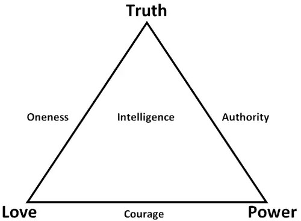

##  清晰感

_2015-03-03_ _史蒂夫**帕弗利纳_ 聪明人的个人发展 聪明人的个人发展

**聪明人的个人发展**

stevepavlinachina

个人成长，与你同行

__ __

  

倘若缺乏清晰感阻碍了你采取行动，那就找到或发展出一套能获得足够清晰感，供你采取行动的流程。别再把它当作解决不了的问题。它根本不是个问题。

  

写下囊括你人生核心目的的使命宣言就是一个基本解决办法。

  

  

**使命宣言**

  

使命宣言是你和自己人生订立的合同。它基本上回答了如下两个问题：

  

1\. 你想做出什么贡献？

  

2\. 你想取得什么收获？

  

我最近刚更新了自己公司的使命宣言。这是目前的版本：

  

Pavlina公司的使命是：

  

  * 探索、辨明清醒自主的成长模式，对其进行优雅的编纂整理

  * 挑战现状，甘冒明智的风险，并勇于试验

  * 强化全球社会与真实（Truth）、爱（Love）和力量（Power）原则的和谐一致性

  * 雄心勃勃、坚持不懈和可持续地推进个人清醒自主的成长

  * 在激励人心的创新想法，共同协作的团队工作，以及自律严谨的实施执行间，寻求最佳平衡

  * 逐步拥抱代表优秀与精通的最高标准

  * 经由权威、大胆、喜乐与爱的方式来领导和激励他人

  

这份公司使命的给予和收获层面紧密交织在一起。我深入享受着致力于清醒自主成长的整个过程。与我一同工作的人们也都有此感受。但这并非唯一的使命宣言形式。你也可以有
通过其他渠道做出贡献和取得收获的使命宣言。

  

我还有一份个人使命宣言，它跟我的公司使命有很多共同点，但又有些许不同。

  

我的个人使命是：

  

  * 探索、理解，以及整合生活中存在的明智秩序

  * 富于见解地辨明、优雅洗练地编纂，以及雄心勃勃地推进这种秩序

  * 经由权威、大胆、喜乐和爱的方式来领导和激励他人

  * 逐步拥抱代表优秀和精通的最高标准

  * 在激励人心的创新想法，共同协作的团队工作和自律严谨的执行实施间，寻求最佳平衡

  * 富足地享受生活最美妙的奖赏

  * 为自己其他阶段的存在形式做好准备（包括死后可能有的存在形式。译者注）

  

在自己与生活达成的合同中，有一部分内容是，若去追求崇高人生目标，我就可以期望生活会成为自己坚实后盾。我并不期待生活让我要做的事情变得容易，而是期待它将协助我
学到重要经验教训，不让自己在琐事和毫无必要的障碍上浪费时间。一旦我学到并融会贯通一个重要教训，就能取得进步并继续前行。

  

例如，当学到如何以自己深感满足的方式为他人贡献价值，并意识到贫穷思维的愚蠢之处后，我就期望生活会给予我支持，提供能很好完成相应任务的合适工具。我将毫无羞耻地
去买自己能买到的最好工具，并在使用它们时深怀感激。我不会在这种事上显得吝啬。

  

我发现当自己行动与人生使命和谐一致时，生活确实会成为我的坚强后盾。我体验到深受支持的富足感。

  

当然整个合同的提议内容都只存在于我自己脑中。因此只要我相信生活与我达成了某种共识安排，那我们自然就有了这些合同条款。生活只是个想象出的概念。我实际上所做的就
是跟自己协商出一份交易，以便给予我足够清晰感，以确信的生活姿态采取行动。

  

假如起草的使命宣言包含太多自我牺牲和麻烦之处，你就将在执行实施时拖沓延迟，而且常会停滞不前。那是因为你在行动中无法感到太多来自生活的支持。你甚至可能感到被其
打败。另一方面，若你的使命全都是关于“我-我-我”的内容，那就没人在意你是否成功。而且内心深处，你也知道自己的使命跟其他人毫不相干。在实现这种使命的过程中，
你会有自我折磨的感受，因为它并没让人感到更伟大的实现需求。

  

一份明智的使命宣言，应该在你想要为生活做出的贡献，和从生活中取得的收获之间，有着合适的平衡。大自然就以相似原则在和谐运转。一个给予过多的物种常会消亡。一个过
于贪婪的物种也会消亡。拥有良好平衡的生存方式才是更优选择。

  

你可以通过询问它们，来辨清人生使命的其他一些问题有：

  

1\. 我能用自己生命去做的最重要事情是什么？

  

2\. 我渴望成为什么样的人？

  

3\. 我愿意从生活中获得何种支持？

  

4\. 我想怎样去活？

  

5\. 我到底在意什么？

  

6\. 我存在于世的意义是什么？

  

7\. 我在去世前想要体验什么？

  

8\. 什么能给我带来思维上的刺激感？

  

9\. 什么能激起我情感上的积极反应？

  

10\. 我精神上的追求是什么？

  

11\. 我想创造什么？

  

12\. 我想在死后留下什么作为自己遗产？

  

13\. 我相信生活的真正意义到底是什么？

  

14\. 我想和什么样的人分享自己人生之旅？

  

你的使命宣言应能让你在读出它时满怀微笑。它应该激起你内心强大情感。你应该在看着它时能脱口而出，“没错，这就是我要的样子！”

  

你的使命宣言会跟随时间进化 —
随着你不断学习和成长，这也是预料中的事情。假如你能以从容态度认真明智地写出一份使命宣言，尽最大努力完成此事，它将为你带来巨大好处，帮你获得生活的清晰感。

  

  

**目标**

  

有了清晰使命（对人生目的的清楚陈述），你就能从中派生出具体行动目标。你的使命就是你生活的总体方向。而你的目标就是人生道路上的一个个里程碑。

  

你可以通过设定一些长期目标（不少于2年的时间规划），来表达和探索自己的人生使命。这能将你的生活目的与自身各种技能紧密联系起来。你可能需要发展新的技能来实现个
人使命，所以请把发展这些技能也包括在长期目标中。例如，在进行自己首个专业付费演讲前，我便用了数年时间拓展个人公共演讲技能。

  

将这些目标按照从重到轻的优先顺序排列。问问你自己：“若我只能完成这份列表上的一个项目，应该是哪个？”然后再问自己：“若我只能再完成这份列表上的一个项目，又该
是哪个？”照此方法完成排序。

  

之后基于这些长期目标设定为期1年的各种目标。对其进行优先排序。

  

再基于你的1年目标来为这个季度设定相应目标。接着进行优先排序。在每个季度开始时更新这份列表。我认为在每一季度的开始更新你的1年目标也很明智，这样你就能根据当
前的进展或延误调整相关目标。

  

然后再基于你的季度目标设定本月目标。对其进行优先排序。并在每月开始时更新此列表。

  

在每周开始，基于你的当月目标设定本周目标。同时把那些紧急和临时性项目添加到目标列表中，这些项目无需与你的人生使命相关。

  

对这些项目进行优先排序，专注于在一周内尽早完成那些重要项目，利用剩余时间处理那些紧迫但较不重要的项目。学会拖延完成那些无关紧要的事务。

  

在每天开始时（或更好是每天结束前），为即将来临的一天设定好目标。再对这些目标进行优先排序。

  

第一次创建这些列表会耗费些努力，不过一旦你形成这种做事习惯，维持这样的做法便十分容易。

  

请以从容态度出色完成这种任务。好好坐上几个小时，发动你的头脑，设定出你能想到的最细致的目标。我喜欢在一间偏暗的房间里做此事，或是坐在壁炉旁，或是蜡烛旁，同时
播放些大自然的环境声音（比如下雨或海浪起伏声）。创造出放松和利于冥想的环境，确实能帮我深度集中精力并出色完成设定目标的工作。我知道根据以往经验，若在此时粗心
草率地完成工作，就会使执行阶段变得痛苦不堪和糟糕沮丧。设定目标是极富挑战的工作，因而值得你给它一点尊重。

  

完成每份目标列表后，请全读一遍并问自己：“这是我能设定出的最好目标吗？”如果是否定回复，或者你有所犹豫，难以确定，那就放松休息一下。当自己精神焕然一新时再回
到个人目标列表，重做一遍设定目标的工作。

  

除了从人生使命中派生出各种目标，你也可添加一些并非基于使命的目标。这样做完全没问题。但若你发现频繁列出此种目标，那就后退一步，看看能否从中瞧出任何行为模式。
它们也许暗示了你可以融合到使命宣言中的新元素。例如，我热爱做个人成长类型的试验，最终我意识到投身于试验应当成为个人使命内容的一部分 —
而且也应是我公司使命的一部分。

  

要是由我来从零开始创建所有这些列表，对于每个时间框架为长期、1年和1季度的目标，我将分别花费1-2个小时的时间进行设置。因此只是设定完成这些目标就将用上3-
6小时。而设定当月目标会用上大概15-30分钟。设定一周目标会用大概10分钟。设定当天目标通常只需5分钟。

  

一旦创建完成这些列表，对目标系统的维护运行就十分简便… 通常只用在每天结束前花上5分钟，选定和优先安排次日的任务内容便可。以后逐步深入的计划安排工作可在每周
、每月和每季度结束时完成。相对于在生活清晰感上获得的回报，你对设定目标所做的时间投入绝对值得。

  

  

**行动**

  

在每一天开始，重温你的人生使命和为每个时间框架安排的目标。这只会用去5-10分钟时间。这样做时，请想象你为每个时间段所设定的目标已然完成。留意其中的因果联系
。看看个人日常行动如何最终与长期目标连结在一起，以及你的各个目标如何反映出自我的人生使命。确实让这些目标沉入自己心底，使你今天行为要么与设定的人生道路相一致
，要么就不是。

  

向自己许下要在今日取得进步的承诺。下定决心在今天朝着实现人生使命前行。这种每天重温承诺的做法极其重要。它能给你提供巨大帮助，防止自己脱离正确轨道，以及被琐事
和干扰阻绊。

  

你现在就可着手开始。从当天事项列表上的第一个任务做起。排除和忽略其他所有事情。你的最大挑战，是发展出按照优先顺序完成日常列表的习惯。不要跳出这些优先顺序。不
要让自己因琐碎事务分心。学会由重要性驱动的做事习惯，而非由紧迫性驱动。

  

若你需要休息一下，那就去休息。之后继续完成列表上的下一项任务。

  

这种简单目标系统的好处在于，大多数日子里你都无需决定该做何事。你只用放松下来，专注于行动。你已完成了细致的决定工作，而且辨清了该做什么，以及相应的做事顺序。
这就是为何要出色完成目标设定和策划工作的原因。假如你知道已在策划阶段尽了最大努力，就能在执行阶段放松行动。你会信任去完成这些目标，就是能让自己明智前进的正确
行动。

  

但是，若你在策划阶段做得粗心草率，便会在试图执行时质疑个人决定。你将弃用自己的日常目标列表，不按优先顺序处理各个事项，在并不重要的任务上浪费时光。随后紧急事
项终会堆积如山，你不得不把长期目标放在一边，先行解决这些琐碎事务。像这样过上几天后，你就不会再麻烦自己做任何计划安排。之后你就将随波逐流几个月，甚至可能是几
年时间。最终你又拾起这套做法，重复这种过程。

  

我想尽可能强调用最细致认真和深思熟虑的态度来设定目标的重要性，以便省去你未来会遇到的一些困苦。创建一份高质量的使命宣言同样如此。不必惊讶要花费数天时间，才能
想出一份你真切感到是个人最佳成果的使命宣言。相对于你的整个人生，这仍是一份较小的投入，却可以帮你在执行实施时节省大量时间。

  

  

**创造自然流畅的生活状态**

  

顺其自然的做事方法又如何？倘若你在没有清晰发展方向的前提下，把顺其自然作为日常行为状态，基本上你终将顺着随机混合了他人使命的生活之流去发展。这也许听起来没什
么问题，但长远看来会造成混乱，而且毫无特别的满足感。假如你必须这样做，那就试它十几二十年，然后留意那种总感觉自己落在生活之后和不断错失良机的沉没感。这恰恰是
因为你就在不断错失良机。你没有领导自己的生活。这种版本的顺其自然不过是毫无目标地随波逐流。其中毫无荣耀可言。

  

应用顺其自然态度的更明智做法，就是首先定义出你想要的自然状态。然后顺着那份人生目的自然流动发展。有时你只用放松于这种自然状态便可。其他时候则可能需要你动手划
上几桨。别把顺其自然当作你的借口，让自己人生一事无成。

  

倘若你真的还无法定义出自己想要的自然状态，那就先附着于他人生活之流中。要将其作为一个清醒自主的选择，而非随机偶然的事情。别只因感觉需要一份工作，就随便找家公
司上班。找到你尊敬或欣赏的人士，或在其价值观能激励自己的那种公司工作。如果需要就免费工作。这种学徒经历的教育价值将为你以后的人生道路带来巨大红利。它不仅体现
在你获得的技能知识上，还有你对自身发展道路增添的清晰感。若你最终意识到自己的人生目的必须在与之不同的方向上实现，那时你便可从容阐明自然流畅的生活状态，开始更
清醒自主地追求这样的生活。

  

请记住你生命里的一天天终将逝去。你可以让这些日子流向更伟大的人生目的，享受清晰感和从容执行所带来的众多奖赏。或者，你可以继续随波逐流，偶尔抱怨一下不知自己该
做什么，好像这是个很特殊的问题（不，它其实能被解决），或是感觉它莫名其妙就令自己脱离了生活正规（并非如此），然后你便要遭受悔恨一生的结果（这也可以避免）。

  

长远看来，过那种经过深思熟虑，与激励人心的目的相一致的生活，要更轻松容易和使人心满意足。这主要是因为你得以体验和享受自己真正想要的许多事物。如此生活一段时间
后，这种人生道路很大程度上就能变得自我持续。你会更难漫无目的地随波逐流，因为那样你就只能看着其他人全然享受生活，从而引发诸如怨愤、沮丧或无助的感受。假如你正
有任何愤怒、怨恨或者后悔的感觉，这样很好。引导这类感觉去做些新鲜决定。写下一份新使命宣言，再设定一些细致目标。让自己回归正轨永远不晚。

  

  

Steve Pavlina

2014.02.05

  

  

阅读原文

阅读

__ 举报

[阅读原文](http://mp.weixin.qq.com/s?__biz=MzA3NzIyNTQ3NA==&mid=206039117&idx=1&sn
=6bd471338f749e42ededa1855c98d6ae&scene=1#rd)

