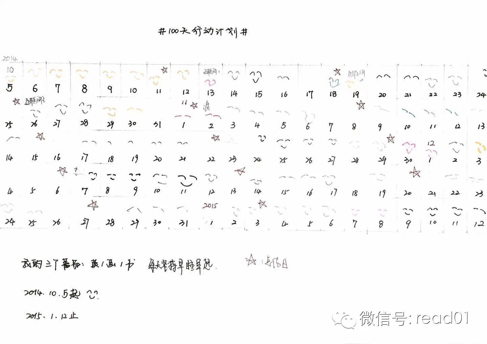

  

昨天的文章发完之后，除了有N多的人，在问有没有男生版的长期择偶策略，当然有，而且还有男女两方的短期择偶策略。 有更多人关心，如果不是高富帅、白富美，是不是就
没机会了。当然不是，这本书只是从进化的角度来考虑男女双方的选择策略，而细化到现实情况中还有很多不同的因素要考虑。

今天提供一种爱情Hack技巧，只需要两个人共同回答36道问题和4分钟的对视，就能让两个陌生人相爱，如果你还是单身，把文章看完，做好准备，把你的男神或女神约出
来实践一下，看看效果。

**以前分享过一些文章，可以进行扩展阅读：**

  * 写给女孩子的33条恋爱诫律 输入【恋爱】

  * 情人节女性必看《銀座媽媽桑說話術》输入【**情人**】

  * 教你瞬间赢得别人信任的 “冷读术”-（1）输入【**冷读**】

  * 冷读术（2）输入【**冷读**】

  * 《魔鬼搭讪学》泡妞的哲学 输入【**泡妞**】

## 文章反馈

在文章中征求 Windows Phone下的时间记录APP推荐，有些读者回应：

**@圣琳**

aTimeLogger

**@何壮壮**

Jiffy 时间管理软件，昨天刚下载，感觉还不错，推荐给那位读者

**@沐沐**

atimelogger有记录时间和汇总导出数据的功能 易于操作

## 正文

> 原文作者：Mandy Len Catron

>

> 译者：管它如何

>

> 译文出处：http://select.yeeyan.org/view/465121/439835 （可以点击文章最后的【查看原文】来访问）

二十多年前，心理学家Arthur Aron成功地让两个陌生人在他的实验室里相爱了。去年夏天，我将他的方法运用到了自己的生活中。正是因为这样，我才会在午夜站在
一座桥上，凝视一个男人的眼睛，整整四分钟。

容我解释。当晚早些时候，那个男人说：“我猜想，在具备一些共性的基础上，你可以爱上任何一个人。如果真是这样，你怎样选择爱上某个人呢？”

他是我在大学里认识的人。我时不时会在室内攀岩室碰见他，也曾想“我们要是在一起，会怎样？”我在Instagram上小窥过他的日常生活，但这是我们第一次单独出来
玩。

“其实，心理学家们尝试过让人们相爱，”我回想起了Aron博士的研究，因此说道。”挺有意思的。我一直想试试。“ 第一次读到这个研究时，我正经历分手。每次我想要
离开，感性都战胜理性。我觉得自己停滞不前。因此，就像一名优秀的学者，我转而投靠科学，希望有一种更聪明地去爱的方法。

我向我这位大学熟人解释了这个研究。一对异性恋男女从两个不同的门进入实验室。他们面对面坐着，并回答一系列私密程度逐渐提高的问题。然后，他们静静地凝视对方的眼睛
四分钟。最令人感到好奇的细节是：六个月后，两名被试结婚了。他们请了整个实验室的人去参加了他们的婚礼。

“那咱们试试，”他说。

我承认我们的实验已经不符合研究的几点。第一，我们是在一个酒吧里，不是在一个实验室里。第二，我们不是陌生人。不仅如此，我现在意识到，如果某人对浪漫爱情的发生并
不怀有开放的态度，此人不会建议也不会同意尝试一个旨在创造爱情的实验。

我谷歌了Aron博士设置的问题，有36道。我们花了接下来的两个小时，把iPhone传来传去，一交一替地问每个问题。

开始的问题很无害：“你想要当名人吗？什么样的名人？”还有“你上回给自己唱歌是什么时候？给别人唱歌是什么时候？”

但问题马上就变得深入了。

在回答“说出三个你和你的搭档似乎有的相同之处”这个问题时，他看着我说，“我觉得我们都对对方有意思。”

在他又列了另外两个我马上就忘了的共通点时，我边笑边喝了一大口啤酒。我们交换了最近一次我们俩各自哭时的故事，也坦白了我们想向算命师傅请教的一件事。我们解释了我
们和我们各自母亲间的关系。

这些问题让我想到了那个讲烂了的温水煮蛙的实验。实验中，青蛙意识到水变热时已经太晚了。对于我们，因为所暴露的弱点的程度是逐渐增加，所以直到我们已经进入了私密的
领域时，我才有所察觉。这个过程，通常要花上几周或几个月。

我喜欢通过我自己的答案了解自我，但我更喜欢了解关于他的事情。在我们稍事休息去卫生间时，我们刚来时空荡的酒吧已经坐满了人。

我独自一人坐在我们的桌边，一小时以来第一次意识到我周遭的环境，并且疑惑有没有人在听我们的对话。如果他们在听，我是没有注意到。并且我也没有注意到人潮散去，夜渐
深深。

我们都有一套好讲给生人和熟人的对自身的叙述，但是Aron博士的问题令人不可能依赖于那一套叙述。我们的对话是一种加速度的亲密行为。我对这种行为的记忆源自儿时的
夏令营，和新朋友熬一整晚，交换我们短暂人生的所有细节。13岁时，第一次离开家，快速了解某人显得自然。但是成人生活很少赋予我们这样的环境。

我感到最不舒服的时刻并不是当我需要坦白关于我自己的事情的时候，而是勇敢地提供对于我搭档的看法的时候。比如，“轮流分享你认为你的搭档所拥有的积极的性格特点，一
共说五点”（22题），还有”告诉你的搭档你喜欢他们什么；这次，诚实地说出你可能不会给一个刚认识的人说的事情“ （28题）。

Aron博士的研究主要集中在创造人与人之间的亲密感。确切地讲，有几个课题是探究我们如何将他人和我们对自身的认知一体化的方法。我们能很容易地意识到这些问题是如
何鼓励人们做到他们所说的“自我延展”。
说一些类似于“我喜欢你的声音，喜欢你对啤酒的喜好，喜欢你的朋友们仿佛都很欣赏你”的话，会令属于一方的某些优秀的特点明确成为对另一方有价值的内容。

听到某人欣赏你什么，真的，很令人惊喜。我不知道为什么人们不常常衷心地去互相夸奖。

我们在午夜时回答了所有的问题，花的时间远比原来做研究时的90分钟要长。环视酒吧，我觉得自己仿佛大梦初醒。“这没那么糟糕，”我说。“绝对比凝视对方双眼好受多了
。”

他犹豫了犹豫，问：“你觉得我们也应该那么做吗？”

“在这儿？”我环视了一下酒吧。这感觉有点太怪了，太公开。

“我们可以站在桥上，”他转向窗口说道。

那晚天气暖和，而且我一点也不困。我们走到了桥的最高处，然后转身面向对方。我设秒表时紧张地摆弄着我的手机。

“OK，” 我边大口吸气边说

"OK，" 他微笑着说道。

我曾在陡坡上滑雪而下，也曾被短短的一条绳子挂在岩壁上，但是安静地凝视某个人的眼睛四分钟是我人生中最激动也最吓人的体验之一。我花了前几分钟仅仅试着恰当地呼吸。
还有很多紧张的微笑，直到最终，我们习惯了这样的状态。

我知道眼睛是心灵的窗口那些有的没的，但是那个时刻真正的关键不仅仅是我真的在看某人，而是我在看的人也在看我。当我接受了这个想法的吓人之处，并花时间平复下来，我
达到了一个意料之外的境界。

我感到勇敢，也进入了一种疑惑的状态。一部分疑惑是关于我自身的弱点，一部分则是一种奇怪的疑惑，类似于你一遍又一遍地说一个词，直到它丧失了含义，继而变成了它的本
质：多种声音的一个集合。

关于眼睛也是亦然，它不是一个通向什么的窗口，而不过是一丛非常有用的细胞。与眼睛相关的情感不再，而我是被它惊人的生物性现实所打动：眼球的天然的球状，瞳孔的明显
的肌肉组织，还有角膜的光滑湿润的镜面。它既奇怪又精致。

当秒表响的时候，我吃了一惊——也有一点释然。但是我也有一种怅然若失感。我已然开始透过不真实也不可靠的视角来回顾我们的夜晚了。

我们很多人都认为爱情是发生在我们身上的一件事。我们沉浸其中。我们受到伤害。

但是我喜欢这个研究的一点是它假设爱情是一种行动。它假设我的搭档在乎的事情我也在乎，因为我们有至少三个共同点，因为我们和我们各自的母亲有亲密的关系，也因为他让
我看着他。

我想知道知道我们的互动会带来什么。如果其他的没有，我曾想这至少是个好故事。但是我现在意识到这个故事并不是关于我们的；它是关于费心去了解某个人意味着什么，同时
也更是一个关于被了解意味着什么的故事。

尽管我花了很多年希望不是这样，但现实是我们不能选择谁来爱你，也不能仅图方便来创造浪漫的感情。科学告诉我们爱情和生物学是有关系的；我们的费洛蒙和荷尔蒙在幕后做
着很多的工作。

但是抛开所有这些不谈，我开始认为爱情是一件比我们所认为的更可控的东西。Arthur
Aron的研究告诉我们生成爱情茁壮成长所需的信任和亲密感是可能的，甚至简单的。

你有可能在想他和我有没有相爱。嗯，有。尽管这很难全部归功于这个研究（可能不管怎样都会发生），但是这个研究确实提供了我们一个从容的方式迈入一段恋情。我们在那一
晚创造的私密空间里呆了几个星期，等着看这段关系如何发展。

爱情没有发生在我们身上。我们相爱是因为我们各自做了去爱的决定。

下面的文章就是刚才提到的36个问题。

## 第37题：大婚礼还是小婚礼？

> 译者： 管它如何

>

> 原作者：Daniel Jones

>

> 出处：http://article.yeeyan.org/view/465121/439950

在Mandy Len Catron写的“这样做，与任何人坠入爱河”的现代爱情文章中，她提到了心理学家Arthur Aron的（还有其他一些）研究，这些研究探
寻了两个陌生人之间的亲密程度是否能通过让他们互相问对方一系列具体的有关个人的问题来促进。研究中的36个问题被划分为三组，每组都设计的比上一组更深入。

这背后的想法是互相暴露弱点会促进亲密关系。研究学者的原话是说：“同辈人之间一段亲密关系的发展的一个关键的模式就是持续的，升级的，双向的有关个人的信息公开”。
让一个人向另一个人暴露自身弱点可以是极度困难的，因此这个实验强迫人们这么做。

Catron女士和她朋友尝试的最后一件事——互相凝视对方双眼四分钟——较少被记录，建议的时间长短也从两分钟到四分钟不等。但是Catron女士的推荐绝不含糊。
“两分钟刚够把人吓着，”她告诉我。“四分钟才有点作用。”

### 第一组

  1. 世界上任何一个人都能选，你会想要选谁来做晚餐客人？

  2. 你想成为名人吗？什么样的名人？

  3. 在打电话前你会排练你将要说什么吗？为什么？

  4. 哪些事会组成你的“完美”的一天？

  5. 你上一回给自己唱歌是什么时候？你上一回给别人唱歌是什么时候？

  6. 如果你能够活到90岁并在人生的后60年保留30岁的心智或30岁的身体，你会选择哪一个？

  7. 你有一个关于你会如何死去的秘密预感吗？

  8. 说出三个你和你的搭档似乎有的相同之处。

  9. 你对你人生中的什么最感到感恩？

  10. 如果你能改变你是如何被抚养长大的，你会改变什么？

  11. 在四分钟内告诉你的搭档你的人生故事，越多细节越好。

  12. 如果你能某天早上醒来具有某种品质或能力，那会是什么？

### 第二组

  1. 如果一个水晶球能够告诉你关于你，你的人生，你的将来的任何事情，你会想要知道什么？

  2. 有没有一件你很长时间以来都梦想去做的事情？你为什么还没有去做？

  3. 你人生的最大成就是什么？

  4. 你在一段友谊中最在乎的是什么？

  5. 你最珍惜的记忆是什么？

  6. 你最糟糕的记忆是什么？

  7. 如果你知道一年内你会突然过世，你会改变任何你现在的生活方式吗？为什么？

  8. 友谊对你而言意味着什么？

  9. 爱和感情在你人生中充当着什么样的角色？

  10. 轮流分享你认为你的搭档所拥有的积极的性格特点，一共说五点。

  11. 你的家庭有多紧密和温暖？你觉得你的童年生活比别的大多数人的要更开心吗？

  12. 你如何看待你与你母亲之间的关系？

### 第三组

  1. 说出三个“我们”相关的正确的陈述。比方说，“我们两个都在这个房间里，都感到......”

  2. 将这句话补充完整：“我希望我能有一个可以和我分享......的人。”

  3. 如果你和你的搭档成为亲密的朋友，请分享给她／他很有必要知道的事情。

  4. 告诉你的搭档你喜欢他们什么；这次，非常诚实地说出你可能不会给一个刚认识的人说的事情。

  5. 给你的搭档分享一个你的人生中很尴尬的瞬间。

  6. 你上一回在别人面前哭是什么时候？自己哭是什么时候？

  7. 告诉你的搭档一件你已经喜欢他们的事。

  8. 如果有的话，什么事是严肃到不能拿来开玩笑的？

  9. 如果你今晚就要离世，没有能够和任何人沟通的机会，你会最后悔没有给什么人说什么事？你为什么还没有给他们说呢？

  10. 你的房子着火了，里面有你拥有的所有东西。在救出了你的爱人和宠物后，你有时间安全地冲进去最后一趟去救任何一件物品。那件物品会是什么？为什么？

  11. 你全家所有人中，谁的离世会让你感到最烦闷？为什么？

  12. 分享一个私人的问题并询问你的搭档的建议，看他／她会如何处理这个问题。而且，让你的搭档反映你看上去对你所提出的这个问题是怎么想的。

## 100天行动读者反馈

**@一休**

老师，第一个百天行动完毕，想了解一下gtd

**@CaiGuichao**

我已经坚持一周每晚看书2小时以上了，每天早上起来回家吃完饭后没开过电脑了，一直看书，到11点举10分钟哑拧，然后洗漱完上床再看半小时到一小时书，从小没看过什
么书，看书特别慢，但是有一点挺高兴的，有一天晚上看完了一本160页的书。

以前天天玩游戏，简直是蹉跎岁月啊。有时书太精彩了，看4小时也是有的。我一定要，必须要坚持下去！

  

阅读原文

阅读

__ 举报

[阅读原文](http://mp.weixin.qq.com/s?__biz=MjM5NjA3OTM0MA==&mid=204494716&idx=1&sn
=51d1f9b95a247091da242d7406dbdf64&scene=1#rd)

