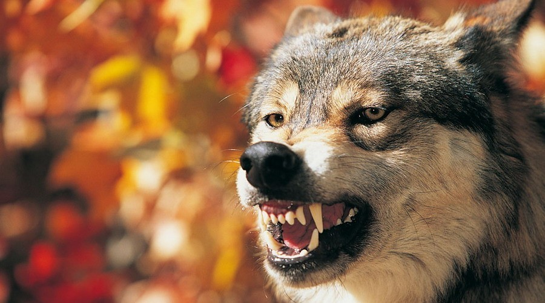
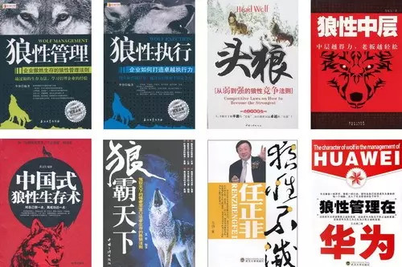
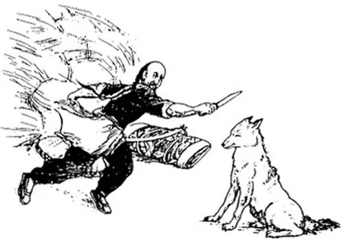
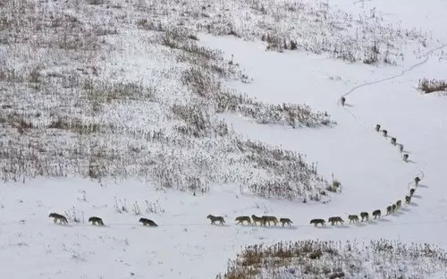
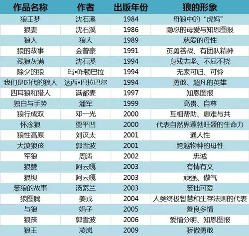
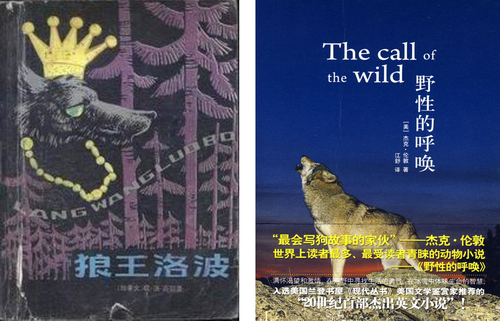
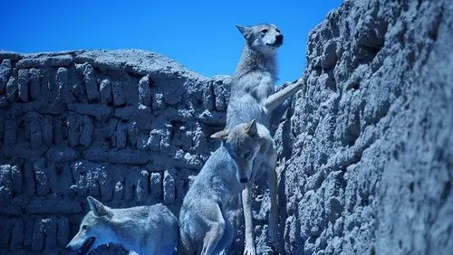
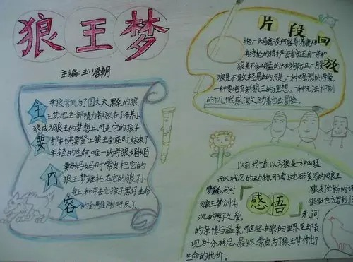
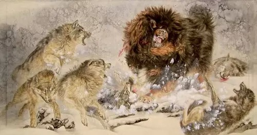

##  狼的中国进化史  | 大象公会

_2015-03-11_ 大象公会 大象公会

**大象公会** 

idxgh2013

知识，见识，见闻。最好的饭桌谈资。知道分子的进修基地。

__ __

**世界上有两种狼，一种生活在自然界，一种生活在中国作家笔下，后者拥有今天中国人推崇的一切高贵品德和精神，它是怎样进化出来的？**

  

**文/黄章晋**

  

全世界没有哪个地方像如今的中国一样喜欢狼、崇拜狼。今天，无论是战场、商场还是职场，狼都是中国人的精神导师。只要上网或者上书店看一下，就很容易知道狼已经是中国
人的图腾。

  
**一些与狼性相关的畅销书**

  

不过，这几乎是一瞬间才发生的。要说清楚这个奇迹般的现象，或许要从狼的中国进化史说起。

  

历代先贤大哲若知道今天的中国人崇尚以狼为师，应该从坟里跳出来。

  

从《诗经》、《左传》、《国语》、《山海经》到《聊斋志异》，自古以来关于狼的传说和故事中，它的形象都是凶残、贪婪和不可姑息同情的。汉语中与狼相关的词汇，除狼吞
虎咽这种少数中性词外，几乎全部是贬义，像狼心狗肺、狼子野心、狼狈为奸、引狼入室、鬼哭狼嚎、披着羊皮的狼之类，几乎是汉语中的顶级贬义词。

  
**《聊斋志异》中《狼三则》插图。《狼三则》是写屠夫在不同情况下遇狼并杀狼的故事。第一则着重表现狼的贪婪本性；第二则着重表现狼的欺诈伎俩；第三则着重表现狼的爪牙锐利。但最终却都落得个被屠夫杀死的下场**

  

狼在中国人观念中最经典的形象是“中山狼”，它是小学生课本中《东郭先生与狼》的原型，而这个故事中救狼、狼恩将仇报、找第三方主持公道、狼上当受惩这四个重要环节，
在印度等国的传说中有更古老版本，而且各版本中坏东西多是狼，应能说明世界各民族对狼的看法出奇一致——在英语、蒙古语、诸突厥语，与狼相关的谚语和词汇也总是负面的
。

  

有趣的是，老虎、狮子远比狼要凶猛可怕，但在不同文化中，形象都要高大得多，它是描述威武、雄壮、英雄气概最常用的比喻方式，虽也会用在负面表达或评价上，但至少算得
上是毁誉参半。

  

今天中国突然以狼为师，当然是中国人笔下的狼突然变了，它进化成了一种地球上从来没有出现过的物种。

  

古人笔下的狼，多是独来独往，或是两三只成群，以今天人们的知识看，它未必是狼生存方式的完整准确呈现，甚至有可能是错误的总结，但它是一种可以理解的、因观察角度所
限而犯下的错误。

  
**BBC纪录片《冰冻星球》中，25头森林狼成群结队，穿过厚厚的冰雪去追踪北美野牛**

  

譬如，中国民间关于野兽凶狠程度普遍有“一猪二熊三老虎”的排序。实际上，这个排序完全是倒过来的，野猪是老虎的重要食材，而老虎捕食熊、熊捕食野猪也并不稀罕。

  

但从人的日常观察角度看，这个错误的排序完全可以理解：野猪经常会因为成群结队侵入农田与人发生冲突，而熊与人的冲突就少得多，老虎则更少。尤其是，野猪攻击力较弱，
与人发生冲突时，会对人造成极为惨烈的伤害，攻击力强大的熊解决战斗迅速，很难造成遍体鳞伤肚破肠流的残相，如果老虎主动攻击人，人们只会发现上山的邻居失踪了。

  

而今天中国人笔下的狼，首先规模急剧膨胀，比如《狼图腾》中的狼群动辄几十只，这是今天中国狼群的标准规模，它已经达到或超过中国野生食草动物结群的规模，这个规模已
经比较克制，冯远理先生《那些本不该消失的生命》中的狼群规模，甚至达到或超过非洲大草原上食草动物的规模，而富有想象力的金庸先生笔下的狼群，其规模只有蚂蚁、蜜蜂
和蝗虫才能与之相比，《书剑恩仇录》是这么描述新疆沙漠中的超大狼群的：“远处一片黑云着地涌来”、“不知有几千几万头饿狼”。

  

狼的规模急剧膨胀，自然会表现出强烈的社会性。古人笔下的狼，不过是一种凶残的野兽，并无社会等级，更谈不上角色分化。而今天的狼，不但拥有今天中国人推崇的一切美德
：坚韧、顽强、进取、团结、牺牲精神（此处可省略两百字）。有的狼群甚至会有一位类似成吉思汗、毛泽东式高瞻远瞩、雄才大略的狼王。

  

没错，狼变了。

  

狼在中国的进化始于1980年代中国作家突然开始写狼。狼先是小心翼翼地表现出一些闪光点，譬如对后代、伴侣也是有感情的，而且它也是智慧甚至是可爱的，比如1987
年创刊的《大灰狼》中，狼已经是可爱的了；1990年代后，写狼的中国作家越来越多，在生态环境、传统文化之类话题上，狼开始理直气壮地成为值得同情的牺牲品；在新世
纪的“狼文化热”中，它终于慷慨激昂地成为中国人民的精神导师。

  

**1980年代以来部分以狼为主题的代表性文学作品**  

  

写狼的中国作家，绝大部分只在动物园见过狼，不排除他们当中有人能分得清哈士奇犬和狼，但后面将谈到他们其实还没人能正确可靠地描述家畜以外的动物。他们关于狼的各种
灵感当然来自1978年后海外观念的影响。

  

对中国狼影响最大的，应该是欧内斯特•汤普森•西顿的《狼王洛波》和杰克•伦敦的《野性的呼唤》。这两本书其实在一百年前就被翻译到中国。但真正在中国社会造成知识和
观念冲击，是在1978年改革开放后的重新翻译出版。

  
**《狼王洛波》与《野性的呼唤》**

  

《狼王洛波》中包括狼的社会化特征在内的大量细节，是汉语世界全新的知识，而《野性的呼唤》提供了一种全新的反人类中心的视角，带来的是强烈的观念冲击。中国作家关于
狼的文学作品，无论是强调狼某些可贵的品质，还是从生态角度重新审视人与自然关系，都可从这两本书中找到源头。

  

虽然你可以认为，这些中国作家是西顿和伦敦下的蛋，但他们比西顿和伦敦不知道高到哪里去了。因为西顿和伦敦作品中的狼，多少也在真实基础上赋予了一定浪漫想象，而中国
作家笔下的狼，则完全是写实表象下天马行空的狂想，西方人再进化一百年也达不到今天中国作家的水平。

  

诚然，西顿和伦敦虽然有与狼真实交道的优势，尤其是西顿，他本人是个著名的博物学家，而中国作家虽然没人说得清猫科动物和犬科动物的区别，但他们的优势恰好也在这里，
这样狼才能进化成不但具备种种中国人推崇的美德，而且是人类在商场、战场上最高智慧的发明者——《狼图腾》不但认为“狼懂气象，懂地形，懂选择时机，懂知己知彼，懂战
略战术，懂近战、夜战、游击战、运动战、奔袭战、偷袭战、闪击战,懂集中优势兵力打歼灭战。”，而且进一步推论“狼子兵法”是《孙子兵法》的源头之一。

  

《狼图腾》是引爆中国“狼文化热”的原子弹，但《狼图腾》中出现的狼，远远算不上它在中国进化史中的最顶级，虽然书中出现的狼，掌握的某些技能甚至超过了中国作家，譬
如狼在跳进羊圈高高的围墙后，在牧民赶来时，它们机智地在围墙下迅速将死羊的尸体像堆沙袋一样码成一个斜坡，翻墙逃离现场。

  
**电影《狼图腾》剧照**

  

譬如冯远理先生《那些本不该消失的生命》中的狼明显就比《狼图腾》中的狼进化得更高级，虽然该文只是简略地讲述了一个惊人的故事：1970年3月，青海贵德县附近的老
虎坡，一支200人的解放军在拉练宿营时被狼群包围，狼群采用分割包围的办法让67名解放军丧生狼口。

  

狼在没有语言没有地图没有通讯工具的情况下，能在旷野迅速组织起分工明确、规模极大的狼群，从狼的智力进化上说，它只有两种可能：

  

一、狼的智力已经进化得比人更强。人类学有个著名的“邓巴数字”，即人类学家罗宾•邓巴发现，大脑的认知能力决定了人类拥有稳定社交网络的人数是148人，而这个狼群
的规模已经超过“邓巴数字”好几倍。

  

二、该狼群不是一个狼王率领一群狼兵的扁平化组织，而是进化出了复杂的科层结构，并且狼已经进化掌握了一套可以表达复杂精密意思的身体语言（它显然需要比语言更高级的
智力），只是人类目前尚不知道。

  

另外，在一块面积有限，猎物极为稀少地区，居然生活着数量如此庞大的狼群，我们不难推测，狼不但平时是不以捕猎为生的，而且它们必然有某种神秘的、不消耗能量的生存技
术——在高原荒漠地区，单位面积能生存的食草动物也是非常有限的。

  

著名动物故事作家沈石溪笔下的狼，虽然在狼群数量的进化上没有跟上同行脚步，但在狼的心智和情感进化上成就斐然。

  

沈石溪的《狼王梦》中，那个要把后代培养成狼王的母狼紫岚，在培养三个儿子失败后，又将希望寄托在外孙身上，为了让外孙们有个安全的成长环境，最后竟与金雕同归于尽，
虽然她没有看到成功的那一天，但比起今天新闻中以“狼性教育”培养子女成才的几个著名“虎爸”“虎妈”，其苦心孤诣更值得千万中国“虎爸”“虎妈”学习。

  
**一位小学生读《狼王梦》的读书小报**

  

而他的《狼妻》中，待产的母狼一眼看穿了披着公狼皮的“我”只是妄图冒充它丈夫，但英明地预见到“我”这个动物学家为了研究而扮演公狼的角色，将会每天带回小动物，所
以一直假装蒙在鼓里。该母狼镇定自若处惊不变的演技，完全可以秒杀孙红雷。

  

杨志军先生的《藏獒》虽然写的不是狼，但它也可视为“狼文化”中的一支。杨志军确实有足够的理由藐视《狼图腾》，因为杨笔下的藏獒，在品性的高贵上，比姜戎在《狼图腾
》中塑造的狼要高出几个量级。

  

譬如《狼图腾》中狼不顾伤亡冲进马群的情节，在小说中被形容为壮烈的自杀式攻击，严格说来，它只是有伤亡风险，与必求一死的日本神风自杀攻击不是一回事，而《藏獒》中
，争斗獒王地位失败的藏獒，在对手试图以宽恕姿态让其臣服时，毅然跳崖自杀，这才是完完全全的武士道切腹风范。

  

当然，《狼图腾》中狼王为了不让受伤的同伴落在人的手中受辱，在其颈部狠咬一口成全其名节，阿云噶的《狼赞》中，公狼为了不让自己的情人受人羞辱咬断母狼的颈动脉，这
些帮“人”自杀的行为也很让人感动。

  

尤其让人动容的是，藏獒若不幸得了瘟疫，在自知必死时，从容、决绝、饱含深情却又绝不留恋地离开獒群、离开主人的帐篷，孤独地走向荒野，静静等待死亡，等待狼群，因为
它要用自己的死，把瘟疫传染给狼群。

  
**画家笔下，藏獒与狼群搏斗的场景**

  

我操，人类历史上出现过这样的英雄吗？

  

狼在中国的进化是大跃进式的，所谓大跃进，指的并非进化速度，而是在方向上的随心所欲，譬如沈石溪和蒙古族作家郭雪波的狼，舌头进化出了猫科动物才有的倒刺，看上去没
有太多必要性。

  

还有些作家笔下的狼，进化出来的性格对狼来说简直是一场灾难。比如把军车困在戈壁滩的狼群，会前赴后继地消耗司机的子弹，为了坚持到最后的胜利，在没有食物的情况下靠
吃被打死的同伴为生……狼若真进化成不懂得趋利避害不会算计成本收益的野兽，它会迅速自我灭亡。

  

事实上，狼不用那么疯狂，只要像中国作家笔下那样，不吃嗟来之食，坚持祖先的骄傲和自尊，它们确实早该灭亡了。BBC近年一部关于狼的纪录片或许可以告诉我们狼是怎么
适应环境进化的：

  

中南欧的山林中还有一小群狼，人们好奇在几乎无猎可捕的环境中它们如何生存，因为它们几乎不祸害农家的禽畜，摄制组后来发现，原来它们晚上进城，熟门熟路地找到垃圾箱
，因为那里有非常丰富、现成的食物。

  

即使是荒野中的狼，也是很容易通过投放食物让它们迅速变得像汪星人一样，见到主人就摇着尾巴围上来蹭来蹭去。

  

**一群与人亲昵的狼，看上去与汪星人无异**

  

——中国国境之外的狼展现的完全是另外一种进化方式，如果你热爱中国作家笔下的狼，当然可以说，高贵、骄傲、自尊的中国狼与国外的狼是两种不同的动物，因为塑造狼文化
的中国作家与他们的国外同行相比，看上去也是完全不同的两种哺乳动物。

  

前面谈到，无论是从狼的能力、智慧和品格上看，《狼图腾》在狼的中国进化史上都算不上巅峰，但为什么只有它才会成为独一无二的经典？蒙古人存在狼图腾吗？为什么中国社
会今天兴起了一股“以狼为师”的文化热？

  

**请关注续文。**

  

**版权声明**

****大象公会所有文章均为原创，****  

****版权归大象公会所有。如希望转载，****

****请事前联系我们：****

bd@idaxiang.org

****知识 | 见识 | 见闻****

阅读

__ 举报

[阅读原文](http://mp.weixin.qq.com/s?__biz=MjM5NzQwNjcyMQ==&mid=211363298&idx=1&sn
=d133ff2ed4f42774d688e868b58e60ca&scene=1#rd)

