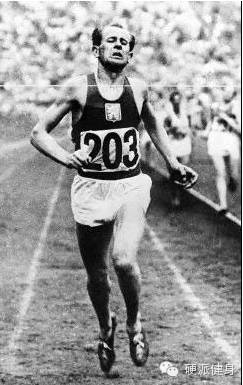
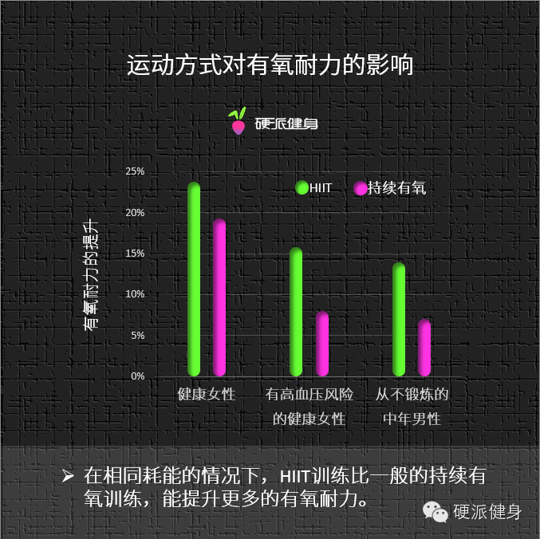
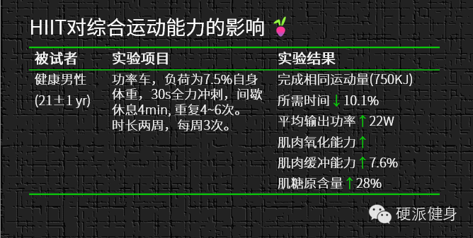

##  瘦的更多！  跑的更快！

_2015-02-25_ _斌卡_ 硬派健身 硬派健身

**硬派健身**

oh-hard

最专业  **  靠谱  **  蠢萌的运动健身科普

__ __

  

我们一直在强调HIIT的超强减脂能力以及其省时间、易操作的优点，不如今天我们也来谈谈HIIT对有氧耐力的影响。

  

近年来国内的马拉松比赛越来越多，参加马拉松的爱好者也越来越多。很多人喜欢跑步，但又害怕HIIT只是减脂，不能提高他们的有氧能力。

  

但其实这种担忧是非常没必要的，因为间歇训练，一开始就是被发明出来提高有氧能力的啊！

  

**HIIT的前世今生**

  

上个世纪50年代，素有“人类火车头”之称的、三项长跑奥运冠军埃**扎托皮克就创造了间歇跑训练法；

  

德国教练员波**格施勒博士和心脏学家赫伯特博士对间歇训练进行了进一步的验证和改进，并通过应用使德国运动员在20世纪40-50年代三次打破田径世界记录。

  

****20世纪60年代初期，澳大利亚的卡莱尔夫妇将HIIT运用到了游泳训练当中，在当时的泳坛大放异彩。从此HIIT便成为田径运动员最重要的训练方法之一。

  

****20世纪末期，HIIT被发现对减脂的效果更好，于是没多久就席卷了全球，从体坛走到民间，并成为最重要的运动方式之一。

  

  

_“人类的火车头”_

  

所以，在一开始HIIT并不是减脂的最佳手段，而是提高有氧耐力的方法之一，我们甚至可以说，可能是最好的方法之一。

  

****HIIT对有氧能力的提升****

  

那么，怎么判断有氧能力是否得到提升呢？这其中有一个很重要的因素和标准，那就是最大摄氧量（VO2max）。

  

**什么是最大摄氧量？**   
  
最大摄氧量(maximal oxygen consumption, VO2max)是指在人体进行最大强度的运动，当机体出现无力继续支撑接下来的运动时，所能摄
入的氧气含量。作为耐力运动员的重要选材依据之一，是反映人体有氧运动能力的重要指标，高水平最大摄氧量是高水平有氧运动能力的基础。

  

研究人员发现耗能量相同的间歇运动训练与持续训练方案相比，最大摄氧量提高更多。在相同耗能的情况下，HIIT训练，比一般的持续有氧训练，能提升更多的有氧耐力。  

  

（数据来源①②③）

  

另外，HIIT对于身体的有氧耐力提升不止于此，还有很多其他的方面。比如肌肉内能源储备、肌糖原的提升，以及综合运动能力的提升：

  

  

  

通过上面这个图表我们可以看到，经过了两周间歇训练之后，受试者的肌肉氧化能力、肌肉缓冲能力以及肌糖原含量都提高了。

  

要知道肌糖原的储备决定了运动力竭的时间，提升28%相当于在手机只剩最后一格电的时候竟然还坚持了半个小时！

  

等于说HIIT不仅不会损害你的有氧耐力，还增加了你的有氧耐力。同时你每分钟输出的功率更大，也就让你跑得更快！你整体需要花的时间，当然也就更少了。

  

所以说如果你是有氧运动爱好者的话，常做HIIT不仅能让你减脂，还能提高你的有氧耐力；而如果你是马拉松爱好者的话，那么HIIT能够帮助你获得更好的成绩，一次次
地超越自己。

  

  

* * *

①Trapp EG，Chisholm DJ，Freund J，et al．The effects of high-intensity
intermittent exercise training on fat loss and fasting insulin levels of young
women．Int J Obes（Lond），2008.  

②Ciolac EG，Bocchi EA，Bortolotto LA，et al．Effects of high-intensity aerobic
interval training vs．moderate exercise on hemodynamic，metabolic and
neuro－humoral abnormalities of young normotensive women at high familial risk
for hypertension．Hypertens Res，2010.

③Nybo L，Sundstrup E，Jakobsen MD，et al．High-intensity training versus
traditional exercise interventions for promoting health． Med Sci Sports
Exerc，2010.

阅读

__ 举报

[阅读原文](http://mp.weixin.qq.com/s?__biz=MzA5NjQwMTQxOA==&mid=206240119&idx=1&sn
=62f0eae74190743e5384761b8cdd1317&scene=1#rd)

