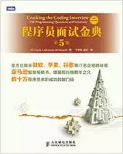
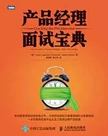

##  程序员与PM的面试季——重磅好书助攻

_2015-03-10_ 图灵教育 图灵教育

**图灵教育** 

turingbooks

是好书，把我们联系在一起

__ __

**小编语**

  

最近网上的跳槽潮可谓一浪高过一浪啊！这不，小编也来火上浇个油，愿大家在新的一年里事业越烧越旺。在这个激（ Kuang）动（Zao）人（Bu）心（An）的季节
里，小编要向大家隆重推荐两针强心剂：技术面可保您代码无bug，管理面可佑您变身PM全能王。接下来闪亮登场的两位主角就是，《程序员面试金典（第5版）》和《产品
经理面试宝典》！若你能分享给需要的小伙伴，那真真是极好的，小编跪谢了！

  

**作者：Gayle Laakmann McDowell**

**译者：李琳骁 漆犇**

**上市时间：2013.11**  

  * 数十万程序员求职成功的敲门砖

  * 亚马逊超级畅销书，雄踞排行榜数年之久

  * 全方位揭示微软、苹果、谷歌等IT 名企招聘秘密

  * 150个编程题问答

  * 5种应对棘手算法题的有效方法

  * 10种面试者最容易犯的错误

  * N条准备面试的策略

  

原谷歌资深面试官的经验之作，层层紧扣程序员面试的每一个环节，全面而详尽地介绍了程序员如何应对面试，才能在面试中脱颖而出。第1～7章主要涉及面试流程解析、面试
官的幕后决策及可能提出的问题、面试前的准备工作，以及对面试结果的处理等内容；第8～9章从数据结构、概念与算法、知识类问题和附加面试题4个方面，为读者呈现了出
自微软、苹果、谷歌等多家知名公司的150道编程面试题，并针对每一道面试题目，分别给出了详细而精巧的解决方案。

**目录**

序

前言

第1章　面试流程

第2章　面试揭秘

第3章　特殊情况

第4章　面试之前

第5章　行为面试题

第6章　技术面试题

第7章　录用通知及其他

第8章　面试考题

第9章　解题技巧

  

  

**作者：Gayle Laakmann McDowell，Jackie Bavaro**

**译者：吴海星 陈少芸**

**上市时间：2015.03.20**

  * 谷歌前面试官Gayle McDowell重磅打造

  * 超级畅销书《程序员面试金典》姊妹篇

  * 产品经理及项目经理超级畅销书

  * 从技术走向管理的必读之作

《产品经理面试宝典》针对IT行业产品经理，以面试为主线，首先介绍产品经理职责、谷歌微软等知名企业中产品经理的作用和要求，然后采访了几位知名企业的产品经理，介
绍成为产品经理的基本素质，之后是从简历准备到各公司面试要点到具体面试问题分析，这部分是本书的重点内容。

**目录**

第1章 简介

第2章 产品经理的职责

第3章 公司

第4章 积累合适的经验

第5章 职业发展

第6章 面试内幕

第7章 简历

第8章 真实的简历：修改之前和之后

第9章 求职信

第10章 研究公司

第11章 定义自我

第12章 行为问题

第13章 估算问题

第14章 产品问题

第15章 案例分析问题

第16章 编码问题

  

阅读

__ 举报

[阅读原文](http://mp.weixin.qq.com/s?__biz=MjM5Njc0MjIwMA==&mid=203466259&idx=1&sn
=2663a438e75ca885ac77d51e26ef717d&scene=1#rd)

