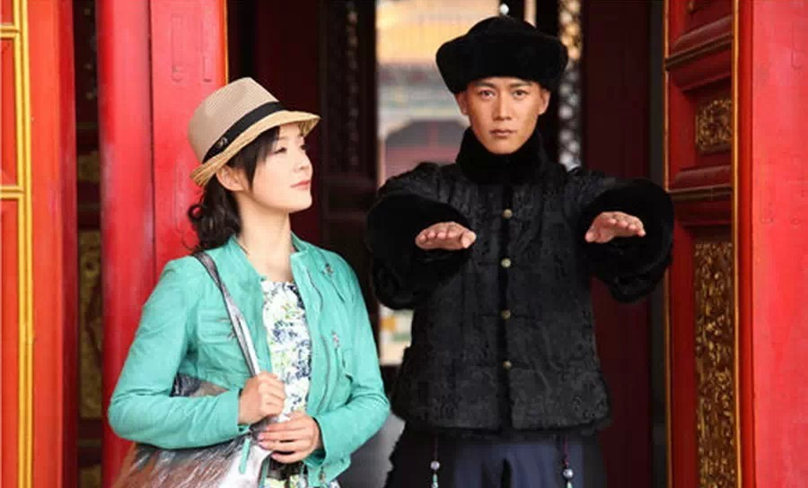
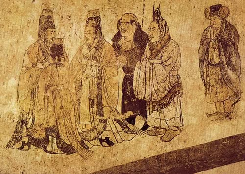
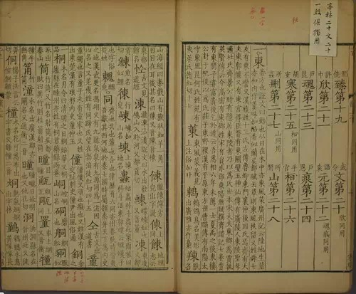
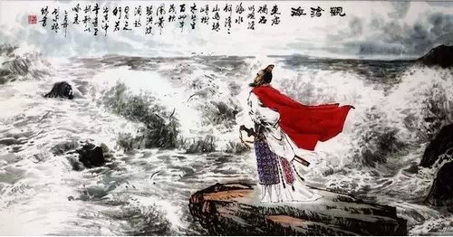
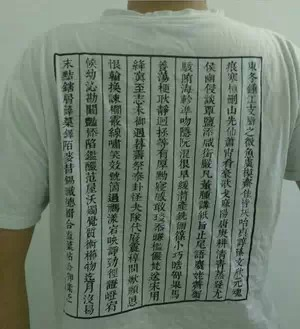
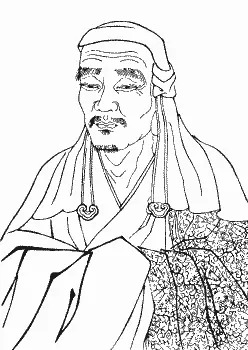
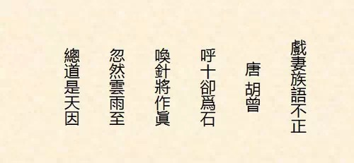
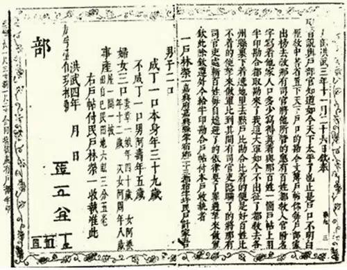
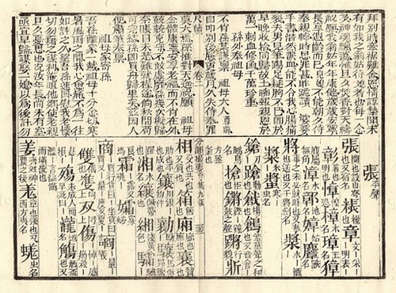

**据说古代中国是讲粤语的。用粤语读唐诗，比普通话更有韵味——后者已经被满语等改造的偏离了古音。同样的版本还有闽南语等。真的是这样吗？**  

  

**文/郑子宁**

  

带上一把手枪，一箱子弹，穿越回冷兵器时代建功立业，往往是屌丝们的梦想。不少以此为题材的网络小说长盛不衰。

  

不过，适应真正的穿越需要极高的技术含量。忽略掉皇阿玛戴手表、汉朝的椅子、唐朝的西红柿等细节，穿越作品更大的问题是语言——互相听不懂对方的口音。

  

残酷的事实是：穿越到清朝当格格贝勒贵妃，勉强能够圆梦；穿越回元明，古人多半会觉得主角口音怪异，但还能约莫听懂；穿越到唐朝以前就比较惨，运气好点会被当做东国来
客，由鸿胪寺接待后送去学习汉语；运气差的，也许会直接被处理为外国奸细。

**鸿胪寺，唐朝外交礼仪机构。图为唐章怀太子墓道东壁《客使图》，描绘了唐代鸿胪寺官员接待使节、来宾的情景**

  

一些人认为，那用文言文不就解决了？

  

这倒是个方案。不过很难操作——且不说地道的文言学与现在初高中的教学差异多大，平常的古人也不会用文言文说话。哪怕完美学会了文言的语法词汇，也只能和小部分人笔谈
，仿佛外国来客。

  

那么，古代的读音究竟是怎样的？如何确定哪些是古音？换作粤语就可以和古人无缝衔接了？

  

**【变化的语音】**

  

解释这些问题，要先从汉语的独特性质说起。

  

与拼音文字不同，汉字很大程度上独立于语音——也就是说，语音的改变并不反映在文字上。

  

这一特点不但让一般人对于语音的变化缺乏意识，让穿越徒增困难，还给研究历史音变的专家增加了麻烦。

  

古人并没有留下任何音频、视频，现代读音又受复杂的历史变迁干扰，语言学者怎么就知道哪些是古音呢？

**《大宋重修广韵》普遍认为是现存最权威的韵书**

  

其一，靠韵书。

  

韵书大体相当于古代的字典，自然要标注读音。汉语韵书普遍采用反切法：将一个字的声母和韵母声调分拆，分别用其他字标注。

  

举例来说，《大宋重修广韵》中“东”就被注为“德红切”——采用“德”的声母，“红”的韵母和声调。

  

当然，能读懂反切法，必须要知道所用字的读音，这恰恰是今人未知的目标。不过，对反切注音的整理虽不能直接确立读音，但能得出当时语音系统的框架。

  

其二，靠汉字本身。

  

汉字并非完全独立于语音，还会有大量的形声字，通过对古今声旁的对比，能提供线索。如“路”声旁为“各”，普通话两字读音根本就不搭界，但古人会用“各”做“路”声旁
，说明古代两字读音必然接近。

**司永禄先生描绘的《观沧海》，该诗就算用切韵音读也已经不押韵**

**  
**

  

**《观沧海》中古汉语朗诵版**

**  
**

**东临碣石，以观沧海。**

**水何澹澹，山岛竦峙。**

**树木丛生，百草丰茂。**

**秋风萧瑟，洪波涌起。**

**日月之行，若出其中。**

**星汉灿烂，若出其里。**

**幸甚至哉，歌以咏志。**

  

第三，诗文押韵。

  

曹操《观沧海》一诗中，“海”、“峙”、“茂”、“起”、“里”、“志”六字押韵，在现代，几乎任何一种汉语方言都不能做到全押。整理诗词押韵的变化，也是研究的重要
方向。

  

第四，外语和现代方言。

  

外语主要指曾大量翻译进汉语的语言。如佛教用语的梵语和巴利语。家喻户晓的“夜叉/药叉”，来源于梵语यक्ष（yakṣa），即可说明当年夜/药的读音很可能接近y
a或yak，和今天不同。

  

最后，还有些散见于文献中，并不系统的描写。

  

《吕氏春秋》中，东郭牙观察到齐桓公口型“呿而不唫”（开而不闭），成功判断出齐桓公“所言者‘莒’也”，将齐桓公和管仲谋划讨伐莒国的事泄露了出去。按照今天的普通
话呼“莒”，则口型甚小，也能帮助人们对比出古音。

  

通过以上方法综合分析，学者可以回溯古代汉语的读音体系。

  

举例来说：“塔”本来自巴利语थुप（thūpa），在《广韵》中为“吐盍切”，通过整理可认为属于盍韵，而现代方言中粤语读taap，朝鲜汉字音读탑（tap），综
合考虑则可认为“塔”和与其一个韵母的所有盍韵字（如“阖”、“盍”等字）在古代韵母非常有可能均为ap。

  

目前，学界普遍以《切韵》《广韵》等书中的语音作中古汉语基准，复原可信度已经相当之高。

  

那么，以此来对照，粤语是否就符合古代的读音呢？广东人就可以顺利穿越到唐朝，交流无碍？

**《广韵》共分206韵，其音系规模远比现代汉语任何一种方言庞大**

  

**【广东话是唐朝官话？】**

  

遗憾的是，这是个彻头彻尾的幻想，没有一丁点可信的成分。

  

和现代一样，古代的地区之间也存在语音差别。唐朝时，广东还属于中原人眼中蛮荒地区，韩愈被贬至潮州时绝望到写出了“知汝远来应有意，好收吾骨瘴江边。”的诗句。它和
其他地区，特别是高大上的中原口音存在着差别。

  

最能直观说明这些差别的还是佛教禅宗六祖。慧能出生于新州（今广东新兴），他初见五祖弘忍时弘仁责曰：“汝是岭南人，又是猲獠，若为堪作佛？”后来慧能拜别弘忍时也自
称：“慧能生在边处，语音不正，蒙师传法，今已得悟，只会自性自度”。其实，慧能本籍为河北范阳，家在岭南不过一两代人的功夫，但是已经“语音不正”，说明至少唐朝人
并不觉得岭南人讲话正。

  

**禅宗六祖慧能**

  

真正地位崇高的语音，一向是中原读书人的口音，尤其是洛阳一带。

  

东晋永嘉南渡后，士大夫诵读的口音被称之为洛生咏，备受推崇。《颜氏家训》中谈及语音称：“榷而量之，独金陵与洛下耳”。唐宋时期，洛阳读书人的发音仍然有极高的地位
。北宋寇准和丁谓一次谈及语音，论及天下语音何处为正，寇准说“惟西洛人得天下之中”，丁谓则说：“不然，四方皆有方言，惟读书人然后为正。”

  

南宋陆游《老学庵笔记》中仍有“中原惟洛阳得天下之中，语音最正”的说法。

  

但是，即使粤语不是唐朝官话，但相对于北方官话，粤语真实的保留了不少中原旧音。

  

中唐以后，北方陷入长期的战乱和异族统治，汉语由中古汉语转换为近古汉语。

  

唐懿宗时，胡曾有《戏妻族语不正》诗，生动反应了当时的语音变化。

**胡曾妻族“十”“石”同音，“针”“真”同音，“阴”“因”同音在当时属于语音不正现象**

  

  
**《戏妻族语不正》近古汉语朗诵版**

**  
**

**呼十却为石，**

**唤针将作真。**

**忽然云雨至，**

**总道是天因。**

  

此时，偏居一隅的岭南却很少受到北方发生的音变影响，受到高大上的中原知识分子的注意。

  

南宋朱熹《朱子语类》中有如下评价：“四方声音多讹，却是广中人说得声音尚好。盖彼中地尚中正。自洛中脊来，只是太边南去，故有些热。若闽浙则皆边东南角矣，闽浙声音
尤不正。”可以看出，读书人认为其继承了中原洛阳地区的语音，所以“尚好”。

  

宋元明清四朝，北方语音变化愈厉。相对而言，岭南地区更加安定，语言的保守性愈加突出。

  

经济上的发展，更令曾经的蛮荒之地挺起了腰杆。尤其是广州，发展水平逐渐超越了中原地区，岭南人的文化自信逐渐提高，并自视为古中原的继承者。

  

广州人陈澧在《广州音说》里面就明确指出：“广州方音合于隋唐韵书切语，为他方所不及者，约有数端”。并举例论证：广州话能分阴上阳上阴去阳去，有-m尾，“觥公”、
“穷琼”读音不同等，均为佳例（不过广州“九狗”无别，“呼夫”不分等不合古音的方面就被选择性地无视了）。

  

之后，又写道：“至广中人声音之所以善者，盖千余年来中原之人徙居广中，今之广音实隋唐时中原之音，故以隋唐韵书切语核之而密合如此也。”陈澧可算是粤语为唐朝官话说
法的滥觞了。

  

**【胡化？】**

  

不过，北方汉语是否真的胡化了呢？

**朱元璋的口语圣旨，颇有元朝遗风**

  

多数人并不了解真正胡化的语言是什么样子。金元时期曾经流行过一种奇怪的汉语：“汉儿言语”，语序近似蒙古语，语法也受阿尔泰影响，如复数加“每”等特点。

  

具体来说，元碑中“长生天气里，大福荫护助里皇帝圣旨”这种现代看来很拗口的句式，即为汉儿言语，但明朝以后基本消亡了。

  

实际上，语音变化本为常态，虽然北方话由于社会动荡等原因可能变得比某些南方方言快了些，但很难将这些变化归咎于胡语影响。如入声在中原的弱化至迟在北宋已经开始，彼
时“金元虏语”离得还远呢。

  

翘舌音被许多人认为是“北方胡化说”最重要的证据之一。其实，许多南方话也是很晚近才将翘舌音丢掉。

  

苏州长沙成都南京等地的老派方言都有翘舌音，广州话在一百多年前也是有“翘舌音”。无论韵书《分韵撮要》、早期传教士，还是香港人民地名拼写，均分平翘。

  

所以，想要无缝的穿越回唐朝，光讲一口流利的粤语是不够的，即便是土生土长广东人，还是需要大量的音韵学知识。

**《分韵撮要》书影，可以清楚看到“相”“商”两字音不同，现代粤语则已经合并（图片来源：澳大利亚国家图书馆）**

  

**版权声明**

****大象公会所有文章均为原创，****  

****版权归大象公会所有。如希望转载，****

****请事前联系我们：****

bd@idaxiang.org

****知识 | 见识 | 见闻****

阅读

__ 举报

[阅读原文](http://mp.weixin.qq.com/s?__biz=MjM5NzQwNjcyMQ==&mid=209403636&idx=1&sn
=35b5a6d19e423edb7fce9fb60bfd87e9&scene=1#rd)

