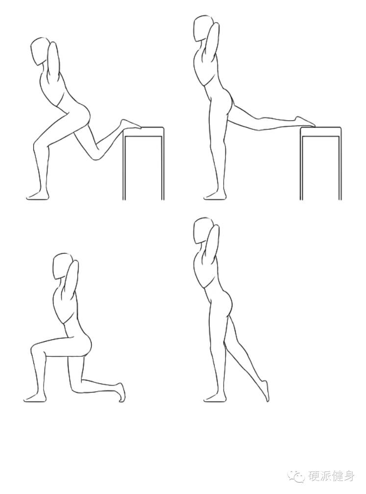
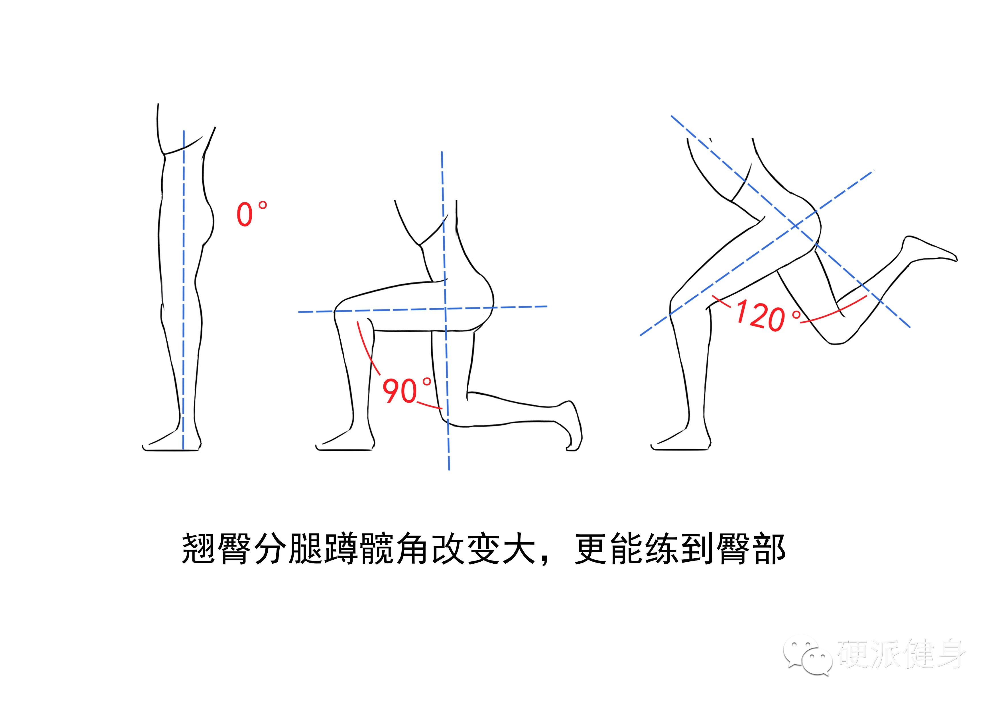
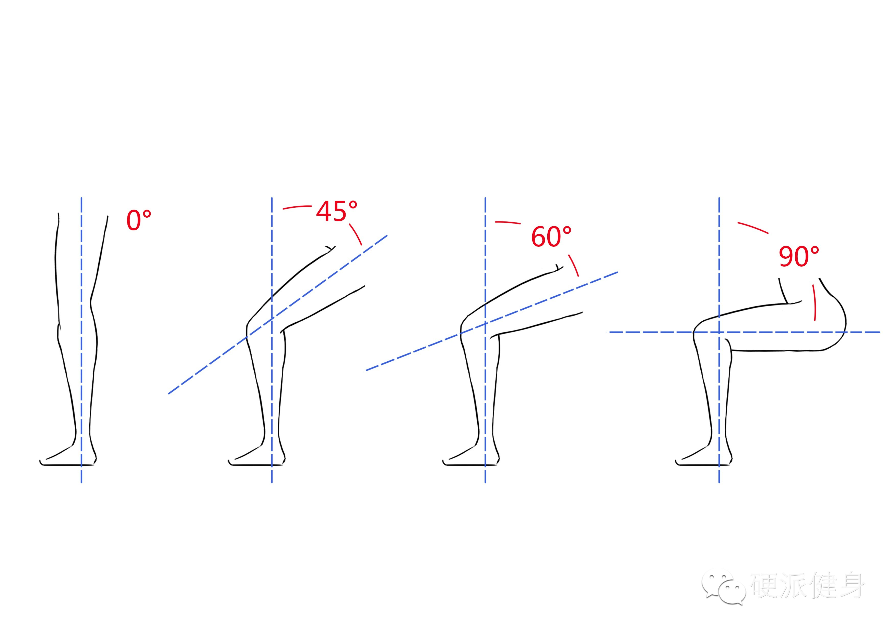
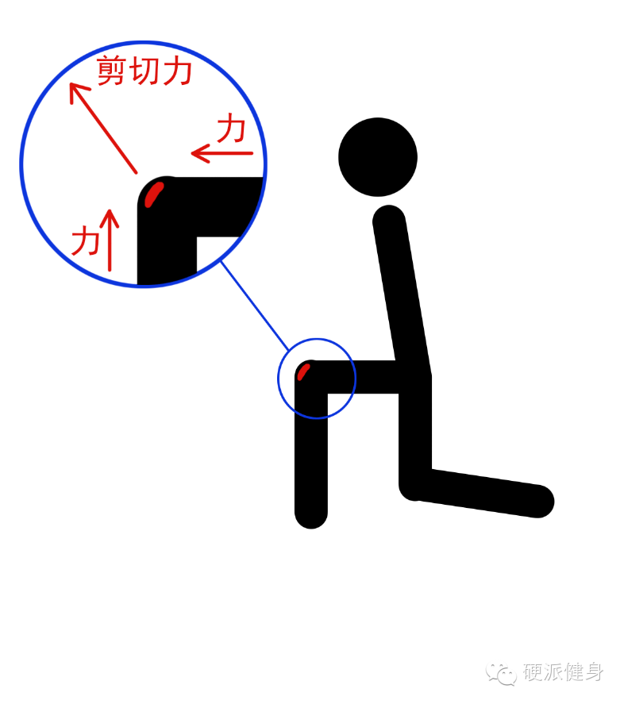
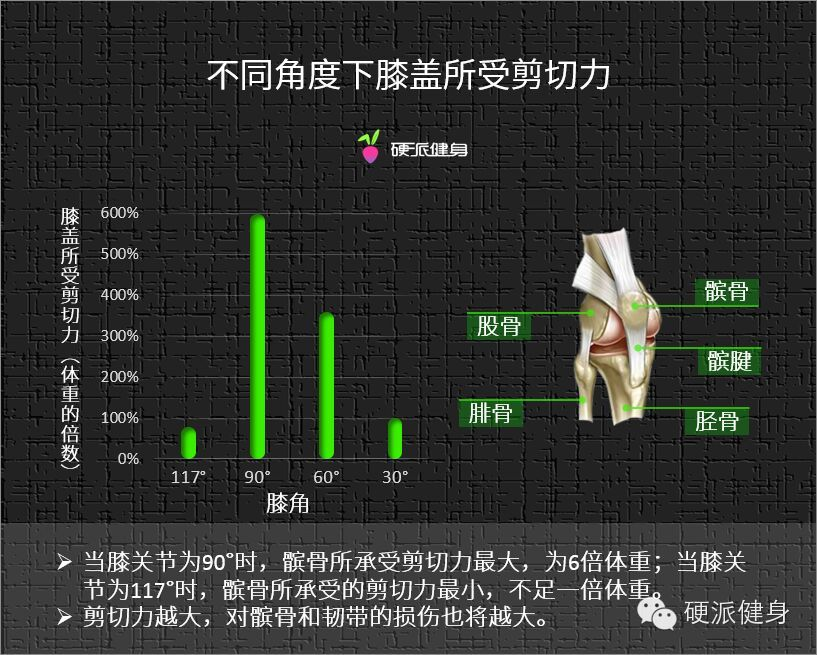
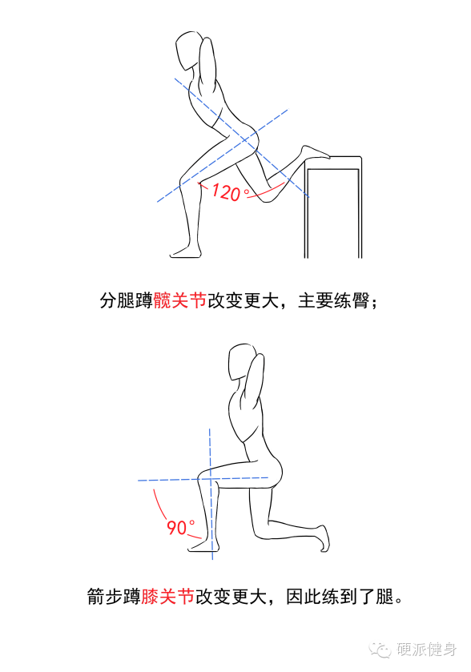
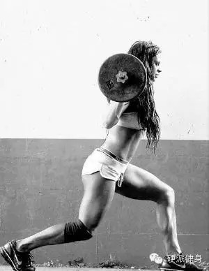
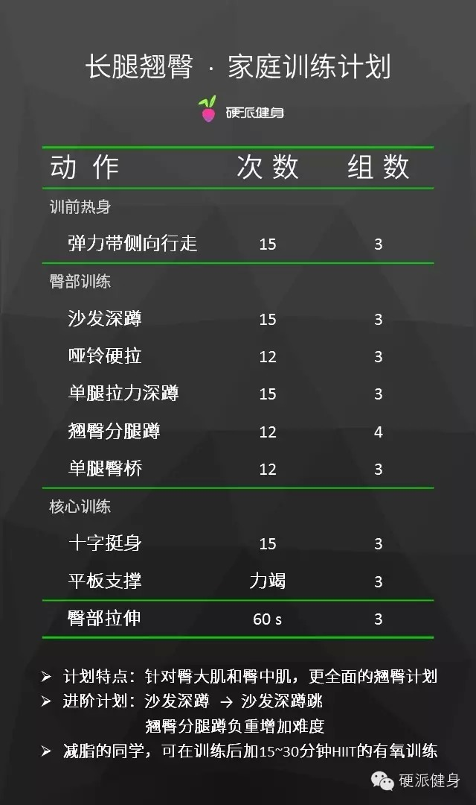

##  翘臀不作死  安全练长腿

_2015-03-10_ _斌卡_ 硬派健身 硬派健身

**硬派健身** 

oh-hard

最专业  **  靠谱  **  蠢萌的运动健身科普

__ __

  

> #### 内容概要

>

>   * 翘臀分腿蹲VS传统箭步蹲，胜！

>

>   * 翘臀的关键：更大的髋角改变

>

>   * 翘臀分腿蹲对膝盖的伤害更小

>

>   * 翘臀不粗腿，最佳选择的关键！

  

上周我们介绍了练翘臀的动作——翘臀分腿蹲之后，童鞋们的反响都很热烈，看来臀部果然是大家最关心的部位之一，尤其三月，将自己裹成一只熊的季节已然过去，出门携带大
长腿和翘臀的季节即将来临。此刻正是做准备的好时机，童鞋们也要努力才行，不然一眨眼就又是一个徒伤悲的夏季……  

  

  

  

翘臀分腿蹲不仅可以让你的臀部挺翘，而且还可以衬托地腿部更修长，身高更高！不过后台也有很多人留言说，所有的媒体介绍此类动作的时候，都是介绍的箭步蹲啊，你这个和
箭步蹲比有什么差异吗？

  

童鞋们，所谓人比人得死，货比货得扔。翘臀分腿蹲比起箭步蹲简直好太多了！不然我会克服懒癌特意介绍给你们嘛？

  

翘臀分腿蹲比起箭步蹲来说，有三个最大的优点：  

**1 更安全，不会对韧带和关节产生更大伤害。**

**2 更翘臀，整体动作更针对臀中肌和臀大肌。**

**3 不粗腿，相对箭步蹲来说，腿部肌肉参与更少！**

  

至于原因，我们来一个一个分析咯。

  

## **翘臀分腿蹲VS箭步蹲**

  

首先来看两个动作的对比图：  

  

通过上图的对比其实已经能够看出两个动作之间最大的区别了：

**|**** 翘臀分腿蹲**

****髋关节改变更大（胯那个部位），接近100～120°°，膝关节改变较小，只有30°°～45°°

**  
**

**| ****传统箭步蹲**

****髋关节改变较小，接近90°°，膝关节改变较大，接近90°°  

  

千万不要小看这个角度的变化，要知道很多时候运动效果的好与坏，就是靠这些小小的不同来决定的。

  

1

更翘臀

  

我们之前说过，练臀最关键的就是髋角的改变。因为臀部最主要的生理作用就是后伸和后旋股骨（也就是你平常朝前伸腿或朝两边伸腿），也就是说，**对髋角的改变越大、对
臀部肌肉的刺激也就更大了**。

  

通过下图可以很明显地看出来，**翘臀分腿蹲对髋角的改变比箭步蹲大很多**。

  

当你的脚抬起来的时候，翘臀分腿蹲可以让你的脊椎跟大腿之间的角度变化为0°°～120°°，而箭步蹲仅为0°°～90°°。

  

因此相比箭步蹲，翘臀分腿蹲对臀部肌肉的刺激更大！久而久之也就能让你的屁股更翘！

  

所以针对翘臀的这一点，箭步蹲实在不是翘臀分腿蹲的对手。

  

2

更安全

  

除了翘臀之外，翘臀分腿蹲也更加安全。

  

在做分腿蹲的时候我们的膝盖关节改变角度为20°°～40°°之间，然而箭步蹲却恰好是90°°。膝盖同样要承受剪切力的时候，**‍20°°～40°°的剪切力明显
小于90°°，因此****翘臀分腿蹲对膝盖的伤害也就更小**。

  

当膝关节的角度小于90°°的时候，髌骨受到的剪切力要远远小于90°°时所承受的。  

  

我们都知道膝关节比较脆弱，是大家常会受伤的地方。当你承受的力越多，带给髌骨的压力也将越大，髌骨受伤的几率也就越大。

  

有研究证明，当膝关节的角度在0°°～50°°的时候，韧带和前十字韧带的伤害更小；而当膝关节在60°°～90°°的时候，韧带和前十字韧带则会受到更大伤害①②。

  

  

  

如图表所示，对膝盖伤害最大的角度为90°°，是自身的6倍体重的剪切力；而60°°以下和100°°以上，对髌骨的伤害都相对小很多。

  

而在做箭步蹲的时候，膝盖的角度恰好是90°°，因此相比受力更多的箭步蹲，翘臀分腿蹲能更好地保护关节，防止膝盖受伤！

  

3

防止腿粗

  

翘臀分腿蹲比箭步蹲更适合翘臀的第三个原因则是因为，**翘臀分****腿蹲只练习臀部，不像箭步蹲是臀腿都练**。

  

很多练臀的同学都担心翘臀的同时不小心把腿练粗了，但如果用分腿蹲的话，就不需要有这个担心了。

  

因为当膝关节改变角度比较小时，你的训练主要针对臀部肌肉；而当膝关节改变大的时候，训练则会对腿部更有效。

  

  

**分腿蹲主要改变髋关节，箭步蹲则主要改变膝关节**，就是这些不同，导致了翘臀分腿蹲的训练效果比箭步蹲更好。

  

同样的还有保加利亚分腿蹲，膝角和髋角也是90°°，在训练的时候也会练到腿部，导致腿粗。

  

所以**想要翘臀又怕粗腿的、或者想要翘臀不想伤膝盖的童鞋们可以都在家做一下翘臀分腿蹲**，它不仅不会粗腿、安全、能更好地训练到臀部之外，毕竟还有着没有场地要
求、没有器械要求和没有时间限制等等优点。

  

不过如果你是想要腿部也有比较粗壮肌肉和线条，想要在练臀的同时还练腿的话，那么箭步蹲或保加利亚分腿蹲对你来说就是一个一举两得的动作了，它不仅可以让你翘臀，还能
拥有更为健康的腿部，改变下肢的曲线，避免头重脚轻。

  

  

  

趁夏天还没有来临，按照我们的家庭计划，每周几个小时，在天暖的时候就能拥有翘臀、露出大长腿，展现你性感清丽的一面了。

  

  

  

本专题下期预告

oh-hard

什么？翘臀也能预防跑步膝？！

  

* * *

① Escamilla R F. Knee biomechanics of the dynamic squat exercise[J]. Medicine
and science in sports and exercise, 2001, 33(1): 127-141.

②张越红. 女子排球运动员训练中髌骨软骨损伤的原因及预防措施[J]. 首都体育学院学报, 2013, 25(4): 353-354.

阅读

__ 举报

[阅读原文](http://mp.weixin.qq.com/s?__biz=MzA5NjQwMTQxOA==&mid=206630609&idx=1&sn
=8daf2b645b46ccffee9850260ab37d95&scene=1#rd)

