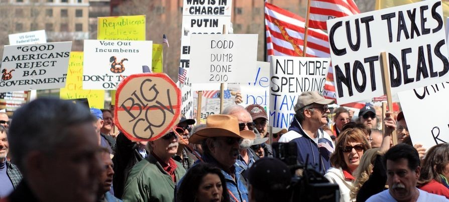
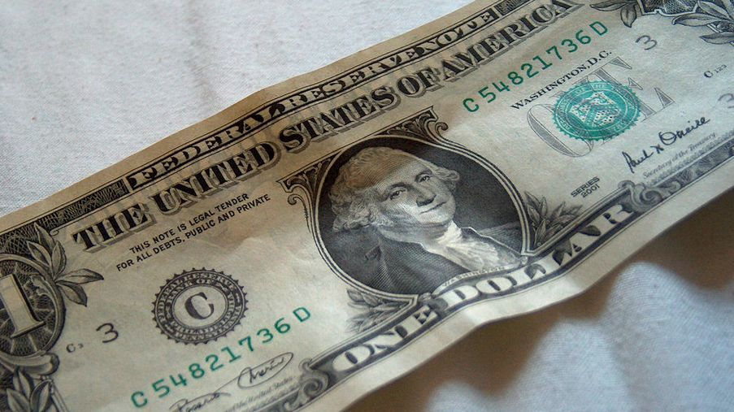
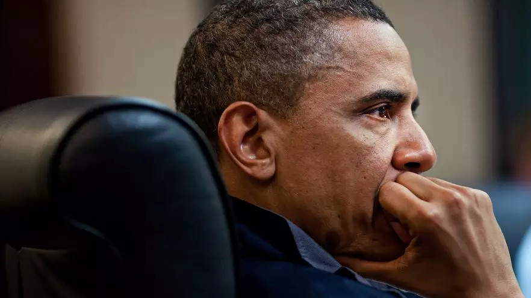

##  老美也有禁忌话题？——5条底线凡人勿碰！

_2015-03-11_ _看东西_ Kandongsee看东西 Kandongsee看东西

**Kandongsee看东西** 

kandongsee

Kandongsee  (看东西)  由来自中国和西方大学的“学霸团队”创办，致力于为中国学生深度剖析西方学生圈的热门潮流和校园文化。各种欧美学霸原创趣文、
视频、学生圈热点快讯应有尽有。官方网站：kandongsee.com

__ __

看东西

by Madeline Kaplan (Yale University)  
译 丁悦旸（上海外国语大学）

Americans, as you may know, have a reputation for being talkative (a nicer
word for loud). We tend to have a lot to say, and we tend to feel pretty
comfortable saying it. Still, there are some taboo topics that even Americans
don’t like to discuss. So, when in conversation with a chatty American, try
not to bring up…  
  
众所周知，老美向来以健谈行走于江湖（换句话说就是聒噪）。他们总有说不完的话，他们很享受谈话的感觉。然而，即便健谈如老美，也有些话题需要回避。因此，与健谈的老
美聊天，谨忌以下话题……

1

Money 金钱

  

Money makes the world go round, and Americans are, at times, “all about the
Benjamins” (Benjamin Franklin appears on our $100 bill). However, just because
money’s on your mind doesn’t mean it should be a key part of your
conversational repertoire. It’s considered impolite to ask about someone’s
salary, or to discuss other matters of personal finance.

  
有钱能使鬼推磨，老美有时也“本杰明至上”（注：即“金钱至上”，100美元上有本杰明**富兰克林的头像）。不过，心里惦记钱跟讨论话题集中在钱上又是两码事。如果
你谈论别人的薪资或个人财产，大家会觉得你没礼貌。

2

Weight 体重

  

Americans have famously enormous appetites—I once went to a French ice cream
shop where the sizes were small, medium, large, and American. But discussing
someone else’s weight is considered extremely rude in the United States. A
person’s weight is private, and making comments about is definitely considered
disrespectful.

  
老美素以“大胃王”著称——我去过一家法国冰淇淋店，里面冰淇淋的尺寸分为小、中、大以及老美特供尺寸。但是，在美帝，讨论别人的体重是极其无礼的行为。个人体重属于
隐私，对此发表意见就是不尊重他人。

3

Politics 政治

  

We have all kinds of political opinions in the United States, and the range of
popular beliefs runs across a much wider spectrum than in some other nations.
Just follow an American presidential election and you’ll see that our
political system is hardly even civilized. It’s not that talking politics is
an unforgivable taboo in the United States, just that it’s probably not such a
good idea to bring it up unless you’re prepared for a potential argument.

  
美帝充斥着各种政治观点，主流观点的范围也远比其他一些国家宽松得多。参见任意一场美国总统大选，你都会觉得他们的政治体系远非想象中那么文明。我并不是说在美帝谈论
政治是无法原谅的禁忌，而是奉劝大家，如果你没有准备好进行一场强有力的辩论，那么最好就别开始这个话题。

4

Religion 宗教

  

Similarly, though the United States is a relatively religious country,
personal beliefs are rarely brought up in casual conversation. It’s a good
idea to get to know someone a little bit before discussing his or her
religious backgrounds or practices. Faith is usually considered a private
matter (though it certainly plays a sizable role in the American public sphere
as well, particularly amongst politicians who are keen to show an allegiance
to it).

  
同样，尽管美帝相对而言是个宗教国家，个人信仰却很少出现在日常对话中。如果在稍微了解对方一些后，再开始谈论宗教背景或宗教活动的话题，会比较好。信仰也被视为个人
隐私（尽管信仰在美国大众生活中扮演着很重要的角色，尤其那些政客热衷于宣誓他们忠于信仰）。

5

Soccer 足球

  

First of all: We call it “soccer”, not football. Americans are proud of their
homegrown sports like baseball and American football, and professional soccer
is relatively unpopular. We prefer our sporting events to be saturated with
American patriotism and plenty of game-day snacks. If you want to talk soccer
with a stubborn American sports fan, be prepared to start with the basics—and
to encounter a whole lot of resistance to the world’s favorite sport.

  
首先要指出，此处我们讨论的是“足球”（soccer），而不是美式橄榄球（football）。老美对他们诸如棒球和美式橄榄球的本土体育运动深以为豪，而职业足球
就相对冷门了。老美更喜欢把体育赛事与他们的爱国情怀和比赛日零食融为一谈。如果你执意要跟一位美国老顽固体育迷讨论足球，请从基本常识谈起——然后准备好迎接老美对
这项风靡世界的体育运动狂风暴雨般的抵触情绪吧！

你是否有留学申请经验，或者求职经验，或者英语学习心得想和看东西的粉丝们分享？

  

建成属于我们学生自己的互帮互助平台，是看东西的一大目标，所以请不要大意地把你的心得你的故事统统砸向我们！并附上你的个人介绍，可满足你的一切个性化署名要求哟~
（比如附上一张招蜂引蝶的帅照或微博名等……大家懂的，互帮互助嘛XD）

  

投稿请发送至 **lenny@kandongsee.com**！

**这****篇文章怎么样？喜欢它就分享它！**

**回复国家名可查询往期文章目录哦**

**  
**

**Kandongsee (****看****东****西****)************是****由中西合璧****的“学霸****团队****”****创办的****文化交流平台。这里不仅有生动有趣的文化短文，第一手的西方学生圈资讯，更有萌萌哒文化微电影，留学论坛也会在将来上线，敬请期待！******

**  
**

**真的不关注一下吗？:)**

**微信****:**** Kandongsee  ******

**微博: @****看****东****西****_Kandongsee**

**  
**

点击下方 “阅读原文”查看更多

↓↓↓

阅读原文

阅读

__ 举报

[阅读原文](http://mp.weixin.qq.com/s?__biz=MzA5OTAwMjYxNg==&mid=203302747&idx=1&sn
=14ebc80325d33123db6443ae08619b3e&scene=1#rd)

