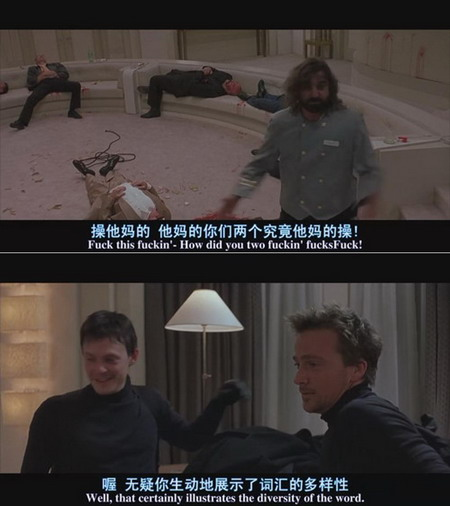
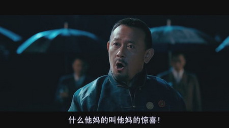
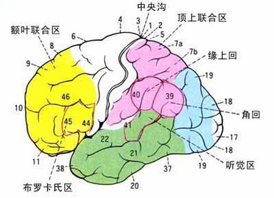
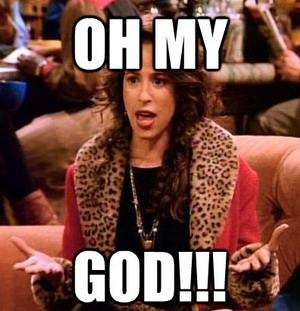
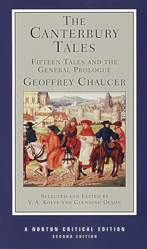
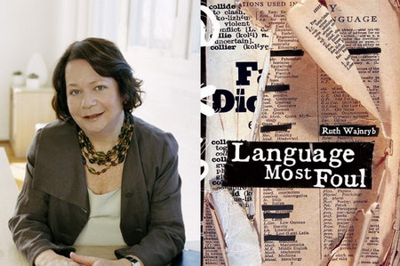
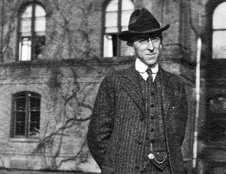
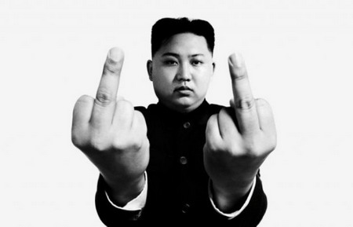
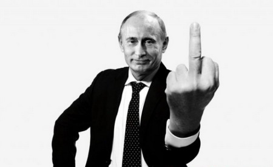

**人们说话越来越脏了？是的，对于那些拒绝脏话的道德楷模来说，他们的同类越来越少了。是什么原因让脏话渐渐失去原有的威力，逐渐变得司空见惯呢？**

  

**文/郑子宁**

  

自控力超凡，在任何情况下都不使用脏话——“操”“日”“干”“去他妈的”“屌”“鸡巴”——的人，可谓凤毛麟角。

  

研究显示，多数人平均一天会冒出80-90次脏话，占一天话语总量的0.5%-0.7%左右。讲话特别豪放的甚至可以达到3.4%，差不多说三十个词就得带个脏话出来
——真正做到传说中每句话都“屌开头”“屄结尾”的境界。

  

大多数人都有四周充斥着脏话与脏字的印象，这在大城市尤其显眼，如南北两京分别流行“傻屄”和“呆屄”，可谓遥相呼应。足球比赛时，球迷们高喊“XX傻屄”的场景蔚为
壮观。上海青年也常冒出一句“册na（操你们）”，所幸掌握上海话的人为数不多，它也就尚未恶名远扬。

**北京工人体育场，一位出言不逊的国安球迷**

  

但是，旧时北京人曾以说话注重礼数而闻名；早年西方传教士也对南京人的言辞文雅赞誉有加；上海人虽然一向有尖刻促狭的恶名，但也与脏话毫不相关。

  

无独有偶，西方世界也曾相当“文明”。《纽约时报》的专栏作家曾写出非常隐晦的句子，只为表示某个与排泄功能相关的名词就快打到风扇上了。1989年，爱荷华州发生一
场空难，驾驶舱的通话记录本上写道：“我们得丢掉这个（删去二字）养的了……”，即便灾难将至，对脏话的畏缩态度仍跃然纸上。

  

人们说话越来越脏了？是的，对于那些拒绝脏话的道德楷模来说，他们的同类越来越少了。如今，要多“干（日，操）”几次，才能达到数十年前同样的语言效果，脏话的茁壮成
长已经成为世界性的现象。

  

2006年，美联社进行的大规模问卷调查显示，近四分之三的人认为自己听到的脏话越来越多。同时，它们已经走出私人领域，渐渐侵入大众传媒。

  

1998-2002年间，美国全家老小一起看电视的晚八点档节目中，脏话的出现频率几乎翻倍，九点档的增幅更加惊人，达到106%，很多节目出现脏话时也不再使用“哔
——”消声。而上世纪三十年代，好莱坞电影《飘》中，女主角说了一句脏话即可引发轩然大波，但现在，若一部影视作品语言洁净恐怕才是新闻。

**美国电影《处刑人》截图，与之类似粗口横飞的电影在当今影坛比比皆是**

**  
**

脏话扩张的影响显而易见：现今美国儿童说脏话的年龄越来越低，两三岁的小孩子即会轻松自如地使用英语七大禁词之一的“fuck”。而在1981年，曾有播音员口误说出
该词便落到被开除的下场。

  

在中国，虽然意识形态主管部门对脏话尚无明确规定，但涉嫌“越界”的节目仍有被封杀的危险。如干露露母女大爆粗口的某节目就因“内容低俗”而被责令节目停播、频道整改
。2004年，文化部和广电总局电影局联合出台《关于立即组织查缴<十面埋伏>以及粗口歌、哈狗帮、摇头玩等违法音像制品的通知》。

  

但是近年，在对脏话的监管方面，两部门显然谈不上十分勤力。近期大陆制作的大量电影电视剧，尤其是反应军人生活的主旋律剧中，不少都有“出口成脏”的角色，且多为形象
正面的猛男。《高地》的两位男主角出口闭口“狗日的”，《永不磨灭的番号》堪称脏话百科全书，各地脏话无一漏网，甚至连面向儿童的《小小飞虎队》中，成人角色也时不时
蹦出几句国骂。该剧导演的解释说：“（没有脏话）实在不符合人物性格，那都是些五大三粗的汉子，急了眼谁不骂两句？”——与建国初期同样是军事题材的《地道战》、《铁
道游击队》等老片相比，“文明”程度天壤之别。

**电影《让子弹飞》截图，有好事者曾统计全片共出现了44次“妈的”**

  

就连一直担心中小学生身心健康的《新华字典》，也不得不“抓住时代精神”（字典编篡者语），在新版本中收入了对“鸡”的第二种解释“从事色情业的女性”。

  

是什么原因让脏话渐渐失去原有的威力，逐渐变得司空见惯呢？

  

**【我并不是时刻准备着性交】**

  

现在，在大量使用脏话的语境中，脏字的含义发生了改变——从具体的指称功能，逐渐转向发泄情绪，如：干（日，操），原来如此！开口闭口“我日”“真屌“的人并不是真的
时时刻刻都准备性交。

  

作为情感工具，脏话在大脑中也有所反映：正常话语的产生主要是由大脑左半球的布罗卡氏区负责，而脏话则主要由右半球产生。一个人如果布罗卡氏区受损，往往会罹患失语症
，说话断断续续，很不连贯，难以表达自己的想法，但是失语症患者不少人仍然可以使用脏话。

**布罗卡氏区示意图**

  

而说脏话就是在突破这种禁忌以表达自己的强烈情感。专门研究脏字的语言学家认为，一个词语越是变得充满情绪意涵，可以达成的文法范围就越广。

  

屄本身并不比阴门粗俗，阴茎也不比鸡巴天生高雅——脏话之所以具备冒犯性，是因其在社会变迁中逐渐成为一种语言禁忌。是社会，而非词汇本身形成了忌讳“屄”和“鸡巴”
的习惯。

  

因此，随着社会接受程度的变化，不仅新脏话可以取代旧脏话，同一句脏话也可能逐渐甩脱自身的粗俗色彩。

  

这类社会禁忌的改变古已有之。如在西方基督教社会中，往往会有和宗教有关的脏话。像英语的My God（我的神）、Jesus Christ（耶稣基督）、Damn（
诅咒）等词在旧时都是程度相当严重的脏话，为社会所忌。在魁北克法语中，甚至“洗礼”、“神龛”之类都是脏话。但是在当今英语的实际使用中，这类“宗教脏话”在很大程
度上已经丧失了原本的力度，变为很多人，尤其是女性的口头禅。

**美剧《Friends》里的Janice以其在片中标志性的口头禅“Oh My God”而被广大观众所牢记**

  

当今威力强大的性脏话在前现代时也曾经禁忌性一度较低。《红楼梦》里，诸多小姐贵妇不少口头禅就是“小蹄子”。鲍二女人骂鲍二“糊涂浑呛了的忘八！你撞丧那黄汤罢。撞
丧醉了，夹着你那膫子挺你的尸去，叫不叫，与你屄相干。”茗烟更是有“我们操屁股不操屁股，管你鸡巴相干，横竖没操你爹去罢了”的惊人之语。

  

《笑林广记》的“肮脏”程度更甚，要不是是古书八成会被出版总署归为低俗出版物。被当作英语文学典范的《坎特伯雷故事集》里面cunt（屄）这个在英语中外号叫C-
bomb（C炸弹）的超级脏词堂而皇之地出现——现在要是哪本诗集里面有这个词估计是永远都别想出版的。

**《坎特伯雷故事集》，作者Geoffrey Chaucer**

  

**【**“干”的飞黄腾达**】**

  

另有一些脏话，时脏时净，在人类的禁忌史中时隐时现，比如现在出现频率相当之高的“干（fuck）”一词。

  

至少在五百年前，“干”作为动词和名词，还百无禁忌的四处现身在苏格兰的诗句和民谣中。但到了1575年，“干”差不多已经在印刷品上绝迹。即使连语言学研究者、《脏
话文化史》的作者露丝**韦津利（Ruth Wajnryb）也无法确定它因何而消失。

**露丝**韦津利与她的著作《脏话文化史》**

  

其后，“干”又与词典的编篡者们展开一段紧张的关系史。字典的编篡者们不敢将脏字收入词典，担心触怒大众，影响出版社的利益。《牛津英文词典》虽然曾宣称要“记录英语
中每一个字词”，却直到1970年代初期才开始收录“四字词（如fuck、shit、cunt等）”。

  

正是拜数世纪以来的禁忌所赐，“干”连同其他大量脏字被剔除在词典之外，以致语言学研究者们无法确认它的语源，系统地追踪它的历史。

  

根据美国词典编辑佛列瑟纳（Stuart Berg Flexner）考证，从19世纪末开始，“干”被广泛用做情绪字眼，但它在美国的飞黄腾达始于1960年代的解
放运动之后。在此期间，不断有人对社会禁忌发起挑战：1948年，《不敬语的失落艺术》（The Lost Art of Profanity）出版。

**《The Lost Art of Profanity》一书的作者Burges Johnson**

  

（也有研究者将“干”的流传归因于军队——随着背井离乡的美军士兵在二次世界大战的战场上传播，后来，好莱坞及互联网将它带向了更宽阔的地带。）

  

与性相关的脏字成为语言禁忌的最大原因在于性本身的禁忌性。

  

在对性脏话禁忌程度较高的时期，这类脏话主要为男性所使用。他们希望以打破性禁忌的方式展示自己的攻击性和力量，上述主旋律影视剧也想借此表达男主角的雄性魅力（**
参考大象公会《最适合演毛泽东的是姜文》系列文章**）。

  

上世纪八十年代以前的研究发现，同性之间交谈时使用性脏话的频率是和异性交谈时的三倍。与此同时，男性之间讲话爆粗口的频率大约是女性之间谈话的两倍，更加说明了性脏
话主要是男人之间炫耀雄风的工具。

**网上广为流传的各国领导人比中指的恶搞图片**

  

随着性禁忌本身的弱化，女性之间谈论与性相关的内容也不再伤风败俗，脏话比例随之大大升高——近期的研究认为，女性间脏话的频率已经和男性间不相上下。当然，在面对异
性时，仍有所收敛。

  

如果一个字要能使人震惊，就必须保持该字的禁忌。而禁忌被打破的次数多了，威力就会减弱。

  

禁忌的威力削弱会导致更多的人尝试打破禁忌，就此形成正反馈效应。久而久之，社会对特定的一批脏话习以为常。脏话就不但从私域走向公域，也从底层向主流社会扩散。因此
北大教授孔庆东对记者大骂“三妈”，引发舆论哗然也就不足为奇了。

**网络红人孔庆东**

  

未来会怎样呢？虽然现今性脏话已经威力大减，但仍然不为所有人接纳，也正因为如此才会有“卧槽”、“我艹”、“B”、“特么”之类的避讳写法。在可预期的将来——如果
不出现几十年前那样对社会的强力控制，那么脏话出现的频率会越来越高，“你他妈真鸡巴好”最终大概会和现在的“你很好”意思差不多。不过到那时，新一批的脏话又将应运
而生。

  

**版权声明**

****大象公会所有文章均为原创，****  

****版权归大象公会所有。如希望转载，****

****请事前联系我们：****

bd@idaxiang.org

****知识 | 见识 | 见闻****

阅读

__ 举报

[阅读原文](http://mp.weixin.qq.com/s?__biz=MjM5NzQwNjcyMQ==&mid=209044618&idx=1&sn
=0eb21ff7c829d40df842794350b2c457&scene=1#rd)

