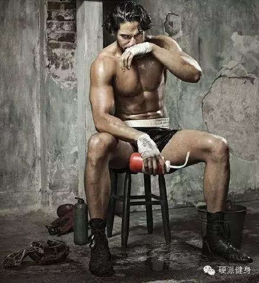

##  身材练不好？你歇错了！

_2015-03-02_ _斌卡_ 硬派健身 硬派健身

**硬派健身**

oh-hard

最专业  **  靠谱  **  蠢萌的运动健身科普

__ __

  

上回我们讲过两个小明打篮球的故事，他们的先天条件不同、身体素质不同，因此在健身中针对的目的也不同。

  

第一只小明由于身体瘦弱，想要提高弹跳力，因此训练以增加爆发力为主；第二只小明则由于太高，需要稳健的下盘，因此训练以提高最大力量为主。（回复组间间歇了解更多）

  

这一次呢，我们讲讲第三个小明。

  

  

  

这个小明追求的既不是爆发力也不是更大的力量，而是单纯为了让身材更好看。但他又练不出来，只好把自己P成现在的样子……

  

虽然每个人对身材好的定义都略有差别，但某种程度上来说重点要看的无非是那么几个指标：身高与比例是不是合理，腰、胸、臀的围度是否能勾勒出一个更强健的躯体……等等
。

  

对于大部分成年人来说，身高是没办法的事了（当然，你也可以像小明或小明那样穿内增高的鞋子……），但不同部位的围度却是可以改变的。

  

一般男性想要的好身材，说白了，就是对围度的改变。尤其是针对大肌群的改变——胸、背、臀——这三个部位练好了，能让你看起来更加强健、更加可靠，整个人在气势上就甩
了路人一大截，成为人群中的焦点。

  

  

  

而女性想要的好身材，同样需要在低体脂的情况下增大围度，比如胸围和臀围，简单说来，就是丰胸，细腰，翘臀，长腿。也就是更鲜明的曲线、更大的围度比。

  

  

  

看到这里可能有人会问了：难道力量训练和肌肉围度训练不是一样的吗？

  

没错，我们以前就说过，肌肉的最大力量、爆发力、肌肉围度增长基本算是三种不同的能力，从训练角度来说，这三者之间的区别也是很大的。

  

**最大力量、爆发力、肌肉围度**

  

简单而言，最大力量是肌肉一次能举起的最大力量。比如1RM卧推、深蹲等。根据希尔方程，肌肉收缩力量与收缩时间呈正比。所以举起大重量一般需要较长的时间。**最大
力量训练的最佳组间休息时间是3-5分钟**。

  

爆发力则是肌肉的输出功率最大，即较短的单位时间内，肌肉能输出的最大力量，比如举重、跳高、投掷等。**爆发力训练的最佳组间休息时间是2-5分钟**。

**  
**

**肌肉围度增长的最佳训练间歇是30秒-90秒。**

  

**肌肉围度&无氧耐力**

  

之前就有很多人问过我，斌卡，你说很多动作该做8-12个，做3组，可是我第一组12个做完就没有力气了，第二组只能做4、5个，怎么办？

  

其实这个就是无氧耐力的范畴咯！

  

我们上回说到，当进行力量训练时，组间休息1分钟，血乳酸由0.64mmol/L增长到0.99mol/L ①。而
**无氧耐力很大程度就表现在肌肉的乳酸耐受能力**。

  

研究发现健美选手比起举重选手，拥有更强的无氧耐力②。当然，他们的围度也更大。

  

**最大力量与无氧耐力有什么区别？**

以深蹲为例，力量举选手，他们可能最大力量更强，能蹲起240+公斤。而健美选手可能只能蹲起200公斤。

但是力量举选手蹲80%max重量时，可能只能进行5次。健美选手可能举起80%10次。这就是无氧耐力和最大力量的区别。

  

  

**更多乳酸，更多生长激素，更多增肌减脂**

  

  

在力量训练中，无氧糖酵解系统分解出乳酸。而分解出的乳酸堆积在身体里，会引起运动部位的肌肉酸胀、烧灼等。越短的组间休息，越能引起乳酸的堆积。  

TIPS

运动后的肌肉酸疼和乳酸没关系哦！乳酸几小时内肯定会代谢干净，而运动后肌肉酸疼多发在24-72小时。

  

但肌肉生长的重要激素，生长激素就是被认为与乳酸堆积程度有关系③。一般认为中高强度的训练更能刺激生长激素的提高。其实这就是HIIT训练能极限减脂的一个原因，因
为**生长激素不仅促进肌肉围度生长，而且还可以促进脂肪的分解利用**。

  

******生长激素**促进蛋白质合成，抑制外周组织对葡萄糖的利用，减少葡萄糖的消耗，加速脂肪的分解，使机体的能量来源由糖代谢向脂肪代谢转移，有利于生长发育和组织修复④。

  

**最佳肌肉围度训练的组间休息**

  

研究者发现，30-90s的间歇时间，对于肌肉围度增长是最为有利的。当训练间歇较短时候，血乳酸明显增加，而生长激素也急剧增长⑤。  

  

另一项研究者发现，30秒左右的短间歇，对比长间歇时间，更能引起生长激素的急剧增长，并且不会引起皮质醇的提高⑥。  

  

我们上面说过生长激素可以刺激肌肉围度的增加。所以目前学术界认为，在健身中，以肌肉增长为目的的训练间歇以30-90秒为宜。

  

科学家进行了12周实验。其训练结果发现，短间歇导致的生长激素的急剧增长与肱二头肌肌肉增长的相关系数为0.74，与II型肌肉的肌纤维增长系数为0.71，明显呈
正相关⑦。

  

在最大力量和爆发力训练中，我们曾经说过，短时间的组间间歇会引起血乳酸的显著提高。虽然在力量和爆发力训练中，乳酸堆积会影响训练，但在肌肉训练中，**高浓度的乳
酸→生长激素等分泌→肌肉体积增长 & 体脂下降**。

  

  

  

****30秒休息完不成计划？没关系，慢慢来！****

  

另外，针对大家在问的问题：“组间休息短，无法顺利完成次数”也不必太担心。无氧耐力是可以根据训练水平而提高的，训练可以使得肌体产生适应，比如增加毛细血管和线粒
体的密度，肌肉的乳酸耐受力也会随之增强⑧。

  

也就是说，和力量、围度等一样，**无氧耐力也是会随着训练而提升的**。

  

简单而言，也许现在的你，没法在30s间歇的情况下，完成80%max重量，12次的训练，不过你可以稍微休息长一点时间（90s），或者减少一些次数（8次），以便
于完成自己的训练。以后随着训练水平的提高，乳酸耐受力就会提高，你一定可以完成整个计划。

  

（不太推荐在组间减少重量，因为那样可能会影响自己的整体训练水平。以后会提到）

  

所以说到训练，最关键的还是在于坚持。就像定投一样你只要每一次训练都比上一次进步，哪怕只有一点点，那么这些现在困扰你的问题最终都不再是问题。而你离自己理想的身
材、更强健的体魄、更强大的自己，也都将越来越近。

  

"

硬派健身继续招聘ing～

想要跟我们一起更好地训练吗？

想要从一个健身小白成为大神吗？

赶快加入我们吧！

回复【找伙伴】 了解更多～

  

* * *

①Pincivero D M, Gear W S, Moyna N M, et al. The effects of rest interval on
quadriceps torque and perceived exertion in healthy males[J]. The Journal of
sports medicine and physical fitness, 1999

②Kraemer W J, Noble B J, Clark M J, et al. Physiologic responses to heavy-
resistance exercise with very short rest periods[J]. International journal of
sports medicine, 1987

③田野.运动生理学高级教程[M]. 高等教育出版社, 2003

④张颖, 李涛. 运动对生长激素的影响[J]. 咸宁学院学报, 2011

⑤Goto K, Nagasawa M, Yanagisawa O, et al. Muscular adaptations to combinations
of high-and low-intensity resistance exercises[J]. The Journal of Strength &
Conditioning Research, 2004

⑥Kraemer W J. A Series of Studies-The Physiological Basis for Strength
Training in American Football: Fact Over Philosophy[J]. The Journal of
Strength & Conditioning Research,1997

⑦McCall G E, Byrnes W C, Fleck S J, et al. Acute and chronic hormonal
responses to resistance training designed to promote muscle hypertrophy[J].
Canadian Journal of Applied Physiology, 1999

⑧Kraemer W J. A Series of Studies-The Physiological Basis for Strength
Training in American Football: Fact Over Philosophy[J]. The Journal of
Strength & Conditioning Research, 1997

阅读

__ 举报

[阅读原文](http://mp.weixin.qq.com/s?__biz=MzA5NjQwMTQxOA==&mid=206378507&idx=1&sn
=1dca6cf57382822b7675c4591cd5671d&scene=1#rd)

