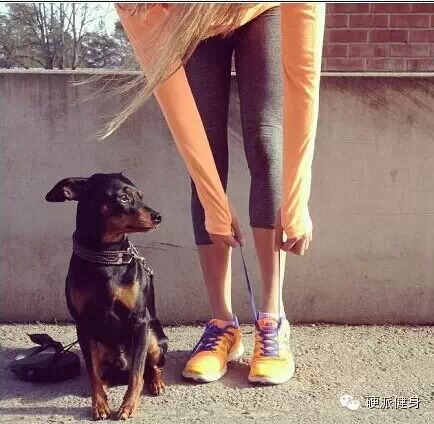
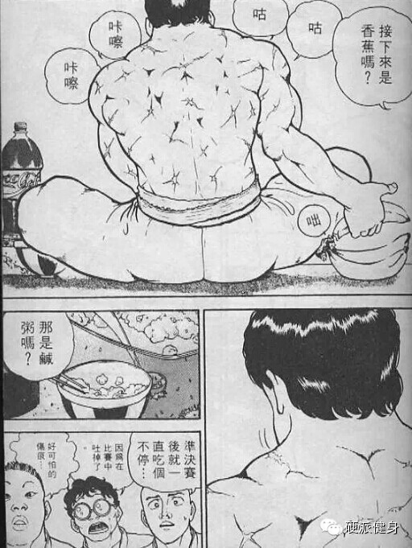
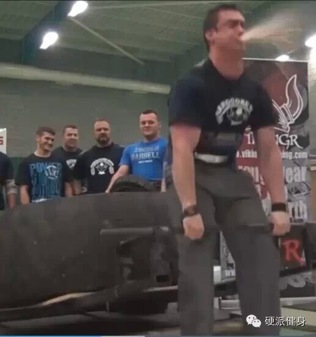
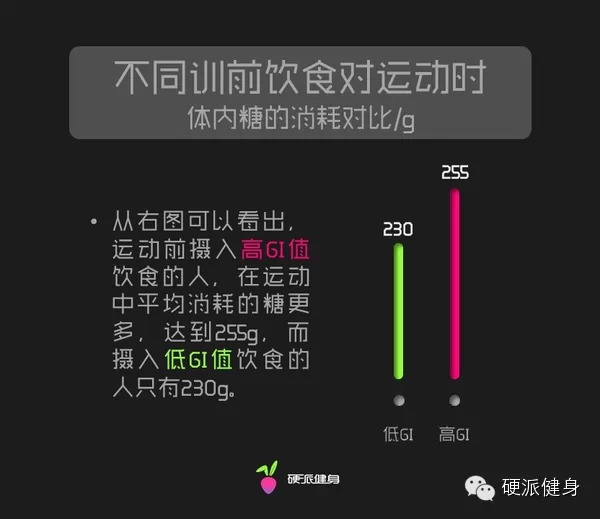
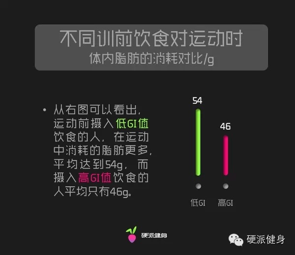
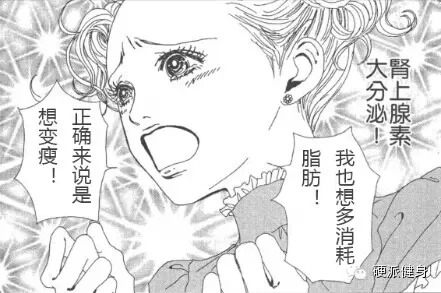
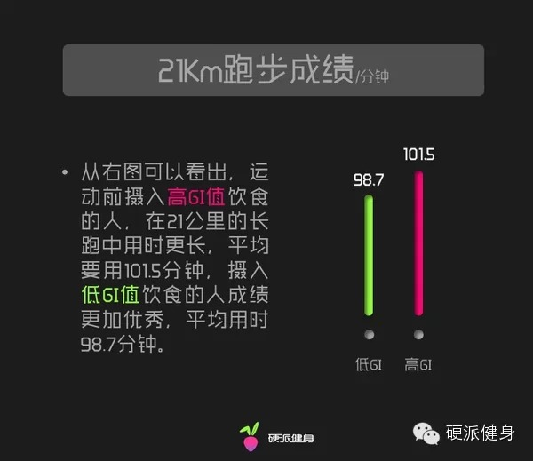
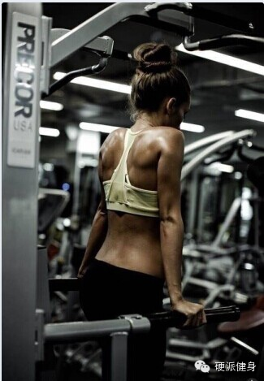
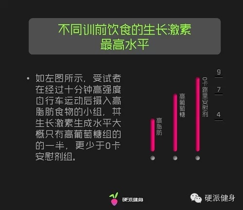
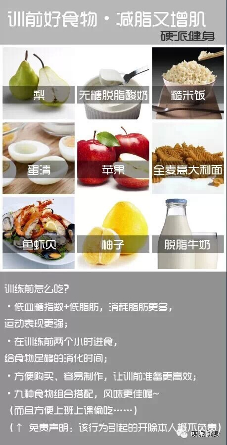

本文内容摘要：

◆训前两小时左右摄入饮食，可以维持比较好的训练状态，也不会导致肠胃不适。

◆训前摄入低GI值（血糖指数）的食物，可以增强运动表现，促进脂肪消耗。

◆训前摄入脂肪，会影响训练表现，影响生长激素分泌。

◆自己推荐的一些方便的训前食物！

　　很多健身的朋友，都是下班回家前去健身房，通常情况下都是晚上7-8点，距离午饭已有一段时间的距离。如果空腹去锻炼，感觉很没力气，但是上班时，又没法提前吃晚
饭。不少人就问我“斌卡，训练前吃些什么呢？”今天我们就来讲讲，训前怎么吃，才能增肌又减脂！（回复关键词：简易饮食表了解更多 ）  

　　一句话结论：**一般的健身者，最好是在运动前两小时摄入低血糖指数，并且脂肪含量低的食物****。**这样的好处一是促进运动表现，增加运动耐力，二是促进脂
肪的分解，三是可以不影响运动中生长激素的分泌。

　　什么是GI值？GI值是血糖生成指数，是人吃下去一样食物所引起的血糖升高程度的指标。

　　比如含糖比较高的，吃下去血糖会飙升，这就是GI值高的，而一些粗粮、脂肪类，吃下去后血糖增长比较缓慢，属于GI值低的类型。（回复关键词：食物血糖表 或
GI 了解更多）

  

训前两小时左右进食，保证能源供给

　　如果运动前几分钟才吃东西，消化未完很可能会有肠胃不适，这一点我相信很多吃完再运动的人已经体验过了……

　　记得有一次，我在健身房看见一个私教带人跑步，那人上跑步机跑了几步就脸色煞白，私教也好像没注意到，仍然在后面催促，过几分钟，可怜人“哇”一口就把午饭吐出来
了（我上班时午休去练，估计他也是吃完午饭去的），满跑步机履带上都是啊……吃了什么粒粒分明（当然我也没敢仔细看）……霎时间那私教的脸跟可怜人上跑步机时候一样煞
白……  

　　此外，不少做深蹲硬拉比较多的朋友都会佩戴训练腰带。训练腰带在训练中会压迫腹部，这虽然保护了脊椎，但也很容易让人把腹内的食物吐出来……

　　比如我以前看到过一个硬拉比赛里，口吐蛋白粉的小哥儿……

水遁 ** 水龙炮！！！

　　一般训前两小时左右进食，既可以保证训练中的能源供给，也可以保证食物已经被消化。

  

吃对食物，能让你跑的更快，减脂更多！

　　首先，相比于高血糖指数的食物，运动前两小时进食GI低的东西，在训练中可以提高脂肪的燃烧率①。（本篇不涉及极限增肌的训练情况）

　　在一项实验中我们发现②，相比同样热量的高血糖指数食物，进食GI值低的食物，能让人体内的脂肪供能提高17.9%，也就是说我们消耗了更多脂肪！

　　实验认为，这可能是低GI食物促进了更多肾上腺素分泌，从而刺激了脂肪的分解动员。  

我好像暴露了什么……  

　　第二，可能与常识相反，比起高血糖值的食物，低GI食物更能提高运动耐力③。也就是说，在训练前吃个燕麦片，可能会比吃糖吃白面包更能提升你的运动表现。同样在上
面的实验显示，低GI组比高GI组的21KM跑时间缩短了2.8%。如果你经常完不成训练，细细想想是不是训练前吃的东西不对。  

  

  

  

训练前，不要摄入脂肪！

  

　　 于是，就有人问啦~斌卡君，既然是这样，那么我训练前吃脂肪类的食物可以吗？比如士力架、巧克力等，他们热量高、糖分高、供能快，同时脂肪含量还很高，导致GI
值比较低，不是符合你说的训练前要吃GI低食物的要求吗？

　　可惜哦~虽然高脂肪的食物GI值比较低，但是他们也并不是训练前的理想饮食。

　　一方面，脂肪的摄入会影响训练水平，限制血液流入肌肉。更重要的，健身前摄入脂肪会影响你训练时的生长激素（简称GH）生成水平。

　　在一项研究中，学者们让受试者在训练前分别摄入三种不同的食物，一种是0卡路里的安慰剂，一种是包含脂肪的液体食物，最后还有高葡萄糖饮料。

　　研究发现，受试者在经过十分钟高强度的自行车运动后，生长激素生成水平产生了非常明显的差异。摄入高脂肪食物的小组，其生长激素生成水平大概只有高葡萄糖组的一半
，连0卡安慰剂组的一半都不到④……

　　生长激素可以加速脂肪的分解，有利于生长发育和组织修复。它的生成促进蛋白质合成，抑制外周组织对葡萄糖的利用，减少葡萄糖的消耗，加速脂肪的分解，使机体的能量
供给由糖代谢向脂肪代谢转移⑤。一句话，生长激素是增肌减脂的重要激素（回复关键词：减脂增肌了解更多）。

　　也就是说，高脂肪食物使得生长激素分泌变少了。这会影响到你的身体恢复和增长，而且还会影响到减脂塑形的效果。研究人员认为，之所以高脂肪的摄入影响到了GH的生
成水平，是因为脂肪的消耗会产生生长激素抑制素，一种会降低GH生成的反向激素。

所以，虽然说健康的脂肪是人类所必须的，而且合理的摄入健康脂肪对减脂塑形也有积极意义，但在健身的前、中、后期，我们还是不要摄入脂肪，以免影响我们的健身效果。

  

一些合适又方便的训前食物！

  

  

* * *

① Febbraio MA.Keenan J.Angus DJPreexercise carbohydrate ingestion,glucose
kinetics,and muscle glycogenuse:effect of the glycemic index 2000

②运动前进食不同血糖指数食物对长跑能力的影响王香生， 陈亚军， 骆卓明

③ DeMarco HM.Sucher KP.CisarCJ.Butterfield GE Pre-exercise carbohydrate
meals:application of glycemic index 1999

④Acute effects of high fat and high glucose meals on the growth hormone
response to exercise.Cappon JP1, Ipp E, Brasel JA, Cooper DM.

⑤运动对生长激素的影响 张颖 李涛

阅读

__ 举报

[阅读原文](http://mp.weixin.qq.com/s?__biz=MzA5NjQwMTQxOA==&mid=205035493&idx=1&sn
=ab998cb2bf291e1513744864f0ad181b&scene=1#rd)

