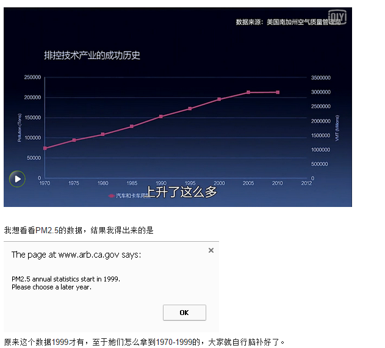

##  雾霾里的乌合之众

_2015-03-06_ _巴依老爷_ 笔戈科技 笔戈科技

**笔戈科技**

bigertech

提供电子产品测评、科技公司观察、潮流消费指南。

__ __

在过去的一周里，柴静的《穹顶之下》无疑是社交网络上最为火爆的话题。一周的时间里，柴静本人和她的团队也经历了无数的赞美和质疑，沸沸扬扬，而现在终于冷却。大家应
该也能更加冷静和理性地看待这部作品和此次事件。

  

  * 2 月 28 日上午，柴静团队联合人民网、优酷发布作品《穹顶之下》，作品在发布的当天可以用「好评如潮」来形容，几乎没有负面消息。

  

  * 从 3 月 1 日开始，网上出现了一些质疑的声音和批评的意见，有专业人士指出一些柴静所犯的错误，但与此同时，网上对柴静的人身攻击也开始了，称「柴静是资深烟民，开 4.0 大排量的 SUV，曾经做过小三等等。」

  

  * 3 月 3 日，知乎上一个关于「柴静的雾霾调查纪录片《穹顶之下》有哪些科学上的错误？」的回答列举了柴静的 10 大错误，获得了超过 7000 的赞同，并在网上迅速传播，但随后果壳网、NASA 和众多的知乎网友就证实 JUN 的回答有太多的漏洞。

  

《乌合之众：大众心理学研究》这本书对于我理解和分析此次事件中人们的行为和心理有着极大的帮助作用，我想分享给大家。

  

## **冲动、易变和急躁**

**  
**

群体是无意识的，所以他在行动之前是没进过任何思考的，所有行为完全是下意识的本能反应。所以当他们看到柴静的纪录片时觉得震撼，周围的人都在转发，他们就转了，当他
们得知「原来柴静是个老烟枪还做过小三」时，他们又立即调转枪口对准了柴静——「这个说一套做一套的绿茶婊」。

  

> 群体的情绪是极端情绪化的，他们易于被最为矛盾的情感所激发；但与此同时，他们又总是如同牵线木偶一样，受到当前刺激因素的影响。

## **  
**

## **轻信他人，容易受到暗示**

**  
**

在那个 7000 多赞同的答案中有这么一句「原来这个数据 1999 才有，至于她们怎么拿到 1970-1999 的，大家就自行脑补好了。」

  

  

还能怎么脑补？「柴静数据造假了呗。数据都是假的，怎么可能得出正确的结论呢？」只一句话就把这些人带到沟里去了，可是他们都没仔细看 JUN
的截图，截图中，明明是「汽车和卡车用量」，结果他说成是 PM2.5，这些人根本就没仔细推敲条件和结论，就真的自己脑补一个结果。

  

> 群体易于接受暗示，是因为他们期待着任何形式的暗示。群体期待着暗示，是因为他们需要暗示。因为群体一旦形成，他们就会于急切之中期待着点什么，无论是什么，只要
能让他们立刻行动起来。

##  

## **不承认障碍**

  

> 群体根本没有能力来理解这种障碍的存在，于对他们来说，群体就是优势，数量上的强大让他们感受到自己的势不可挡。

>

>  

这样导致的一个最直接的后果就是群体往往充满了暴戾的气息。轻则跑到别人的微博下面去破口大骂，末了还要来一句「请给我点赞」。重则就是真的对他人进行伤害和攻击，最
典型的一个例子就是 2012 年 9 月 15 日，西安反日游行中，一男子砸破日系车主头颅。我想一个人在光天化日之下是不敢杀人的，但是汹涌的游行队伍大概让他
有了「不是一个人在战斗」的错觉，但是最终的牢狱之灾却只能他自己来承担。

  

这就是一群乌合之众。他们既没有专业的知识素养也没有明辨是非的能力，一个人的时候或许还有些忌惮，一旦他们成为一个群体，一切就难以控制了。

  

其实仔细想一想，即使柴静身边的人都在撒谎，「柴静是资深烟民，开 4.0 大排量的 SUV，曾经做过小三。」这些都是真的，那我问你「是不是小三与治理雾霾之间究
竟有什么关系？」而反日游行中，你砸自己同胞的车，烧自己同胞的店，甚至不惜打伤自己的同胞，你究竟是在反什么？

  

更让人哭笑不得的是，而当有人反驳 JUN 的观点时，居然有自称「柴粉」的人跑到她的微博下去骂她，我想他们不是什么「柴粉」，叫他们「柴黑」更合适，表面上看起来
这些「柴粉」和「柴黑」是势不两立的，但实质上，他们始终都是同一群人，冲动，急躁，不思考，暴戾恣睢。

  

  

这样的人在「文革」中，在反日游行中，在《惊惶庞麦郎》中，在「雾霾」中，在你我之中。

  

阅读原文

阅读

__ 举报

[阅读原文](http://mp.weixin.qq.com/s?__biz=MzA3OTQzNzAxMg==&mid=207466040&idx=1&sn
=a56207098bea1826c253b68c66c2a63c&scene=1#rd)

