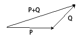
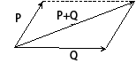

#1.2 向量的数乘和加减法

##1.2.1向量的数乘
###1.2.1.1 定义

实数a与向量V的乘积是一个向量，记作aV。

系数a和向量V的乘积，可定义为：

###1.2.1.2 几何意义

向量数乘，表现为向量的方向和模的变化：

* 当a>0时，向量方向不变，模变为原来的|a|倍。

* 当a<0时，向量方向变为原来的反方向，模变为原来的|a|倍。

* 当a=0时，向量变为0向量，模等于0。

##1.2.2 向量的加减法
###1.2.2.1 定义
两个向量相加后得到一个新向量，这个新向量的每个分量，等于两个旧向量对应分量的相加值。

对于给定向量P和Q，可将P+Q的运算定义为：

向量的减法运算，可视为加上负向量的加法。既P-Q=P+（-Q）。因此，向量减法可定义为：

###1.2.2.2 向量加法的几何意义

向量加法，在几何上表述为两个向量的三角形or平行四边形合成，合成后可得一个新向量。

已知向量P和Q，则P+Q可以由下图得到:

- 三角形法

- 平行四边形法

##1.2.3 性质
对于给定向量P，Q和R，实数a和b。向量的数乘和加减法有如下性质：

1. 向量加法的交换律：P+Q=Q+P

2. 向量加法的结合律：(P+Q)+R=P+(Q+R)

3. (ab)P=a(bP)

4. a(P+Q)=aP+aQ

5. (a+b)P=aP+bP

======================
 本作品采用<a rel="license" href="http://creativecommons.org/licenses/by-nc-sa/3.0/cn/">知识共享署名-非商业性使用-相同方式共享 3.0 中国大陆许可协议</a>进行许可。
