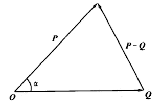
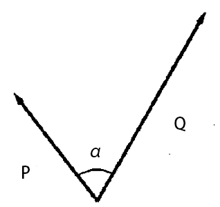

#1.4 数量积

##1.4.1 定义
数量积也叫内积，点积。

求数量积的过程，称为点乘。

两个n维向量P和Q的数量积记作P•Q。

对于矩阵形式，不用写点乘符号•，记作

数量积有时也记作尖括号形式\<P,Q\>，书写略繁琐，而且这和本书的向量记法容易混淆。

##1.4.2 座标表示
两个向量P和Q的数量积等于两个向量的每个对应分量的乘积之和。

在三维空间中，可展开为：

##1.4.3 矩阵形式
数量积也可以用矩阵乘积的形式给出：

##1.4.4 几何公式
已知两个向量P和Q的长度，和他们的夹角α。则P•Q满足下面公式：

###1.4.4.1 证明
如图1-4-1.png所示

由余弦定理可得：

由座标公式展开：

两边消去可得：

两边除以-2：

证毕！

###1.4.4.2 推论
由几何公式可知

当且仅当P•Q=0时，向量P和Q互相垂直。

##1.4.5 几何意义
向量的数量积描述了两个向量的“相似”程度，数量积越大，两个向量越接近。从下图可以明显看出：

*G注：这个特性经常用于光照计算*

##1.4.6 性质
数量积有一些有趣的性质：

1. 向量点乘的交换律：P•Q=Q•P
2. (aP)•Q=a(Q•P)
3. 向量点乘对向量加法的分配率：P•(Q+R)=P•Q+P•R
4. 
5. 柯西-施瓦茨不等式（ cauchy-schwarz）：

###1.4.6.1 性质4 证明

根据数量积的座标公式，和向量模的计算公式。很容易得出等式两边均为：

证毕！

###1.4.6.2 性质5：柯西-施瓦茨不等式 的证明
对向量的数量积几何公式（1.4.4），两边同时取绝对值：

因为所以，可知：

证毕！

======================
 本作品采用<a rel="license" href="http://creativecommons.org/licenses/by-nc-sa/3.0/cn/">知识共享署名-非商业性使用-相同方式共享 3.0 中国大陆许可协议</a>进行许可。
