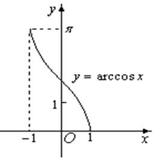

#1.5 向量的夹角
##1.5.1 公式
由向量的数量积的几何公式，可得到两个向量的夹角公式：

当P和Q均为单位向量时，上述公式可简化为：

##1.5.2 快速判断两向量方向一致性

如果只需要判断两向量方向是否一致，而不需要计算夹角。由反三角函数曲线可知，直接判断P·Q的值即可。

可以使用数量积结果快速判断：

- P·Q>0时：，P和Q的方向基本相同
- P·Q=0时：，P和Q正交（垂直）
- P·Q\<0时：，P和Q的方向基本相反

======================
 本作品采用<a rel="license" href="http://creativecommons.org/licenses/by-nc-sa/3.0/cn/">知识共享署名-非商业性使用-相同方式共享 3.0 中国大陆许可协议</a>进行许可。
