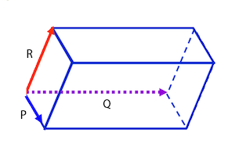

#1.8 混合积

##1.8.1 定义
已知三个向量P，Q，R。则P×Q•R（也写为(P×Q)•R）称为P，Q，R的混合积。

混合积也可记作[P Q R]。

在混合积中，叉乘的优先级高于点乘。

*G注：这就是为什么在C++中不提倡重载“^”为叉乘符号的原因，因为^的优先级低于乘法“\*”，所以没有办法正常表示混合积。其实运算符重载的局限很大，没有想象中那么有用。*

混合积也叫标量三重积。（三重积分为标量三重积和矢量三重积，如果P，Q，R三者叉乘，则称为矢量三重积。）

##1.8.2 几何意义

在3维空间中，不共面的向量P，Q，R的混合积(P×Q)•R，表示的是由向量P，Q，R围成的平行六面体的“有符号”体积。

如下图所示：（注意P，Q，R不一定互相垂直，只要不共面就可以了）

###1.8.2.1 符号判断

当向量P，Q，R满足右手定则时，(P×Q)•R>0。

当向量P，Q，R满足左手定则时，(P×Q)•R<0。

###1.8.2.2 推论

当且仅当向量P，Q，R三者共面时，(P×Q)•R=0。

简单证明：当三者共面时，因为向量P×Q垂直于当前平面，所以P×Q垂直于R。由1.4.3 数量积几何公式，可知(P×Q)•R=0

##1.8.3 混合积的伪行列式表示

对于任意给定3维向量P，Q，R。其混合积可以表示为：

##1.8.4性质
混合积有一些有趣的性质：

1.(P×Q)•R=(R×P)•Q=(Q×R)•P

###1.8.4.1 性质1 证明方法1

由平行四面体体积不变，可直接得证。

###1.8.4.2 性质1 证明方法2

由1.8.3，且根据行列式性质交换两行改变结果的符号可得：

同理可证：(P×Q)•R=(Q×R)•P

证毕！

======================
 本作品采用<a rel="license" href="http://creativecommons.org/licenses/by-nc-sa/3.0/cn/">知识共享署名-非商业性使用-相同方式共享 3.0 中国大陆许可协议</a>进行许可。
