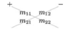
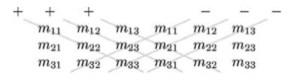

#2.5 行列式

##2.5.1 定义
方阵M的行列式是从方阵的元素中计算出的一个标量，记作|M|（也记作det M）。

非方阵矩阵的行列式是未定义的。

矩阵的行列式记法和矩阵类似，只是用竖线|取代了中括号[]，2.3.1中方阵M的行列式可记作：

##2.5.2 行列式求值的递推公式

*G注：行列式求值是一个比较复杂的问题，不过我们有一个递推公式可以描述这个问题。*

###2.5.2.1 余子式

假设n阶矩阵M。从M中除去第i行和第j列后剩下的n-1阶矩阵，称为M的余子式，记作（也记作 但容易被误认为是代数余子式，因为余子式是个矩阵，所以并不推荐这种记法）。

如3阶方阵M可表示为：

其余子式是一个2阶矩阵，可表示为：

###2.5.2.2 代数余子式

代数余子式是其对应余子式的有符号行列式。我们同时规定，对1阶矩阵的行列式就是其元素值本身。

###2.5.2.3 递推公式

n阶行列式|M|的值就是：其任选一行或一列（一般我们选第1行），然后进行拆分后得到的所有代数余子式之和。

按列拆分时的公式：

按行拆分时的公式：

其中1≤k≤n。

*G注：因为递推公式是可以不断分解递推的，最终一定会得到只有1阶矩阵行列式的形式。所以该递推公式可以表示n阶行列式的求值。*

##2.5.3 二阶行列式

###2.5.3.1 求值公式

下面我们给出2阶行列式的求值方法：

###2.5.3.2 推导

根据行列式递推公式（2.5.4.3）按行拆分，选取k=1，展开：

2阶矩阵的余子式是1阶矩阵，而1阶矩阵的行列式就是其元素值本身，所以直接展开：

证毕！

###2.5.3.3 记忆方法

使用下图方式能帮助记忆，将主对角线和反对角线上的元素各自相乘，然后用主对角线元素的积减去反对角线元素的积。

###2.5.3.4 向量积形式

2阶行列式，可看作是ab两个向量的混合积。

###2.5.3.5 几何意义

二阶行列式和向量积的表达式类似。行列式的值等于以基向量为两边的平行四边形的有符号面积。

##2.5.4 三阶行列式

###2.5.4.1 求值公式

下面我们给出3阶行列式的求值方法：

###2.5.4.2 推导

根据行列式递推公式（2.5.4.3）按行拆分，选取k=1，展开：

证毕！

###2.5.4.3 记忆方法

使用下图方式能帮助记忆，把矩阵M连写两遍，将主对角线和反对角线上的元素各自相乘，然后用各个主对角线元素的积减去各个反对角线元素的积。

###2.5.4.4 混合积形式

3阶行列式，可看作是abc三个向量的混合积。

###2.5.4.5 几何意义
在3维空间中，行列式等于变换后的基向量为三边的平行六面体的有符号体积。

##2.5.5 四阶行列式

由于计算量较大，而且计算方法类似，所以我们只给出公式：

##2.5.6 性质
行列式有许多有趣的性质：

1. 矩阵积的行列式等于矩阵行列式的积：|MN|=|M||N|

2. 矩阵转置的行列式等于原矩阵的行列式：

3. 行列式性质：

	1. 两行（列）互相交换则行列式取反

	2. 任意行（列）全为零，行列式的值等于零

	3. 其中一行（列）乘以系数a，则行列式的值也变为原来的a倍

	4. 其中一行（列）乘以系数a，然后加到其他行（列）对应位置上，行列式的值不变

###2.5.6.1 性质3.1 证明

使用数学归纳法来证明：

1. 对n阶矩阵，当n=2时。

	设有2阶矩阵F，交换第1行和第2行得到2阶矩阵G。由二阶行列式求值公式可得：

	

	即，当n=2时，命题成立。

2. 设对n=m-1阶矩阵，命题成立。

	设有m阶矩阵F，交换第r行和第s行（r≠s）得到m阶矩阵G。

	根据行列式求值递推公式，选取k行（k≠r且k≠s），有：

	①

	∵是m阶矩阵G的余子式，那么必然是m-1阶矩阵。

	又∵k≠r且k≠s

	∴②,③

	代②③入①，可得：

	

	即当任意n=m-1时，总有n=m，使命题成立。

综上，根据数学归纳法，命题对于任意n>=2的自然数都成立，证毕！

###2.5.6.2 性质3.1 推论

如果矩阵有相同的两行（列），则行列式为零。

简单证明：对于有两行相同的矩阵M，两行交换后依然为矩阵M，但根据性质3.1行列式符号改变。则有：

∴当且仅当|M|=0时，上式成立。证毕！

###2.5.6.3 性质3.2 证明

简单证明：根据行列式递推公式，选取全为零的一行，可知行列式计算结果为零。

###2.5.6.4 性质3.3 证明

设矩阵F，将其k行乘以系数a后得到矩阵G，则根据行列式递推公式有：

证毕！

###2.5.6.5 性质3.4 证明

已知矩阵F，将F的r行乘以a加到k行得到矩阵G。求证|G|=|F|。

由行列式递推公式得：

∵ 可看作矩阵F中，k行元素被替换成r行元素后得到的新矩阵的行列式。那么这个矩阵有两行相同，根据性质3.1 推论，可知此行列式值为零

∴|G|=|F| 证毕！

======================
 本作品采用<a rel="license" href="http://creativecommons.org/licenses/by-nc-sa/3.0/cn/">知识共享署名-非商业性使用-相同方式共享 3.0 中国大陆许可协议</a>进行许可。
