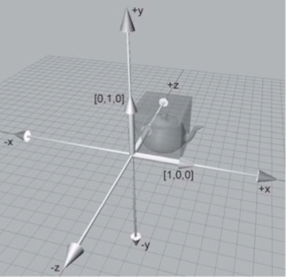
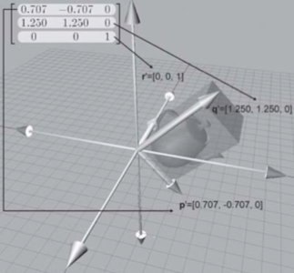

#2.7 矩阵的几何意义

##2.7.1 向量的基向量表示

设任意向量V，基向量i=\<1,0,0\>,j=\<0,1,0\>,k=\<0,0,1\>
那么有：

任意向量可以看作是由基向量的线性变换组成。i，j，k也是一组标准正交基。

注意：上图中的[i,j,k]不是行向量，而是用分块矩阵表示的。

##2.7.2 矩阵表示任意向量的线性变换

因为，当前座标系下所有向量都可以用基向量的线性变换表示，所以变换基向量等同于变换座标系，变换座标系等同于变换该座标系下所有向量。

可以将其从标准正交基扩展到所有基向量的情况。

已知线性无关向量P，Q，R，那么根据1.9节向量空间定义，P，Q，R是一组基向量，可由P，Q，R构成矩阵M。

矩阵M可以理解为将当前座标系基向量进行的一组变换，变换后得到新的基向量P，Q，R。矩阵M描述了一组线性变换关系。

对于<x,y,z>向量，通过乘以矩阵M变换后得到的<x',y',z'>向量，可以有如下表示：

我们将矩阵乘法展开，得到：

因为矩阵实际上是线性方程组的一种描述，所以对x‘可以得到下列等式：

，，表示<x,y,z>向量的x，y，z各个座标对新的向量<x',y',z'>中的x座标施加的影响权值：

表示x对x'的影响权值

表示y对x'的影响权值

表示z对x'的影响权值

对于Q，R向量，也可以如此理解。

对向量的变换，最终体现为座标的变动。

##2.7.3 变换盒

从几何上来说，矩阵可以看作是由变换后的基向量围成的一个变换盒（相对于变换之前围成的盒子）。

下图就可以表示i，j，k基向量，根据矩阵（该矩阵是个旋转矩阵），变换后的结果p，q，r

变换前：

变换后：

##2.7.4 逆变换

对于通过可逆矩阵作出的变换，我们通过逆矩阵既可以作出该变换的逆变换。对于2.7.2中的变换，他的逆变换是：

该变换表示，把向量从由P，Q，R为基向量所表示的座标系，变换到由i，j，k为基向量所表示的座标系。

======================
 本作品采用<a rel="license" href="http://creativecommons.org/licenses/by-nc-sa/3.0/cn/">知识共享署名-非商业性使用-相同方式共享 3.0 中国大陆许可协议</a>进行许可。
