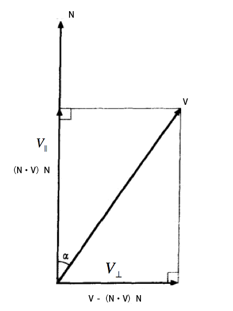

#3.3 旋转变换

##3.3.1 旋转矩阵

将物体沿x，y或z轴旋转θ角用到的是旋转变换。

旋转变换由旋转矩阵完成，记作：

OpenGL中规定，当旋转轴指向我们的时候，逆时针为正方向。

###3.3.1.1 推导

如图：在2D空间中，已知向量P=\<Px,Py\>。

设Q为P逆时针旋转90度后的向量，由三角函数可知Q=\<-Py,Px\>。

根据正交基构造理论。向量P和Q的线性组合可表示当前平面内所有向量。

设P'是P在当前平面内，旋转θ角后得到的向量。

根据向量三角形法则和三角函数，得：

P'=Pcosθ+Qsinθ

按向量方式展开，并整理为矩阵形式：

推广到3D空间：

假设绕z轴旋转。P',Q'不受z座标影响，R'不受x，y座标影响。

P'=\<cosθ,sinθ,0\>

Q'=\<-sinθ,cosθ,0\>

R'=\<0,0,1\>=R

综上，由P',Q',R'基向量构造变换矩阵

同理可得：

###3.3.2 绕任意轴旋转的矩阵

已知：向量V，单位方向向量N，角θ
求：V沿N方向，旋转θ的旋转矩阵

解：

设V与N的夹角为α，沿N分解V，得到平行和垂直于N的两个V的分量。如图：

根据向量投影定理，得到：

设向量V沿N方向旋转θ角后得到向量为V'

可求得垂直于V和N所在平面的向量Q=N×V

∵也处于V和N所在平面 ∴Q也垂直于 且根据向量积公式，有

由上述条件可知，Q和组成一组正交基，可以表示在该平面内所有向量。因此可由和沿N旋转90度后的向量Q的线性组合表示（此结论在3.3.1.1有详细推导）：

综上，得到：

代入“向量投影公式的矩阵形式”以及“向量积的矩阵形式”，展开后：

设C=cosθ，S=sinθ，整理后，得：

即：

======================
 本作品采用<a rel="license" href="http://creativecommons.org/licenses/by-nc-sa/3.0/cn/">知识共享署名-非商业性使用-相同方式共享 3.0 中国大陆许可协议</a>进行许可。
