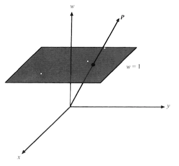

#3.4 齐次座标与平移变换

##3.4.1 齐次座标形式

已知三维向量P=\<x,y,z\>，则四维向量P'=\<x',y',z',w\>，称为向量P的齐次座标形式。

齐次座标和普通座标的互换公式为：

x=x'/w
y=y'/w
z=z'/w

即，当w=1时：x=x',y=y',z=z'。

##3.4.2 点向量与方向向量

向量既可以表示点（称为点向量），也可以表示方向（称为方向向量）。

当表示点时，向量随着平移矩阵变换而发生平移。

当表示方向时，向量不应随着平移矩阵变换而发生平移。

所以，我们规定，在齐次座标形式中：

当w=1时，表示点向量。

当w=0时，表示方向向量。

通过后面的平移矩阵计算公式我们会发现，当w=0时，方向向量不受平移矩阵的影响。

##3.4.3 齐次座标的几何意义

*G注 在3D数学中，升维和降维是经常采用的研究方法（比如投影定理，和齐次座标），这种方法可以很大程度上简化问题本身。*

根据3.4.1的座标互换公式，三维向量P可以看作是四维向量P'往三维空间（当w=1时）的投影。

为了更好理解，我们使用三维向量往二维向量投影，来表述：

设有三维向量P'=\<x',y',w\>，则二维向量P可表示为P=\<x,y\>=\<x'/w,y'/w\>。

因为投影关系，可以看到对应不同的w，有很多向量P'都可以投影成向量P。

##3.4.4 四维变换与平移矩阵

在三维变换中，要表示平移，只能通过加平移向量的方式表示。

已知：向量P，变换矩阵M，平移向量T。那么变换后的向量P'，可以表示为：

P'=MP+T

但对于多次变换，这将产生非常复杂的矩阵等式。

下面是二次平移时的矩阵恒等式：

P"=M'P'+T'=M'(MP+T)+T'=M'MP+M'T+T'

我们可以通过，将变换放到更高的维度来处理这种事。对于三维空间中的平移（此时通过向量加法表示），如果在四维空间中，就可以通过矩阵乘法来表示。此时，不论是普通的正交变换（如旋转，缩放），还是平移变换，都被统一为四维矩阵表示。（更重要的是，我们此时可以使用矩阵乘法的各种性质，来进行推导和简化。）

将三维变换矩阵M，和平移向量T组合成四维矩阵F。根据矩阵乘法，矩阵F可以很容易的描述平移变换。

======================
 本作品采用<a rel="license" href="http://creativecommons.org/licenses/by-nc-sa/3.0/cn/">知识共享署名-非商业性使用-相同方式共享 3.0 中国大陆许可协议</a>进行许可。
